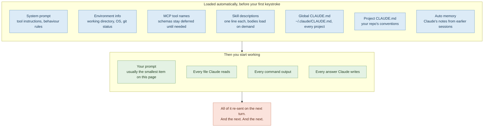
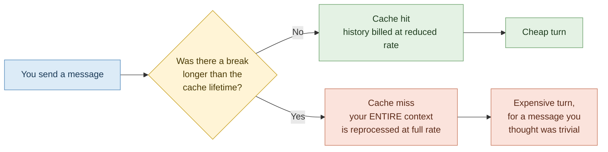

# 01 — How Context Works: Why Your Tokens Disappear

> **Module:** Claude Code Token Efficiency (1 of 6)
> **Time:** 40 minutes
> **You will need:** Claude Code installed, and one real repository you can open — ideally your current project repo.

---

## The one idea that explains everything

Most people assume Claude Code charges them for **what they type**. It doesn't. It charges for **everything Claude has to read in order to answer**, and it re-reads the whole conversation on every single turn.

That is the entire lesson. Everything else in this package is a consequence of it.

> 🔁 **ANALOGY — The taxi meter that never resets**
> Imagine a taxi where the meter doesn't measure the distance of your *next* turn — it re-charges you for the *whole journey so far*, every time you speak. Ten minutes in, saying "turn left" is cheap. Four hours in, saying "turn left" costs you the whole four hours again.
>
> **Backup analogy:** you're carrying a rucksack. Every file Claude opens, every command it runs, every answer it gives goes into the rucksack. You never take anything out. Then you carry the whole rucksack into every following room.

> 💡 **WHY this design exists**
> The model has no memory between requests. It is stateless. The only way it can know what you discussed twenty minutes ago is if that conversation is sent again as part of the current request. There is no database it can consult — the conversation *is* the memory, and shipping the memory costs tokens.

---

## Two different limits, constantly confused

Candidates almost always report "I ran out of tokens" when they mean one of two completely different things. Learn to tell them apart, because the fixes are different.

| | **Length limit (context window)** | **Usage limit (your plan allowance)** |
|---|---|---|
| **What it measures** | How big *one conversation* can get | How much you use *in total, over time* |
| **Typical size** | 200,000 tokens on most models and plans | A rolling ~5-hour window plus a weekly window |
| **What you see** | A context or auto-compact warning | "You've hit your session limit" / "your weekly limit" |
| **What happens** | Claude Code summarises older history and carries on — your session does not end | You are locked out until the window resets |
| **The fix** | Keep the conversation small (Modules 02–05) | Also keep the conversation small — a fat conversation drains the allowance faster |

> ⚠️ **GOTCHA — Your allowance is shared**
> On Pro, Max, Team and Enterprise plans, your usage pool is shared across Claude chat, Claude Code and Cowork. A morning spent chatting in the browser eats the same budget your afternoon coding session needs. Candidates who "only used Claude Code for an hour" and hit a wall have usually spent the budget somewhere else.

> ⚠️ **GOTCHA — Switching models does not rescue you**
> Session and weekly windows apply across all models. Running `/model` to drop from Opus to Sonnet will *not* restore a session you've already exhausted. (It will, however, get you working again after a model-specific message such as "You've hit your Opus limit.")

---

## What is already in context before you type a single character

This is the part that surprises everyone. Open Claude Code, type nothing at all, and there is already a substantial amount of content loaded.



> 💡 **WHY your prompt is almost never the problem**
> A typical prompt is 30–60 tokens. A single source file Claude reads to answer it can be 2,000–3,000. Your words are rounding error. **The cost is in what Claude has to look at.** This is why "writing shorter prompts to save tokens" is the wrong instinct — a *longer, more specific* prompt that stops Claude reading nine files is far cheaper than a short vague one.

> ⚠️ **GOTCHA — The terminal lies to you by omission**
> When Claude reads a file you see a one-line notice: `Read src/api/auth.ts`. That one line may represent 2,400 tokens now sitting in your context permanently. Test output shows as "tests passed" — the 1,200 tokens of raw output are still in there. **What you see in the terminal has almost no relationship to what you are paying for.**

---

## Prompt caching: the thing that makes long sessions survivable, until it doesn't

Claude Code automatically caches the repeated parts of your conversation, so re-sending history is billed at a reduced cached rate rather than the full rate. This is why a long session doesn't cost quite as much as the raw arithmetic suggests.

But the cache expires:

- On a **subscription**, roughly an hour
- On an **API key or cloud provider**, roughly five minutes by default
- Once you're drawing on **usage credits**, it drops to about five minutes



> ⚠️ **GOTCHA — The lunch break tax**
> Leave a large session open, go to lunch, come back and type "thanks, now add a test". That single trivial message misses the cache and reprocesses your entire accumulated context at full rate. **This is the single most common cause of "I barely used it and I'm out."**
>
> The fix is not to avoid breaks. The fix is to `/clear` *before* the break, so there's little context left to reprocess when you return.

---

## Auto-compaction: the safety net, not the strategy

When a conversation approaches the context window limit, Claude Code automatically summarises the older history to free space. Your session doesn't die. But:

- Compaction is **lossy** — full tool outputs and intermediate reasoning are replaced by a summary
- Running `/compact` **costs a large request**, because the conversation being summarised has to be read in order to summarise it
- `/clear` costs nothing at all, because there's nothing to summarise

Treat auto-compaction as the airbag, not the steering wheel. If you're relying on it, you've already been driving badly for an hour.

---

## ✅ Hands-On Practice (10 minutes)

Do this now, in a real repo. It takes five commands.

1. **Open a terminal in a repository you actually work in.** Not a toy folder — the point is real numbers.
2. Start Claude Code:
   ```bash
   claude
   ```
3. **Before typing anything else**, run:
   ```
   /context
   ```
   You'll get a live breakdown by category. Write down the total, and note which single category is largest.
4. Now ask something genuinely vague, the way you would on a bad day:
   ```
   Have a look at this codebase and tell me what could be improved.
   ```
5. When it finishes, run `/context` again. Write down the new total.

**Record it here:**

| Measurement | Tokens | Largest category |
|---|---|---|
| Before typing anything | | |
| After one vague prompt | | |
| Difference | | — |

Almost everyone is startled by step 5. That is the intended reaction.

---

## 🧪 Lab — Baseline Audit (25 minutes)

**Goal:** establish *your own* numbers, so that every technique in Modules 02–06 can be measured against something real rather than taken on trust.

You will keep this baseline sheet for the rest of the package. Do not skip it.

### Setup

Work in a repository with at least ~20 source files. If you don't have one to hand, clone any public repo you find readable — language doesn't matter, these techniques are identical in Java, Python, JavaScript, Go or anything else.

### Part A — The startup cost

1. Start a fresh session: `claude`
2. Run `/context`. Record the total and the breakdown.
3. Answer these:
   - How many tokens are consumed before you've asked for anything?
   - What proportion of your 200K window is that?
   - Which is bigger: your project `CLAUDE.md`, or your MCP tool listing?

### Part B — The cost of a vague prompt

1. In the same session, run one deliberately vague prompt: `improve the error handling in this project`
2. Let it run to completion. Count how many files it read (they appear as one-line `Read ...` notices).
3. Run `/context`. Record the total.

### Part C — The cost of a specific prompt

1. Run `/clear` — this starts a fresh conversation at zero conversation cost.
2. Confirm with `/context` that you're back near your Part A baseline.
3. Now ask for the *same outcome*, but specific. Name one file and one function. For example:
   `Add error handling to the <functionName> function in <path/to/file>. Wrap the external call in a try/catch and log the failure. Don't touch anything else.`
4. Count the files read. Run `/context`. Record the total.

### Part D — Session totals

Run `/usage`. This shows token usage for the current session, and on a paid plan it also shows how much of your plan limits you've consumed, attributed to skills, subagents, plugins and MCP servers.

> ⚠️ **GOTCHA** — On Pro and Max plans the dollar figure in the Session block is not your bill; your usage is included in the subscription. Read the *plan usage bars* and the *percentage breakdown* instead. Press `d` or `w` to toggle between the last 24 hours and the last 7 days.

### Your baseline sheet

| | Files read | Context after (tokens) | Δ from startup |
|---|---|---|---|
| **A.** Startup, nothing typed | 0 | | — |
| **B.** Vague prompt | | | |
| **C.** Specific prompt | | | |

**Ratio to calculate:** `B ÷ C`. Write it at the top of your notes.

Across cohorts this ratio typically lands somewhere between **3× and 8×**. That number is the size of the prize available to you from Module 03 alone — and you found it yourself rather than being told it.

---

## 🎯 Challenge Task

**Become able to predict cost before you spend it.**

Before each of your next ten prompts, write down a one-line prediction: *"this will make Claude read about N files."* Then run it and count.

Score yourself. Most people are wildly wrong for the first three or four, then rapidly get calibrated. That calibration — the instinct that says *"hang on, the way I've phrased that is going to send it crawling through the whole repo"* — is the single most valuable habit in this entire package, and it cannot be taught by reading. It only comes from predicting and being wrong a few times.

**Stretch:** configure your status line to show context window usage continuously, so you stop having to run `/context` to know where you stand. See `/docs/en/statusline` in the Claude Code documentation.

---

## Key takeaways

1. Every turn re-sends the whole conversation. Cost grows with conversation length, not with prompt length.
2. Your prompt is the smallest thing in your context. What Claude *reads* is the expensive part.
3. The terminal shows you one line for content that may be thousands of tokens.
4. Length limits and usage limits are different problems with the same fix: keep context small.
5. Cache misses after a break reprocess everything. Clear before you walk away.
6. `/clear` is free. `/compact` is not.

---

**Next:** `02-session-hygiene.md` — when to clear, when to compact, and the discipline that recovers the most tokens for the least effort.

**Source:** Claude Code documentation — Manage costs effectively (`code.claude.com/docs/en/costs`) and Explore the context window (`code.claude.com/docs/en/context-window`). Commands and behaviour change between releases; check `claude --version` and the live docs if something here doesn't match what you see.
