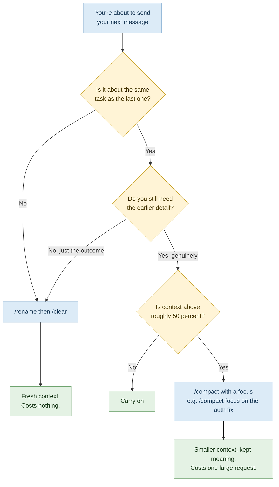

# 02 — Session Hygiene: The Cheapest Win Available

> **Module:** Claude Code Token Efficiency (2 of 6)
> **Time:** 45 minutes
> **Prerequisite:** Module 01, and your completed baseline sheet.

---

## The habit that costs candidates the most

Ask a candidate who's just been locked out what they were doing, and the answer is nearly always some version of: *"I've had the same session open since this morning."*

That session contains a stand-up chat, a CSS fix, a database migration question, a merge conflict, a long detour into a Docker problem, and now a request to rename a variable. All of it is re-sent with every message. The variable rename is being charged at the price of the entire day.

> 🔁 **ANALOGY — One notebook, one project**
> Engineers don't keep one notebook for their entire career and flip to a fresh page. They keep a notebook per project. When the project ends, the notebook closes. Claude Code sessions work the same way: **one task, one session.**
>
> **Backup analogy:** you wouldn't leave every tab from last Tuesday open in your browser and wonder why the laptop is slow.

> 💡 **WHY this beats every other technique**
> The other five modules all shave percentages. This one deletes whole conversations. If a candidate applies exactly one thing from this package, it should be this.

---

## The four commands that matter

| Command | What it does | What it costs | When |
|---|---|---|---|
| `/clear` | Starts a brand-new conversation. Context resets to startup content only. | **Nothing.** There's nothing to summarise. | Switching to unrelated work. The default. |
| `/compact` | Summarises the conversation so far, replacing it with a structured summary. | **A large request** — the conversation must be read to be summarised. | You need continuity but the context is bloated. |
| `/rename` | Names the current session. | Nothing meaningful. | Before you clear, so you can find it again. |
| `/resume` | Reopens a previous session. | Reloads that history into context. | Genuinely returning to earlier work. |

Plus one recovery command worth knowing: **`/rewind`** (or double-tap Escape) restores both the conversation and your code to an earlier checkpoint — the right move when Claude has gone three steps down a wrong path and each step is now sitting in your context.

---

## The decision: clear, compact, or carry on



> ⚠️ **GOTCHA — "I'll compact instead of clearing, it's safer"**
> This is the most common wrong instinct, and it's expensive. Compaction is a real request against a large conversation. If you don't actually need the earlier detail, `/clear` gets you the same clean slate for free. Reach for `/compact` only when continuity genuinely matters.

> ⚠️ **GOTCHA — `/compact` in a fresh session**
> It will simply tell you `Not enough messages to compact.` There's no history to summarise. Harmless, but a sign you've reached for the wrong tool.

---

## Steering what compaction keeps

The automatic pass guesses what's important. You can do better than a guess.

**Per-invocation — tell it what to preserve:**
```
/compact focus on the failing test output and the schema changes
```

**Permanently — put it in your project `CLAUDE.md`:**
```markdown
# Compact instructions

When compacting, preserve: the current task, file paths touched,
test failures and their causes. Drop exploratory reading.
```

This section applies to *every* compaction, including the automatic ones you didn't trigger.

> 💡 **WHY this matters more than it sounds**
> After compaction, Claude can reference earlier work but no longer has the exact code it read. If your session keeps "forgetting" a constraint you set an hour ago, that constraint was summarised away. Pinning it in Compact Instructions is how you stop losing it.

---

## What survives compaction, and what quietly doesn't

| Loaded via | After compaction |
|---|---|
| System prompt | Unchanged — it isn't part of message history |
| Project-root `CLAUDE.md` | Re-injected from disk |
| Auto memory | Re-injected from disk |
| Rules with `paths:` frontmatter | **Lost** until a matching file is read again |
| Nested `CLAUDE.md` in subdirectories | **Lost** until a file in that folder is read again |
| Invoked skill bodies | Re-injected, but capped — oldest dropped first |
| Hooks | Not applicable — hooks run as code, not context |

> ⚠️ **GOTCHA — The disappearing rule**
> Path-scoped rules load when their trigger file is read, which means compaction summarises them away with everything else. If a rule must survive, either drop the `paths:` frontmatter or move it into the project-root `CLAUDE.md`.

---

## Compacting earlier, on purpose

You can set how full the context gets before the automatic pass fires:

```
/autocompact 500k
```

Accepted forms: a plain count (`200000`), a suffix (`500k`, `1M`), or a bare number meaning thousands (`200` = 200,000). Range is 100K to 1M, capped at your model's actual window. `/autocompact auto` returns to the tuned default.

For one launch only, without changing your saved setting:
```bash
claude --autocompact 500k
```

---

## Why an idle session still burns budget

A session left open is not free. Usage climbs even when you aren't typing, because of:

- **Long context** — every request carries the whole conversation, and every tool use is another request carrying another batch of results
- **Cache misses** — the first message after a long break reprocesses everything (Module 01)
- **Scheduled tasks** — these fire on their interval whether you're there or not, sending full context each time
- **Agent teammates** — each active teammate keeps consuming tokens until it exits
- **Background jobs** — conversation summarisation for `--resume`, and status checks (small, typically under a few pence per session, but non-zero)

> ✅ **TRY THIS — The end-of-task ritual**
> Three seconds, every time you finish a piece of work:
> ```
> /rename fix-login-401
> /clear
> ```
> Named, findable, and your context is back to zero. You can `/resume` it tomorrow if you need to.

---

## ✅ Hands-On Practice (10 minutes)

1. Open a session and do three *unrelated* small things — ask about a config file, then a test, then a README.
2. Run `/context` and note the total.
3. Run `/clear`.
4. Run `/context` again.

Look at the difference. That gap is what you were paying on every single message before you cleared, forever, until you did.

Now repeat, but use `/compact` instead of `/clear` at step 3, and compare the resulting totals. Compaction leaves you higher than clearing — because it deliberately keeps a summary. Both are useful; they are not interchangeable.

---

## 🧪 Lab — The A/B Discipline Test (30 minutes)

**Goal:** prove to yourself, with your own numbers, what session discipline is worth. This is the lab candidates most often report as the moment it clicked.

You will do the **same task twice**, under two different disciplines, and compare.

### Choose your task

Pick something real and self-contained from your repo that takes 5–8 exchanges. Good candidates: add input validation to one function; write tests for one module; fix one failing test. Write the task down before you start — you must run *identical* work in both arms.

### Arm 1 — The polluted session

1. Start a fresh session.
2. **Deliberately pollute it first.** Spend about ten exchanges on unrelated things: ask it to explain three different files, run the test suite, ask a general question about the framework, ask it to summarise the README. This is a simulation of a normal undisciplined morning — it should feel familiar.
3. Run `/context`. Record: **P1 = context before starting the real task.**
4. Now do your chosen task, without clearing.
5. Run `/context` and `/usage`. Record: **P2 = final context.**

### Arm 2 — The clean session

1. Run `/clear`.
2. Run `/context`. Record: **C1 = context before starting the real task.**
3. Do the **identical** task, with the identical prompts where possible.
4. Run `/context` and `/usage`. Record: **C2 = final context.**

### Results

| | Context before task | Context after task | Turns taken |
|---|---|---|---|
| **Arm 1 — polluted** | P1 = | P2 = | |
| **Arm 2 — clean** | C1 = | C2 = | |

**Calculate:**
- Overhead carried on every message in Arm 1: `P1 − C1`
- Multiply that by the number of turns the task took. That is roughly what the pollution cost you — paid repeatedly, for nothing.

### Reflection — answer these in writing

1. Did the pollution change the **quality** of the answer, not just the cost? (Look carefully. Larger context often means *worse* recall, not better — the model has more to sift through.)
2. In your normal working day, how close is Arm 1 to what you actually do?
3. What would have to change in your habits for Arm 2 to be your default?

> 💡 **WHY the quality question matters**
> Candidates come into this expecting a cost lesson and leave with a quality one. Bloated context degrades accuracy and recall. Session hygiene isn't a budget measure that costs you output — it improves the output. That's why it's worth doing even on an unlimited plan.

---

## 🎯 Challenge Task

**Run a clean day.**

For one full working day, commit to this rule: **`/clear` between every unrelated task, no exceptions.** Use `/rename` first so nothing is lost. At the end of the day, run `/usage` and press `w` to see the week.

Compare that day against a normal one. Write down:
- Number of sessions you ran (it will be much higher — that's the point)
- Whether you hit a limit
- Whether anything was actually lost by clearing, or whether you just *felt* like it might be

That last question is the real one. The fear of losing context is what keeps people in bloated sessions, and it is almost always unfounded — `CLAUDE.md` and your repo carry the durable knowledge, not the chat history.

**Stretch:** add a Compact Instructions section to your project `CLAUDE.md`, then deliberately grow a session until auto-compaction fires. Check whether the things you asked it to preserve actually survived.

---

## Key takeaways

1. One task, one session. `/clear` between unrelated work.
2. `/clear` is free. `/compact` is a large request. Don't reach for compaction out of caution.
3. `/rename` before clearing means nothing is ever really lost — `/resume` brings it back.
4. Steer compaction with a focus argument or a Compact Instructions section.
5. Path-scoped rules and nested `CLAUDE.md` files do not survive compaction.
6. Idle sessions still cost. Clear before you walk away, not after you come back.

---

**Next:** `03-prompting-for-efficiency.md` — why a longer, more specific prompt is cheaper than a short vague one.

**Source:** Claude Code documentation — Manage costs effectively and Explore the context window. Behaviour changes between releases; verify with `claude --version` against the live docs.
