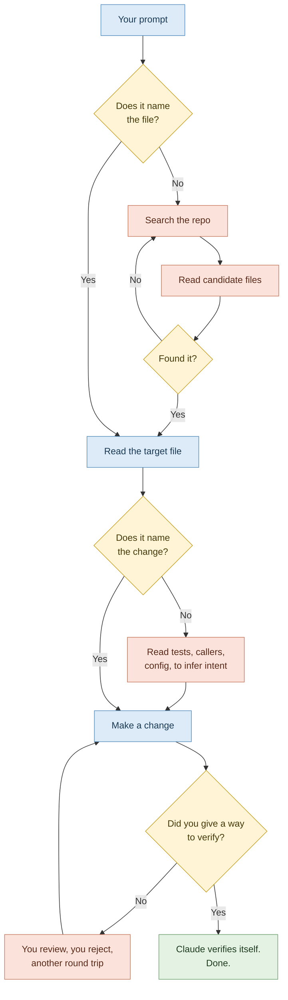

# 03 — Prompting for Efficiency: Longer Prompts, Smaller Bills

> **Module:** Claude Code Token Efficiency (3 of 6)
> **Time:** 45 minutes
> **Prerequisite:** Modules 01–02.

---

## The counter-intuitive rule

Everyone's first instinct on hearing "you're using too many tokens" is to type less. It is exactly backwards.

Compare these two prompts:

```
fix the login bug
```
*Seven tokens. Claude has no idea where the login code is, so it searches. It reads the router. It reads three candidate files. It greps for "login". It reads the tests. It reads the auth middleware. Eleven thousand tokens later it starts forming an opinion.*

```
Users get a 401 after token refresh. The bug is in the rotation order in
src/api/auth.ts, in refreshSession(). Fix it there and add a regression
test in auth.test.ts. Don't change the middleware.
```
*Forty-two tokens. Claude opens two files and fixes it. Three thousand tokens, and a better answer.*

The second prompt is six times longer and roughly four times cheaper.

> 🔁 **ANALOGY — Sending someone to the shop**
> "Get me something for dinner" sends them wandering every aisle, phoning you twice, coming back with the wrong thing. "Get 500g of penne and a jar of arrabbiata from aisle four" is a longer sentence and a shorter trip.
>
> **Backup analogy:** a vague ticket in Jira costs the team a day of clarification. Nobody thinks the fix is to write shorter tickets.

> 💡 **WHY vagueness is so expensive**
> Ambiguity has to be resolved somehow. If you don't resolve it, Claude resolves it — by reading. Every file read to answer "where is this, actually?" is a file you could have named in one clause. **You are paying, in tokens, for information you already had in your head.**

---

## Where the tokens actually go



Every red box on that diagram is optional. Every one of them is removed by a clause in your prompt.

---

## The four clauses that cut the most

Build your prompts from these. Not all four every time — but notice which one you're leaving out.

### 1. Location — *where*
> "…in `src/api/auth.ts`" · "…in the `OrderService` class" · "…the migration added last week"

Removes the entire search phase. Biggest single saving available.

### 2. Change — *what*
> "…wrap the external call in a try/catch and log the failure"

Removes the inference phase, where Claude reads tests and callers to work out what you meant.

### 3. Boundary — *what not to touch*
> "…don't change the middleware" · "…leave the tests alone for now"

Removes speculative reading and speculative edits, and the review round-trip that follows them.

### 4. Verification — *how we'll know it worked*
> "…`npm test -- auth` should pass" · "…expected output is a 200 with the new token" · paste the failing stack trace

Lets Claude check its own work before handing it back. Removes the most expensive loop of all: the one where you reject the answer and it tries again.

> ✅ **TRY THIS — The 15-second rewrite**
> Before sending any prompt, read it back and ask: *"Have I said where, what, what-not, and how-we'll-know?"* Adding the missing clause takes fifteen seconds. It routinely saves several thousand tokens.

---

## Point, don't paste

Candidates paste files into the prompt because it feels helpful. It isn't.

| | Cost |
|---|---|
| Pasting a 400-line file into your prompt | The whole file, in context, **plus** Claude will often read the real file anyway to check for drift |
| Naming the path | Claude reads exactly what it needs, once |

Pasting is genuinely right in only three cases:
- **A stack trace or error message** — short, high-signal, not in a file
- **Expected output** — the thing that doesn't exist yet
- **A snippet from somewhere Claude cannot reach** — a Slack message, a ticket, a colleague's email

> ⚠️ **GOTCHA — The screenshot exception**
> A screenshot of a broken UI is often *cheaper* than describing it in prose and far more accurate. Don't over-apply "don't paste" — the rule is about files Claude can already open, not about information it has no other route to.

---

## Use plan mode before expensive work

Press **Shift+Tab** to cycle into plan mode. Claude explores and proposes an approach for your approval, without editing anything.

> 💡 **WHY this saves rather than costs**
> Plan mode costs tokens up front. It saves far more by preventing the expensive failure: Claude confidently implementing the wrong approach across six files, you rejecting it, and both the wrong implementation and the rejection sitting in your context forever while it tries again.
>
> The rule of thumb: **if the work touches more than two files, plan first.**

---

## Course-correct early, not politely

When Claude starts down the wrong path, candidates tend to let it finish out of politeness, then explain what was wrong. Every token of that wrong path is now permanent context, and the explanation is another turn.

- **Escape** — stops it immediately, mid-work
- **`/rewind`** or **double-tap Escape** — restores conversation *and* code to an earlier checkpoint

> ⚠️ **GOTCHA — The apology loop**
> "That's not quite what I meant, could you instead…" keeps the wrong attempt in context and adds a turn. Pressing Escape and re-prompting from scratch is cheaper and usually produces a better answer, because the wrong attempt isn't sitting there anchoring the next one.

---

## Three more habits worth naming

**Batch related asks.** "Add validation to these three functions: A, B, C" is one exploration. Three separate prompts is three explorations over the same files.

**Test incrementally.** One file, test, continue. Catching a mistake after one file is cheap; catching it after six means six files of wrong work in your context.

**Don't use it as a search engine.** "What's the difference between `let` and `const`?" needs none of your repo, but your entire context is sent along with it anyway. General knowledge questions belong in a browser or a fresh session — never in the middle of a large working session.

---

## ✅ Hands-On Practice — The Rewrite Drill (15 minutes)

Rewrite each of these using the four clauses. Then run *your* version in a real repo and count the files read.

| Vague | Your rewrite |
|---|---|
| `make this faster` | |
| `there's a bug somewhere in the API` | |
| `add tests` | |
| `clean up this code` | |
| `why isn't this working?` | |
| `update the docs` | |

> ⚠️ **GOTCHA — Don't rewrite into a novel**
> The goal is *precision*, not length for its own sake. "Add error handling to `parseConfig()` in `config.js`; throw a descriptive error on malformed JSON; existing tests must still pass" is complete. Three paragraphs of background is just a different kind of waste.

---

## 🧪 Lab — Measured A/B on Real Prompts (30 minutes)

**Goal:** produce your own vague-vs-specific ratio on real work, and see whether the specific version is also *better*.

### Method

Pick **three** genuine tasks from your current repo. For each one, run both arms with a `/clear` between them so neither contaminates the other.

**Per task:**

1. `/clear`, then `/context` → record **start**
2. Run the **vague** version of the prompt
3. Record: files read, `/context` total, number of turns until you were satisfied
4. `/clear`, then `/context` → confirm back to start
5. Run the **specific** version — same intended outcome, all four clauses present
6. Record the same three numbers

### Results table

| Task | Arm | Files read | Context Δ | Turns to satisfaction | Quality (1–5) |
|---|---|---|---|---|---|
| 1 | vague | | | | |
| 1 | specific | | | | |
| 2 | vague | | | | |
| 2 | specific | | | | |
| 3 | vague | | | | |
| 3 | specific | | | | |

### Analysis

1. **Average context ratio** (vague ÷ specific) across the three tasks: ______
2. **Turns to satisfaction** — did specificity reduce round trips as well as reads?
3. **Quality column** — this is the one that matters. Score honestly. If the specific version scored *lower* anywhere, work out why: usually it means a clause was wrong rather than merely absent, and you over-constrained the solution.
4. Compare your ratio here against the B ÷ C ratio from your Module 01 baseline sheet. Are they in the same range?

> 💡 **WHY the over-constraint failure is worth finding**
> "Fix it in `auth.ts`" is a saving when the bug is in `auth.ts` and a disaster when it isn't — you've now sent Claude to the wrong place with confidence. Specificity is only cheap when it's *correct*. If you're genuinely unsure where something lives, say so: "I think this is in the auth layer but I'm not certain" costs a little exploration and avoids a lot of wrong work.

---

## 🎯 Challenge Task

**Build a prompt template for your own recurring work.**

Look back through your last twenty prompts. You will find three or four shapes that repeat — "add a test for X", "fix this failing build", "review this diff", "explain why Y happens".

For each recurring shape, write a template with the four clauses baked in as blanks. For example:

```
BUG FIX
Symptom: <what the user sees>
Suspected location: <file / function, or "unsure — likely the X layer">
Constraint: don't change <...>
Verify with: <command or expected output>
```

Keep these somewhere you can paste from. Candidates who do this report their token usage dropping without any conscious effort afterwards — the discipline moves out of willpower and into the template, which is the only place discipline reliably survives.

**Stretch:** turn your best template into a Claude Code slash command so it's one keystroke away. See the skills and commands documentation.

---

## Key takeaways

1. Longer, specific prompts are cheaper than short vague ones. Typing less is the wrong fix.
2. Four clauses: **where**, **what**, **what not**, **how we'll know**.
3. Point at files, don't paste them — except stack traces, expected output, and things Claude can't reach.
4. Plan mode (Shift+Tab) before anything touching more than two files.
5. Escape early. Don't let a wrong path finish out of politeness.
6. General knowledge questions don't belong inside a large working session.

---

**Next:** `04-project-memory-and-config.md` — stop re-explaining your project every morning, without turning `CLAUDE.md` into a tax.

**Source:** Claude Code documentation — Manage costs effectively (Write specific prompts, Work efficiently on complex tasks).
