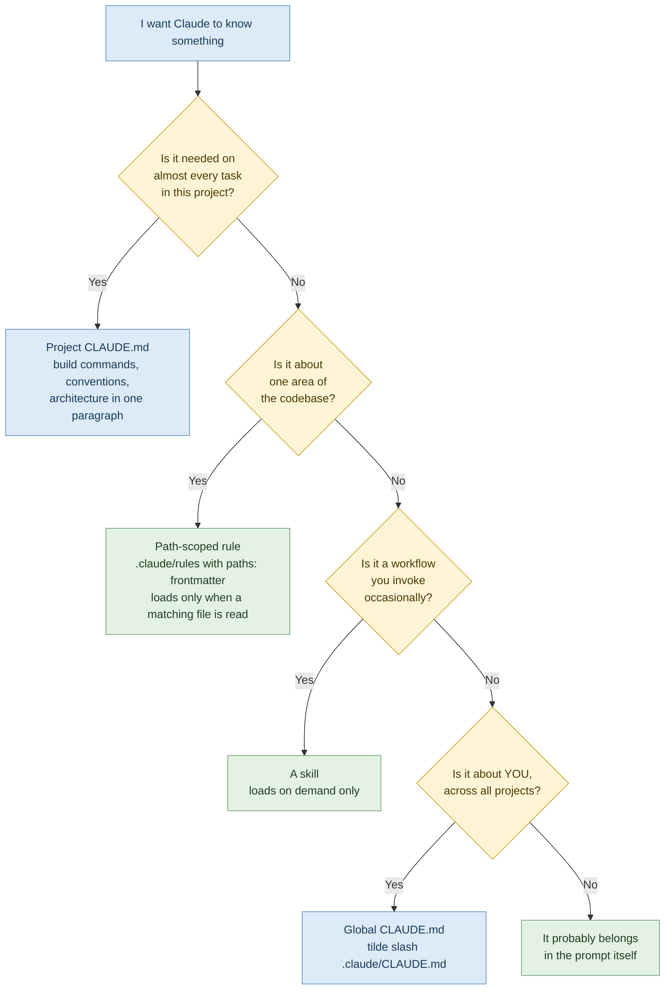

# 04 — Project Memory: Stop Re-Explaining Yourself

> **Module:** Claude Code Token Efficiency (4 of 6)
> **Time:** 45 minutes
> **Prerequisite:** Modules 01–03.

---

## Two opposite mistakes

**Mistake one:** no `CLAUDE.md` at all. Every morning starts with "we use Postgres, the tests are in `/tests`, run them with `make test`, and don't touch the generated files." Every session pays for that again, and every session Claude reads a few files to work out what you didn't tell it.

**Mistake two — and this is the one that catches the keen candidates:** an 800-line `CLAUDE.md` containing the full architecture, the deployment runbook, the PR review checklist and the database migration procedure.

> ⚠️ **GOTCHA — `CLAUDE.md` is a tax on every single request**
> It loads at session start and sits in context for everything you do afterwards. An 800-line `CLAUDE.md` is charged to you while renaming a variable, while asking about CSS, while doing anything at all. **The official guidance is to keep it under 200 lines.** Candidates who "optimise" by documenting everything in `CLAUDE.md` often make their usage worse than having none.

> 🔁 **ANALOGY — The induction pack vs the manual**
> A new joiner gets a one-page induction sheet: where the kitchen is, who to ask, how to get a laptop. They do *not* get the 400-page compliance manual handed to them on day one — that lives on the shelf and comes down when it's needed.
>
> `CLAUDE.md` is the induction sheet. Skills are the shelf.

---

## Where each kind of instruction belongs



**The rule the diagram encodes:** blue boxes cost you on every request. Green boxes cost you only when they're relevant. **Push everything you can into green.**

---

## What belongs in `CLAUDE.md`

**Yes — earns its place:**
- Build, test and lint commands (`make test`, `npm run dev`, `./gradlew build`)
- Conventions Claude cannot infer from the code (branch naming, commit format, "we never edit files under `generated/`")
- One paragraph of architecture — enough that Claude doesn't have to read five files to find its bearings
- Compact instructions (Module 02)

**No — costs more than it returns:**
- Anything Claude can read from the code itself. Don't document your folder structure; Claude can list folders.
- Full API references, schema dumps, dependency lists
- Workflow procedures used occasionally — these are skills
- Aspirations. "We should have 90% coverage" isn't an instruction, it's a wish, and it's charged to you on every request.

> 💡 **WHY "don't document what's inferable" is the sharpest cut**
> A folder listing costs Claude one cheap command *when it needs it*. The same listing in `CLAUDE.md` costs you on every request forever. Trading an occasional cheap read for a permanent charge is a bad trade, and it's the most common way a `CLAUDE.md` bloats past 200 lines.

---

## Path-scoped rules: instructions that show up only when relevant

A rule in `.claude/rules/` with `paths:` frontmatter loads automatically when Claude reads a matching file — and stays out of context entirely otherwise.

```markdown
---
paths:
  - "src/api/**"
---
All API handlers must validate input before touching the database.
Errors return the standard envelope in src/api/errors.ts.
```

Perfect for conventions that apply to one area. The API rules cost nothing while you're working on the front end.

> ⚠️ **GOTCHA — Rules don't survive compaction**
> Because path-scoped rules enter the *message history* when triggered, compaction summarises them away. They reload next time a matching file is read — but if a rule absolutely must persist, drop the `paths:` frontmatter or move it to the project-root `CLAUDE.md`. (See the survival table in Module 02.)

---

## Skills: the shelf

Skills load **on demand**. Only a one-line description sits in context at startup; the body loads when the skill is actually invoked.

This makes skills the right home for anything procedural:
- PR review checklists
- Database migration steps
- Release procedures
- A "codebase overview" skill describing architecture, key directories and naming conventions — so Claude gets its bearings from one invocation instead of reading six files

> 💡 **WHY a codebase-overview skill is the highest-value one to write**
> Every session, on every unfamiliar task, Claude spends tokens orienting itself. A skill that answers "how is this project laid out and why" replaces that exploration with a single load — and only when it's needed, unlike putting the same content in `CLAUDE.md`.

> ✅ **TRY THIS — Hide skills with side effects**
> Set `disable-model-invocation: true` on skills that commit, deploy, or send messages. They're then excluded even from the startup description index — zero context cost until *you* invoke them by name with `/skillname`. Two benefits for one line of frontmatter: cheaper, and Claude can't fire them on its own.

---

## Inspecting what you've actually got

| Command | Shows |
|---|---|
| `/context` | Live breakdown by category, with optimisation suggestions, including which `CLAUDE.md` and memory files loaded |
| `/memory` | Opens your memory files for editing |
| `/usage` | Plan usage, attributed to skills, subagents, plugins and MCP servers |

> ⚠️ **GOTCHA — Auto memory grows without you noticing**
> Claude Code keeps its own notes across sessions (build commands it learned, mistakes to avoid). Useful — but it loads at startup like everything else. If your startup context has crept up over weeks and you haven't touched `CLAUDE.md`, this is usually why. Check it with `/memory`.

---

## ✅ Hands-On Practice (15 minutes)

1. In your main repo, run `claude` then `/context` immediately.
2. Find the `CLAUDE.md` line in the breakdown. How many tokens?
3. Open it: `/memory`
4. Count the lines. Over 200?
5. Go through it line by line with one question per line: **"is this needed on almost every task?"**

Mark each line: **KEEP** (every task), **RULE** (one area only), **SKILL** (occasional procedure), **DELETE** (inferable from the code, or aspirational).

Most first-time audits find 40–60% of the file is not KEEP.

---

## 🧪 Lab — The `CLAUDE.md` Diet (30 minutes)

**Goal:** measurably reduce your per-request overhead without losing anything Claude actually needs.

### Part A — Measure

1. Fresh session, `/context` before typing. Record **startup total** and the **`CLAUDE.md` figure**.
2. Copy your current `CLAUDE.md` somewhere safe. You are going to change it and you want a way back.

### Part B — Cut

Using your KEEP / RULE / SKILL / DELETE marks:

1. **DELETE** lines: remove them.
2. **RULE** lines: move into `.claude/rules/<area>.md` with `paths:` frontmatter for the relevant directory.
3. **SKILL** lines: move into a skill. If you've not written one before, start with the smallest procedure you marked.
4. **KEEP** lines: leave them, but tighten the wording. Bullet points, not prose.

Target: **under 200 lines**, ideally well under.

### Part C — Re-measure

1. Fresh session, `/context` before typing. Record the new startup total.
2. Calculate the saving: `old − new`.
3. Multiply by a typical number of turns in your working day (30 is a reasonable estimate). That is your daily saving from a thirty-minute edit.

### Part D — Verify nothing broke

This part is not optional, and it's the one candidates skip.

Run three tasks you'd normally run. Specifically check:
- Does Claude still know your build and test commands?
- Does it still follow the conventions you moved into rules? (It should — when it reads a matching file.)
- Did it do anything you'd previously told it not to?

If something regressed, that line was genuinely a KEEP. Put it back. **A cheaper config that produces wrong work is not a saving.**

### Results

| | Startup context | `CLAUDE.md` tokens | Lines |
|---|---|---|---|
| Before | | | |
| After | | | |
| Saving | | | |

**Saving × 30 turns/day = ______ tokens/day, for a one-off edit.**

---

## 🎯 Challenge Task

**Write a `codebase-overview` skill for your project.**

Contents:
- What the project does, in two sentences
- Key directories and what lives in each
- The main architectural decisions and *why* — the reasoning Claude can't infer from code
- Naming conventions
- The three things newcomers always get wrong

Then measure it. Run an unfamiliar task in a fresh session **without** the skill and count files read; `/clear`; run the same task **with** the skill invoked and count again.

> ⚠️ **GOTCHA — Truncation keeps the top**
> After compaction, skill bodies are re-injected but capped per skill and in total, oldest dropped first — and truncation keeps the *start* of the file. **Put your most important instructions near the top of `SKILL.md`.** A skill with the critical constraint buried on line 300 will quietly lose it.

**Stretch:** share the skill with your team by committing it to the repo. One person's thirty minutes becomes everyone's saving — which is the actual argument for doing any of this at team level.

---

## Key takeaways

1. `CLAUDE.md` loads on every request. Under 200 lines. Treat every line as a recurring charge.
2. Don't document what Claude can read from the code.
3. Area-specific conventions → path-scoped rules. Occasional procedures → skills.
4. Skills load on demand; `disable-model-invocation: true` keeps side-effect skills at zero cost until invoked.
5. `/context` tells you where your startup budget is going. `/memory` lets you fix it.
6. Always verify after cutting. Cheap and wrong is not an improvement.

---

**Next:** `05-model-and-tooling-choices.md` — matching the tool to the job, and keeping verbose work out of your context entirely.

**Source:** Claude Code documentation — Manage costs effectively, Explore the context window, Store instructions and memories.
