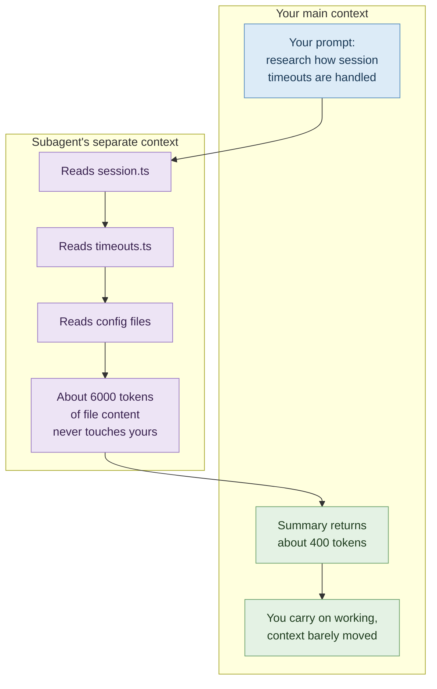

# 05 — Model and Tooling Choices: Matching the Tool to the Job

> **Module:** Claude Code Token Efficiency (5 of 6)
> **Time:** 45 minutes
> **Prerequisite:** Modules 01–04.

---

## Four levers, in order of impact

Modules 02–04 were about *habits*. This one is about *settings* — things you change once and benefit from continuously.

1. **Which model** is doing the work
2. **How hard it thinks** before answering
3. **Where verbose work happens** — your context, or somewhere else
4. **What's loaded** that you aren't using

---

## Lever 1 — Model selection

> 🔁 **ANALOGY — Who you send to the job**
> You don't send your principal architect to reset someone's password. Not because they'd do it badly — because it's an expensive way to get a cheap thing done, and they're not available when the architecture question arrives at four o'clock.

| Model | Use for |
|---|---|
| **Sonnet** | Most coding work. This is the default for a reason and handles the large majority of tasks well. |
| **Opus** | Complex architectural decisions, genuinely hard multi-step reasoning, subtle debugging. |
| **Haiku** | Simple subagent tasks — set `model: haiku` in the subagent configuration. |

Switch mid-session with `/model`. Set a default in `/config`.

> ⚠️ **GOTCHA — Opus left as the default**
> Alongside never clearing sessions, this is one of the two habits the documentation names as the usual cause of unexpectedly high spend. It's set once, forgotten, and then quietly applies to every trivial task for weeks. **Check `/model` now, before reading further.**

> ⚠️ **GOTCHA — Switching down won't unlock you**
> Session and weekly windows apply across all models. If you're already locked out, `/model` won't help. It only helps *before* you get there — which is the whole point.

---

## Lever 2 — Extended thinking

Extended thinking is on by default because it substantially improves performance on complex planning and reasoning. **Thinking tokens are billed as output tokens**, and the default budget can run to tens of thousands of tokens per request depending on the model.

For work that doesn't need deep reasoning — renaming things, formatting, small mechanical edits — that's a lot of thinking spent on very little.

Controls:
- `/effort` — lower the effort level
- `/model` — effort can be set here too
- `/config` — disable thinking entirely
- On models with a fixed thinking budget, `MAX_THINKING_TOKENS=8000` as an environment variable

> ⚠️ **GOTCHA — Not every model behaves the same**
> Adaptive-reasoning models ignore a nonzero `MAX_THINKING_TOKENS` — use effort levels there instead. And on Claude Fable 5, thinking cannot be disabled at all; it always uses extended thinking. Check what you're actually running before assuming a setting took effect.

> 💡 **WHY not just turn thinking off permanently**
> Because it earns its cost on hard problems. A model that reasons properly and gets it right first time is far cheaper than one that answers fast, gets it wrong, and drags three correction rounds through your context. **Lower effort for mechanical work; leave it high for hard work.** The skill is telling them apart.

---

## Lever 3 — Keep verbose work out of your context

This is the highest-leverage idea in the module.

Some operations produce enormous output: running a full test suite, reading logs, fetching documentation, searching a large unfamiliar codebase. That output lands in your context and stays there for the rest of the session.

**Subagents solve this.** A subagent gets its own separate context window. It does the noisy work there, and only its *summary* returns to you.



Delegate to a subagent when the task is: research across many files, running a verbose test suite, processing logs, or fetching and digesting documentation.

> ✅ **TRY THIS**
> Just ask for it in the prompt: *"Use a subagent to research how we handle session timeouts, then fix the bug in `timeouts.ts`."* The research cost stays in the subagent; the fix happens in your context with the findings summarised.

> ⚠️ **GOTCHA — Subagents aren't free, they're *isolated***
> Each subagent loads its own `CLAUDE.md`, MCP setup and system prompt. You're not avoiding the tokens; you're stopping them from accumulating in *your* window and being re-sent on every subsequent turn. For one small read this is a net loss. For a large research task it's a substantial win. **The saving comes from the re-sending you avoid, not from the reading.**

### Hooks: filter before Claude ever sees it

A hook can preprocess data before it enters context. Instead of Claude reading a 10,000-line log to find the errors, a hook greps for `ERROR` and returns only the matching lines — tens of thousands of tokens down to hundreds.

The documented example is a `PreToolUse` hook that rewrites test commands to show only failures. Worth setting up once if you run test suites frequently; the full working example is in the Manage costs page of the Claude Code docs.

### Agent teams: know what you're switching on

Agent teams spawn multiple Claude Code instances, each with its own context window. The documentation puts them at roughly **7× the tokens** of a standard session when teammates run in plan mode.

They're disabled by default. If you enable them: use Sonnet for teammates, keep teams small, keep spawn prompts focused, and shut teammates down when their work is done — each active teammate keeps consuming tokens until it exits.

---

## Lever 4 — Stop paying for things you aren't using

**MCP servers.** Tool definitions are deferred by default, so only tool *names* enter context until Claude actually uses one. Still worth auditing:
- `/context` shows what's consuming space
- `/mcp` lists configured servers — disable any you're not actively using

**Prefer CLI tools where they exist.** `gh`, `aws`, `gcloud`, `sentry-cli` and similar are more context-efficient than an MCP server, because they add no per-tool listing at all. Claude can run them directly.

**Code intelligence plugins** for typed languages give Claude precise symbol navigation — "go to definition" replaces a grep followed by reading several candidate files. They also report type errors automatically after edits, so mistakes get caught without running a compiler.

> ✅ **TRY THIS — The two-minute audit**
> ```
> /mcp
> ```
> How many servers are configured? How many did you use this week? Disable the rest. Most candidates find at least one they enabled during a tutorial months ago and have never used since.

---

## ✅ Hands-On Practice (15 minutes)

1. Run `/model`. What is your default? If it's Opus, change it to Sonnet and note the date — you'll compare usage in a week.
2. Run `/mcp`. List every configured server. Cross out the ones you haven't used in a fortnight. Disable them.
3. Run `/context`. Compare against your Module 04 figure. Did the MCP audit move it?
4. Run `/effort` and look at the available levels. Set a lower one, then ask for a mechanical change — a rename, a formatting fix. Judge whether the answer was any worse.

---

## 🧪 Lab — The Delegation Test (30 minutes)

**Goal:** measure what subagent delegation is actually worth on a real research task, and find where the crossover point sits.

### Setup

Pick a genuine research question about your repo that requires reading several files. Something like: *"How does authentication flow from the request through to the database?"* or *"Where is retry logic implemented and is it consistent?"*

### Arm 1 — Direct

1. `/clear`, then `/context` → record **start**
2. Ask the research question normally.
3. When it finishes, record: files read, `/context` total.
4. **Now do a follow-up task** — anything small, e.g. "add a comment explaining the retry backoff." This matters: it's the follow-up that reveals the true cost, because it's charged against the inflated context.
5. Record `/context` after the follow-up.

### Arm 2 — Delegated

1. `/clear`, then `/context` → record **start**
2. Ask the same question, prefixed: *"Use a subagent to research…"*
3. Record: `/context` total after the research returns.
4. Do the **same** follow-up task.
5. Record `/context` after the follow-up.

### Results

| | Context after research | Context after follow-up | Answer quality (1–5) |
|---|---|---|---|
| **Direct** | | | |
| **Delegated** | | | |

### Analysis

1. Where was the bigger gap — after the research, or after the follow-up? (It should be the follow-up. Explain to yourself why.)
2. **Quality check:** did the summarised findings lose anything you needed? Delegation trades detail for context. Sometimes that trade is wrong — if you needed the exact code, a summary won't do.
3. Project it forward: if you'd done *ten* follow-up tasks after that research, what would the gap be?

### Part C — Find the crossover

Repeat Arm 1 and Arm 2 with a **trivial** task — reading a single small file.

You should find delegation is now a *net loss*, because the subagent's own startup overhead exceeds what it saved. Record roughly where you think the crossover sits for your repo.

> 💡 **WHY finding the crossover matters more than learning the rule**
> "Use subagents" applied blindly makes small tasks more expensive. The candidates who get real value from this are the ones who know *when* — and that's a judgement built from measuring, not from a bullet point.

---

## 🎯 Challenge Task

**Set up a hook that filters your noisiest command.**

Find the command whose output most often floods your context — usually a full test suite, a verbose build, or a log tail. Write a `PreToolUse` hook that filters it to only the interesting lines (failures, errors).

The documented pattern:
1. Add a `PreToolUse` hook with a `Bash` matcher in `settings.json`, pointing at a script
2. The script reads the command, and if it matches a test runner, rewrites it to pipe through a filter
3. Make it executable and verify with `/hooks` that it appears under PreToolUse
4. Confirm with `claude --debug` — the debug log shows `modified tool input keys: [command]` when the hook rewrites the command

The full worked example is in the Manage costs page of the Claude Code documentation.

Then measure: run your test suite before and after, comparing `/context` each time.

> ⚠️ **GOTCHA — Filter carefully**
> A hook that filters too aggressively hides the information Claude needs to fix the failure. Keep enough surrounding lines to be actionable — the documented example keeps several lines of context after each match, which is there for a reason. A hook that saves tokens by hiding the stack trace has cost you the debugging session.

**Stretch:** write a second hook for a different noisy command, and compare which one saved more. Then decide honestly whether the second one was worth the setup time — not every optimisation pays for itself, and knowing which ones don't is part of the skill.

---

## Key takeaways

1. Sonnet for most work; Opus for genuinely hard reasoning; Haiku for simple subagents. Check `/model` — a forgotten Opus default is a top cause of high spend.
2. Thinking tokens bill as output. Lower `/effort` for mechanical work, keep it for hard work.
3. Subagents isolate verbose work in a separate context. The saving is in the re-sending you avoid — so it scales with how long you keep working afterwards.
4. Hooks can filter data *before* it enters context. Biggest single-shot reduction available.
5. Agent teams run ~7× the tokens. Deliberate choice, not a default.
6. Audit `/mcp`. Prefer CLI tools. Disable what you don't use.

---

**Next:** `06-antipatterns-cheatsheet.md` — everything above, on one page you can pin up.

**Source:** Claude Code documentation — Manage costs effectively (Reduce token usage), Subagents, Hooks, Model configuration.
