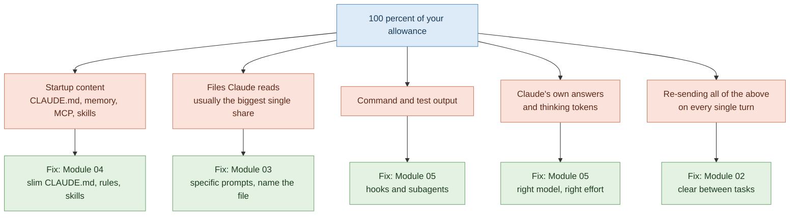

# 06 — The Cheatsheet: Everything on One Page

> **Module:** Claude Code Token Efficiency (6 of 6)
> **Time:** 20 minutes to work through, then keep it open
> **Prerequisite:** Modules 01–05. This is a reference, not a substitute — the labs are where the learning happened.

---

## Where the tokens go



---

## The ten habits that burn tokens

| # | Habit | Why it costs | Fix |
|---|---|---|---|
| 1 | One session open all day | Whole conversation re-sent every turn | `/rename` then `/clear` between unrelated tasks |
| 2 | Vague prompts | Claude explores the repo to resolve ambiguity you could have resolved | Name the file, the change, the boundary, the check |
| 3 | Pasting files into prompts | The file enters context twice — your paste and Claude's read | Point at the path instead |
| 4 | Bloated `CLAUDE.md` | Charged on every request, forever | Under 200 lines; move the rest to rules and skills |
| 5 | Opus left as the default | Heavy model on trivial work | `/model` → Sonnet; Opus when it's earned |
| 6 | Letting a wrong path finish | The wrong work stays in context permanently | Escape early; `/rewind` to a checkpoint |
| 7 | Verbose output into main context | Test logs and research sit there for the rest of the session | Subagents; filter with hooks |
| 8 | Coming back from lunch to a big session | Cache miss reprocesses everything at full rate | `/clear` **before** the break, not after |
| 9 | General knowledge questions mid-session | Your whole context is sent along for a question that needs none of it | Ask in a browser or a fresh session |
| 10 | `/compact` used out of caution | Compaction is a large request; clearing is free | `/clear` unless you genuinely need continuity |

---

## Prompt rewrites

| ❌ Costs more | ✅ Costs less |
|---|---|
| `fix the login bug` | `Users get a 401 after token refresh. Fix the rotation order in refreshSession() in src/api/auth.ts. Add a regression test. Don't touch the middleware.` |
| `add tests` | `Add unit tests for parseConfig() in config.js. Cover: valid input, malformed JSON, missing file. Follow the existing test style.` |
| `make this faster` | `The report endpoint takes 4s. I think it's the N+1 in getOrders() in orders.js. Confirm, then fix. Response shape must not change.` |
| `why isn't this working?` <br/>*(with a file pasted)* | `<paste the stack trace>` + `This fires when I submit the form. Relevant handler is in checkout.js.` |
| `clean up this code` | `In utils.js, extract the duplicated date formatting into one function. Behaviour must stay identical — existing tests should pass unchanged.` |
| `review my changes` | `Review the diff on this branch for error handling gaps only. Ignore style.` |

**The pattern:** ✅ says **where**, **what**, **what not to touch**, and **how we'll know it worked**.

---

## Command reference

| Command | Does |
|---|---|
| `/context` | Live breakdown of what's in your context, by category |
| `/usage` | Session token usage; on paid plans, plan usage bars and a breakdown by skill/subagent/plugin/MCP. `d` / `w` toggles 24h and 7d |
| `/clear` | New conversation. **Free.** |
| `/compact` | Summarise conversation. **Costs a large request.** Takes a focus: `/compact focus on the auth fix` |
| `/rename` | Name the session before clearing |
| `/resume` | Reopen a previous session |
| `/rewind` | Restore conversation and code to a checkpoint (or double-tap Escape) |
| `/model` | Switch model mid-session |
| `/effort` | Adjust thinking effort |
| `/config` | Defaults, including disabling thinking |
| `/memory` | Open and edit `CLAUDE.md` and memory files |
| `/mcp` | List and disable MCP servers |
| `/autocompact` | Set how full context gets before auto-compaction, e.g. `/autocompact 500k` |
| `/hooks` | Verify configured hooks |
| **Shift+Tab** | Cycle into plan mode |
| **Escape** | Stop immediately |

---

## The 60-second session ritual

**Starting work:**
```
claude
/context          ← know your baseline before you spend anything
```

**Before each prompt, ask:** where / what / what-not / how-we'll-know?

**Before anything touching 3+ files:** Shift+Tab into plan mode.

**When it goes wrong:** Escape. Don't explain politely — re-prompt.

**Finishing a task:**
```
/rename <what-you-did>
/clear
```

**Before a break of more than a few minutes:** `/clear` — the cache will be cold when you return either way; the question is how much gets reprocessed.

---

## Self-scorecard

Score honestly. Re-score in a fortnight.

| | Never | Sometimes | Usually | Always |
|---|:---:|:---:|:---:|:---:|
| I `/clear` between unrelated tasks | 0 | 1 | 2 | 3 |
| My prompts name a specific file or function | 0 | 1 | 2 | 3 |
| I use plan mode before multi-file work | 0 | 1 | 2 | 3 |
| I press Escape when it goes wrong, rather than explaining | 0 | 1 | 2 | 3 |
| My `CLAUDE.md` is under 200 lines | 0 | 1 | 2 | 3 |
| I check `/context` at least once a session | 0 | 1 | 2 | 3 |
| I'm on the right model for the task | 0 | 1 | 2 | 3 |
| I delegate research to subagents | 0 | 1 | 2 | 3 |
| I clear before breaks, not after | 0 | 1 | 2 | 3 |
| I give a verification target in my prompts | 0 | 1 | 2 | 3 |

**Score:**
- **0–10** — you are almost certainly hitting limits regularly. Modules 02 and 03 will change your week.
- **11–20** — the common ground. The gap is usually habits 1, 6 and 8, and they're the cheap ones to fix.
- **21–30** — you're running efficiently. If you're still hitting limits, the issue is genuine workload, not waste — take it to your trainer or your admin with your `/usage` figures.

---

## Troubleshooting

**"I've hit my session limit"**
A plan usage window, not a context problem. Applies across all models, so switching won't help. The message tells you when it resets. Fix the habits before the next window opens rather than waiting it out passively.

**"Context low" or an auto-compact warning**
Not a usage limit. Your conversation is approaching the auto-compact threshold. `/clear` if you're done with the current task; `/compact` with a focus if you need continuity.

**"I barely used it and I'm out"**
Almost always one of: a session left open all day; a cache miss after a break reprocessing a large context; Opus as the default; usage spent in Claude chat earlier the same day, sharing the same pool.

**"It's forgotten something I told it"**
Compaction happened. Path-scoped rules and nested `CLAUDE.md` files don't survive it. Move critical constraints into the project-root `CLAUDE.md` or a Compact Instructions section.

**"Where has it all gone?"**
`/usage` on a paid plan attributes recent usage to skills, subagents, plugins and MCP servers, and flags behaviours accounting for 10%+ of recent usage — long context and cache misses among them. Start there rather than guessing.

---

## If you remember only three things

1. **Every turn pays for the whole conversation.** `/clear` between unrelated tasks.
2. **Specific prompts are cheaper than short ones.** Name the file.
3. **`/context` before you spend, `/usage` after.** You cannot manage what you don't measure.

---

## Where to check when this goes out of date

Claude Code ships frequently and commands change — `/cost` was superseded by `/usage`, for instance. Run `claude --version` to see what you're on, and check the live documentation rather than trusting a cached page:

- Manage costs effectively — `code.claude.com/docs/en/costs`
- Explore the context window — `code.claude.com/docs/en/context-window`
- Store instructions and memories — `code.claude.com/docs/en/memory`
- Subagents — `code.claude.com/docs/en/sub-agents`

If something in these six modules doesn't match what your terminal does, **the terminal is right.** Tell your trainer so the material gets corrected for the next cohort.
