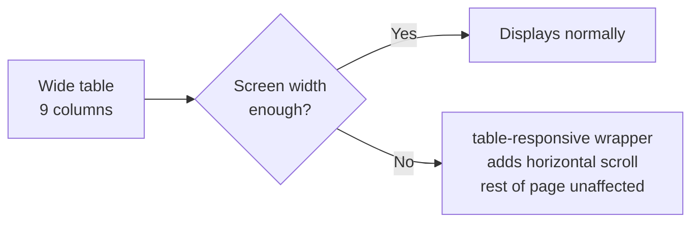

# Module 2: Building the Customer Management Page

Now we apply everything from Module 1 to a real page: a customer table (id, name, email, phone, date of birth, date of join, branch, account balance), with an inline Add/Update form on the same page.

---

## Starter Skeleton (unstyled)

Save this as `customers.html`. It's plain HTML — no Bootstrap classes yet. Your job this module is to add them.

```html
<!DOCTYPE html>
<html lang="en">
<head>
  <meta charset="UTF-8">
  <title>Customer Management</title>
  <link href="https://cdn.jsdelivr.net/npm/bootstrap@5.3.3/dist/css/bootstrap.min.css" rel="stylesheet">
</head>
<body>

  <div id="page-wrapper">

    <h1>Customer Management</h1>

    <!-- Customer Table -->
    <table id="customer-table">
      <thead>
        <tr>
          <th>ID</th>
          <th>Name</th>
          <th>Email</th>
          <th>Phone</th>
          <th>Date of Birth</th>
          <th>Date of Join</th>
          <th>Branch</th>
          <th>Account Balance</th>
          <th>Actions</th>
        </tr>
      </thead>
      <tbody>
        <tr>
          <td>1</td>
          <td>Alex Rivera</td>
          <td>alex.rivera@example.com</td>
          <td>+36 20 123 4567</td>
          <td>1994-03-12</td>
          <td>2021-06-01</td>
          <td>Budapest</td>
          <td>4,250.00</td>
          <td>
            <button class="edit-btn">Edit</button>
          </td>
        </tr>
        <tr>
          <td>2</td>
          <td>Sara Kovacs</td>
          <td>sara.kovacs@example.com</td>
          <td>+36 30 987 6543</td>
          <td>1997-11-05</td>
          <td>2022-02-15</td>
          <td>London</td>
          <td>1,980.50</td>
          <td>
            <button class="edit-btn">Edit</button>
          </td>
        </tr>
      </tbody>
    </table>

    <!-- Add / Update Customer Form -->
    <div id="customer-form-wrapper">
      <h2>Add Customer</h2>
      <form id="customer-form">
        <div>
          <label for="name">Name</label>
          <input type="text" id="name">
        </div>
        <div>
          <label for="email">Email</label>
          <input type="email" id="email">
        </div>
        <div>
          <label for="phone">Phone</label>
          <input type="text" id="phone">
        </div>
        <div>
          <label for="dob">Date of Birth</label>
          <input type="date" id="dob">
        </div>
        <div>
          <label for="joinDate">Date of Join</label>
          <input type="date" id="joinDate">
        </div>
        <div>
          <label for="branch">Branch</label>
          <select id="branch">
            <option>Budapest</option>
            <option>London</option>
            <option>Singapore</option>
          </select>
        </div>
        <div>
          <label for="balance">Account Balance</label>
          <input type="number" id="balance" step="0.01">
        </div>
        <button type="submit">Save Customer</button>
        <button type="button">Cancel</button>
      </form>
    </div>

  </div>

  <script src="https://cdn.jsdelivr.net/npm/bootstrap@5.3.3/dist/js/bootstrap.bundle.min.js"></script>
</body>
</html>
```

**Checkpoint before styling:** open this in a browser. It should look completely plain — default black text, no spacing, no borders beyond the browser's bare minimum. That's your baseline.

---

## Part A — Structuring the Page

Wrap the page content in Bootstrap's layout classes first, before touching the table or form individually:

```html
<div id="page-wrapper" class="container my-4">
```

`container` centers the page and constrains its width at each breakpoint; `my-4` adds vertical margin (top and bottom) so content isn't jammed against the browser edges.

✅ **TRY THIS:** add `text-center mb-4` to your `<h1>` for a centered page title with spacing below it.

---

## Part B — Styling the Table

With 9 columns (including Actions), this table is wide — on a laptop it may be fine, but on a tablet or phone it will overflow. Bootstrap's answer is `table-responsive`, which wraps the table in a horizontally scrollable container so it never breaks the page layout:

```html
<div class="table-responsive">
  <table id="customer-table" class="table table-striped table-hover align-middle">
    ...
  </table>
</div>
```

| Class | Effect |
|---|---|
| `table` | base Bootstrap table styling |
| `table-striped` | alternating row background |
| `table-hover` | highlight row on mouse hover |
| `align-middle` | vertically centers cell content — useful once buttons are inside cells |

For the Account Balance column, right-align the numbers so they're easy to scan and compare — add `class="text-end"` to both the `<th>` and each `<td>` for that column.

For the Edit button inside each row:

```html
<button class="btn btn-sm btn-outline-primary edit-btn">Edit</button>
```

`btn-sm` keeps the button compact so it doesn't dominate the row height. `btn-outline-primary` keeps it visually secondary to the main "Save Customer" action in the form below.

**🔴 Diagram: table-responsive on a narrow screen**



⚠️ **GOTCHA:** `table-responsive` goes on a `<div>` *wrapping* the table, not on the `<table>` tag itself.

---

## Part C — Styling the Form (Inline Card)

Wrap the whole Add/Update form in a card, matching the component you practiced in Module 1:

```html
<div id="customer-form-wrapper" class="card mt-4">
  <div class="card-body">
    <h2 class="card-title h4">Add Customer</h2>
    <form id="customer-form">
      ...
    </form>
  </div>
</div>
```

`h4` alongside `card-title` shrinks the heading size to fit better inside a card, while keeping the `card-title` spacing/weight styling.

### Laying out fields in a grid

Rather than every field stacking full-width, group related fields side by side using the row/col system from Module 1:

```html
<div class="row">
  <div class="col-md-6 mb-3">
    <label for="name" class="form-label">Name</label>
    <input type="text" id="name" class="form-control">
  </div>
  <div class="col-md-6 mb-3">
    <label for="email" class="form-label">Email</label>
    <input type="email" id="email" class="form-control">
  </div>
</div>

<div class="row">
  <div class="col-md-4 mb-3">
    <label for="phone" class="form-label">Phone</label>
    <input type="text" id="phone" class="form-control">
  </div>
  <div class="col-md-4 mb-3">
    <label for="dob" class="form-label">Date of Birth</label>
    <input type="date" id="dob" class="form-control">
  </div>
  <div class="col-md-4 mb-3">
    <label for="joinDate" class="form-label">Date of Join</label>
    <input type="date" id="joinDate" class="form-control">
  </div>
</div>

<div class="row">
  <div class="col-md-6 mb-3">
    <label for="branch" class="form-label">Branch</label>
    <select id="branch" class="form-select">
      <option>Budapest</option>
      <option>London</option>
      <option>Singapore</option>
    </select>
  </div>
  <div class="col-md-6 mb-3">
    <label for="balance" class="form-label">Account Balance</label>
    <input type="number" id="balance" step="0.01" class="form-control">
  </div>
</div>

<button type="submit" class="btn btn-primary">Save Customer</button>
<button type="button" class="btn btn-outline-secondary">Cancel</button>
```

💡 **WHY:** the field groupings aren't arbitrary — Name/Email together, Phone/DOB/Join Date together, Branch/Balance together — grouping related short fields on one row uses horizontal space efficiently, while keeping each row logically coherent.

⚠️ **GOTCHA:** a `<select>` element uses the class `form-select`, not `form-control` — a common mix-up, since visually they end up looking similar once styled.

✅ **TRY THIS:** add `me-2` (margin-end) to the "Save Customer" button so it doesn't sit flush against the "Cancel" button next to it.

---

## Part D — Optional Polish

- Add a `badge` to show branch inline in the table instead of plain text: `<span class="badge bg-info text-dark">Budapest</span>`
- Add `border-0 shadow-sm` to the card for a subtle lifted look: `class="card mt-4 border-0 shadow-sm"`
- Add `text-success` or `text-danger` conditionally to the balance column if you want negative balances to visually stand out (styling only — the logic to apply it conditionally is a JavaScript task, not CSS)

---

## 🎯 Full Checkpoint

By the end of this module, your page should have:

- A centered, comfortably spaced layout (`container`, `my-4`)
- A striped, hoverable, horizontally-scrollable-on-mobile table with right-aligned balance figures
- An inline card below the table containing a neatly grouped, responsive Add/Update form
- Small, outlined Edit buttons in the table and clear primary/secondary buttons in the form

This is a complete, professional-looking customer management page built entirely with Bootstrap classes — no custom CSS required.

---

## 🚀 Challenge Task

Add a search input above the table (`form-control`, placeholder "Search customers...") styled to sit neatly above the `table-responsive` wrapper, aligned to the right using `d-flex justify-content-end`. Wiring up the actual search filtering is a JavaScript task for another day — this challenge is about layout and alignment only.

*No solution provided — bring your attempt to the next session.*