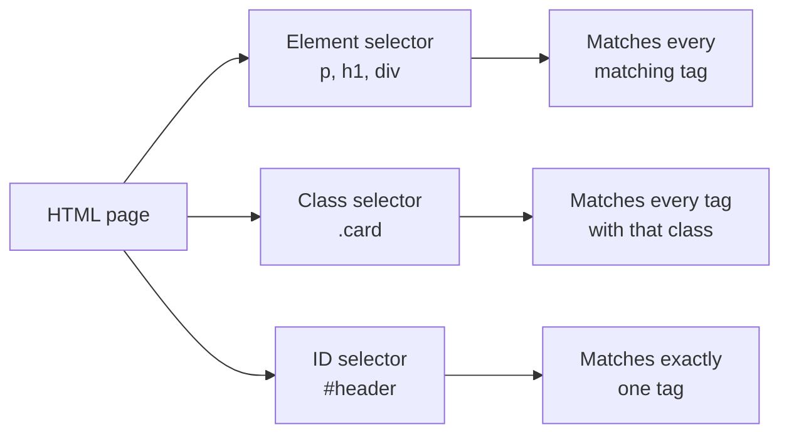
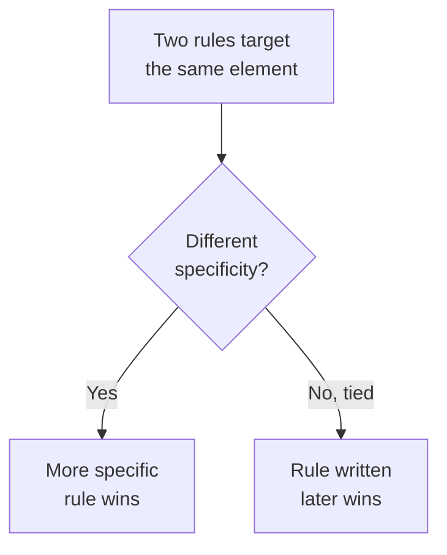
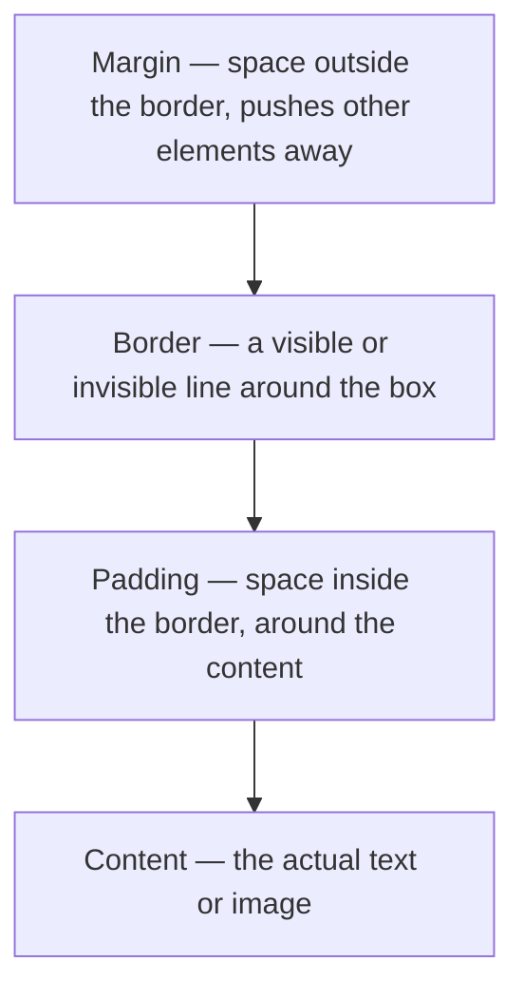

# Module 1: CSS 101 & Foundations — Selectors and the Box Model

Welcome to your CSS playbook. Over the next 2 hours you'll design and build your own **About Me page**, one module at a time. Every module ends with you editing the *same* two files — `about-me.html` and `style.css` — so by the end you'll have a complete, personally styled page.

---

## Part A — CSS 101

### What is CSS?

HTML gives a web page **structure** (headings, paragraphs, images). CSS gives it **style** (colors, spacing, fonts, layout). Same HTML, endless possible looks — that's the whole point of this session.

### Linking a stylesheet

You link a CSS file to an HTML file once, in the `<head>`:

```html
<head>
  <link rel="stylesheet" href="style.css">
</head>
```

From that point on, every rule you write in `style.css` applies to `about-me.html`. No refreshing the link, no re-linking — just save `style.css` and reload the browser.

### Anatomy of a CSS rule

```css
h1 {
  color: navy;
  font-size: 32px;
}
```

- `h1` is the **selector** — which element(s) this rule targets
- Everything inside `{ }` is a **declaration block**
- `color: navy;` is one **declaration** — a property and a value, ending in `;`

### Selector types

| Selector | Targets | Example |
|---|---|---|
| Element | every tag of that type | `p { }` styles all paragraphs |
| Class | any tag with `class="..."` | `.card { }` styles `<div class="card">` |
| ID | the one tag with that `id="..."` | `#main-title { }` styles `<h1 id="main-title">` |
| Descendant | tag B *inside* tag A | `.card p { }` styles paragraphs inside `.card` |

**🔴 Diagram: CSS Selector Types — what each one grabs**



**✅ TRY THIS:** classes can repeat across many tags, but an `id` should only ever be used once per page.

### Cascade, specificity, inheritance (in plain English)

CSS stands for **Cascading** Style Sheets. When two rules target the same element, CSS needs a tie-breaker:

1. **Specificity** — more specific selectors win. `#header` beats `.title` beats `p`.
2. **Order** — if specificity ties, whichever rule is written *last* in the file wins.
3. **Inheritance** — some properties (like `color` and `font-family`) automatically pass down from parent to child, unless overridden.

**🔴 Diagram: Which rule wins?**



💡 **WHY:** you don't need to memorize specificity scoring today — just know that IDs > classes > elements, and "last one written" is the tiebreaker.

---

## Part B — The Box Model

Every single HTML element is a rectangular box, whether you can see it or not. The box model describes what's inside that box, from the content outward:

**🔴 Diagram: The Box Model — layers of every element**



```css
.card {
  padding: 16px;        /* space inside the border */
  border: 1px solid #ccc; /* the line itself */
  margin: 24px;          /* space outside the border */
}
```

⚠️ **GOTCHA:** by default, `width` only sets the *content* width — padding and border get added on top, making the box bigger than you expect. Fix it globally with:

```css
* {
  box-sizing: border-box;
}
```

This makes `width` include padding and border, so a `300px` box actually measures `300px` total. Add this once, at the very top of every stylesheet you write.

🔁 **ANALOGY:** think of a framed photo on a wall. The photo is the *content*, the mat around it is the *padding*, the frame itself is the *border*, and the empty wall space around the frame is the *margin*.

---

## 🔧 Hands-On Practice

Create a scratch file called `practice.html` (separate from your About Me page — just for experimenting):

```html
<!DOCTYPE html>
<html>
<head>
  <link rel="stylesheet" href="practice.css">
</head>
<body>
  <div class="box">Box One</div>
  <div class="box">Box Two</div>
</body>
</html>
```

```css
* {
  box-sizing: border-box;
}

.box {
  width: 200px;
  padding: 20px;
  border: 2px solid navy;
  margin: 16px;
  background: lightblue;
}
```

**✅ TRY THIS:**
1. Change `padding` and watch the box grow inward
2. Change `margin` and watch the gap between boxes grow
3. Remove `box-sizing: border-box;` and see the box get wider than `200px`

---

## 🧪 Lab: Selector Practice

Given this HTML:

```html
<div class="profile">
  <h2 id="name">Alex Rivera</h2>
  <p class="tagline">Building things, one commit at a time</p>
</div>
```

Write three separate CSS rules:
1. An element selector that styles all `<p>` tags
2. A class selector that styles `.tagline` specifically
3. An ID selector that styles `#name` specifically

Then answer: if `#name` and a hypothetical `.profile h2` rule both set a different `color`, which one wins, and why?

---

## 🎯 Apply to About Me

This is where your real 2-hour project begins. Below is your starter file — completely unstyled. Save it as `about-me.html`, and create an empty `style.css` right next to it, linked via `<link rel="stylesheet" href="style.css">`.

```html
<!DOCTYPE html>
<html lang="en">
<head>
  <meta charset="UTF-8">
  <title>About Me</title>
  <link rel="stylesheet" href="style.css">
</head>
<body>

  <!-- Header: your name and role -->
  <header id="header">
    <div class="avatar">SK</div>
    <div>
      <h1 id="name">Your Name</h1>
      <p id="role">Your role &middot; Your city</p>
    </div>
  </header>

  <!-- Bio section -->
  <section id="bio">
    <h2>About me</h2>
    <p>A couple of sentences about yourself.</p>
  </section>

  <!-- Skills section -->
  <section id="skills">
    <h2>Skills</h2>
    <div class="skills-list">
      <div class="skill-item">HTML</div>
      <div class="skill-item">CSS</div>
      <div class="skill-item">JavaScript</div>
    </div>
  </section>

  <!-- Contact section -->
  <footer id="contact">
    <button class="btn">Contact me</button>
    <button class="btn">View resume</button>
  </footer>

</body>
</html>
```

**Your task for this module:**

1. Add `* { box-sizing: border-box; }` to the top of `style.css`
2. Give `#header`, `#bio`, `#skills`, and `#contact` some `padding` so content isn't crammed against the edges
3. Add a `border-bottom` between sections so they're visually separated
4. Give `.avatar` a fixed `width`, `height`, and a visible `border` (we'll make it a circle in Module 2)

**Checkpoint:** your page should now have four visibly separated, padded sections — no colors or fonts yet, just shape and spacing. That's exactly right for this stage.

---

## 🚀 Challenge Task

Using only what you've learned in this module (selectors + box model), try to give the `.skill-item` boxes a visible border and consistent spacing between them — without looking ahead to Module 3. There's more than one way to do it with what you know so far.

*No solution provided — bring your attempt to the next session.*