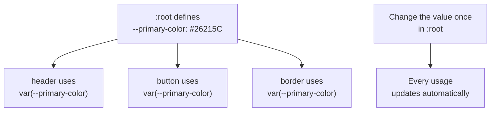

# Module 2: Color & Typography

Your page has shape now. This module gives it a voice — a color palette and a font pairing that feel like *yours*.

---

## Part A — Color in CSS

### Ways to write a color

```css
p {
  color: red;              /* named color */
  color: #26215C;          /* hex */
  color: rgb(38, 33, 92);  /* red, green, blue */
}
```

All three do the same job. Hex is the most common for custom palettes since design tools (Figma, Coolors, Google Fonts) usually give you hex codes directly.

### Two properties you'll use constantly

```css
.card {
  color: #26215C;             /* text color */
  background-color: #EEEDFE;  /* box color */
}
```

⚠️ **GOTCHA:** `color` sets *text* color, `background-color` sets the *box* color. Mixing these up is the single most common beginner error.

### CSS Variables — define your palette once

Instead of retyping `#26215C` in ten places, define it once at the top of your file:

```css
:root {
  --primary-color: #26215C;
  --accent-color: #7F77DD;
  --text-color: #333333;
}

header {
  background-color: var(--primary-color);
}

.avatar {
  background-color: var(--accent-color);
}
```

**🔴 Diagram: CSS Variables — define once, use everywhere**



💡 **WHY:** if you decide your primary color should be a slightly different shade of purple halfway through, you change one line instead of hunting through the whole file.

🔁 **ANALOGY:** `:root` variables are like naming a paint color once ("Midnight Purple") and just saying that name every time you need it, instead of re-mixing paint from scratch each time.

---

## Part B — Typography

### Setting a font

```css
body {
  font-family: 'Poppins', sans-serif;
}

h1, h2 {
  font-family: 'Playfair Display', serif;
}
```

The second value (`sans-serif`, `serif`) is a **fallback** — if the browser can't load your chosen font, it uses the closest generic style instead.

### Using Google Fonts

Add this inside `<head>` in your HTML, before your stylesheet link:

```html
<link href="https://fonts.googleapis.com/css2?family=Poppins:wght@400;600&family=Playfair+Display&display=swap" rel="stylesheet">
```

Then reference the font names exactly as shown in `font-family`.

### Font pairing — one rule of thumb

Pick **one font for headings, one for body text**. A common, safe pairing: a distinctive serif or display font for headings, a clean sans-serif for body copy. Avoid using more than two fonts total — it starts to look chaotic.

### Other useful text properties

```css
p {
  font-size: 16px;
  font-weight: 400;    /* 400 = regular, 600–700 = bold */
  line-height: 1.6;    /* space between lines, improves readability */
  letter-spacing: 0.5px;
}
```

✅ **TRY THIS:** `line-height` between 1.4 and 1.7 is the readable sweet spot for body text. Below 1.2, lines feel cramped.

---

## 🔧 Hands-On Practice

Two files, saved side by side — save as `colors-and-font-practice.html` and `colors-and-font-practice.css`:

```html
<!DOCTYPE html>
<html lang="en">
<head>
  <meta charset="UTF-8">
  <title>Color & Typography Practice</title>
  <link href="https://fonts.googleapis.com/css2?family=Poppins:wght@400;600&family=Playfair+Display&display=swap" rel="stylesheet">
  <link rel="stylesheet" href="colors-and-font-practice.css">
</head>
<body>
  <h1>Color & Typography Demo</h1>
  <p>This paragraph uses the body font and color defined in :root. Change the variables in the CSS file and reload to see the whole page shift.</p>
</body>
</html>
```

```css
:root {
  --bg-color: #FAF7F2;
  --heading-color: #26215C;
  --body-color: #444444;
}

body {
  background-color: var(--bg-color);
  color: var(--body-color);
  font-family: 'Poppins', sans-serif;
  padding: 40px;
}

h1 {
  color: var(--heading-color);
  font-family: 'Playfair Display', serif;
  font-size: 32px;
}

p {
  font-size: 16px;
  line-height: 1.6;
}
```

**✅ TRY THIS, live in front of the room:** change `--bg-color` to three different hex values one at a time and reload — pale yellow feels cheerful, dark navy feels serious, soft pink feels playful. Then swap `'Playfair Display'` for `'Georgia'` and ask candidates which pairing they prefer.

---

## 🧪 Lab: Build a Palette

Pick 3 colors using a tool like [coolors.co](https://coolors.co) or [Google Fonts](https://fonts.google.com):
- One **primary** color (headers, buttons)
- One **accent** color (highlights, hover states — save for Module 5)
- One **neutral** (page background or muted text)

Write them as `:root` variables. Then pick a heading font and a body font from Google Fonts and set them up with the `<link>` tag.

---

## 🎯 Apply to About Me

Open your `style.css` from Module 1.

**Your task for this module:**

1. Add a `:root` block with `--primary-color`, `--accent-color`, and `--bg-color` variables
2. Pick a Google Fonts pairing and add the `<link>` tag to `about-me.html`
3. Set `body { font-family: ... }` for your body font, and a separate rule for headings
4. Apply `background-color: var(--primary-color)` to `#header`, and `color: white` for the text inside it so it stays readable
5. Give `.avatar` a `border-radius: 50%` so it becomes a circle, using `var(--accent-color)` as its background

**Checkpoint:** your page should now have a distinct color identity and two fonts (one for headings, one for body) — still stacked vertically, but it should feel like *your* page now, not a generic one.

---

## 🚀 Challenge Task

Try applying `var(--accent-color)` as the background for each `.skill-item`, with `var(--primary-color)` as its text color. Make sure the text stays easy to read against the background you chose.

*No solution provided — bring your attempt to the next session.*