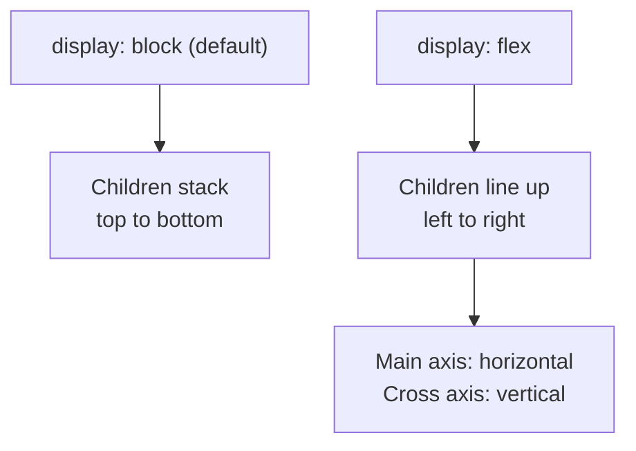
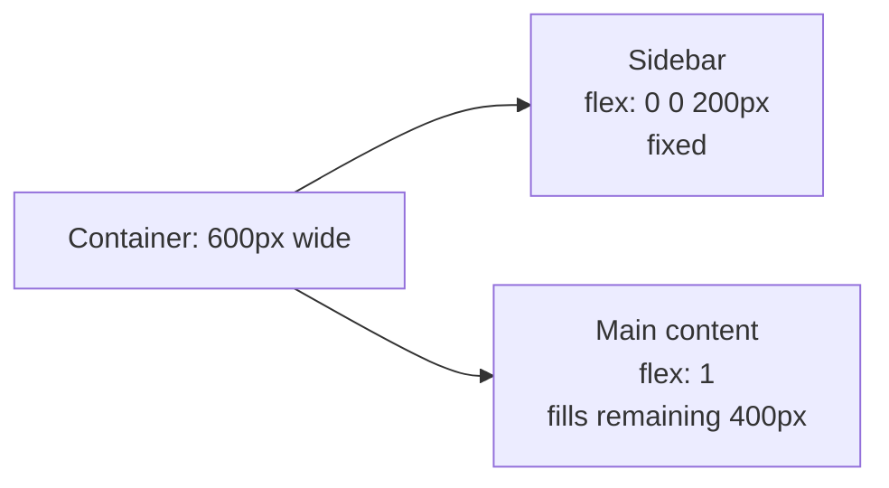

# Module 3: Layout with Flexbox

Right now every section on your page stacks vertically because that's just how HTML elements behave by default (`display: block`). Flexbox is how you break out of that — putting things side by side, centering them, and controlling the space between them.

---

## Part A — What Flexbox Actually Does

Flexbox turns a container into a **flexible row or column**, and gives you simple tools to align and space whatever's inside it.

```css
.container {
  display: flex;
}
```

That one line changes everything: every direct child of `.container` now lines up side by side instead of stacking.

**🔴 Diagram: Block layout vs Flexbox layout**



🔁 **ANALOGY:** think of `display: block` as books stacked flat in a pile, and `display: flex` as the same books standing upright on a shelf, side by side.

### The main axis and cross axis

By default, flex's **main axis** is horizontal (left to right) and the **cross axis** is vertical. Two properties control alignment along each:

```css
.container {
  display: flex;
  justify-content: center;   /* aligns along the main axis */
  align-items: center;       /* aligns along the cross axis */
}
```

| Property | Controls | Common values |
|---|---|---|
| `justify-content` | horizontal spacing (main axis) | `flex-start`, `center`, `space-between`, `space-around` |
| `align-items` | vertical alignment (cross axis) | `flex-start`, `center`, `stretch` |
| `gap` | space between items | any length, e.g. `16px` |

✅ **TRY THIS:** `justify-content: space-between` pushes the first item to the far left and the last item to the far right, spreading everything else evenly in between — perfect for a header with a logo on one side and a button on the other.

### Changing direction

```css
.container {
  display: flex;
  flex-direction: column; /* stack vertically, but still flex */
}
```

`flex-direction: column` flips the main axis to vertical — useful when you want flex's alignment powers but a stacked layout.

---

## Part B — Sizing Flex Items

```css
.sidebar {
  flex: 0 0 200px;  /* don't grow, don't shrink, stay 200px */
}

.main-content {
  flex: 1;          /* grow to fill remaining space */
}
```

`flex: 1` is the one you'll reach for most — it means "take up all the leftover room."

**🔴 Diagram: How flex-grow shares leftover space**



⚠️ **GOTCHA:** `display: flex` only affects the *direct children* of the container, not grandchildren. If nested content isn't lining up, check you're applying `flex` to the right wrapper.

---

## 🔧 Hands-On Practice

Two files, saved side by side — save as `flexbox-practice.html` and `flexbox-practice.css`:

```html
<!DOCTYPE html>
<html lang="en">
<head>
  <meta charset="UTF-8">
  <title>Flexbox Practice</title>
  <link rel="stylesheet" href="flexbox-practice.css">
</head>
<body>
  <div class="header">
    <div class="logo">Logo</div>
    <div class="nav">
      <a href="#">Home</a>
      <a href="#">About</a>
      <a href="#">Contact</a>
    </div>
  </div>
</body>
</html>
```

```css
.header {
  display: flex;
  justify-content: space-between;
  align-items: center;
  padding: 20px;
  background: #eee;
}

.logo {
  font-weight: bold;
  font-size: 20px;
}

.nav a {
  margin-left: 16px;
  text-decoration: none;
  color: #333;
}
```

**✅ TRY THIS, live in front of the room:** change `justify-content` to `center`, then `flex-start`, then `space-around`, and reload each time — watch how the logo and nav rearrange. Then change `align-items` from `center` to `flex-start` and resize the browser taller to show the vertical effect.

---

## 🧪 Lab: Two-Column Layout

Build a simple two-column layout: a fixed-width sidebar (`200px`) and a main content area that fills the rest of the space, both the same height. Use `display: flex` on the parent, `flex: 0 0 200px` on the sidebar, and `flex: 1` on the main content.

---

## 🎯 Apply to About Me

Open your `style.css` from Module 2.

**Your task for this module:**

1. Add `display: flex; align-items: center; gap: 20px;` to `#header` so the avatar and name/role text sit side by side instead of stacking
2. Add `display: flex; gap: 12px;` to `#contact` so your two buttons sit next to each other instead of stacking
3. Inside `.skills-list`, add `display: flex; flex-wrap: wrap; gap: 10px;` so skill items line up in a row (and wrap onto a new line if there isn't room)
4. Experiment with `justify-content` on `#header` — try `flex-start` vs `space-between` and pick whichever looks best with your content

**Checkpoint:** your header should now show the avatar and your name/role side by side, and your buttons should sit next to each other. The page is starting to look like a real layout, not a stack of boxes.

---

## 🚀 Challenge Task

Using `flex-direction: column` and `justify-content: center` together, try centering the entire bio section's content both horizontally and vertically within its box. Think about what container needs `display: flex` for this to work.

*No solution provided — bring your attempt to the next session.*