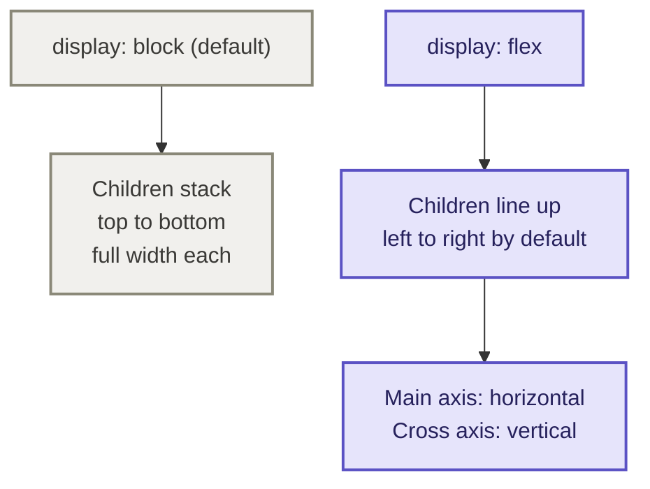
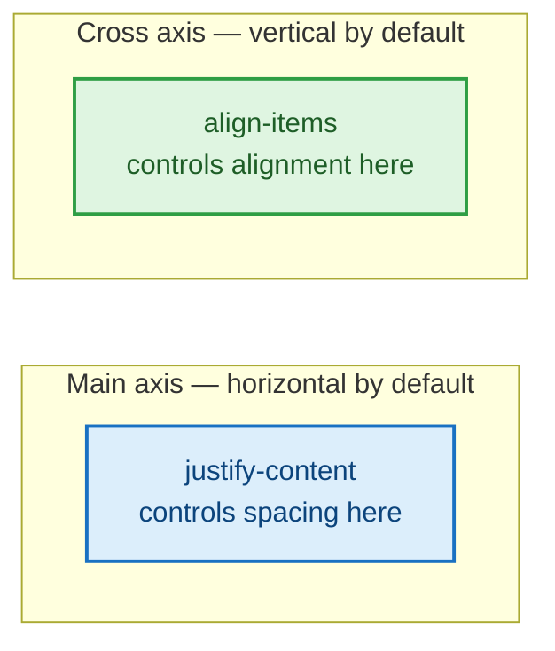
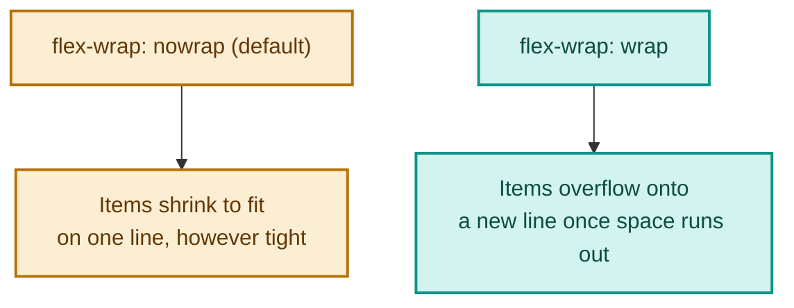
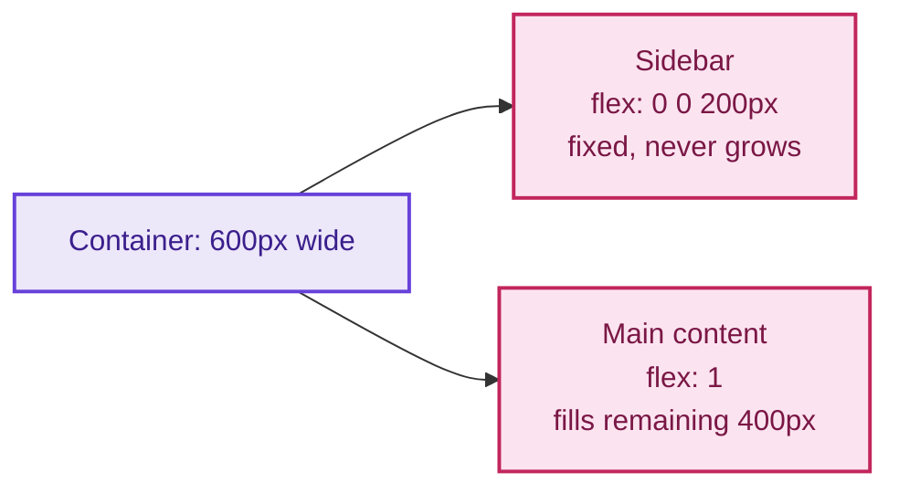
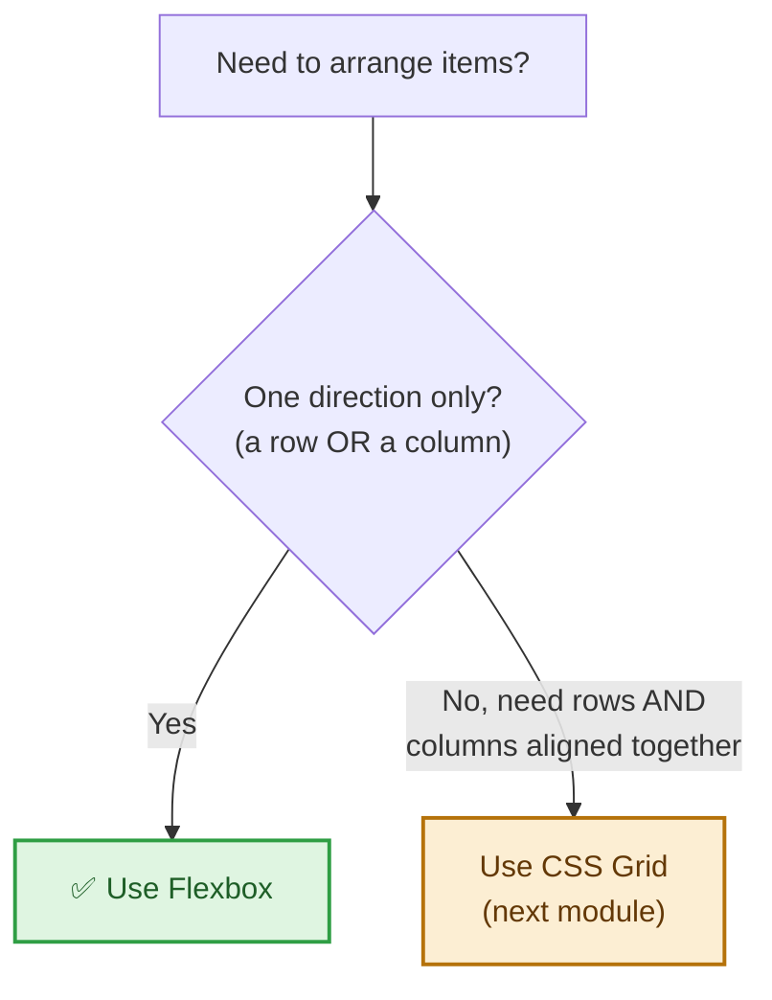

# Module 3: Layout with Flexbox

Right now every section on your page stacks vertically because that's just how HTML elements behave by default (`display: block`). Flexbox is how you break out of that — putting things side by side, centering them, and controlling the space between them.

---

## Part A — Why Flexbox Exists

Before flexbox, lining elements up side by side, centering something vertically, or making a row of boxes share space evenly all required awkward workarounds (floats, `display: inline-block` with spacing hacks, or absolute positioning). Flexbox was built specifically to solve **one-dimensional layout** — arranging items in a single row or a single column — cleanly, with no hacks.

🔁 **ANALOGY:** think of `display: block` as books stacked flat in a pile, one on top of the other. Flexbox turns that same pile into books standing upright on a shelf, side by side — and gives you dials to control exactly how they're spaced, aligned, and sized on that shelf.

**🔴 Diagram: Block layout vs Flexbox layout**



### Container vs items — the two halves of every flex layout

Every flexbox layout has exactly two roles:

- **The container** — the parent element you set `display: flex` on. This is where you control spacing, direction, and alignment for everything inside it.
- **The items** — the direct children of that container. These are what actually get arranged.

```css
.container {
  display: flex;   /* this element becomes the flex container */
}
/* .container's direct children automatically become flex items — no extra class needed */
```

⚠️ **GOTCHA:** `display: flex` only affects the *direct children* of the container, not grandchildren. If nested content isn't lining up the way you expect, check that you're applying `display: flex` to the correct wrapper — the one immediately around the elements you want arranged.

---

## Part B — The Main Axis and Cross Axis

This is the single most important flexbox concept: every flex container has two axes, and different properties control alignment along each one.

By default, the **main axis** runs horizontally (left to right) and the **cross axis** runs vertically (top to bottom) — but `flex-direction` can flip which is which (covered below).

**🔴 Diagram: Main axis vs cross axis**



```css
.container {
  display: flex;
  justify-content: center;   /* aligns items along the MAIN axis */
  align-items: center;       /* aligns items along the CROSS axis */
}
```

### justify-content — every value explained

Controls how items are spaced along the main axis (horizontally, by default):

| Value | Effect |
|---|---|
| `flex-start` (default) | items packed at the start |
| `flex-end` | items packed at the end |
| `center` | items packed together in the center |
| `space-between` | first item at the start, last at the end, even gaps between the rest |
| `space-around` | equal space around every item (including half-gaps at each end) |
| `space-evenly` | perfectly equal space everywhere, including the outer edges |

✅ **TRY THIS:** `justify-content: space-between` is the single most common flexbox value in real layouts — it's what puts a logo on the far left and a nav menu on the far right of a header, with nothing extra needed to push them apart.

### align-items — every value explained

Controls how items are aligned along the cross axis (vertically, by default):

| Value | Effect |
|---|---|
| `stretch` (default) | items stretch to fill the container's height |
| `flex-start` | items align to the top |
| `flex-end` | items align to the bottom |
| `center` | items are vertically centered |
| `baseline` | items align by their text baseline |

💡 **WHY:** `align-items: center` combined with `justify-content: center` is the classic "how do I center a div" answer — two lines of CSS on the parent solve a problem that used to take a genuine workaround.

### gap — spacing without margins

```css
.container {
  display: flex;
  gap: 16px;
}
```

`gap` puts consistent space *between* items only — not around the outside of the whole group, and without needing margin on individual items (which used to cause uneven spacing at the edges). This is the modern, preferred way to space flex items.

### flex-direction — choosing row or column

```css
.container {
  display: flex;
  flex-direction: column; /* stack vertically, but still flex */
}
```

`flex-direction: column` flips the main axis to vertical and the cross axis to horizontal — `justify-content` and `align-items` then swap which direction they control accordingly. This is useful when you want flex's alignment powers (centering, even spacing) but a stacked layout, like a vertically-centered sidebar menu.

### flex-wrap — letting items wrap onto new lines

```css
.container {
  display: flex;
  flex-wrap: wrap;
  gap: 12px;
}
```

By default, flex items all try to squeeze onto a single line, shrinking if necessary. `flex-wrap: wrap` lets them flow onto multiple lines instead once they run out of room — essential for things like a row of tags or skill badges that need to reflow on smaller screens.

**🔴 Diagram: flex-wrap: nowrap vs wrap**



---

## Part C — Sizing Individual Flex Items

While the properties above go on the *container*, these next ones go on the individual *items* themselves:

```css
.sidebar {
  flex: 0 0 200px;  /* don't grow, don't shrink, stay 200px */
}

.main-content {
  flex: 1;          /* grow to fill remaining space */
}
```

`flex` is shorthand for three values: `flex-grow flex-shrink flex-basis`.

| Part | Meaning |
|---|---|
| `flex-grow` | how eagerly this item grows to fill leftover space (0 = never, 1 = grows equally with other `flex: 1` items) |
| `flex-shrink` | how eagerly this item shrinks if there isn't enough room (0 = never shrink) |
| `flex-basis` | the item's starting size before growing/shrinking is applied |

`flex: 1` is shorthand for `flex: 1 1 0%` — the value you'll reach for most, meaning "ignore your natural size, just take an equal share of the leftover room."

**🔴 Diagram: How flex-grow shares leftover space**



### align-self — overriding alignment for one item

```css
.special-item {
  align-self: flex-end; /* just this one item breaks from the group's align-items */
}
```

`align-self` overrides `align-items` for a single item, without affecting the rest — handy when one item in a row needs different vertical alignment than its siblings.

---

## Part D — Best Places to Use Flexbox

Flexbox is the right tool specifically for **one-dimensional** layouts — a single row or a single column. Reach for it when you need to:

- **Navigation bars & headers** — logo on one side, nav links on the other (`justify-content: space-between`)
- **Button groups** — a row of buttons with consistent spacing (`gap`)
- **Centering anything** — the classic `display: flex; justify-content: center; align-items: center;` combo
- **Card rows that should share height** — flex items stretch to match each other's height by default (`align-items: stretch`)
- **Form field groups** — labels and inputs side by side, or several short inputs in a row
- **Wrapping tag/badge/skill lists** — `flex-wrap: wrap` lets them reflow naturally

⚠️ **GOTCHA:** flexbox struggles once you need precise alignment across *two* dimensions at once (rows **and** columns lining up together, like a photo gallery or dashboard grid) — that's exactly the job for CSS Grid, covered in the next module. A good rule of thumb: if you're only ever thinking about a single row or a single column, use flexbox; if you're thinking about a full grid of rows and columns together, use grid.

**🔴 Diagram: When to reach for flexbox**



---

## 🔧 Hands-On Practice

Two files, saved side by side — save as `flexbox-practice.html` and `flexbox-practice.css`:

```html
<!DOCTYPE html>
<html lang="en">
<head>
  <meta charset="UTF-8">
  <title>Flexbox Practice</title>
  <link rel="stylesheet" href="flexbox-practice.css">
</head>
<body>
  <div class="header">
    <div class="logo">Logo</div>
    <div class="nav">
      <a href="#">Home</a>
      <a href="#">About</a>
      <a href="#">Contact</a>
    </div>
  </div>
</body>
</html>
```

```css
.header {
  display: flex;
  justify-content: space-between;
  align-items: center;
  padding: 20px;
  background: #eee;
}

.logo {
  font-weight: bold;
  font-size: 20px;
}

.nav a {
  margin-left: 16px;
  text-decoration: none;
  color: #333;
}
```

**✅ TRY THIS:** change `justify-content` to `center`, then `flex-start`, then `space-around`, and reload each time — watch how the logo and nav rearrange. Then change `align-items` from `center` to `flex-start` and resize the browser taller to see the vertical effect.

---

## 🧪 Lab: Two-Column Layout

Build a simple two-column layout: a fixed-width sidebar (`200px`) and a main content area that fills the rest of the space, both the same height. Use `display: flex` on the parent, `flex: 0 0 200px` on the sidebar, and `flex: 1` on the main content.

---

## 🎯 Apply to About Me

Open your `style.css` from Module 2.

**Your task for this module:**

1. Add `display: flex; align-items: center; gap: 20px;` to `#header` so the avatar and name/role text sit side by side instead of stacking
2. Add `display: flex; gap: 12px;` to `#contact` so your two buttons sit next to each other instead of stacking
3. Inside `.skills-list`, add `display: flex; flex-wrap: wrap; gap: 10px;` so skill items line up in a row (and wrap onto a new line if there isn't room)
4. Experiment with `justify-content` on `#header` — try `flex-start` vs `space-between` and pick whichever looks best with your content

**Checkpoint:** your header should now show the avatar and your name/role side by side, and your buttons should sit next to each other. The page is starting to look like a real layout, not a stack of boxes.

---

## 🚀 Challenge Task

Using `flex-direction: column` and `justify-content: center` together, try centering the entire bio section's content both horizontally and vertically within its box. Think about what container needs `display: flex` for this to work.

*No solution provided — bring your attempt to the next session.*