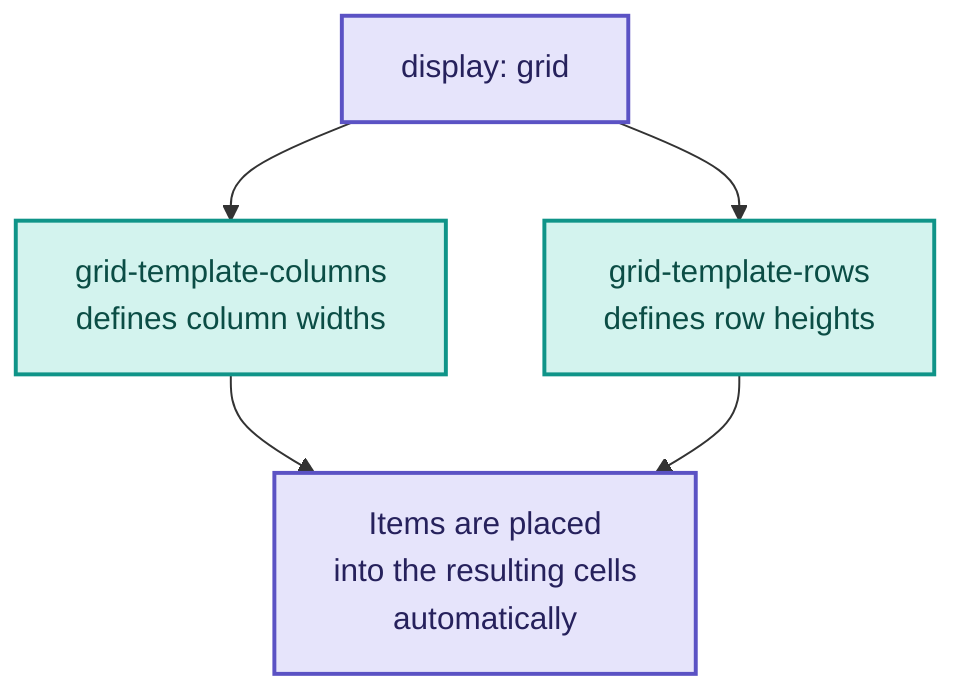
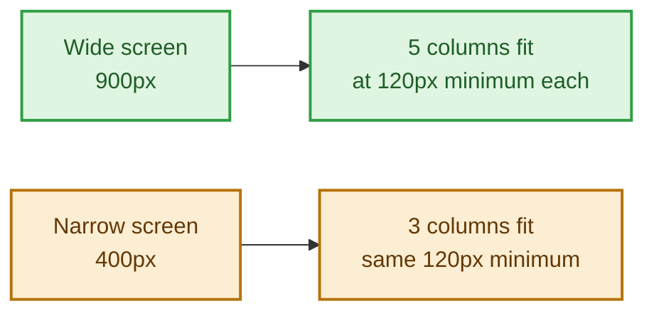
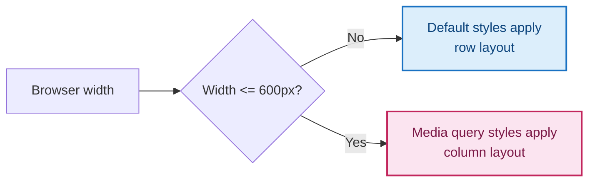
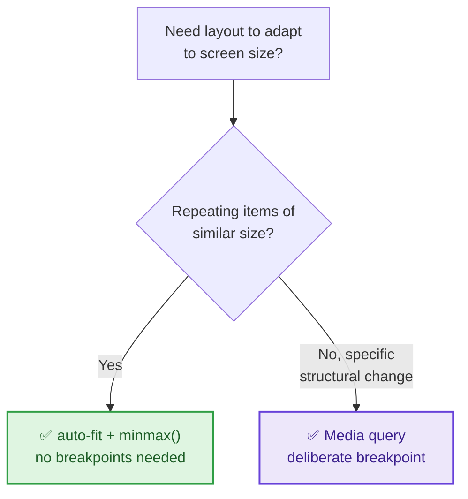

# Module 4: CSS Grid & Responsive Design

Flexbox is great for one-directional layout — a row or a column. Grid is for when you need rows *and* columns at once. This module also covers making your page adapt to different screen sizes, so it looks right on a phone as well as a laptop.

---

## Part A — What CSS Grid Actually Does

Flexbox is great for one-directional layout — a single row or a single column. Grid is for when you need **rows and columns working together at the same time**, like a dashboard, a photo gallery, or a page layout with a header, sidebar, main content, and footer all aligned to the same underlying structure.

🔁 **ANALOGY:** Flexbox is arranging items along a single shelf. Grid is arranging items into a full bookcase — rows and columns at the same time, where an item can span multiple shelves or multiple slots at once.

```css
.skills-grid {
  display: grid;
  grid-template-columns: 1fr 1fr 1fr;
  grid-template-rows: auto auto;
  gap: 12px;
}
```

`display: grid` turns the container into a grid; `grid-template-columns` and `grid-template-rows` define the size of each column and row **track**. Just like flexbox, items are automatically placed into this structure — you don't have to manually assign each one to a cell unless you want more control.

**🔴 Diagram: Grid tracks — rows and columns together**



### Understanding `fr` — the fraction unit

```css
.grid {
  display: grid;
  grid-template-columns: 1fr 2fr 1fr; /* middle column is twice as wide */
}
```

`fr` means "a fraction of the available space" — it's Grid's own unit, unrelated to `%` or `px`. Three `1fr` columns split available width evenly; `1fr 2fr 1fr` gives the middle column double the share of the outer two. This adapts automatically as the container resizes — no recalculating percentages by hand.

### grid-template-columns shorthand — repeat()

```css
.grid {
  display: grid;
  grid-template-columns: repeat(3, 1fr); /* identical to: 1fr 1fr 1fr */
}
```

`repeat(3, 1fr)` just means "repeat `1fr`, three times" — shorthand for writing the same track size out manually.

### A responsive grid without media queries

```css
.skills-grid {
  display: grid;
  grid-template-columns: repeat(auto-fit, minmax(120px, 1fr));
  gap: 12px;
}
```

This is one of Grid's best tricks: `auto-fit` with `minmax()` tells the browser "fit as many 120px-minimum columns as will comfortably fit, and stretch them to share any leftover space." Resize the browser and the column count adjusts on its own — no breakpoints needed.

**🔴 Diagram: auto-fit + minmax adapting to width**



✅ **TRY THIS:** this pattern is perfect for a skills list, a photo gallery, or a card grid — anywhere you have a repeating group of similar-sized items and don't want to write manual breakpoints just to control the column count.

### grid-column and grid-row — spanning multiple cells

```css
.featured-item {
  grid-column: span 2; /* this item takes up 2 columns instead of 1 */
}
```

Individual grid items can span more than one column or row — something flexbox items simply cannot do. This is the clearest sign you need Grid rather than Flexbox: the moment an item needs to be visually wider or taller than its neighbors *within the same structured layout*, Grid is the tool built for that.

---

## Part B — Responsive Design with Media Queries

`auto-fit`/`minmax()` handles a lot of responsive behavior automatically, but sometimes you need more deliberate control over what changes at what size — that's what media queries are for.

```css
.header {
  display: flex;
  flex-direction: row;
}

@media (max-width: 600px) {
  .header {
    flex-direction: column;
    text-align: center;
  }
}
```

`@media (max-width: 600px)` means "apply these rules only when the browser window is 600px wide or narrower." This is how the same header goes from side-by-side on desktop to stacked on mobile.

**🔴 Diagram: How a media query breakpoint works**



⚠️ **GOTCHA:** always write your default (desktop) styles first, then override them inside `@media` for smaller screens. Writing it backwards causes the desktop styles to accidentally overwrite your mobile ones, since CSS rules read top to bottom.

💡 **WHY:** `max-width: 600px` is called a **mobile breakpoint**. You can add as many as you need (`900px` for tablets, `600px` for phones), but start with just one and add more only if something visibly breaks.

### Common breakpoint values

| Approx. width | Typical device | Common breakpoint |
|---|---|---|
| < 600px | phones | `max-width: 600px` |
| 600–900px | small tablets | `max-width: 900px` |
| 900–1200px | tablets/small laptops | `max-width: 1200px` |
| > 1200px | desktops | no query needed — this is the default |

---

## Part C — Best Places to Use Grid vs Flexbox vs Media Queries

- **Use Grid** for: page-level layouts (header/sidebar/main/footer), photo galleries, dashboards, any structure where items need to align across both rows and columns, or where an item needs to span multiple cells
- **Use Flexbox** for: navbars, button groups, centering, single rows or columns of content (covered in Module 3)
- **Use `auto-fit`/`minmax()`** when: you want a naturally responsive grid without writing manual breakpoints — skill lists, tag clouds, card grids
- **Use media queries** when: you need a specific, deliberate layout change at a specific width — like flipping a header from row to column, or hiding an element entirely on mobile

**🔴 Diagram: Choosing the right responsive tool**



---

## 🔧 Hands-On Practice

Two files, saved side by side — save as `grid-and-responsive-practice.html` and `grid-and-responsive-practice.css`:

```html
<!DOCTYPE html>
<html lang="en">
<head>
  <meta charset="UTF-8">
  <title>Grid & Responsive Practice</title>
  <link rel="stylesheet" href="grid-and-responsive-practice.css">
</head>
<body>
  <div class="gallery">
    <div>Item 1</div>
    <div>Item 2</div>
    <div>Item 3</div>
    <div>Item 4</div>
    <div>Item 5</div>
  </div>
</body>
</html>
```

```css
.gallery {
  display: grid;
  grid-template-columns: repeat(auto-fit, minmax(150px, 1fr));
  gap: 16px;
  padding: 20px;
}

.gallery div {
  background: #EEEDFE;
  color: #26215C;
  padding: 24px;
  text-align: center;
  border-radius: 8px;
  font-weight: 500;
}

@media (max-width: 500px) {
  .gallery {
    grid-template-columns: 1fr;
  }
}
```

**✅ TRY THIS:** shrink your browser window slowly and watch the grid columns collapse one by one, then jump to a single column once you cross the `500px` breakpoint. Then change `minmax(150px, 1fr)` to `minmax(80px, 1fr)` and reload to see how the minimum size controls how aggressively columns pack in.

---

## 🧪 Lab: Responsive Header

Take a flex header (logo + nav side by side) and add a media query so that below `600px` width, the nav stacks underneath the logo instead of squeezing beside it. Test by resizing your browser.

---

## 🎯 Apply to About Me

Open your `style.css` from Module 3.

**Your task for this module:**

1. Change `.skills-list` from `display: flex` to `display: grid` with `grid-template-columns: repeat(auto-fit, minmax(100px, 1fr));`
2. Add a media query at `max-width: 600px` that changes `#header` from `flex-direction: row` to `flex-direction: column`, and centers the text
3. Inside that same media query, reduce the padding on your sections slightly so content doesn't feel cramped on a small screen
4. Resize your browser (or open dev tools' device toolbar) and confirm your header stacks cleanly on a phone-sized screen

**Checkpoint:** your page should now be genuinely responsive — resizing the browser reflows the skills grid and, below 600px, stacks your header. This is the module where your page stops being "a page that happens to work" and becomes "a page designed to work everywhere."

---

## 🚀 Challenge Task

Add a second breakpoint at `max-width: 900px` that makes a smaller adjustment than your `600px` one (for tablets rather than phones) — for example, reducing the grid's minimum column width. Think about what changes are needed at each size versus what should just naturally flow.

*No solution provided — bring your attempt to the next session.*