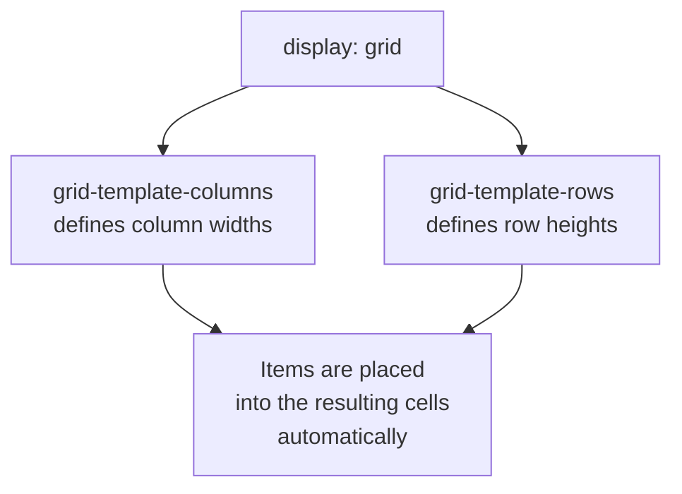
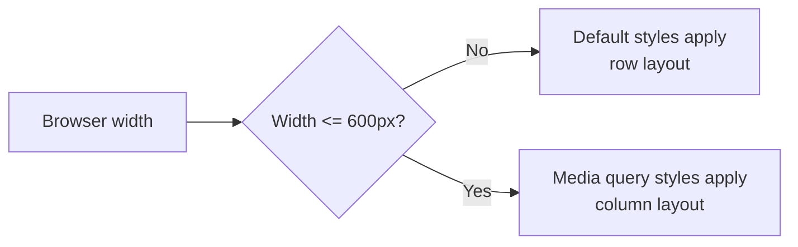

# Module 4: CSS Grid & Responsive Design

Flexbox is great for one-directional layout — a row or a column. Grid is for when you need rows *and* columns at once. This module also covers making your page adapt to different screen sizes, so it looks right on a phone as well as a laptop.

---

## Part A — CSS Grid Basics

```css
.skills-grid {
  display: grid;
  grid-template-columns: 1fr 1fr 1fr;
  gap: 12px;
}
```

`grid-template-columns: 1fr 1fr 1fr` creates three equal-width columns. `fr` means "fraction of available space" — three `1fr` columns split the width evenly.

**🔴 Diagram: Grid tracks — rows and columns together**



🔁 **ANALOGY:** Flexbox is arranging items along a single shelf. Grid is arranging items into a full bookcase — rows and columns at the same time.

### A responsive grid without media queries

```css
.skills-grid {
  display: grid;
  grid-template-columns: repeat(auto-fit, minmax(120px, 1fr));
  gap: 12px;
}
```

This is one of Grid's best tricks: `auto-fit` with `minmax()` tells the browser "fit as many 120px-minimum columns as will comfortably fit, and stretch them to share any leftover space." Resize the browser and the column count adjusts on its own — no breakpoints needed.

✅ **TRY THIS:** this pattern is perfect for a skills list, a photo gallery, or a card grid — anywhere you have a repeating group of similar-sized items.

---

## Part B — Media Queries

Sometimes you need more deliberate control than `auto-fit` gives you — that's what media queries are for.

```css
.header {
  display: flex;
  flex-direction: row;
}

@media (max-width: 600px) {
  .header {
    flex-direction: column;
    text-align: center;
  }
}
```

`@media (max-width: 600px)` means "apply these rules only when the browser window is 600px wide or narrower." This is how the same header goes from side-by-side on desktop to stacked on mobile.

**🔴 Diagram: How a media query breakpoint works**



⚠️ **GOTCHA:** always write your default (desktop) styles first, then override them inside `@media` for smaller screens. Writing it backwards causes the desktop styles to accidentally overwrite your mobile ones, since CSS rules read top to bottom.

💡 **WHY:** `max-width: 600px` is called a **mobile breakpoint**. You can add as many as you need (`900px` for tablets, `600px` for phones), but start with just one and add more only if something visibly breaks.

---

## 🔧 Hands-On Practice

```css
.gallery {
  display: grid;
  grid-template-columns: repeat(auto-fit, minmax(150px, 1fr));
  gap: 16px;
}

@media (max-width: 500px) {
  .gallery {
    grid-template-columns: 1fr;
  }
}
```

**✅ TRY THIS:** shrink your browser window slowly and watch the grid columns collapse one by one, then jump to a single column once you cross the `500px` breakpoint.

---

## 🧪 Lab: Responsive Header

Take a flex header (logo + nav side by side) and add a media query so that below `600px` width, the nav stacks underneath the logo instead of squeezing beside it. Test by resizing your browser.

---

## 🎯 Apply to About Me

Open your `style.css` from Module 3.

**Your task for this module:**

1. Change `.skills-list` from `display: flex` to `display: grid` with `grid-template-columns: repeat(auto-fit, minmax(100px, 1fr));`
2. Add a media query at `max-width: 600px` that changes `#header` from `flex-direction: row` to `flex-direction: column`, and centers the text
3. Inside that same media query, reduce the padding on your sections slightly so content doesn't feel cramped on a small screen
4. Resize your browser (or open dev tools' device toolbar) and confirm your header stacks cleanly on a phone-sized screen

**Checkpoint:** your page should now be genuinely responsive — resizing the browser reflows the skills grid and, below 600px, stacks your header. This is the module where your page stops being "a page that happens to work" and becomes "a page designed to work everywhere."

---

## 🚀 Challenge Task

Add a second breakpoint at `max-width: 900px` that makes a smaller adjustment than your `600px` one (for tablets rather than phones) — for example, reducing the grid's minimum column width. Think about what changes are needed at each size versus what should just naturally flow.

*No solution provided — bring your attempt to the next session.*