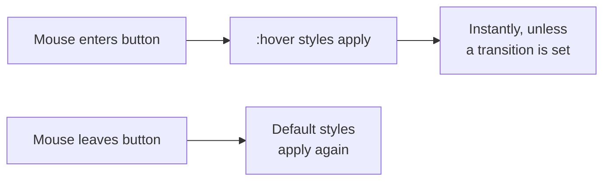
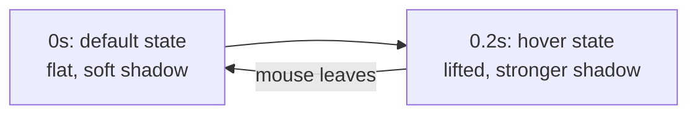

# Module 5: Polish — Transitions, Hover States & Shadows

Your page has shape, color, layout, and responsiveness. This last module is what makes it feel *alive* — small touches that respond to the user, rather than sitting there completely static.

---

## Part A — Hover States

```css
.btn {
  background-color: var(--primary-color);
  color: white;
}

.btn:hover {
  background-color: var(--accent-color);
}
```

`:hover` is a **pseudo-class** — a special selector that only applies while a specific condition is true (in this case, while the mouse is over the element). The moment the cursor leaves, the styles revert automatically.

**🔴 Diagram: How a hover state switches styles**



✅ **TRY THIS:** other common pseudo-classes include `:focus` (when a form element is selected via click or tab key) and `:active` (the exact moment something is being clicked).

---

## Part B — Transitions

By default, the hover change above happens *instantly* — one frame it's one color, the next frame it's another. `transition` smooths that change into a short animation.

```css
.btn {
  background-color: var(--primary-color);
  transition: background-color 0.2s ease;
}

.btn:hover {
  background-color: var(--accent-color);
}
```

`transition: background-color 0.2s ease;` reads as: "when `background-color` changes, animate it over 0.2 seconds, easing in and out smoothly."

| Part | Meaning |
|---|---|
| `background-color` | which property to animate |
| `0.2s` | how long the animation takes |
| `ease` | the speed curve (starts slow, speeds up, ends slow) |

You can transition more than one property, and even all of them:

```css
.card {
  transition: transform 0.2s ease, box-shadow 0.2s ease;
}
```

⚠️ **GOTCHA:** the `transition` property goes on the *default* state of the element, not inside `:hover`. It defines "how to animate any change," so it needs to be set before the change happens.

🔁 **ANALOGY:** without `transition`, a light switch is either fully on or fully off. With `transition`, it's a dimmer switch — the same two end states, but a smooth journey between them.

---

## Part C — Shadows and Depth

```css
.card {
  box-shadow: 0 4px 12px rgba(0, 0, 0, 0.1);
}
```

`box-shadow` takes: horizontal offset, vertical offset, blur radius, and color. `rgba(0, 0, 0, 0.1)` is black at 10% opacity — a soft, subtle shadow rather than a harsh one.

A very common combo: lift a card slightly on hover using `transform`, paired with a stronger shadow:

```css
.card {
  transition: transform 0.2s ease, box-shadow 0.2s ease;
  box-shadow: 0 2px 6px rgba(0, 0, 0, 0.08);
}

.card:hover {
  transform: translateY(-4px);
  box-shadow: 0 8px 20px rgba(0, 0, 0, 0.15);
}
```

**🔴 Diagram: Transition timeline for a hover lift**



💡 **WHY:** small, subtle values (`4px` lift, `0.1` opacity shadow) read as tasteful polish. Large values (`50px` lift, solid black shadow) read as broken or excessive — restraint is the skill here.

---

## 🔧 Hands-On Practice

```css
.demo-btn {
  padding: 10px 20px;
  background: #26215C;
  color: white;
  border: none;
  border-radius: 8px;
  transition: transform 0.15s ease, box-shadow 0.15s ease;
}

.demo-btn:hover {
  transform: scale(1.05);
  box-shadow: 0 4px 10px rgba(0, 0, 0, 0.2);
}
```

**✅ TRY THIS:** change `0.15s` to `1s` and hover again — you'll feel exactly why fast transitions (`0.15s`–`0.3s`) feel responsive, while slow ones feel sluggish.

---

## 🧪 Lab: Interactive Card

Build a single card with a subtle shadow at rest, that lifts (`translateY(-4px)`) and gains a stronger shadow on hover, with a smooth `0.2s` transition on both properties.

---

## 🎯 Apply to About Me

Open your `style.css` from Module 4. This is the final module — your page is about to be complete.

**Your task for this module:**

1. Add a `transition` to `.btn` and a `:hover` state that swaps to `var(--accent-color)`
2. Add a subtle `box-shadow` to your `.skill-item` boxes, and a `:hover` state that lifts them slightly with `transform: translateY(-2px)`
3. Add `border-radius` to your header, buttons, and skill items if you haven't already — rounded corners pair well with soft shadows
4. Do a final full read-through of your page at both desktop and mobile width, and fix anything that feels off

**Checkpoint:** your About Me page is complete. It should have shape, your own color and font identity, a real side-by-side layout, responsive behavior on resize, and small interactive touches on hover. That's the full journey from a bare HTML skeleton to a finished, personal page — built entirely by you, one concept at a time.

---

## 🚀 Challenge Task

Add a subtle fade-in effect for the whole page on load, using `@keyframes` and `animation` (properties not covered in this module — look them up and experiment). This is a genuine stretch goal meant to push past what's been taught directly.

*No solution provided — this is the final challenge of the playbook.*