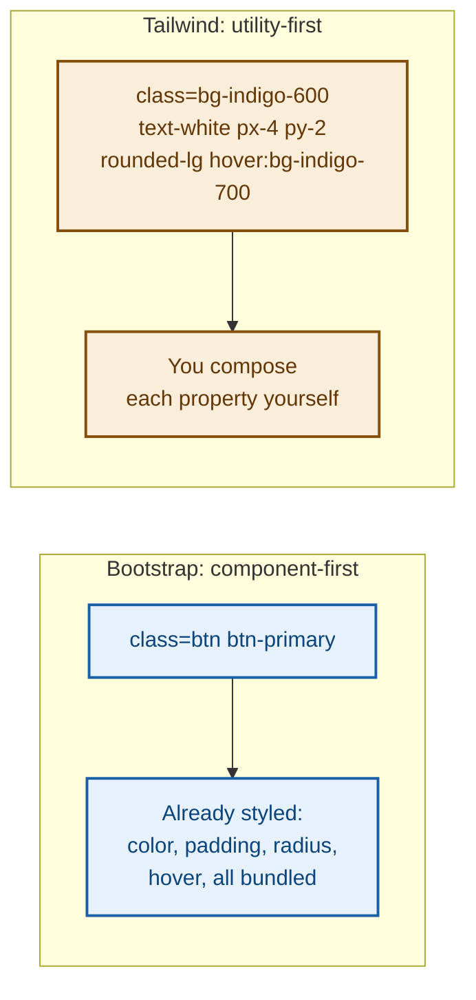
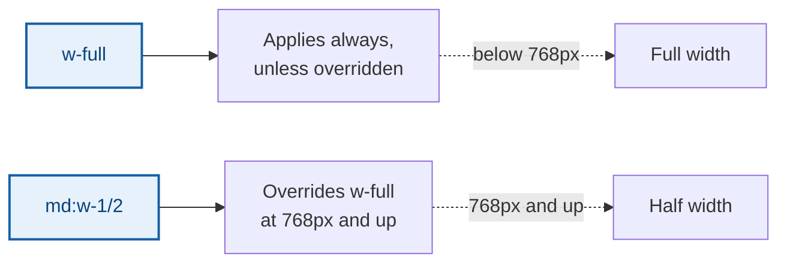

# Module 1: Tailwind CSS 101

Bootstrap gives you pre-built components (`.btn`, `.card`, `.table`) that already look like something. Tailwind is different: it gives you hundreds of small **utility classes** — one class per CSS property — and you compose them together to build your own look from scratch. No fighting to override someone else's default styles; you're always starting from zero.

---

## Part A — Utility-First, Explained

```html
<div class="bg-indigo-600 text-white p-4 rounded-lg">
  Hello Tailwind
</div>
```

Each class does exactly one job:

| Class | CSS it applies |
|---|---|
| `bg-indigo-600` | `background-color: #4f46e5;` |
| `text-white` | `color: #ffffff;` |
| `p-4` | `padding: 1rem;` |
| `rounded-lg` | `border-radius: 0.5rem;` |

**🔴 Diagram: Bootstrap's model vs Tailwind's model**



💡 **WHY:** this is the single biggest mental shift coming from Bootstrap. There's no `.btn` class waiting to be styled — a Tailwind button is just an element with enough utility classes on it to *look* like a button. More typing per element, but total control and nothing to override.

🔁 **ANALOGY:** Bootstrap components are like ordering a combo meal — fast, but you get what's on the menu. Tailwind utilities are like building a plate from individual ingredients — more assembly, but exactly what you wanted.

---

## Part B — Including Tailwind

For training and quick prototyping, the CDN build requires zero setup:

```html
<head>
  <script src="https://cdn.tailwindcss.com"></script>
</head>
```

⚠️ **GOTCHA:** the CDN build is meant for learning and prototyping only — real production projects use Tailwind's build step (via npm) so unused classes get stripped out and the CSS file stays small. For this playbook, the CDN is exactly right.

---

## Part C — Spacing, Sizing & Color

### Spacing scale

Tailwind's spacing utilities follow a consistent numeric scale, not arbitrary pixel values:

```html
<div class="p-2">8px padding</div>
<div class="p-4">16px padding</div>
<div class="p-8">32px padding</div>
```

| Class | Value |
|---|---|
| `p-1` / `m-1` | 4px |
| `p-2` / `m-2` | 8px |
| `p-4` / `m-4` | 16px |
| `p-8` / `m-8` | 32px |

Same pattern applies to `px-*` (horizontal), `py-*` (vertical), `pt-*`/`pb-*`/`pl-*`/`pr-*` (individual sides), and the `m-*` margin equivalents.

### Color scale

Every color in Tailwind has shades numbered 50 (lightest) to 900 (darkest):

```html
<div class="bg-blue-50">Very light blue</div>
<div class="bg-blue-500">Medium blue</div>
<div class="bg-blue-900">Very dark blue</div>
```

✅ **TRY THIS:** `text-*` sets text color using the exact same color names and shades as `bg-*` — `text-blue-600` and `bg-blue-600` are the same blue, just applied to text vs background.

---

## Part D — Flexbox & Grid Utilities

Same concepts you already know from hand-written CSS and Bootstrap, just as utility classes:

```html
<div class="flex justify-between items-center gap-4">
  <div>Logo</div>
  <div>Nav</div>
</div>
```

| Class | Same as |
|---|---|
| `flex` | `display: flex;` |
| `justify-between` | `justify-content: space-between;` |
| `items-center` | `align-items: center;` |
| `gap-4` | `gap: 1rem;` |
| `grid grid-cols-3` | `display: grid; grid-template-columns: repeat(3, 1fr);` |

---

## Part E — Responsive Design

Tailwind uses breakpoint **prefixes** in front of any utility class — no separate `@media` block to write:

```html
<div class="w-full md:w-1/2 lg:w-1/3">
  Full width on mobile, half on tablets, a third on desktop
</div>
```

| Prefix | Applies at |
|---|---|
| (none) | all screen sizes (mobile-first default) |
| `sm:` | ≥640px |
| `md:` | ≥768px |
| `lg:` | ≥1024px |

**🔴 Diagram: How a responsive prefix works**



💡 **WHY:** this is the exact same mobile-first idea as `col-12 col-md-6` in Bootstrap — write the mobile style first with no prefix, then layer on prefixed overrides for bigger screens.

---

## Part F — Hover, Focus & Other States

```html
<button class="bg-indigo-600 hover:bg-indigo-700 text-white px-4 py-2 rounded-lg transition">
  Save
</button>
```

`hover:bg-indigo-700` means "apply `bg-indigo-700` only while hovered" — any utility class can be prefixed with `hover:`, `focus:`, or `active:` this way.

```html
<input class="border border-gray-300 focus:border-indigo-500 focus:outline-none px-3 py-2 rounded">
```

`focus:border-indigo-500` changes the border color the moment the input is clicked into — no custom CSS needed, and it composes with `transition` for a smooth change exactly like the transitions module in your CSS series.

✅ **TRY THIS:** `transition` alone (no property specified) tells Tailwind to smoothly animate common properties like color and background — add it any time you use a `hover:` or `focus:` variant for a nicer feel.

---

## Part G — Building "Components" Without Components

Tailwind has no built-in `.card` or `.btn` — you build your own by combining utilities, once, and reuse the combination:

```html
<!-- A "card" is just a div with the right utilities -->
<div class="bg-white rounded-lg shadow-md p-6 border border-gray-100">
  <h3 class="text-lg font-semibold text-gray-800 mb-2">Card Title</h3>
  <p class="text-gray-600">Card content goes here.</p>
</div>

<!-- A "button" is just these utilities together -->
<button class="bg-indigo-600 hover:bg-indigo-700 text-white font-medium px-4 py-2 rounded-lg transition">
  Click me
</button>
```

⚠️ **GOTCHA:** because there's no `.btn` class, every button needs its full set of utilities repeated. In a real project this gets extracted into a reusable component (React, Vue, etc.) — for this training, you'll just get comfortable typing the combination out.

---

## 🔧 Hands-On Practice

Standalone file — save as `tailwind-practice.html`, no separate CSS file needed since Tailwind is entirely utility classes plus the CDN script:

```html
<!DOCTYPE html>
<html lang="en">
<head>
  <meta charset="UTF-8">
  <title>Tailwind Practice</title>
  <script src="https://cdn.tailwindcss.com"></script>
</head>
<body class="bg-gray-50 p-10">

  <div class="bg-white rounded-lg shadow-md p-6 max-w-sm mx-auto">
    <h2 class="text-xl font-semibold text-gray-800 mb-2">Practice Card</h2>
    <p class="text-gray-600 mb-4">Edit the classes below and reload to see changes.</p>
    <button class="bg-indigo-600 hover:bg-indigo-700 text-white font-medium px-4 py-2 rounded-lg transition">
      Action
    </button>
  </div>

</body>
</html>
```

**✅ TRY THIS:** change `bg-indigo-600` to `bg-emerald-600` and `hover:bg-indigo-700` to `hover:bg-emerald-700` together — notice colors always travel in matched pairs. Then change `max-w-sm` to `max-w-md` and `max-w-lg` to see the sizing scale in action.

---

## 🧪 Lab: Responsive Three-Column Layout

Build a `flex` container with three cards that stack full-width on mobile (`flex-col`) and sit side by side on desktop (`md:flex-row`). Use `gap-4` for spacing and give each card `flex-1` so they share space evenly once side by side.

---

## 🚀 Challenge Task

Without looking ahead, try building a small form input with a label above it, using `focus:` and `transition` so the border smoothly changes color when clicked into. This previews exactly what you'll do for the real customer form next.

*No solution provided — bring your attempt to the next session.*