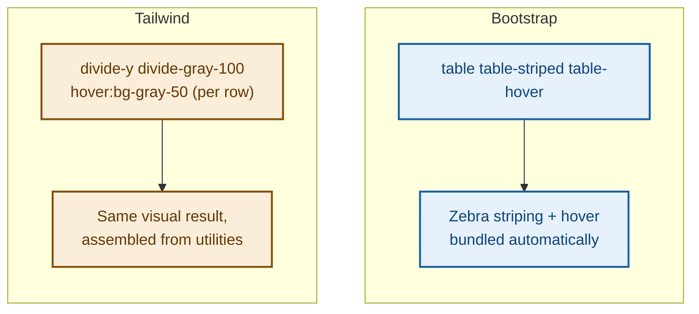

# Module 2: Building the Customer Management Page (Tailwind)

Same page as the Bootstrap version — same table columns, same inline Add/Update form — rebuilt entirely with Tailwind utility classes. Comparing the two side by side is the fastest way to feel the difference between component-first and utility-first CSS.

---

## Starter Skeleton (unstyled)

Save this as `customers-tailwind.html`. Plain HTML, Tailwind CDN linked but no utility classes applied yet.

```html
<!DOCTYPE html>
<html lang="en">
<head>
  <meta charset="UTF-8">
  <title>Customer Management — Tailwind</title>
  <script src="https://cdn.tailwindcss.com"></script>
</head>
<body>

  <div id="page-wrapper">

    <h1>Customer Management</h1>

    <!-- Customer Table -->
    <table id="customer-table">
      <thead>
        <tr>
          <th>ID</th>
          <th>Name</th>
          <th>Email</th>
          <th>Phone</th>
          <th>Date of Birth</th>
          <th>Date of Join</th>
          <th>Branch</th>
          <th>Account Balance</th>
          <th>Actions</th>
        </tr>
      </thead>
      <tbody>
        <tr>
          <td>1</td>
          <td>Alex Rivera</td>
          <td>alex.rivera@example.com</td>
          <td>+36 20 123 4567</td>
          <td>1994-03-12</td>
          <td>2021-06-01</td>
          <td>Budapest</td>
          <td>4,250.00</td>
          <td>
            <button class="edit-btn">Edit</button>
          </td>
        </tr>
        <tr>
          <td>2</td>
          <td>Sara Kovacs</td>
          <td>sara.kovacs@example.com</td>
          <td>+36 30 987 6543</td>
          <td>1997-11-05</td>
          <td>2022-02-15</td>
          <td>London</td>
          <td>1,980.50</td>
          <td>
            <button class="edit-btn">Edit</button>
          </td>
        </tr>
      </tbody>
    </table>

    <!-- Add / Update Customer Form -->
    <div id="customer-form-wrapper">
      <h2>Add Customer</h2>
      <form id="customer-form">
        <div>
          <label for="name">Name</label>
          <input type="text" id="name">
        </div>
        <div>
          <label for="email">Email</label>
          <input type="email" id="email">
        </div>
        <div>
          <label for="phone">Phone</label>
          <input type="text" id="phone">
        </div>
        <div>
          <label for="dob">Date of Birth</label>
          <input type="date" id="dob">
        </div>
        <div>
          <label for="joinDate">Date of Join</label>
          <input type="date" id="joinDate">
        </div>
        <div>
          <label for="branch">Branch</label>
          <select id="branch">
            <option>Budapest</option>
            <option>London</option>
            <option>Singapore</option>
          </select>
        </div>
        <div>
          <label for="balance">Account Balance</label>
          <input type="number" id="balance" step="0.01">
        </div>
        <button type="submit">Save Customer</button>
        <button type="button">Cancel</button>
      </form>
    </div>

  </div>

</body>
</html>
```

**Checkpoint before styling:** identical bare-bones baseline to the Bootstrap starter — plain black text, no spacing, browser default table borders.

---

## Part A — Structuring the Page

```html
<div id="page-wrapper" class="max-w-6xl mx-auto my-8 px-4">
```

| Class | Bootstrap equivalent |
|---|---|
| `max-w-6xl` | roughly what `.container` does at large breakpoints |
| `mx-auto` | centers the block horizontally (Bootstrap does this automatically inside `.container`) |
| `my-8` | vertical margin, same idea as `.my-4` |
| `px-4` | horizontal padding so content doesn't touch the screen edges |

⚠️ **GOTCHA:** unlike Bootstrap's `.container`, Tailwind has no automatic centering — `mx-auto` only works because `max-w-6xl` gives the element a fixed maximum width for the auto margins to center *within*. Forgetting `max-w-*` means `mx-auto` does nothing.

```html
<h1 class="text-2xl font-bold text-gray-800 mb-6">Customer Management</h1>
```

---

## Part B — Styling the Table

Tailwind has no `.table-responsive` class — you build the same horizontal-scroll behavior with a plain `overflow-x-auto` wrapper:

```html
<div class="overflow-x-auto rounded-lg border border-gray-200">
  <table id="customer-table" class="w-full text-sm text-left">
    <thead class="bg-gray-100 text-gray-700 uppercase text-xs">
      <tr>
        <th class="px-4 py-3">ID</th>
        <th class="px-4 py-3">Name</th>
        <th class="px-4 py-3">Email</th>
        <th class="px-4 py-3">Phone</th>
        <th class="px-4 py-3">Date of Birth</th>
        <th class="px-4 py-3">Date of Join</th>
        <th class="px-4 py-3">Branch</th>
        <th class="px-4 py-3 text-right">Account Balance</th>
        <th class="px-4 py-3">Actions</th>
      </tr>
    </thead>
    <tbody class="divide-y divide-gray-100">
      <tr class="hover:bg-gray-50">
        <td class="px-4 py-3">1</td>
        <td class="px-4 py-3 font-medium text-gray-800">Alex Rivera</td>
        <td class="px-4 py-3">alex.rivera@example.com</td>
        <td class="px-4 py-3">+36 20 123 4567</td>
        <td class="px-4 py-3">1994-03-12</td>
        <td class="px-4 py-3">2021-06-01</td>
        <td class="px-4 py-3">
          <span class="bg-blue-50 text-blue-700 text-xs px-2 py-1 rounded-full">Budapest</span>
        </td>
        <td class="px-4 py-3 text-right font-medium">4,250.00</td>
        <td class="px-4 py-3">
          <button class="text-indigo-600 hover:text-indigo-800 text-sm font-medium edit-btn">Edit</button>
        </td>
      </tr>
    </tbody>
  </table>
</div>
```

**🔴 Diagram: Bootstrap table classes vs Tailwind table utilities**



💡 **WHY:** `divide-y divide-gray-100` on `<tbody>` puts a thin line between rows without needing a border on every `<td>` individually — a small but handy Tailwind-specific utility with no direct Bootstrap equivalent.

✅ **TRY THIS:** the `hover:bg-gray-50` class goes directly on the `<tr>`, so add it to every row (or generate it dynamically if this table is rendered from data in a real app).

---

## Part C — Styling the Form (Inline Card)

```html
<div id="customer-form-wrapper" class="bg-white rounded-lg shadow-sm border border-gray-100 p-6 mt-6">
  <h2 class="text-lg font-semibold text-gray-800 mb-4">Add Customer</h2>
  <form id="customer-form" class="space-y-4">
    ...
  </form>
</div>
```

`space-y-4` adds consistent vertical spacing between direct children — useful for the standalone rows in the form, similar to how `mb-3` worked per-field in Bootstrap.

### Laying out fields side by side

Same grouping strategy as the Bootstrap version — Tailwind's version of the row/col system is `flex` with `gap-4`:

```html
<div class="flex flex-col md:flex-row gap-4">
  <div class="flex-1">
    <label for="name" class="block text-sm font-medium text-gray-700 mb-1">Name</label>
    <input type="text" id="name" class="w-full border border-gray-300 rounded-lg px-3 py-2 focus:border-indigo-500 focus:outline-none transition">
  </div>
  <div class="flex-1">
    <label for="email" class="block text-sm font-medium text-gray-700 mb-1">Email</label>
    <input type="email" id="email" class="w-full border border-gray-300 rounded-lg px-3 py-2 focus:border-indigo-500 focus:outline-none transition">
  </div>
</div>

<div class="flex flex-col md:flex-row gap-4">
  <div class="flex-1">
    <label for="phone" class="block text-sm font-medium text-gray-700 mb-1">Phone</label>
    <input type="text" id="phone" class="w-full border border-gray-300 rounded-lg px-3 py-2 focus:border-indigo-500 focus:outline-none transition">
  </div>
  <div class="flex-1">
    <label for="dob" class="block text-sm font-medium text-gray-700 mb-1">Date of Birth</label>
    <input type="date" id="dob" class="w-full border border-gray-300 rounded-lg px-3 py-2 focus:border-indigo-500 focus:outline-none transition">
  </div>
  <div class="flex-1">
    <label for="joinDate" class="block text-sm font-medium text-gray-700 mb-1">Date of Join</label>
    <input type="date" id="joinDate" class="w-full border border-gray-300 rounded-lg px-3 py-2 focus:border-indigo-500 focus:outline-none transition">
  </div>
</div>

<div class="flex flex-col md:flex-row gap-4">
  <div class="flex-1">
    <label for="branch" class="block text-sm font-medium text-gray-700 mb-1">Branch</label>
    <select id="branch" class="w-full border border-gray-300 rounded-lg px-3 py-2 focus:border-indigo-500 focus:outline-none transition">
      <option>Budapest</option>
      <option>London</option>
      <option>Singapore</option>
    </select>
  </div>
  <div class="flex-1">
    <label for="balance" class="block text-sm font-medium text-gray-700 mb-1">Account Balance</label>
    <input type="number" id="balance" step="0.01" class="w-full border border-gray-300 rounded-lg px-3 py-2 focus:border-indigo-500 focus:outline-none transition">
  </div>
</div>

<div class="flex gap-3 pt-2">
  <button type="submit" class="bg-indigo-600 hover:bg-indigo-700 text-white font-medium px-4 py-2 rounded-lg transition">Save Customer</button>
  <button type="button" class="border border-gray-300 text-gray-700 hover:bg-gray-50 font-medium px-4 py-2 rounded-lg transition">Cancel</button>
</div>
```

⚠️ **GOTCHA:** `flex-col md:flex-row` is the responsive equivalent of Bootstrap's `col-md-6` grouping — fields stack on mobile (`flex-col`, the default), and sit side by side from the `md:` breakpoint up. Forgetting `flex-col` as the mobile default means fields squeeze side by side even on a narrow phone screen.

💡 **WHY:** every input repeats the same long class string (`w-full border border-gray-300 rounded-lg px-3 py-2 focus:border-indigo-500 focus:outline-none transition`). This repetition is normal in Tailwind — in a real project with a framework like React, this would be extracted into a reusable `<Input>` component so it's written once.

---

## Part D — Optional Polish

- Branch badge: already shown above using `bg-blue-50 text-blue-700 rounded-full` — Tailwind's version of a Bootstrap `badge`
- Card lift on hover: add `hover:shadow-md transition` to the form wrapper's classes
- Negative balance styling: `text-red-600` vs `text-emerald-600` conditionally — again, applying the class conditionally is a JavaScript task, not a CSS one

---

## 🎯 Full Checkpoint

By the end of this module, your Tailwind version should visually match the Bootstrap version — same striped-feeling hover table, same right-aligned balance column, same grouped and responsive form inside a card — but built entirely from composed utility classes with zero custom CSS and zero pre-built component classes.

---

## 🚀 Challenge Task

Add a search input above the table, using `w-full md:w-64` so it's full-width on mobile but a fixed, comfortable width on desktop, aligned to the right with `flex justify-end`. Exactly the same challenge as the Bootstrap version — compare how differently it's assembled.

*No solution provided — bring your attempt to the next session.*