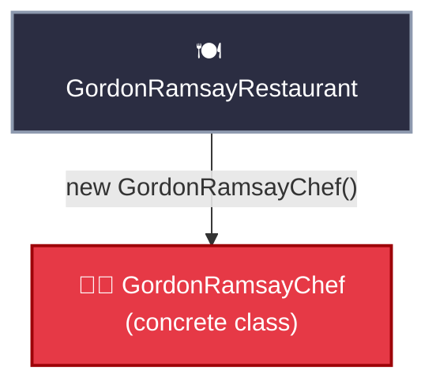
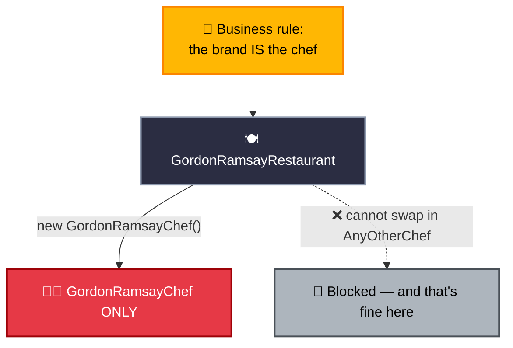
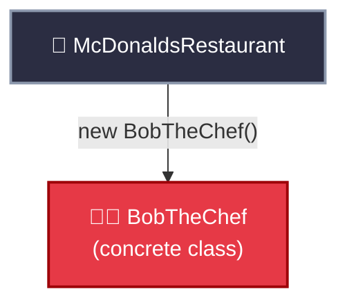
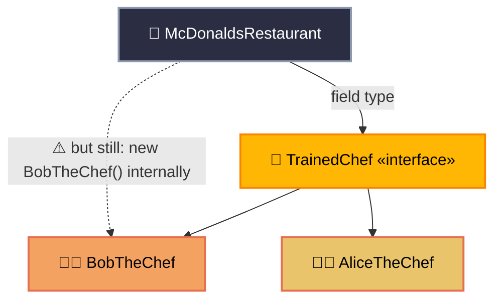
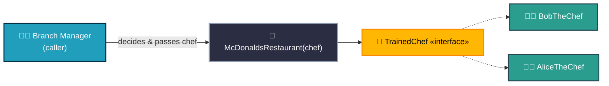
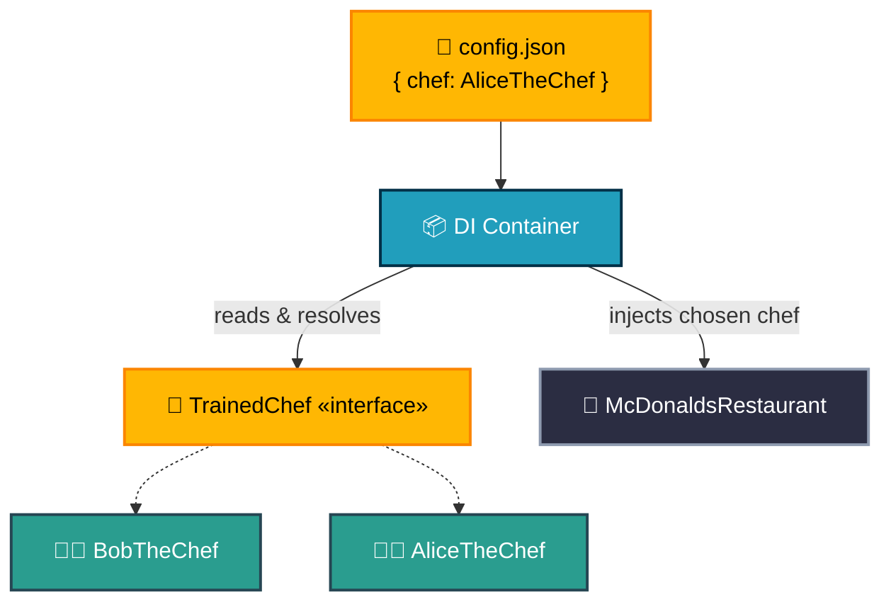
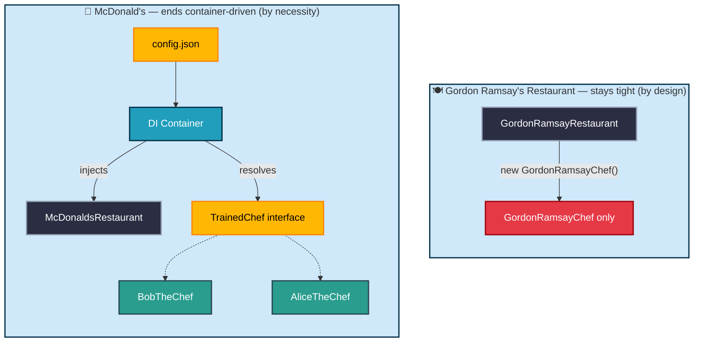

# Dependency Injection & IoC — The Concept

## What Is a Design Pattern?

A **design pattern** is a reusable, named solution to a problem that keeps showing up in software design — not a finished piece of code you copy-paste, but a *template* for how classes and objects should relate to each other. Patterns are usually grouped into three families:

- **Creational** — how objects get created (Factory, Builder, Singleton)
- **Structural** — how classes/objects are composed together (Adapter, Decorator, Facade)
- **Behavioral** — how objects communicate and share responsibility (Strategy, Observer, Template Method)

**Dependency Injection (DI)** is best understood as a technique that *implements* a broader design **principle** called **Inversion of Control (IoC)** — it isn't one of the classic Gang-of-Four patterns itself, but it leans directly on two of them:

- It's a close cousin of the **Strategy pattern** — both let you swap an algorithm/implementation without changing the class that uses it.
- The thing that actually builds and hands over the dependency (a factory, a config reader, a full container) is doing **Factory pattern** work under the hood.

### Technically, what's actually happening

- **IoC (the principle):** normally, a class controls its own flow — it decides what it needs and creates it. IoC flips that: control over *creating and providing dependencies* moves outside the class, to a caller, a factory, or a container. This is sometimes called the **Hollywood Principle** — "don't call us, we'll call you."
- **DI (the technique):** the specific mechanism used to hand a dependency to a class from outside, instead of the class building it. There are three common forms:
  - **Constructor injection** — passed in through the constructor (most common, and what this session focuses on)
  - **Setter injection** — passed in through a setter method after construction
  - **Interface injection** — the dependency implements an interface that has an `inject(...)` method the container calls

A tiny illustrative version of constructor injection (basic, not the full worked example — that comes later):

```java
// Java — constructor injection, basic illustration
interface PaymentGateway {
    void pay(double amount);
}

class OrderService {
    private final PaymentGateway paymentGateway;

    OrderService(PaymentGateway paymentGateway) { // <-- injected, not created here
        this.paymentGateway = paymentGateway;
    }

    void checkout(double amount) {
        paymentGateway.pay(amount);
    }
}
```

```python
# Python — constructor injection, basic illustration
class PaymentGateway:
    def pay(self, amount: float): ...

class OrderService:
    def __init__(self, payment_gateway: PaymentGateway):  # <-- injected, not created here
        self.payment_gateway = payment_gateway

    def checkout(self, amount: float):
        self.payment_gateway.pay(amount)
```

### Where This Shows Up in Real Projects: Layered Architecture

DI isn't just a toy pattern — it's the glue that holds a typical **layered architecture** together: **Controller → Service → Repository**.


- The **Controller** depends on a `Service` — but only on its interface, not the concrete class.
- The **Service** depends on a `Repository` — again, only on its interface.
- **Nobody in this chain calls `new` on the layer below them.** A container (Spring's `ApplicationContext`, or a hand-rolled wiring function in Flask) builds `Repository` first, injects it into `Service`, then injects `Service` into `Controller`.

💡 **WHY this matters practically:** it means you can unit-test a `Controller` by injecting a fake `Service`, and a `Service` by injecting a fake `Repository` — without ever touching a real database. It also means swapping `Repository` from a SQL implementation to a Mongo implementation touches config, not the `Service` or `Controller` code. This is the same shape as the restaurant examples below, just with three layers instead of one.

---

## Why This Matters

Every class that creates its own dependencies is hard to test, hard to reuse, and hard to change. Dependency Injection (DI) and Inversion of Control (IoC) fix that. This session uses **two separate restaurants** to make the point:

- **Gordon Ramsay's Restaurant** — tightly coupled, and it **stays that way on purpose**. It's the "wrong" pattern, used deliberately to show what tight coupling looks like and why it breaks.
- **McDonald's** — a completely separate example that goes through the **full DI journey**, one block-diagram at a time, ending in a config/container-driven design.

These are not the same class evolving — they're two different businesses with two different needs, and by the end you'll see why *both* designs are valid, just for different reasons.

---

## Part A — Gordon Ramsay's Restaurant: Tight Coupling (and it stays that way)

### 🔴 Diagram A1: Direct Instantiation



`GordonRamsayRestaurant` builds its own `GordonRamsayChef` directly, inside its own constructor. It knows the concrete class by name. No interface, no injection — just a hard reference.

### 🔴 Diagram A2: Why It Stays This Way



💡 **WHY this is a legitimate design, not just a mistake:** Gordon Ramsay's restaurant is *supposed* to be inseparable from Gordon Ramsay. Tight coupling isn't automatically wrong — it's wrong when it fights the actual business requirement. Here, it doesn't. We're keeping this example broken on purpose as a reference point.

⚠️ **GOTCHA:** Don't "fix" this example. It's here to be the permanent contrast against McDonald's below — if you loosen this coupling too, the lesson disappears.

---

## Part B — McDonald's: The Full DI Journey

McDonald's is a **separate class hierarchy from Gordon Ramsay's**, built from scratch, going through every stage until it lands on a config-driven, container-managed design.

### 🔴 Diagram B1: Naive Start — Same Mistake, Different Brand



If you build `McDonaldsRestaurant` the same naive way, it has the same problem — but here it's *wrong*, because McDonald's needs to scale across thousands of branches with different chefs.

### 🟡 Diagram B2: Interface Introduced (Still Half-Fixed)



⚠️ **GOTCHA:** `TrainedChef` exists and `AliceTheChef` implements it too — but `McDonaldsRestaurant` still builds `BobTheChef` itself. An interface alone changes nothing if the class still decides which implementation to construct.

### 🟢 Diagram B3: Constructor Injection — True IoC



💡 **WHY this is the actual IoC moment:** Control over "which chef" moves from inside `McDonaldsRestaurant` to whoever calls it. The same `McDonaldsRestaurant` class can now open a branch with Bob or a branch with Alice — no code changes.

### 🔵 Diagram B4: Config / Container-Driven — the End State



💡 **WHY this is the destination:** `McDonaldsRestaurant` never calls `new` on anything. A container reads a config file, resolves the right implementation, and injects it. Swapping which chef a branch gets means editing JSON, not code. This is the shape every real DI framework (Spring, and hand-rolled Flask wiring) follows — see the companion files.

---

## Side-by-Side: The Two Restaurants, End State



🔁 **ANALOGY, tied together:** Same starting shape (a restaurant, a chef), two completely different valid endings. Gordon Ramsay's restaurant is correctly tightly coupled — the brand requires it. McDonald's is correctly container-driven — the business requires scale and swappability. DI/IoC isn't "always decouple everything" — it's "make coupling a deliberate choice, not an accident."

---

## 🔧 Hands-On Practice

1. Build `GordonRamsayRestaurant` exactly as diagrammed in A1. Confirm it compiles and runs.
2. Separately, build `McDonaldsRestaurant` starting from B1 (naive/tight) — notice it has the identical structural problem as Gordon Ramsay's, even though the business need is different.
3. Refactor **only** `McDonaldsRestaurant` through B2 → B3 → B4. Leave `GordonRamsayRestaurant` untouched the entire time.
4. At the end, compare the two side by side and explain out loud why one stayed tight and one didn't.

## 🚀 Challenge Task

Add a third restaurant, `SubwayRestaurant`, that also needs config-driven chef selection like McDonald's — but reuse the *same* `TrainedChef` interface and DI container pattern from Diagram B4, without touching `McDonaldsRestaurant`'s code. No solution provided.