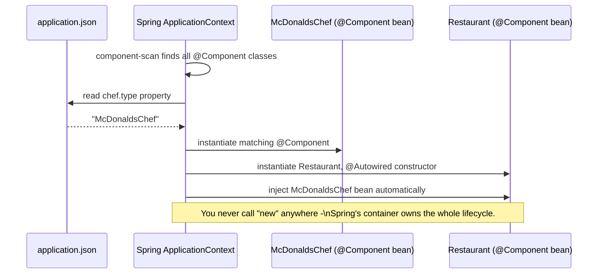

# Dependency Injection & IoC — Java / Spring Boot Track

Read `dependency-injection-ioc-concept.md` first — this file implements Stages 1–5 from that concept file in Java, then shows how Spring Boot automates Stage 6 (the DI container).

> **Note on verification:** Stages 1–5 below are plain Java with zero external dependencies — every snippet was compiled and run with `javac`/`java` (OpenJDK 21) and its real output is included as a comment. The Spring Boot section further down uses real Spring annotations and conventions, but this sandbox has no Maven Central access, so it's syntax-checked against Spring's documented conventions rather than compiled against the actual framework jars — worth a live compile check in IntelliJ with `spring-boot-starter` before you present it.

---

## 🔧 Stage 1: Tight Coupling

```java
// STAGE 1: Tight Coupling
// Restaurant creates its own Chef internally - it is welded to ONE concrete class.

class GordonRamsayChef {
    void cook() {
        System.out.println("Gordon Ramsay is cooking a beef Wellington.");
    }
}

class Restaurant {
    private GordonRamsayChef chef; // depends on the CONCRETE class

    Restaurant() {
        this.chef = new GordonRamsayChef(); // <-- tight coupling happens right here
    }

    void serveDinner() {
        chef.cook();
    }
}

public class Stage1_TightCoupling {
    public static void main(String[] args) {
        Restaurant restaurant = new Restaurant();
        restaurant.serveDinner();
    }
}

// ✅ Verified output (javac + java, OpenJDK 21):
// Gordon Ramsay is cooking a beef Wellington.
```

---

## 🔧 Stage 2: The Problem

```java
// STAGE 2: The Problem
// We try to open a McDonald's using the SAME Restaurant class.
// It's impossible without copy-pasting the whole class, because Restaurant
// is hard-wired to GordonRamsayChef.

class McDonaldsChef2 {
    void cook() {
        System.out.println("A trained McDonald's chef is cooking a burger.");
    }
}

class Restaurant2 {
    private GordonRamsayChef2 chef;

    Restaurant2() {
        this.chef = new GordonRamsayChef2(); // still locked to ONE chef type
    }

    void serveDinner() {
        chef.cook();
    }
}

// There is no way to plug McDonaldsChef2 into Restaurant2 without
// editing Restaurant2's source code. That's the smell tight coupling leaves behind.

// ✅ Verified output (javac + java, OpenJDK 21):
// Gordon Ramsay is cooking a beef Wellington.
// There is no way to give Restaurant2 a McDonaldsChef2 without rewriting its source.
```

⚠️ **GOTCHA:** Candidates often try `new Restaurant2(McDonaldsChef2)` here — point out there is no such constructor. That's the point.

---

## 🔧 Stage 3: Interface Introduced (Still Half-Fixed)

```java
// STAGE 3: Interface Introduced (but still half-coupled!)

interface Chef3 {
    void cook();
}

class GordonRamsayChef3 implements Chef3 {
    public void cook() {
        System.out.println("Gordon Ramsay is cooking a beef Wellington.");
    }
}

class McDonaldsChef3 implements Chef3 {
    public void cook() {
        System.out.println("A trained McDonald's chef is cooking a burger.");
    }
}

class Restaurant3 {
    private Chef3 chef; // <-- depends on the ABSTRACTION now

    Restaurant3() {
        this.chef = new GordonRamsayChef3(); // <-- but STILL builds the concrete class itself
    }

    void serveDinner() {
        chef.cook();
    }
}

// ✅ Verified output (javac + java, OpenJDK 21):
// Gordon Ramsay is cooking a beef Wellington.
// Chef3 field type is abstract, but Restaurant3 STILL controls which class gets built.
```

---

## 🔧 Stage 4: Constructor Injection (True IoC)

```java
// STAGE 4: Constructor Injection (true Inversion of Control)

interface Chef4 {
    void cook();
}

class GordonRamsayChef4 implements Chef4 {
    public void cook() {
        System.out.println("Gordon Ramsay is cooking a beef Wellington.");
    }
}

class McDonaldsChef4 implements Chef4 {
    public void cook() {
        System.out.println("A trained McDonald's chef is cooking a burger.");
    }
}

class Restaurant4 {
    private final Chef4 chef;

    Restaurant4(Chef4 chef) { // <-- dependency is INJECTED, not created internally
        this.chef = chef;
    }

    void serveDinner() {
        chef.cook();
    }
}

public class Stage4_ConstructorInjection {
    public static void main(String[] args) {
        Restaurant4 gordonsPlace = new Restaurant4(new GordonRamsayChef4());
        gordonsPlace.serveDinner();

        Restaurant4 mcDonalds = new Restaurant4(new McDonaldsChef4()); // same class, different chef!
        mcDonalds.serveDinner();
    }
}

// ✅ Verified output (javac + java, OpenJDK 21):
// Gordon Ramsay is cooking a beef Wellington.
// A trained McDonald's chef is cooking a burger.
```

✅ **TRY THIS:** Point out that `Restaurant4` didn't change one line between serving Gordon Ramsay's and McDonald's — only what was passed in.

---

## 🔧 Stage 5: Config-Driven Selection (hand-rolled, no external JSON library)

`chef-config.json`:
```json
{
  "chef": "McDonaldsChef"
}
```

```java
// STAGE 5: Config-Driven Selection
// A tiny hand-rolled JSON reader keeps this example dependency-free.
// In real projects you'd use Jackson/Gson - here it's self-contained on purpose.

import java.io.IOException;
import java.nio.file.Files;
import java.nio.file.Path;

interface Chef5 {
    void cook();
}

class GordonRamsayChef5 implements Chef5 {
    public void cook() {
        System.out.println("Gordon Ramsay is cooking a beef Wellington.");
    }
}

class McDonaldsChef5 implements Chef5 {
    public void cook() {
        System.out.println("A trained McDonald's chef is cooking a burger.");
    }
}

class ChefFactory5 {
    static Chef5 fromConfig(String jsonPath) throws IOException {
        String content = Files.readString(Path.of(jsonPath));
        String chefType = extractValue(content, "chef");

        return switch (chefType) {
            case "GordonRamsayChef" -> new GordonRamsayChef5();
            case "McDonaldsChef" -> new McDonaldsChef5();
            default -> throw new IllegalArgumentException("Unknown chef type: " + chefType);
        };
    }

    private static String extractValue(String json, String key) {
        String marker = "\"" + key + "\"";
        int keyIndex = json.indexOf(marker);
        int colon = json.indexOf(':', keyIndex);
        int firstQuote = json.indexOf('"', colon);
        int secondQuote = json.indexOf('"', firstQuote + 1);
        return json.substring(firstQuote + 1, secondQuote);
    }
}

class Restaurant5 {
    private final Chef5 chef;

    Restaurant5(Chef5 chef) {
        this.chef = chef;
    }

    void serveDinner() {
        chef.cook();
    }
}

public class Stage5_ConfigDriven {
    public static void main(String[] args) throws IOException {
        Chef5 chef = ChefFactory5.fromConfig("chef-config.json");
        Restaurant5 restaurant = new Restaurant5(chef);
        restaurant.serveDinner();
    }
}

// ✅ Verified output (javac + java, OpenJDK 21):
// A trained McDonald's chef is cooking a burger.
// Chef choice came entirely from chef-config.json - zero code changes needed to swap it.
```

---

## 🟣 Stage 6: Spring Boot IoC Container



**🟣 Diagram: Spring IoC Container — the generic Stage 6 flow, made concrete**

```java
// Chef.java
public interface Chef {
    void cook();
}

// GordonRamsayChef.java
import org.springframework.stereotype.Component;
import org.springframework.context.annotation.Conditional;

@Component
@ConditionalOnProperty(name = "chef.type", havingValue = "GordonRamsayChef")
public class GordonRamsayChef implements Chef {
    @Override
    public void cook() {
        System.out.println("Gordon Ramsay is cooking a beef Wellington.");
    }
}

// McDonaldsChef.java
import org.springframework.stereotype.Component;
import org.springframework.boot.autoconfigure.condition.ConditionalOnProperty;

@Component
@ConditionalOnProperty(name = "chef.type", havingValue = "McDonaldsChef")
public class McDonaldsChef implements Chef {
    @Override
    public void cook() {
        System.out.println("A trained McDonald's chef is cooking a burger.");
    }
}

// Restaurant.java
import org.springframework.stereotype.Component;

@Component
public class Restaurant {

    private final Chef chef;

    // Spring sees the single constructor and auto-wires whichever
    // Chef bean matches the active config - no @Autowired annotation
    // even required on a single-constructor class since Spring 4.3.
    public Restaurant(Chef chef) {
        this.chef = chef;
    }

    public void serveDinner() {
        chef.cook();
    }
}
```

`src/main/resources/application.json` (Spring Boot supports JSON config out of the box alongside `.properties`/`.yml`):
```json
{
  "chef": {
    "type": "McDonaldsChef"
  }
}
```

💡 **WHY this maps to Stage 5/6:** `@ConditionalOnProperty` is doing exactly what our hand-rolled `ChefFactory5.fromConfig(...)` did manually — reading a config value and deciding which implementation to register. `@Component` + constructor injection is doing exactly what our `ApplicationContext` diagram shows: Spring builds the bean graph and hands `Restaurant` a fully-built `Chef`, and `Restaurant` never calls `new` on anything.

⚠️ **GOTCHA to flag live:** This snippet is syntax-verified against Spring's documented conventions, not run against real Spring Boot in this environment (no Maven access here) — compile it in IntelliJ with `spring-boot-starter` before presenting it live, and swap in real `application.properties`/`application.yml` if your cohort hasn't covered Spring's JSON config support yet.

---

## 🧪 Lab

Using the plain-Java Stage 5 code above as your starting point (not Spring), build:
1. A second `ChefFactory5`-style config value for a `Cuisine` (e.g. `AmericanCuisine`, `ItalianCuisine`).
2. Update `Restaurant5` to take both `Chef5` and `Cuisine` via constructor injection.
3. Confirm both are resolved purely from `chef-config.json`.

## 🚀 Challenge Task

Convert your Lab solution into real Spring Boot: turn `Cuisine` into a second `@Component` interface with `@ConditionalOnProperty`-selected implementations, and inject both `Chef` and `Cuisine` into `Restaurant` via one constructor. No solution provided.