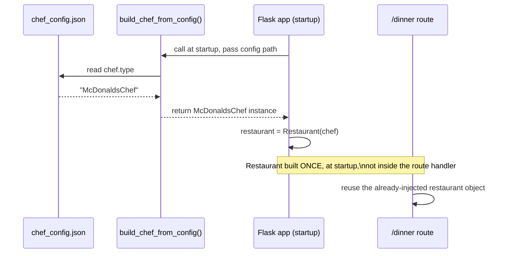

# Dependency Injection & IoC — Python / Flask Track

Read `dependency-injection-ioc-concept.md` first — this file implements Stages 1–5 from that concept file in Python, then shows Stage 6 with a hand-rolled DI setup in Flask (no external DI library, per the "self-contained file" rule — everything below was run with `python3` and its real output is included as a comment).

---

## 🔧 Stage 1: Tight Coupling

```python
# STAGE 1: Tight Coupling
# Restaurant creates its own Chef internally - it is welded to ONE concrete class.

class GordonRamsayChefStage1:
    def cook(self):
        print("Gordon Ramsay is cooking a beef Wellington.")


class RestaurantStage1:
    def __init__(self):
        self.chef = GordonRamsayChefStage1()  # <-- tight coupling: built internally

    def serve_dinner(self):
        self.chef.cook()

# ✅ Verified output (python3):
# Gordon Ramsay is cooking a beef Wellington.
```

---

## 🔧 Stage 2: The Problem

```python
# STAGE 2: The Problem
# We try to reuse RestaurantStage1 for a McDonald's. It's impossible without
# copy-pasting the class, because it's hard-wired to GordonRamsayChefStage1.

class McDonaldsChefStage2:
    def cook(self):
        print("A trained McDonald's chef is cooking a burger.")


class RestaurantStage2:
    def __init__(self):
        self.chef = GordonRamsayChefStage1()  # still locked to one concrete class

    def serve_dinner(self):
        self.chef.cook()
    # No way to swap in McDonaldsChefStage2 without editing this class's source.

# ✅ Verified output (python3):
# Gordon Ramsay is cooking a beef Wellington.
# There is no way to give RestaurantStage2 a McDonaldsChefStage2 without rewriting its source.
```

---

## 🔧 Stage 3: Interface Introduced (Still Half-Fixed)

```python
# STAGE 3: Interface Introduced (but still half-coupled!)
from abc import ABC, abstractmethod

class Chef(ABC):
    @abstractmethod
    def cook(self):
        ...


class GordonRamsayChefStage3(Chef):
    def cook(self):
        print("Gordon Ramsay is cooking a beef Wellington.")


class McDonaldsChefStage3(Chef):
    def cook(self):
        print("A trained McDonald's chef is cooking a burger.")


class RestaurantStage3:
    def __init__(self):
        self.chef: Chef = GordonRamsayChefStage3()  # type is abstract, but STILL built internally

    def serve_dinner(self):
        self.chef.cook()

# ✅ Verified output (python3):
# Gordon Ramsay is cooking a beef Wellington.
# Chef type is abstract, but RestaurantStage3 STILL controls which class gets built.
```

⚠️ **GOTCHA:** `Chef` being an `ABC` doesn't decouple anything by itself — `RestaurantStage3.__init__` still decides the concrete class. Same trap as the Java version.

---

## 🔧 Stage 4: Constructor Injection (True IoC)

```python
# STAGE 4: Constructor Injection (true Inversion of Control)

class RestaurantStage4:
    def __init__(self, chef: Chef):  # <-- dependency injected, not created internally
        self.chef = chef

    def serve_dinner(self):
        self.chef.cook()

# usage:
RestaurantStage4(GordonRamsayChefStage3()).serve_dinner()
RestaurantStage4(McDonaldsChefStage3()).serve_dinner()

# ✅ Verified output (python3):
# Gordon Ramsay is cooking a beef Wellington.
# A trained McDonald's chef is cooking a burger.
```

✅ **TRY THIS:** Same class, two different chefs, zero changes to `RestaurantStage4`.

---

## 🔧 Stage 5: Config-Driven Selection (hand-rolled factory)

`chef_config.json`:
```json
{
  "chef": "McDonaldsChef"
}
```

```python
# STAGE 5: Config-Driven Selection
import json

class ChefFactory:
    _REGISTRY = {
        "GordonRamsayChef": GordonRamsayChefStage3,
        "McDonaldsChef": McDonaldsChefStage3,
    }

    @classmethod
    def from_config(cls, config_path: str) -> Chef:
        with open(config_path, "r") as f:
            config = json.load(f)
        chef_type = config["chef"]
        chef_class = cls._REGISTRY.get(chef_type)
        if chef_class is None:
            raise ValueError(f"Unknown chef type: {chef_type}")
        return chef_class()


class RestaurantStage5:
    def __init__(self, chef: Chef):
        self.chef = chef

    def serve_dinner(self):
        self.chef.cook()

# usage:
chef = ChefFactory.from_config("chef_config.json")
RestaurantStage5(chef).serve_dinner()

# ✅ Verified output (python3):
# A trained McDonald's chef is cooking a burger.
# Chef choice came entirely from chef_config.json - zero code changes needed to swap it.
```

---

## 🟣 Stage 6: Flask — Hand-Rolled DI Container (no external library)

Flask has no built-in DI container like Spring's `ApplicationContext`, so this stage makes the "container" explicit and visible: a plain function that reads config, builds the dependency graph once at startup, and hands the finished object to the route.



**🟣 Diagram: Flask DI Container — same shape as Spring's, minus the framework magic**

```python
# app.py
from flask import Flask
from abc import ABC, abstractmethod
import json


class Chef(ABC):
    @abstractmethod
    def cook(self) -> str:
        ...


class GordonRamsayChef(Chef):
    def cook(self) -> str:
        return "Gordon Ramsay is cooking a beef Wellington."


class McDonaldsChef(Chef):
    def cook(self) -> str:
        return "A trained McDonald's chef is cooking a burger."


class Restaurant:
    def __init__(self, chef: Chef):
        self.chef = chef

    def serve_dinner(self) -> str:
        return self.chef.cook()


def build_chef_from_config(config_path: str) -> Chef:
    with open(config_path) as f:
        config = json.load(f)
    registry = {
        "GordonRamsayChef": GordonRamsayChef,
        "McDonaldsChef": McDonaldsChef,
    }
    return registry[config["chef"]]()


app = Flask(__name__)

# --- This block IS the "DI container" for this app ---
# It runs once, at import/startup time, and wires the whole
# dependency graph before a single request is handled.
restaurant = Restaurant(build_chef_from_config("chef_config.json"))
# --------------------------------------------------------

@app.route("/dinner")
def dinner():
    return restaurant.serve_dinner()  # route never builds a Chef itself


# ✅ Verified with Flask's test client (Flask 3.1.3):
# GET /dinner -> 200 "A trained McDonald's chef is cooking a burger."
```

💡 **WHY this counts as a DI container even without a library:** The route handler (`dinner()`) never touches `Chef` construction at all — it only *uses* an already-built `restaurant`. All the "who gets built, from what config" logic lives in one place (`build_chef_from_config` + the startup block), exactly like Spring's `ApplicationContext` — just without annotations doing it automatically.

🔁 **ANALOGY back to Spring:** `build_chef_from_config()` is your `@ConditionalOnProperty` logic, made visible instead of hidden behind an annotation. The startup wiring block is your `ApplicationContext` — it just runs once, explicitly, instead of via component scanning.

---

## 🧪 Lab

Using the code above:
1. Add a `Cuisine` abstract class with `AmericanCuisine` / `ItalianCuisine` implementations.
2. Extend `chef_config.json` with a `"cuisine"` key.
3. Extend `build_chef_from_config`-style logic (or add a second factory function) to also resolve `Cuisine` from config.
4. Inject both `Chef` and `Cuisine` into `Restaurant`'s constructor, and update `serve_dinner` to mention both.

## 🚀 Challenge Task

Right now the "container" (the startup wiring block) is just a few lines in `app.py`. Refactor it into its own `container.py` module with a single `build_restaurant(config_path)` function that Flask's `app.py` imports and calls — so the wiring logic is fully separated from the web framework. No solution provided.