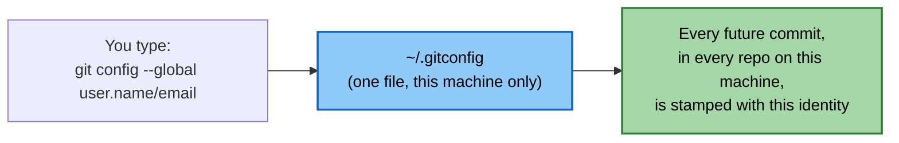

# Lab 00 — Environment Setup

**Objective:** confirm Git is installed and configured correctly, and that your GitHub account is ready, before we touch any real project files.

**Prerequisites:** none — this is the very first thing you'll do today.


*This is a one-time, per-machine setting — not per-project. Set it once here and every repo you create today inherits it automatically.*

---

## Step 1 — Confirm Git is installed

```bash
git --version
```

**Expected output:** something like `git version 2.42.0`. If you get a "command not found" error, flag your trainer now — don't try to install it mid-lab.

---

## Step 2 — Tell Git who you are

Every commit you make is stamped with a name and email. Set yours once, globally, so you never have to do it again on this machine:

```bash
git config --global user.name "Your Name"
git config --global user.email "you@example.com"
```

Use the email associated with your GitHub account — it'll matter later when GitHub links your commits to your profile.

---

## Step 3 — Verify your config

```bash
git config --list
```

**Checkpoint:** you should see `user.name=...` and `user.email=...` somewhere in the output, matching what you just typed.

---

## Step 4 — Set your default editor (optional but recommended)

If you ever run `git commit` without `-m "message"`, Git opens a text editor for you to type the message in. By default this is often Vim, which can be confusing if you've never used it. Set it to VS Code instead:

```bash
git config --global core.editor "code --wait"
```

If you don't have VS Code, ask your trainer for an alternative — the important thing is you're not stuck typing `:wq` in a panic later today.

✅ **TRY THIS:** `git config --global color.ui auto` turns on colored output (red/green file states, colored diffs) if it isn't already on by default — makes every command in the rest of today easier to read at a glance.

---

## Step 5 — Confirm your GitHub account is ready

- [ ] You can log into GitHub in your browser
- [ ] You know your GitHub username
- [ ] You have either:
  - a **Personal Access Token (PAT)** generated (GitHub → Settings → Developer settings → Personal access tokens), **or**
  - an **SSH key** added to your GitHub account

Your trainer will tell you which method the room is using — you won't need this until Lab 05, but it's much easier to sort out now than mid-lab.

---

## Checkpoint Questions

1. What two pieces of information does `git config --global user.name/email` attach to every commit you make?
2. Why might setting a familiar editor now save you a headache later?

You're ready for **Lab 01 — Your First Commit**.