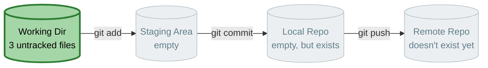
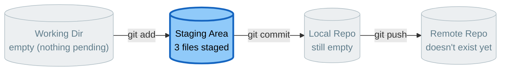
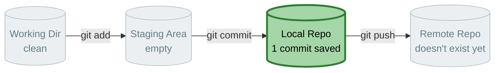
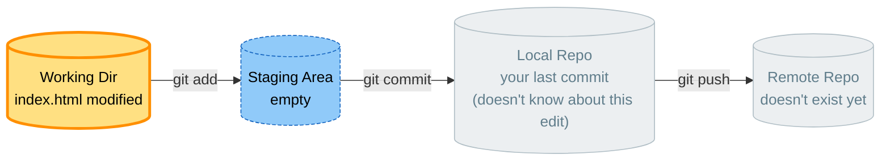
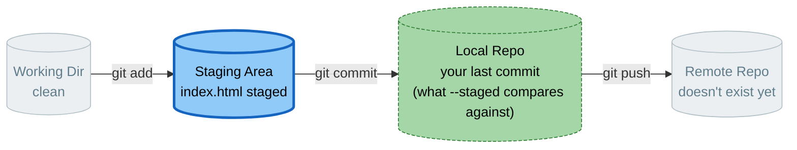

# Lab 01 — Your First Commit

**Objective:** turn a plain folder of website files into a Git repository, and make your first tracked commits.

**Prerequisites:** Lab 00 complete. You'll need the three starter files below — copy each one into a new, empty project folder before Step 1. (They also live in `project-files/starter/` if you'd rather grab them from disk.)

**The one idea to hold onto:** your local repo and GitHub are two separate repositories. Nothing you do in this lab touches the internet — everything stays on your machine until Lab 05.

Every diagram below highlights **where your files currently live** — that's the whole game in Git. A command's only job is to move content from one box to the next.


*This is the map for the whole lab — nothing lives anywhere until this exact chain of commands runs.*

---

## Starter Files

Create a new empty folder for this project, then create these three files inside it with the exact contents below.

**`index.html`**
```html
<!DOCTYPE html>
<html lang="en">
<head>
  <meta charset="UTF-8">
  <meta name="viewport" content="width=device-width, initial-scale=1.0">
  <title>Coming Soon</title>
  <link rel="stylesheet" href="style.css">
</head>
<body>
  <header class="site-header">
    <div class="site-header__inner">
      <span class="logo">Our New Site</span>
      <!-- Nav links get added here as pages are built (signup, login, forgot-password) -->
      <nav class="nav-links"></nav>
    </div>
  </header>

  <section class="hero">
    <h1>We're building something.</h1>
    <p>Watch this space — this page will grow throughout the day as we learn Git.</p>
  </section>

  <main class="content">
    <p>Every change on this site, from here on, happens through a commit.</p>
  </main>

  <footer class="site-footer">
    <p>&copy; 2026 Our New Site. Built for training purposes.</p>
  </footer>

  <script src="script.js"></script>
</body>
</html>
```

**`style.css`**
```css
/* ==========================================================================
   Design tokens
   ========================================================================== */
:root {
  --color-bg: #ffffff;
  --color-surface: #f6f7f9;
  --color-text: #1f2430;
  --color-text-muted: #5b6472;
  --color-border: #e2e5ea;
  --color-primary: #3454d1;
  --color-primary-hover: #2942a8;
  --color-primary-tint: #eef1fc;

  --font-body: -apple-system, BlinkMacSystemFont, "Segoe UI", Roboto, "Helvetica Neue", Arial, sans-serif;

  --radius: 8px;
  --shadow-sm: 0 1px 2px rgba(16, 24, 40, 0.06);
  --shadow-md: 0 4px 12px rgba(16, 24, 40, 0.08);

  --space-1: 8px;
  --space-2: 16px;
  --space-3: 24px;
  --space-4: 40px;
  --space-5: 64px;
}

/* ==========================================================================
   Reset & base
   ========================================================================== */
* {
  box-sizing: border-box;
}

body {
  margin: 0;
  font-family: var(--font-body);
  color: var(--color-text);
  background-color: var(--color-bg);
  line-height: 1.5;
}

h1, h2, h3 {
  line-height: 1.25;
  margin: 0 0 var(--space-2);
}

p {
  margin: 0 0 var(--space-2);
  color: var(--color-text-muted);
}

a {
  color: var(--color-primary);
  text-decoration: none;
}

a:hover {
  text-decoration: underline;
}

a:focus-visible,
button:focus-visible,
input:focus-visible {
  outline: 2px solid var(--color-primary);
  outline-offset: 2px;
}

/* ==========================================================================
   Header / nav
   ========================================================================== */
.site-header {
  border-bottom: 1px solid var(--color-border);
  background-color: var(--color-bg);
  position: sticky;
  top: 0;
  z-index: 10;
}

.site-header__inner {
  max-width: 960px;
  margin: 0 auto;
  padding: var(--space-2) var(--space-3);
  display: flex;
  align-items: center;
  justify-content: space-between;
}

.logo {
  font-weight: 700;
  font-size: 18px;
  color: var(--color-text);
}

.nav-links {
  display: flex;
  gap: var(--space-3);
}

.nav-links a {
  color: var(--color-text-muted);
  font-size: 14px;
  font-weight: 500;
}

.nav-links a:hover {
  color: var(--color-primary);
  text-decoration: none;
}

/* ==========================================================================
   Hero
   ========================================================================== */
.hero {
  max-width: 960px;
  margin: 0 auto;
  padding: var(--space-5) var(--space-3) var(--space-4);
  text-align: center;
}

.hero h1 {
  font-size: clamp(28px, 4vw, 40px);
  letter-spacing: -0.02em;
}

.hero p {
  font-size: 17px;
  max-width: 480px;
  margin-left: auto;
  margin-right: auto;
}

/* ==========================================================================
   Content
   ========================================================================== */
.content {
  max-width: 640px;
  margin: 0 auto;
  padding: 0 var(--space-3) var(--space-5);
}

/* ==========================================================================
   Cards (used by forms on signup / login / forgot-password pages)
   ========================================================================== */
.card {
  background-color: var(--color-bg);
  border: 1px solid var(--color-border);
  border-radius: var(--radius);
  box-shadow: var(--shadow-sm);
  padding: var(--space-4);
}

/* ==========================================================================
   Forms
   ========================================================================== */
form {
  display: flex;
  flex-direction: column;
  gap: var(--space-2);
}

label {
  display: flex;
  flex-direction: column;
  gap: 4px;
  font-size: 14px;
  font-weight: 500;
  color: var(--color-text);
}

input {
  padding: 10px 12px;
  font-size: 15px;
  font-family: inherit;
  border: 1px solid var(--color-border);
  border-radius: var(--radius);
  background-color: var(--color-bg);
  color: var(--color-text);
}

input:focus {
  border-color: var(--color-primary);
}

button {
  padding: 10px 16px;
  font-size: 15px;
  font-weight: 600;
  font-family: inherit;
  color: #fff;
  background-color: var(--color-primary);
  border: none;
  border-radius: var(--radius);
  cursor: pointer;
  transition: background-color 0.15s ease;
}

button:hover {
  background-color: var(--color-primary-hover);
}

/* ==========================================================================
   Footer
   ========================================================================== */
.site-footer {
  border-top: 1px solid var(--color-border);
  padding: var(--space-3);
  text-align: center;
}

.site-footer p {
  font-size: 13px;
  margin: 0;
}

/* ==========================================================================
   Responsive
   ========================================================================== */
@media (max-width: 600px) {
  .site-header__inner {
    flex-direction: column;
    gap: var(--space-1);
  }

  .nav-links {
    flex-wrap: wrap;
    justify-content: center;
  }

  .hero {
    padding: var(--space-4) var(--space-2);
  }
}
```

**`script.js`**
```js
// starter script — intentionally minimal
console.log("Site loaded. Let's get this under version control.");
```

---

## Step 1 — Check the folder's current state

```bash
cd path/to/your/project
git status
```

**Expected output:** `fatal: not a git repository...`. Git has no idea this folder exists yet — that's expected.

---

## Step 2 — Initialize the repository

```bash
git init
```

**Expected output:** `Initialized empty Git repository in .../.git/`

Run `git status` again:

```bash
git status
```

**Expected output:** your three files (`index.html`, `style.css`, `script.js`) listed as **untracked**.



💡 **WHY:** `git init` creates a hidden `.git` folder — that folder *is* your repository. Nothing has been sent anywhere; this is a complete, private repo that only exists on your machine.

---

## Step 3 — Stage your files

```bash
git add index.html
git status
```

**Expected output:** `index.html` now shows under "Changes to be committed" (staged/green). The other two files are still untracked.

Now stage the rest:

```bash
git add style.css script.js
git status
```

**Expected output:** all three files staged.



✅ **TRY THIS:** instead of naming files individually, run `git add .` next time — it stages everything changed in the current folder and below.

---

## Step 4 — Write a real commit message

Before you run the commit, write your own one-line message describing this change. A good pattern to follow:

> Imagine finishing the sentence: *"If applied, this commit will ___."*

For this first commit, something like `Add initial website files` works well — it's short, in the imperative mood, and describes *what* the commit does.

**Avoid** messages like `first commit`, `stuff`, or `wip` — they tell a future reader (including future-you) nothing.

---

## Step 5 — Commit

```bash
git commit -m "Add initial website files"
```

**Expected output:** a summary showing the commit hash and how many files changed.

```bash
git status
```

**Expected output:** `nothing to commit, working tree clean`.

```bash
git log
```

**Expected output:** your commit, with author, date, and message.


*Your commit is now permanently part of your local repo's history. Still nowhere near the internet.*

✅ **TRY THIS:** `git log --oneline` — a much more compact view you'll come to prefer once history gets longer.

---

## Step 6 — Make a change and see the diff

Open `index.html` and change the text inside the `<title>` tag to something of your choosing. Save the file.

```bash
git status
```

**Expected output:** `index.html` now shows as **modified**, not staged.

```bash
git diff
```

**Expected output:** a red/green diff showing exactly which line changed. This compares your working files against the staging area.


*`git diff` (no flags) always compares the yellow box against the blue box — working dir vs. staging.*

---

## Step 7 — Stage, review, and commit again

```bash
git add index.html
git diff --staged
```

**Expected output:** same diff as before, but now comparing staging against your last commit — this is your last chance to review before committing.


*`git diff --staged` compares the blue box against the green box — staging vs. your last commit.*

Write a message describing *this* change specifically (not "more changes" — say what the change actually is, e.g. `Update page title`), then:

```bash
git commit -m "Update page title"
git log --oneline
```

**Expected output:** two commits now listed.

---

## Checkpoint Questions

1. What's the difference between `git diff` and `git diff --staged`?
2. Why is `Add initial website files` a better commit message than `first commit`?
3. If you deleted the `.git` folder right now, what would happen to your files? What would happen to your history?

You're ready for **Lab 02 — Undo, Ignore, and Amend**.