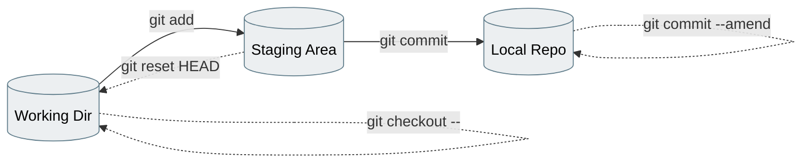
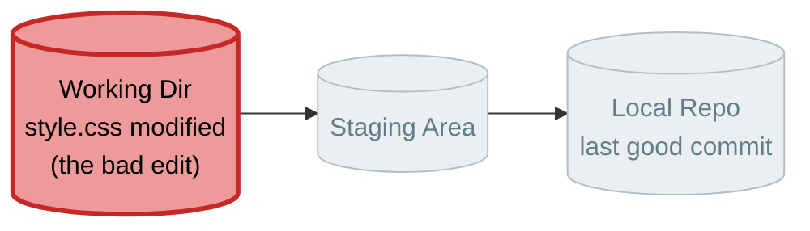
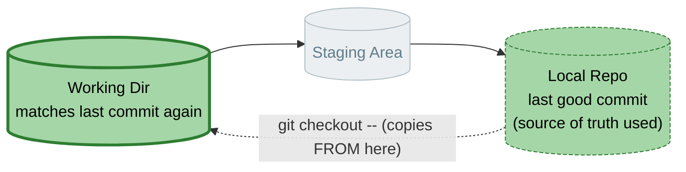
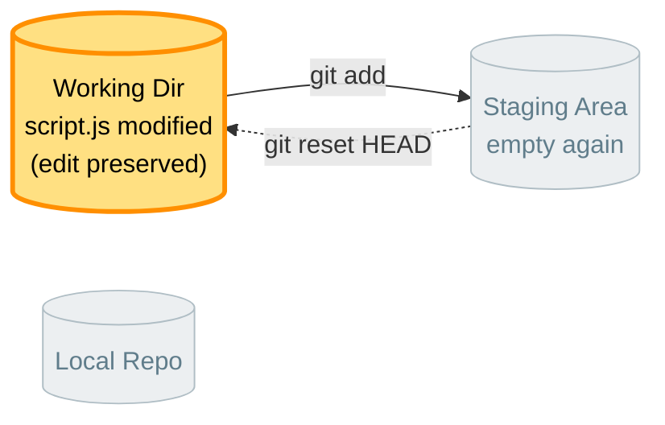
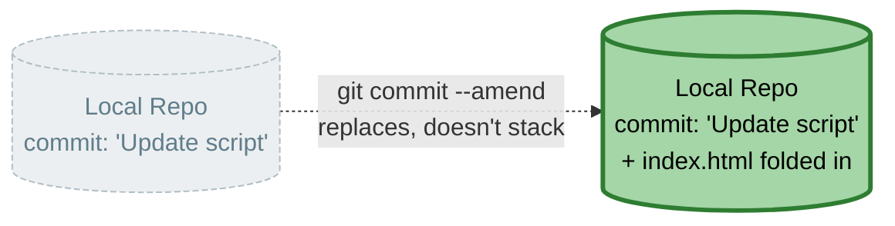
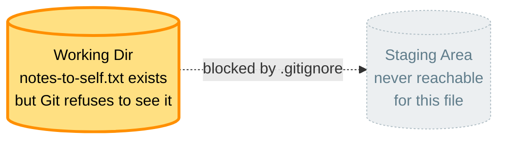
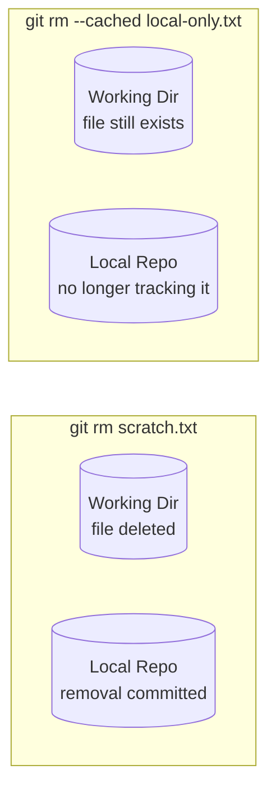

# Lab 02 — Undo, Ignore, and Amend

**Objective:** learn the safety-net commands that let you back out of mistakes at every stage — before staging, after staging, and after committing.

**Prerequisites:** Lab 01 complete, working in the same project folder.

Every undo command in this lab does exactly one thing: it moves a file **backward** through the same chain you learned in Lab 01. Knowing which box you're currently in tells you which command you need.


*Solid arrows move forward (Lab 01). Dashed arrows are this lab — all undo commands.*

---

## Step 1 — Discard an unstaged change

Open `style.css` and make a deliberately bad edit — e.g. set `body { color: hotpink; }`. Save it.

```bash
git status
```

**Expected output:** `style.css` shows as modified.



```bash
git checkout -- style.css
```

Open the file again. **Expected output:** your bad edit is gone — the file is back to its last committed state.



⚠️ **GOTCHA:** this only works for changes that haven't been staged yet. Once you `git add` something, `checkout --` won't undo it — that's what the next step is for.

---

## Step 2 — Unstage a file

Make a small edit to `script.js`, then stage it before you're actually ready:

```bash
git add script.js
git status
```

**Expected output:** `script.js` shows staged (green).

Now say you changed your mind — you're not ready to commit it yet:

```bash
git reset HEAD script.js
git status
```

**Expected output:** `script.js` is back to modified (unstaged) — your edit is still there, it's just no longer staged.


*Notice `reset HEAD` only un-stages — it never deletes your edit. It moves the file left one box, not all the way back.*

---

## Step 3 — Amend the last commit

Commit the `script.js` change:

```bash
git add script.js
git commit -m "Update script"
```

Now realize you forgot to also update `index.html` as part of the same logical change. Edit `index.html`, then:

```bash
git add index.html
git commit --amend
```

Your editor will open with the previous commit message — you can edit it or leave it, then save and close.

```bash
git log --oneline
```

**Expected output:** still the same number of commits as before — `--amend` replaced the last one rather than adding a new one.



⚠️ **GOTCHA:** only amend commits that are still local (not yet pushed to GitHub). We'll cover why in Lab 05.

---

## Step 4 — Ignore files you never want tracked

Create a throwaway file that has no business being in version control:

```bash
echo "just some scratch notes" > notes-to-self.txt
git status
```

**Expected output:** `notes-to-self.txt` shows up as untracked (red).

Create a `.gitignore` file:

```bash
echo "notes-to-self.txt" > .gitignore
git status
```

**Expected output:** `notes-to-self.txt` no longer appears — Git is deliberately ignoring it now. You'll see `.gitignore` itself listed as untracked, since it's a new file too.



```bash
git add .gitignore
git commit -m "Add .gitignore for scratch files"
```

✅ **TRY THIS:** create a folder called `temp/` with a couple of files inside it. Add a single line `temp/` to `.gitignore` and confirm the whole folder disappears from `git status` in one shot.

---

## Step 5 — Remove a tracked file

Create and commit a throwaway tracked file first:

```bash
echo "delete me later" > scratch.txt
git add scratch.txt
git commit -m "Add scratch.txt for removal practice"
```

Now remove it from Git *and* delete it from disk:

```bash
git rm scratch.txt
git commit -m "Remove scratch.txt"
```

Confirm it's gone from your file explorer too.

Now try the "soft" version — stop tracking a file but keep it on disk. Create another file:

```
echo "keep this locally" > local-only.txt
git add local-only.txt
git commit -m "Add local-only.txt"
git rm --cached local-only.txt
git status
```

**Expected output:** `local-only.txt` is now untracked, but if you check your file explorer, the file itself is still there.



---

## Checkpoint Questions

1. What's the difference between `git checkout -- <file>` and `git reset HEAD <file>` — at what stage does each one apply?
2. Why should you avoid `git commit --amend` on a commit you've already pushed to GitHub?
3. What's the difference between `git rm` and `git rm --cached`?

You're ready for **Lab 03 (Bonus) — Git Internals**, or **Lab 04 — Branching and Merging** if your trainer is skipping the bonus.
