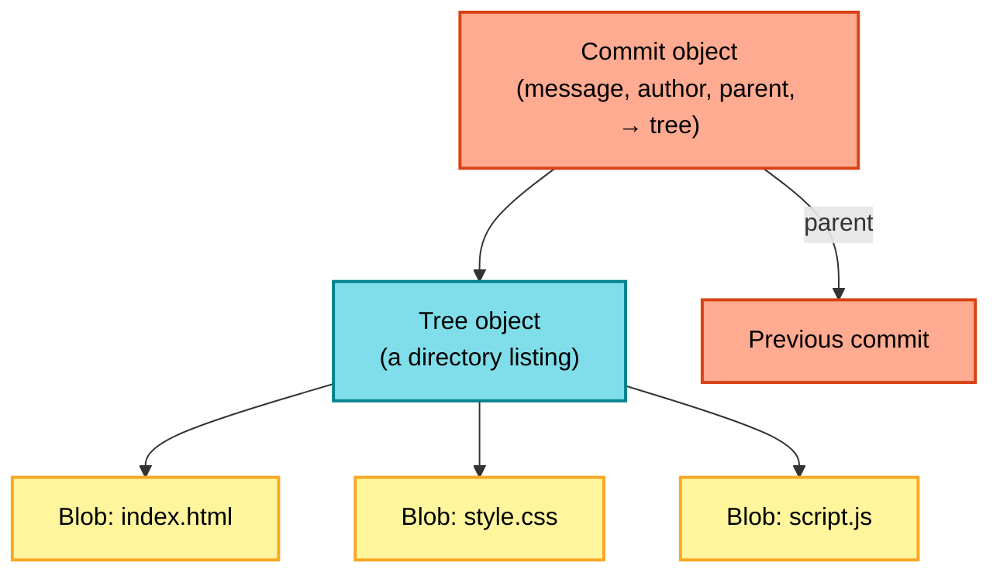
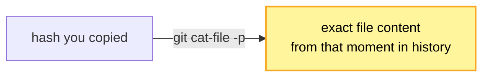
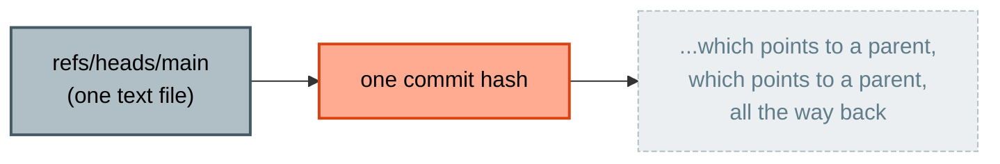

# Lab 03 (Bonus) — What Is Git Actually Doing?

**Objective:** open up the `.git` folder and see, concretely, what a commit actually is under the hood.

**Optional:** skip if your trainer is short on time — nothing later in the course depends on this lab.

**Prerequisites:** Labs 01–02 complete, with at least 3–4 real commits in your history.

🔁 **ANALOGY:** Git doesn't remember "line 4 changed" — it remembers "here's exactly what every file looked like at this moment." Every commit is a full snapshot, not a diff. This lab shows you where those snapshots actually live.


*This is the map for the whole lab — every step below just walks one arrow of this diagram, live, on your own repo.*

---

## Step 1 — Look inside `.git`

```bash
ls -la .git
```

**Expected output:** folders like `objects`, `refs`, `HEAD`, and a few others. This entire folder **is** your local repository. Delete it, and Git-amnesia is instant — your working files stay exactly as they are, but every bit of history is gone.

---

## Step 2 — Explore the objects folder

```bash
ls .git/objects
```

**Expected output:** a set of two-character-named folders (e.g. `4a`, `7f`, `c2`...). Each one holds compressed objects whose full name starts with those two characters.

Pick any commit hash from your history:

```bash
git log --oneline
```

Copy one of the short hashes shown (e.g. `a1b2c3d`).

---

## Step 3 — Inspect a commit object

```bash
git cat-file -p <hash>
```

**Expected output:** something like:

```
tree 8f3b2c...
parent 4a1e9f...
author Your Name <you@example.com> 1234567890 +0000
committer Your Name <you@example.com> 1234567890 +0000

Update page title
```

Notice: a commit is just a pointer to a **tree** (a snapshot of the whole project at that moment), a **parent** (the previous commit), and your message. You're looking at the orange box from the diagram above, filled in with your own real data.

✅ **TRY THIS:** `git show <hash>` gives you the friendlier, human-readable version of the same commit — metadata plus an actual diff of what changed — without needing the raw plumbing command.

```bash
git show <hash>
```

---

## Step 4 — Inspect the tree object

Copy the `tree` hash from the output above:

```bash
git cat-file -p <tree-hash>
```

**Expected output:** a directory listing — file names, permissions, and the hash of each file's content (a **blob**). This is the cyan box — your commit's snapshot of the whole folder.

---

## Step 5 — Inspect a blob object

Copy one of the blob hashes from the tree listing:

```bash
git cat-file -p <blob-hash>
```

**Expected output:** the literal contents of that file, exactly as it was at that commit — this is the actual text of `index.html` or whichever file you picked. This is one of the yellow boxes.



---

## Step 6 — Find out what a branch really is

```bash
cat .git/refs/heads/main
```

**Expected output:** a single line — a 40-character commit hash. That's it. That's the *entire* definition of a branch: one text file holding one hash, pointing at the tip of that branch's history.



---

## What You Just Proved to Yourself

- A **commit** = a pointer to a tree + a parent commit + metadata (author, message)
- A **tree** = a snapshot of a directory at that moment
- A **blob** = the raw content of one file
- A **branch** = a one-line text file holding a single commit hash

Every "magic" Git operation you'll do for the rest of your career — branching, merging, resetting — is really just moving these simple pointers around.

---

## Checkpoint Questions

1. If two completely different commits happened to contain a file with identical content, would Git store that content twice? (Hint: think about how blobs are identified.)
2. What's the minimum information needed to fully describe a branch?

You're ready for **Lab 04 — Branching and Merging**.
