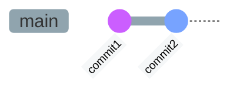
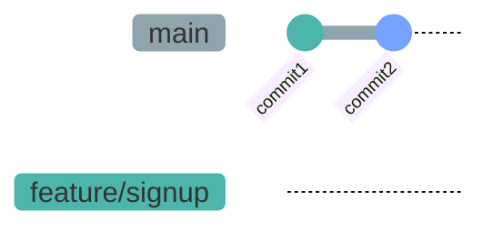
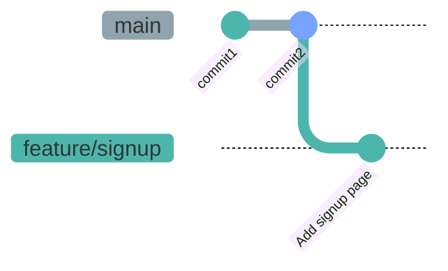
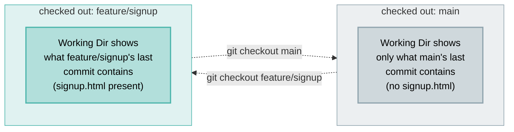
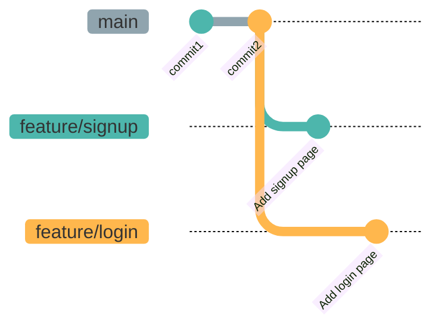
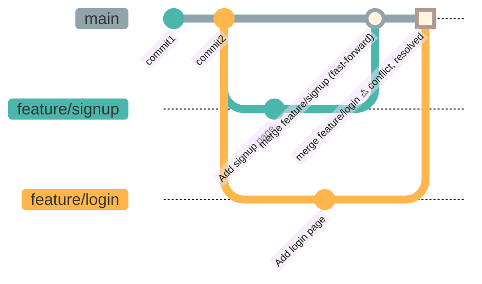
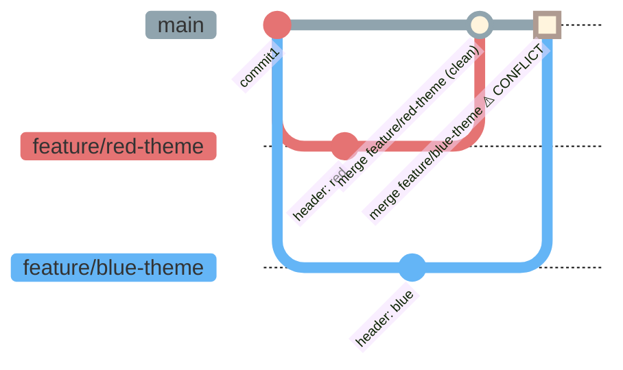
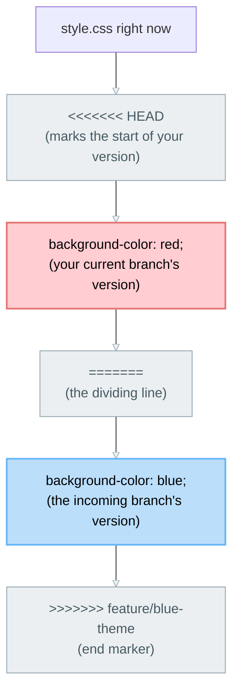

# Lab 04 — Branching and Merging

**Objective:** add new pages to the site on separate branches without disturbing your working homepage, then merge them back in — including resolving a conflict on purpose.

**Prerequisites:** Labs 01–02 complete.

🔁 **ANALOGY:** a branch is a save slot in a video game. Play out a risky change on Slot 2 without touching Slot 1. If it goes badly, delete Slot 2 — nobody ever knows.


*Where your history stands right now — a single line, one branch, `main` (grey throughout this lab). Everything below adds to this picture step by step.*

---

## Naming Your Branches

Before you create your first branch, a word on what to call it. `signup`, `test`, `fix2`, `mybranch` — all of these work technically, but they tell a teammate (or you, in three weeks) nothing about what the branch is for, or whether it's safe to delete yet.

The convention most teams use is:

```
<type>/<short-description>
```

| Type | Use it for | Example |
|---|---|---|
| `feature/` | New functionality | `feature/signup-page` |
| `fix/` or `bugfix/` | Fixing a bug | `fix/broken-nav-link` |
| `hotfix/` | Urgent production fix | `hotfix/login-crash` |
| `chore/` | Maintenance, no user-facing change | `chore/update-dependencies` |
| `docs/` | Documentation only | `docs/readme-setup` |

A few rules of thumb:
- Lowercase, words separated by hyphens — `feature/reset-password`, not `feature/ResetPassword` or `feature/reset_password`
- Short but specific — `feature/signup` beats both `feature/s` and `feature/add-a-new-page-so-users-can-sign-up`
- The prefix is just a naming label, not a real folder — Git treats the `/` as an ordinary character in the branch name

**Every branch you create in this lab follows that pattern.** Your very first one, in Part A below, is `feature/signup` — new functionality, short description, done. Keep that one simple in your head; the pattern doesn't get any harder than that.

---

## Part A — Create a Branch

```bash
git branch
```

**Expected output:** just `* main` (the `*` marks your current branch).

```bash
git checkout -b feature/signup
```

**Expected output:** `Switched to a new branch 'feature/signup'`. This single command both created the branch and switched to it.

```bash
git branch
```

**Expected output:** now shows both `main` and `* feature/signup`, with `feature/signup` marked current.


*A new branch is just a new pointer sitting at the same spot as `main` — nothing has diverged yet. You're now "on" `feature/signup` (teal, from here on) — that's what `checkout` does.*

---

## Part B — Build the Signup Page on Its Own Branch

Create `signup.html` with a basic form. You can use this directly — it already matches the styling from `style.css`:

```html
<!DOCTYPE html>
<html lang="en">
<head>
  <meta charset="UTF-8">
  <meta name="viewport" content="width=device-width, initial-scale=1.0">
  <title>Sign Up</title>
  <link rel="stylesheet" href="style.css">
</head>
<body>
  <header class="site-header">
    <div class="site-header__inner">
      <span class="logo">Our New Site</span>
      <nav class="nav-links">
        <a href="index.html">Home</a>
        <a href="signup.html">Sign Up</a>
      </nav>
    </div>
  </header>

  <main class="content">
    <div class="card">
      <h1>Create your account</h1>
      <form id="signup-form">
        <label>
          Name
          <input type="text" name="name" required>
        </label>
        <label>
          Email
          <input type="email" name="email" required>
        </label>
        <label>
          Password
          <input type="password" name="password" required>
        </label>
        <button type="submit">Create Account</button>
      </form>
    </div>
  </main>

  <footer class="site-footer">
    <p>&copy; 2026 Our New Site. Built for training purposes.</p>
  </footer>

  <script src="script.js"></script>
</body>
</html>
```

Then link it from `index.html`'s navigation — replace the empty `<nav class="nav-links"></nav>` line with:

```html
<nav class="nav-links">
  <a href="index.html">Home</a>
  <a href="signup.html">Sign Up</a>
</nav>
```

```bash
git add signup.html index.html
git status
git commit -m "Add signup page"
```


*Now `feature/signup` (teal) has moved ahead of `main` (grey) by one commit. `main` hasn't changed at all — it doesn't even know this commit exists yet.*

---

## Part C — Watch Branches Actually Isolate Changes

```bash
git checkout main
```

Look at your file explorer or open `index.html`. **Expected output:** `signup.html` is gone, and the navigation link you added disappears too. It's not deleted — it only exists on the `feature/signup` branch.

```bash
git checkout feature/signup
```

**Expected output:** `signup.html` and the link reappear.


*`checkout` rewrites your actual working files to match whichever branch's tip you point it at. This is why files visibly appear and disappear — you're not imagining it.*

✅ **TRY THIS:** `git checkout -` jumps back to whichever branch you were *just* on, so you don't have to type the full name every time you flip back and forth like this.

---

## Part D — Add a Second Feature Branch

```bash
git checkout main
git checkout -b feature/login
```

Create `login.html`:

```html
<!DOCTYPE html>
<html lang="en">
<head>
  <meta charset="UTF-8">
  <meta name="viewport" content="width=device-width, initial-scale=1.0">
  <title>Log In</title>
  <link rel="stylesheet" href="style.css">
</head>
<body>
  <header class="site-header">
    <div class="site-header__inner">
      <span class="logo">Our New Site</span>
      <nav class="nav-links">
        <a href="index.html">Home</a>
        <a href="login.html">Log In</a>
      </nav>
    </div>
  </header>

  <main class="content">
    <div class="card">
      <h1>Log in to your account</h1>
      <form id="login-form">
        <label>
          Email
          <input type="email" name="email" required>
        </label>
        <label>
          Password
          <input type="password" name="password" required>
        </label>
        <button type="submit">Log In</button>
      </form>
    </div>
  </main>

  <footer class="site-footer">
    <p>&copy; 2026 Our New Site. Built for training purposes.</p>
  </footer>

  <script src="script.js"></script>
</body>
</html>
```

Then link it from `index.html`'s navigation — same as Part B, replace the empty `<nav class="nav-links"></nav>` line, but this time with the Log In link:

```html
<nav class="nav-links">
  <a href="index.html">Home</a>
  <a href="login.html">Log In</a>
</nav>
```

⚠️ **Notice:** you're editing the exact same `index.html` line that `feature/signup` already edited back in Part B — but this branch has never seen that change. Keep that in mind; it matters in Part E.

```bash
git add login.html index.html
git commit -m "Add login page"
```


*Two branches now — `feature/signup` (teal) and `feature/login` (amber) — both starting from `main` (grey), each moving independently. Neither knows about the other's commit yet.*

---

## Part E — One Clean Merge, One Real One

```bash
git checkout main
git merge feature/signup
```

**Expected output:** `Fast-forward` — no conflict, since nothing else changed on `main` since you branched off.

```bash
git branch -d feature/signup
```

**Expected output:** the `feature/signup` branch is deleted — its work is already safely part of `main`'s history.

Now merge login:

```bash
git merge feature/login
```

**Expected output, this time:** *not* a fast-forward — and a conflict:

```
CONFLICT (content): Merge conflict in index.html
Automatic merge failed; fix conflicts and then commit the result.
```

Here's why, concretely: `main` just moved forward when you merged `feature/signup` — but `feature/login` branched off *before* that happened, from the original empty nav. Both branches independently rewrote the exact same line of `index.html` into different content. Git can't fast-forward (main has commits login's history doesn't have) and it can't silently pick a side, so it stops and asks you.

Open `index.html` and you'll see something like:

```
<<<<<<< HEAD
<nav class="nav-links">
  <a href="index.html">Home</a>
  <a href="signup.html">Sign Up</a>
</nav>
=======
<nav class="nav-links">
  <a href="index.html">Home</a>
  <a href="login.html">Log In</a>
</nav>
>>>>>>> feature/login
```

Unlike Part F below, this one isn't really an either/or choice — both links are supposed to exist. Resolve it by combining them, then removing the markers entirely:

```html
<nav class="nav-links">
  <a href="index.html">Home</a>
  <a href="signup.html">Sign Up</a>
  <a href="login.html">Log In</a>
</nav>
```

```bash
git add index.html
git commit
git branch -d feature/login
```

```bash
git log --oneline
```

**Expected output:** both features' commits now show up in `main`'s history — one arrived by fast-forward, the other by an actual merge commit you resolved by hand.


*The first merge just moved the `main` pointer forward — no new commit needed. The second couldn't: `main` had already moved, so Git had to actually combine two diverged histories, and that's where the conflict came from.*

💡 **WHY THIS MATTERS:** conflicts aren't reserved for the "on purpose" exercise in Part F — they show up naturally any time two branches independently touch the same line, even when (like here) both changes were perfectly reasonable on their own. Merging in a sensible order, and merging often, is how real teams keep this rare instead of routine.

---

## Part F — Trigger a Merge Conflict on Purpose

Your trainer will pair you with a partner (or assign you a "theme"). You will both edit the **same line** of `style.css` on two different branches — following the same `feature/<description>` pattern from earlier.

```bash
git checkout -b feature/red-theme
```

Change the `header { background-color: ... }` line in `style.css` to red. Commit:

```bash
git add style.css
git commit -m "Set header to red theme"
```

Wait for your trainer's signal, then switch back and let them merge the first branch cleanly:

```bash
git checkout main
git merge feature/red-theme
```

Now your partner's branch (say, `feature/blue-theme`) gets merged in too:

```bash
git merge feature/blue-theme
```

**Expected output (if both edited the exact same line):**

```
CONFLICT (content): Merge conflict in style.css
Automatic merge failed; fix conflicts and then commit the result.
```


*Both branches changed the exact same line, starting from the same point — `feature/red-theme` really is red, `feature/blue-theme` really is blue, and the conflicting merge is highlighted so it jumps out. Git has no way to know which change you actually want — that's not a bug, it's the correct response.*

---

## Part G — Resolve the Conflict

```bash
git status
```

**Expected output:** `style.css` listed under "Unmerged paths."

Open `style.css`. You'll see something like:

```
<<<<<<< HEAD
background-color: red;
=======
background-color: blue;
>>>>>>> feature/blue-theme
```


*This is the exact five-line block from the terminal above, top to bottom — your version (red) first, the incoming version (blue) second, with the three marker lines in grey.*

Edit the file by hand — keep the version you want, remove the `<<<<<<<`, `=======`, and `>>>>>>>` markers entirely. There's no automatic "correct" answer here; Git genuinely cannot decide for you.

```bash
git add style.css
git commit
```

Your editor opens with a pre-filled merge commit message — you can leave it as-is or adjust it, then save and close.

```bash
git log --oneline
```

**Expected output:** both branches' history is now part of `main`, including the merge commit.

💡 **WHY:** a conflict isn't Git failing — it's Git correctly refusing to guess which of two genuinely different changes you actually want.

---

## 👻 The "Ghost Commit" — A Trap to Avoid

While `style.css` is already open for conflict resolution, it's tempting to also fix that typo you noticed, tweak a margin, or slip in a small improvement — "while I'm already in here." **Don't.** That sneaked-in change is a **ghost commit**: real code, riding inside a commit whose message and purpose say something completely different.

Why it's genuinely dangerous, not just messy:

- **The message lies about the contents.** The commit says `Merge branch 'feature/blue-theme'` — it says nothing about the extra line you added. Six months from now, `git log` and `git blame` point at a merge commit with no explanation for that change. It's unaccounted for.
- **Reviewers skip merge commits.** GitHub's PR view, `git log --first-parent`, and most code-review workflows treat merge commits as "just a resolution" and don't scrutinize their contents line by line the way they would a normal commit. Your extra change can ride through completely unreviewed.
- **Reverting the merge reverts your ghost too.** If this merge ever needs `git revert -m 1 <merge-commit>`, your unrelated extra change disappears along with it — collateral damage nobody asked for, in a change nobody knew was there.

**The rule:** a conflict-resolution commit contains **only** the resolution — pick, blend, or rewrite the conflicting lines, and nothing else. Noticed something else worth fixing? Finish the merge cleanly first, then make that its own separate commit with its own honest message, right after.

---

## Checkpoint Questions

1. What does "fast-forward" mean, and why didn't your `feature/signup` merge need a separate merge commit?
2. Your `feature/login` merge conflicted even though nobody did it "on purpose." Why did that one conflict while `feature/signup`'s didn't, and how is that different from the genuinely either/or `feature/red-theme`/`feature/blue-theme` conflict in Part F?
3. What are the three conflict markers, and what does each one represent?
4. Why is sneaking unrelated new code into a conflict-resolution commit (a "ghost commit") a problem, even if the merge itself resolves cleanly?

You're ready for **Lab 05 — Remote Repositories**.
