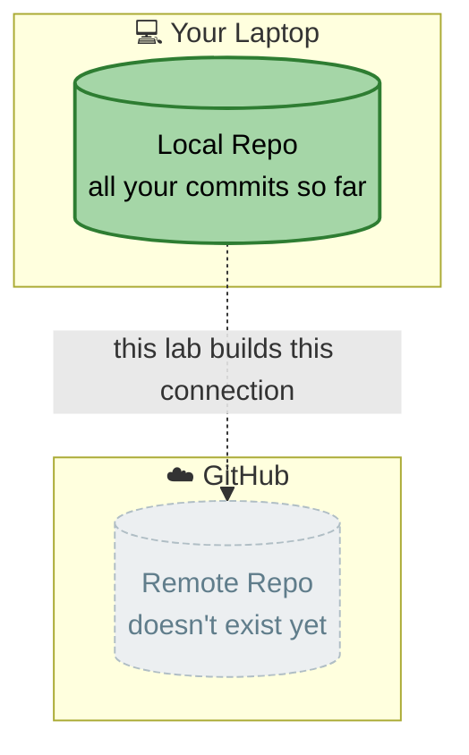
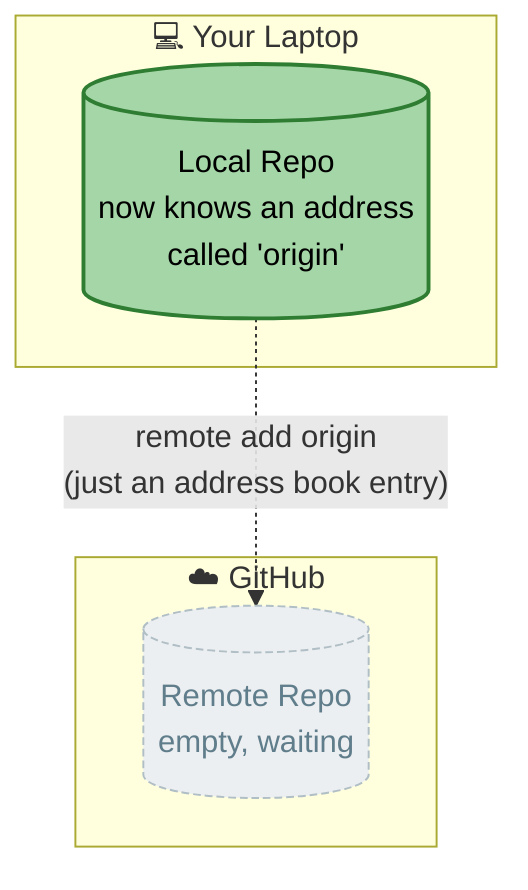
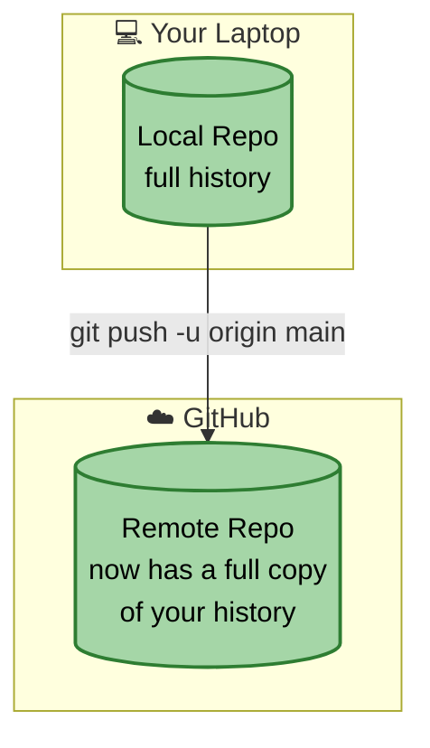
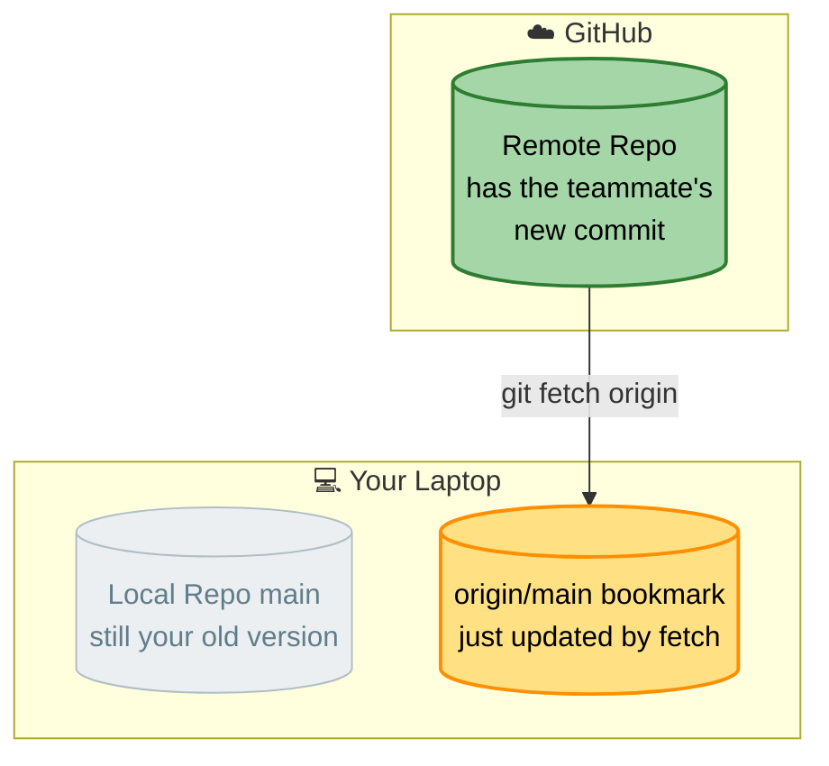
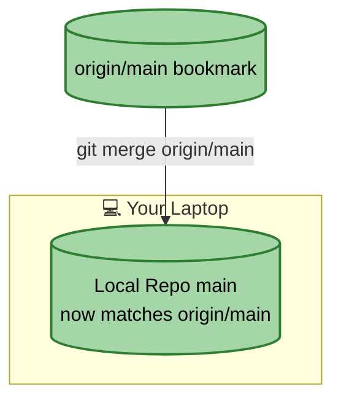
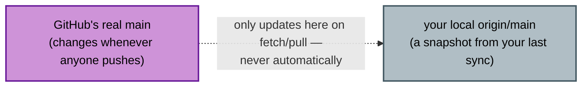

# Lab 05 — Remote Repositories

**Objective:** connect your local repo to GitHub, push your work, and practice syncing with a "teammate's" changes.

**Prerequisites:** Labs 01–04 complete. GitHub account and auth method (PAT or SSH) ready from Lab 00. If this is the shared-repo team lab, confirm you've accepted your collaborator invite — see `05-shared-repo-setup-guide.md` (trainer document).

**The one idea to hold onto:** your local repo and the remote repo on GitHub are two separate, complete repositories. They only ever match because **you** ran a command to copy history between them.


*Right now these two boxes have never spoken. Every step below is about deliberately connecting and syncing them — never automatically.*

---

## Part A — Connect to GitHub

If your trainer created a shared repo, get its URL from them and skip to Step 2.

**Step 1 (individual repo only) — create an empty repository on GitHub:**
- New repository → give it a name → **do not** initialize with a README (you already have local history you don't want to conflict with)
- Copy the URL GitHub gives you

**Step 2 — connect it:**

```bash
git remote add origin <the-url>
git remote -v
```

**Expected output:** `origin` listed twice (fetch and push), pointing at your repo's URL.


*`remote add` only stores an address — it doesn't send anything. Nothing left your laptop yet.*

---

## Part B — First Push

```bash
git push -u origin main
```

**Expected output:** a series of upload progress lines, ending with something like `main -> main`. The `-u` flag links your local `main` to `origin/main` so future pushes/pulls don't need the branch name repeated.

Refresh the repository page in your browser. **Expected output:** your files are now visible on GitHub.


*This is the first moment your work has ever left your machine. Both boxes are green now — they match, but only because you just ran a command.*

---

## Part C — Fetch vs. Pull (Simulate a Teammate)

Your trainer (or a partner, if this is the shared-repo lab) will make a change directly on GitHub — either editing a file in the web UI, or pushing from their own machine.

```bash
git fetch origin
```

**Expected output:** some download activity, but check your files — **nothing has changed locally yet.**

```bash
git status
```

**Expected output:** something like `Your branch is behind 'origin/main' by 1 commit`.



💡 **WHY:** `fetch` downloads the remote's history so Git knows about it, but doesn't touch your working files. It's Git eavesdropping on the server, not acting on what it hears.

Now actually apply it:

```bash
git merge origin/main
```

**Expected output:** your local files update to include the teammate's change.



✅ **TRY THIS:** next time, skip the two-step process — `git pull` does `fetch` + `merge` in one command. Confirm this by having your trainer/partner make another change, then just running `git pull` directly.

---

## Part D — Push Your Own Changes

Make a small change locally (e.g. edit a line in `index.html`), commit it:

```bash
git add index.html
git commit -m "Update homepage copy"
git push
```

**Expected output:** your commit uploads. Refresh GitHub and confirm it's there.

⚠️ **GOTCHA:** always `git pull` *before* you start new work, and again right before you push. Pushing without pulling first is the #1 cause of avoidable conflicts once more than one person is working on a repo.

---

## Part E — Understanding `origin/main`

```bash
git branch -a
```

**Expected output:** your local branches, plus `remotes/origin/main` — this is a **bookmark**, showing where `origin`'s `main` was the *last time you fetched*, not a live feed. It only updates when you `fetch` or `pull`.

✅ **TRY THIS:** `git branch -r` shows just the remote-tracking branches on their own, without your local ones mixed in — handy once a repo has more than one or two branches.



---

## Part F — Force Push (Read Only — Don't Actually Run This Unless Instructed)

If you ever amend a commit or rebase a branch that's *already been pushed*, a normal `git push` will be rejected — your local history no longer matches what's on GitHub. `git push --force` overwrites the remote to match your local history.

**Golden rule:** only force-push a branch you're the sole owner of, and only after telling any collaborators first. If someone else has already pulled the old version, a force-push can silently erase their work.

Your trainer may demo this live — you won't need to run it yourself unless specifically asked to.

---

## Checkpoint Questions

1. What's the difference between `git fetch` and `git pull`?
2. Why might `git push` get rejected, and what should you do *before* reaching for `--force`?
3. What does `origin/main` actually represent, and when does it update?

You're ready for **Lab 06 — Pull Requests**.