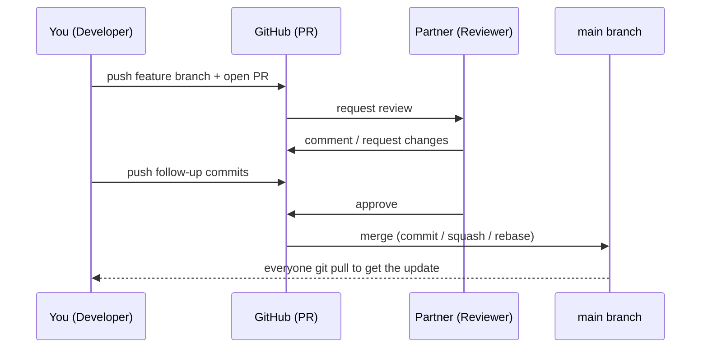
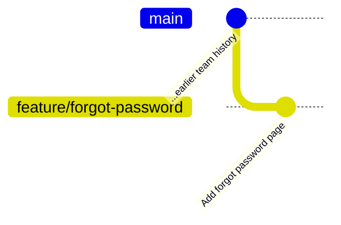
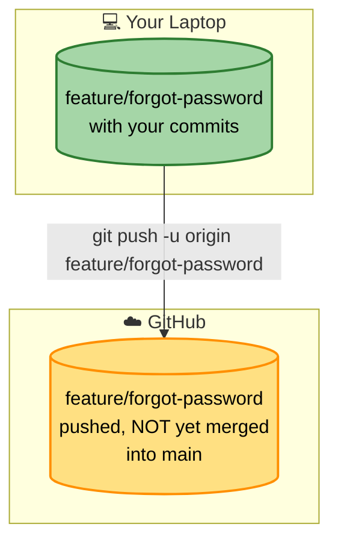
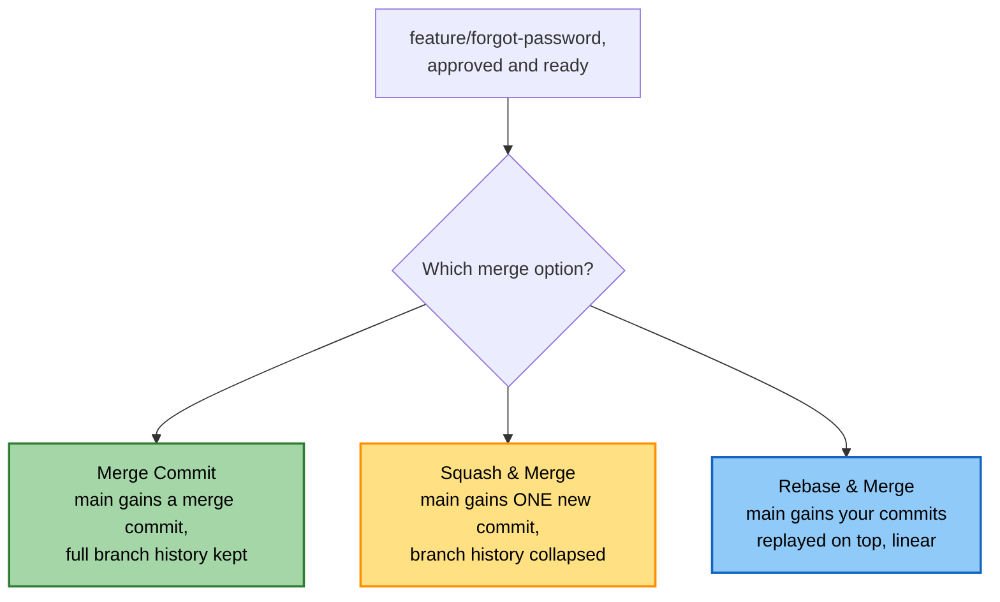
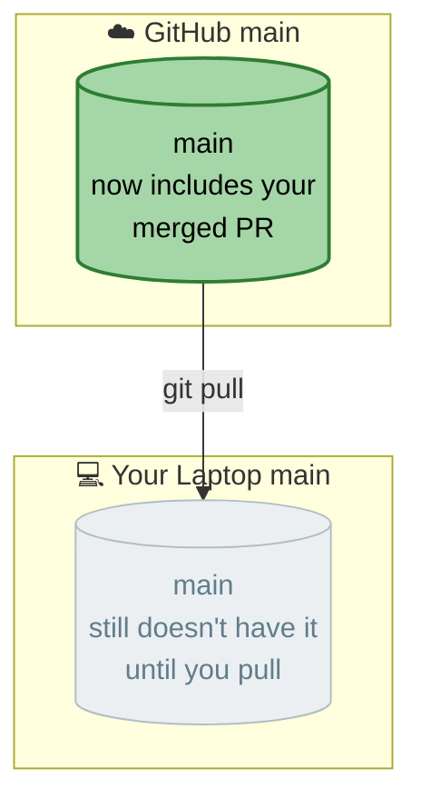

# Lab 06 — Pull Requests

**Objective:** get a feature merged into `main` the way real teams do — through review, not a silent local merge.

**Prerequisites:** Labs 01–05 complete. You'll need a partner to act as your reviewer (and you'll review theirs).


*This is the whole lab, end to end. Every part below is one step of this sequence, done for real.*

---

## Part A — Create Your Feature Branch

You've been assigned (or can choose) a page to add: `forgot-password.html`, or any enhancement to the existing site. Following the `feature/<description>` naming convention from Lab 04, the branch itself is called `feature/forgot-password`.

```bash
git checkout main
git pull
git checkout -b feature/forgot-password
```

Build the page. Here's a reference version, matching the same structure as the signup and login pages from Lab 04:

```html
<!DOCTYPE html>
<html lang="en">
<head>
  <meta charset="UTF-8">
  <meta name="viewport" content="width=device-width, initial-scale=1.0">
  <title>Forgot Password</title>
  <link rel="stylesheet" href="style.css">
</head>
<body>
  <header class="site-header">
    <div class="site-header__inner">
      <span class="logo">Our New Site</span>
      <nav class="nav-links">
        <a href="index.html">Home</a>
        <a href="signup.html">Sign Up</a>
        <a href="login.html">Log In</a>
        <a href="forgot-password.html">Forgot Password</a>
      </nav>
    </div>
  </header>

  <main class="content">
    <div class="card">
      <h1>Reset your password</h1>
      <p>Enter your email and we'll send you a reset link.</p>
      <form id="forgot-password-form">
        <label>
          Email
          <input type="email" name="email" required>
        </label>
        <button type="submit">Send Reset Link</button>
      </form>
    </div>
  </main>

  <footer class="site-footer">
    <p>&copy; 2026 Our New Site. Built for training purposes.</p>
  </footer>

  <script src="script.js"></script>
</body>
</html>
```

Wire it into the existing navigation — by now `index.html`'s nav should already have Home, Sign Up, and Log In from Lab 04; add a fourth link:

```html
<nav class="nav-links">
  <a href="index.html">Home</a>
  <a href="signup.html">Sign Up</a>
  <a href="login.html">Log In</a>
  <a href="forgot-password.html">Forgot Password</a>
</nav>
```

Commit as you go, in small logical steps rather than one giant commit at the end:

```bash
git add forgot-password.html index.html
git commit -m "Add forgot password page"
```


*Same branching mechanics as Lab 04 — the only thing new in this lab is what happens to this branch once it's pushed.*

---

## Part B — Push the Branch

```bash
git push -u origin feature/forgot-password
```

**Expected output:** GitHub will often print a direct link to open a Pull Request from this push — you can use it, or go to the repo page manually.


*Pushing a branch is not the same as merging it. Your code is backed up on GitHub, but `main` hasn't changed at all yet — that only happens in Part E.*

---

## Part C — Open the Pull Request

On GitHub:
1. Go to **Pull requests** → **New pull request**
2. Base branch: `main`. Compare branch: `feature/forgot-password`
3. Write a short description — what did you build, and why? (e.g. *"Adds a forgot-password page with an email form, linked from the login page."*)
4. Assign your partner as a reviewer
5. Click **Create pull request**

---

## Part D — Review a Partner's PR

Switch roles — find your partner's PR and review it:
1. Read through the **Files changed** tab
2. Leave at least one comment — could be a question, a suggestion, or just positive feedback on something specific
3. Choose **Comment**, **Approve**, or **Request changes**. For this lab, aim to **Approve** once you're satisfied (or **Request changes** if you spot something worth fixing first)

If changes were requested, the author pushes a follow-up commit to the same branch:

```bash
git add <changed-file>
git commit -m "Address review feedback"
git push
```

**Expected output:** the PR updates automatically — no need to open a new one, since it's tracking the branch.

---

## Part E — Merge the Pull Request

Once approved, merge it. GitHub gives you three options — try to experience each one across your group if time allows (your trainer will assign who does which):

| Option | What happens | When it's the right call |
|---|---|---|
| **Create a merge commit** | Keeps the full branch history, adds one merge commit | Default choice; good when the history itself has value (bug fixes, anything traceable later) |
| **Squash and merge** | Collapses every commit on the branch into one tidy commit on `main` | Best for messy branches full of `wip`/`fix typo` commits |
| **Rebase and merge** | Replays your branch's commits onto `main` one by one, no merge commit at all | Best for a fully linear history — avoid on branches other people are also working on |



Click your assigned merge option, confirm, and (optionally) delete the branch from GitHub once merged.

---

## Part F — Bring the Merge Down Locally

```bash
git checkout main
git pull
git log --oneline
```

**Expected output:** the merged change now appears in your local `main` history too.


*Even though YOU merged it, your own local `main` doesn't magically know — same two-repos rule applies to you as everyone else on the team.*

```bash
git branch -a
```

If you deleted the remote branch on GitHub, run this to clean up your local reference to it:

```bash
git fetch --prune
```

---

## Checkpoint Questions

1. Why might a team require Pull Requests even for a solo project?
2. What's the practical difference between "merge commit" and "squash and merge," and how would each look different in `git log` afterward?
3. When would rebase and merge be a bad choice?

You're ready for **Lab 07 — Final Capstone**.