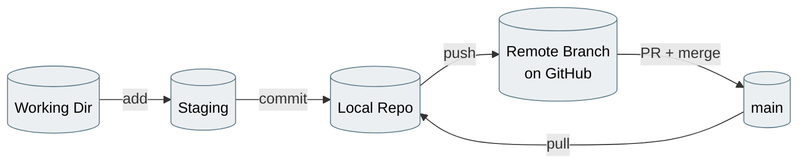

# Lab 07 — Final Capstone

**Objective:** run the entire workflow end-to-end, solo, with no step-by-step hand-holding — this is your proof to yourself that it's actually sunk in.

**Prerequisites:** Labs 01–06 complete.

*Every lab today taught you one arrow of this loop. This capstone is you running the whole loop yourself, start to finish, with no step list telling you which arrow comes next.*

---

## The Brief

Pick one small, genuine improvement to the site — anything from this list, or your own idea:

- Add a footer with a copyright line to every page
- Add basic client-side validation to one of the forms (e.g. password length check in `script.js`)
- Add a simple "About" page, linked from the navigation
- Improve the styling of one page in `style.css`

You will complete this **without a numbered step list** — only the requirements below. Use `04-git-commands-cheatsheet.md` if you need a syntax reminder, but the sequencing is up to you.

---

## Requirements

- [ ] Start from an up-to-date `main`
- [ ] Do the work on a dedicated feature branch (`feature/<short-description>`, per Lab 04's naming convention), not directly on `main`
- [ ] Make at least two separate commits, each with a message that clearly explains *why*, not just *what*
- [ ] Push the branch to GitHub
- [ ] Open a Pull Request with a real description
- [ ] Get it reviewed by a partner (or self-review carefully if working solo)
- [ ] Merge it using whichever strategy you think fits best — and be ready to explain why you chose it
- [ ] Pull the merged change back down to your local `main`

---

## Self-Assessment Checklist

Go through this honestly — if any box feels shaky, that's worth flagging to your trainer now rather than after today.

- [ ] I can turn any folder into a Git repository and track changes in it
- [ ] I can write a commit message that would still make sense to someone else in six months
- [ ] I know the difference between `git add`, `git commit`, and `git push`, and what each one actually moves
- [ ] I can create, switch between, and merge branches confidently
- [ ] I can recognize a merge conflict, understand why it happened, and resolve it by hand
- [ ] I understand that my local repo and GitHub are two separate repositories that only sync when I tell them to
- [ ] I know the difference between `git fetch` and `git pull`
- [ ] I can open, review, and merge a Pull Request, and explain the three merge strategy options
- [ ] I know at least three things on the "Don'ts" list from today (ask your trainer for the full Do's/Don'ts sheet if you don't have it) and why each one matters

---

## Closing Reflection

In your own words, answer this one for yourself (no need to write it down unless you want to):

> If a new teammate joined your project tomorrow and asked "what actually happens when I run `git push`?" — what would you tell them?

If you can answer that clearly, today did its job.