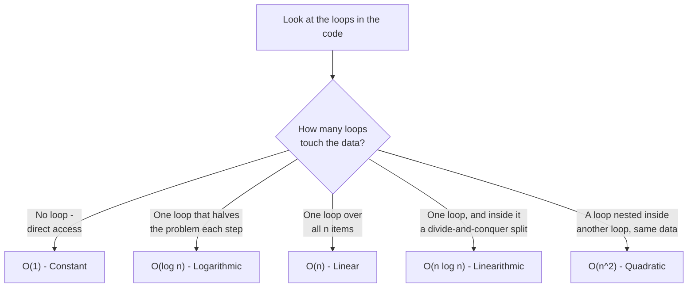
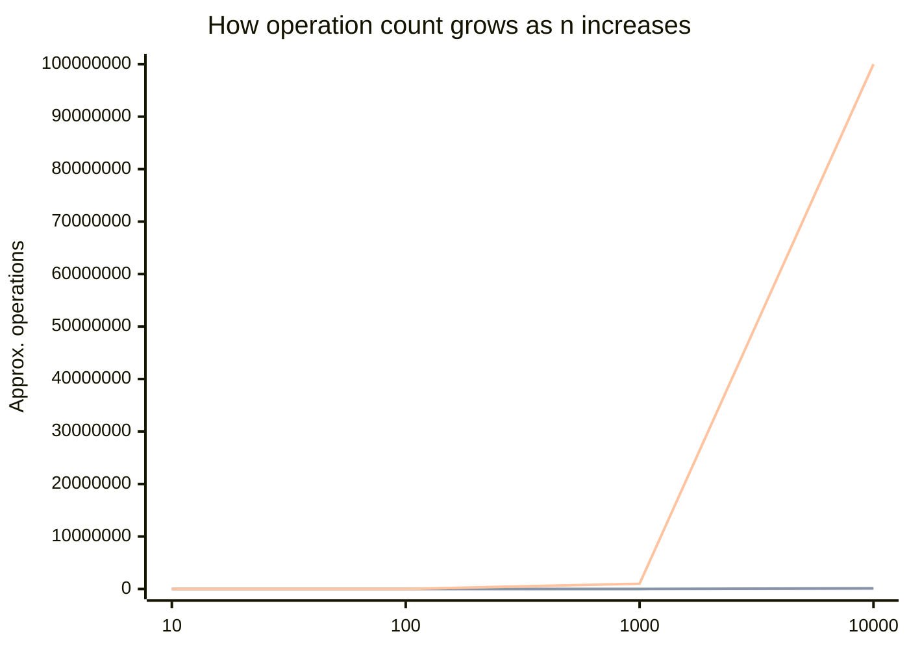
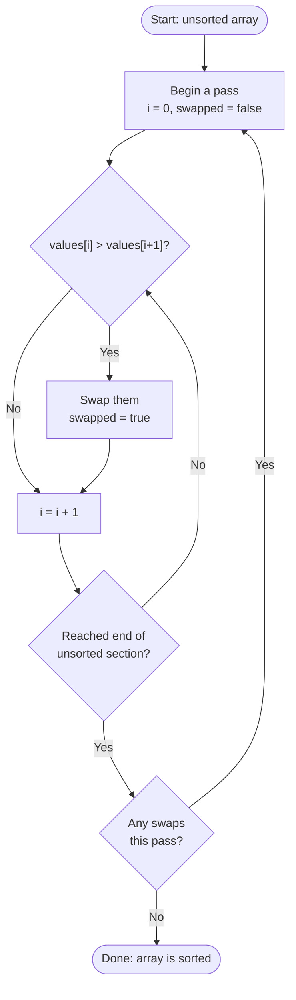
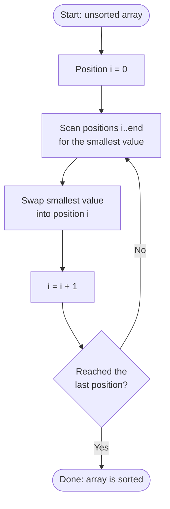
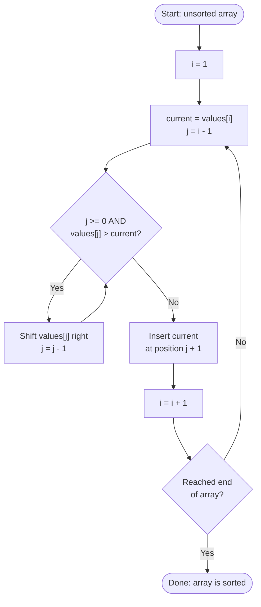
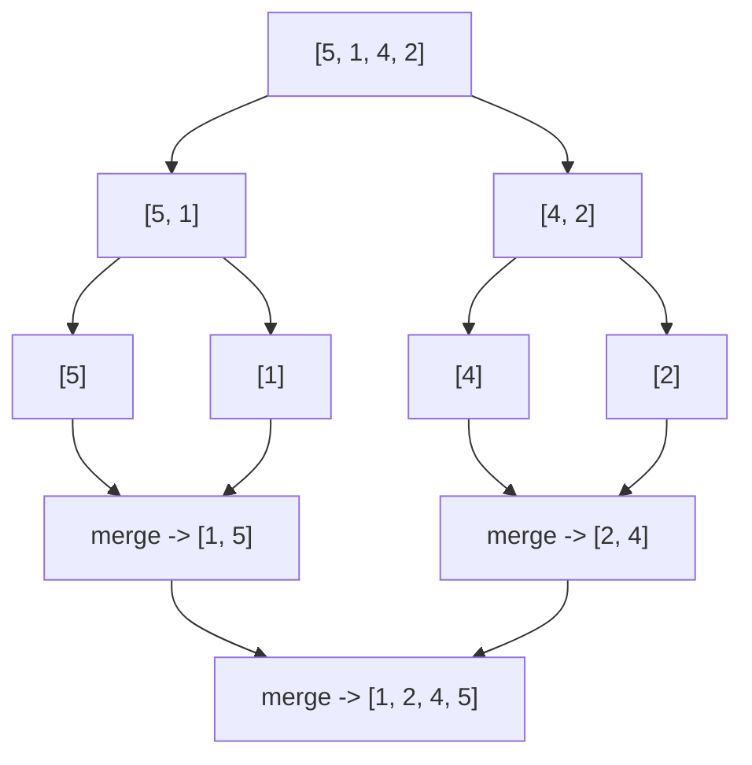
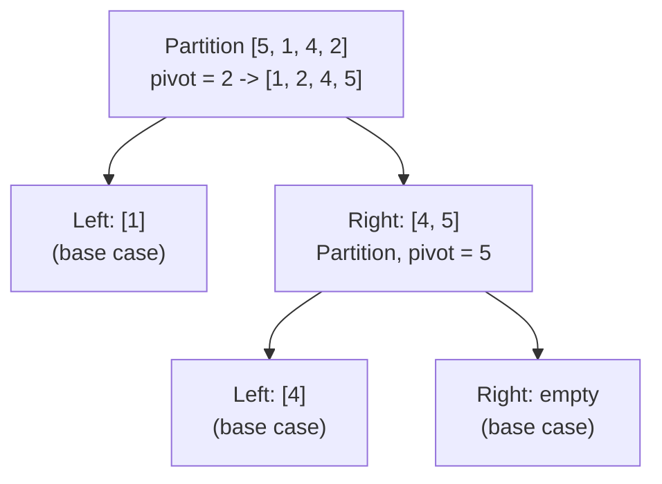
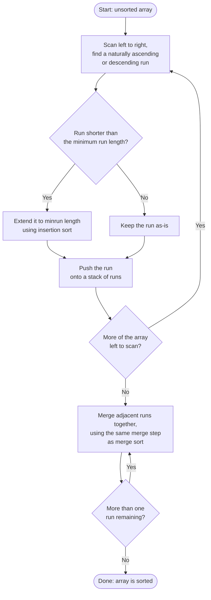

# Big O & Sorting in Java — Workbook

Welcome! This session covers two things: how we measure whether code
is "fast" as data grows (Big O notation), and how the three classic
"simple" sorting algorithms actually work under the hood.

Throughout this workbook, code comments use a few tags to flag
different kinds of information:

- **💡 WHY** — explains the reasoning behind a line of code, not just
  what it does
- **⚠️ GOTCHA** — a common mistake or an easy-to-miss detail
- **🔁 ANALOGY** — connects the code back to something familiar
- **✅ TRY THIS** — a small experiment worth running yourself

> 📊 **Note on diagrams:** this workbook includes several Mermaid
> diagrams (flowcharts and a chart). They render automatically on
> GitHub and in VS Code (with the built-in preview or the "Markdown
> Preview Mermaid Support" extension). If your viewer doesn't support
> them, every diagram has a matching ASCII trace or code block right
> next to it, so nothing here depends on the diagram alone.

---

## Big O Notation

Big O notation describes how an algorithm's **running time** grows as
the input size `n` gets larger. It focuses on the **worst case** and
ignores constants and hardware, so we can compare algorithms fairly —
independent of which machine they run on.

The key idea: what matters is what happens when `n` gets *big*. An
algorithm that's slower on 10 items but scales better will always win
on 10,000,000 items.

**Common complexities, fastest to slowest:**

| Notation | Name | What it means | Example in Java |
|---|---|---|---|
| `O(1)` | Constant | Execution time doesn't change as the volume of data grows | `myArray[i]` |
| `O(log n)` | Logarithmic | Grows very slowly — doubling the data adds just one more step | binary search in a sorted list |
| `O(n)` | Linear | Grows in step with the data — twice the data, twice the time | loop once over a list |
| `O(n log n)` | Linearithmic | A little slower than linear, but the realistic best for sorting | efficient sorts (merge / quick) |
| `O(n²)` | Quadratic | Grows dramatically — twice the data means **four times** the time | nested loops (e.g. bubble sort) |

### Real-life analogies

**`O(1)` — Constant**
Pressing a floor button in a lift. Press "9" and you go to floor 9 —
it makes no difference whether the building has 9 floors or 90. One
press, one action, done.

**`O(log n)` — Logarithmic**
Finding an author in an alphabetised bookshop. Looking for a Terry
Pratchett novel? You walk to roughly the "P" section — you don't
start at "A" and check every shelf. Once you're near "P," you narrow
again: before or after "Pratchett"? Each glance eliminates a huge
chunk of the shop, not just one book at a time.

**`O(n)` — Linear**
Counting how many sweets are left in a jar by counting them one by
one. No shortcuts — you touch every single sweet once. Twice as many
sweets, twice as long to count them.

**`O(n log n)` — Linearithmic**
Sorting a stack of exam papers by splitting into piles: split the
stack in half, then those halves in half again, until each pile has
one paper. Merge pairs of piles back together *in order*. The
repeated halving is the `log n` part; re-merging every paper back in
at every level is the `n` part.

**`O(n²)` — Quadratic**
Everyone in a room shaking hands with everyone else. 10 people make
45 handshakes. 20 people make 190 — not double, **more than four
times as many**. Every item having to compare against every other
item is exactly what the nested loops in bubble/selection sort are
doing.

**A useful gut-check to remember:** one loop → think `O(n)`. A loop
nested inside another loop, covering the same data → think `O(n²)`.
Halving the problem each step → think `O(log n)`. That single habit
gets you most of the way to reading Big O off real code without
memorising formulas.

**🧭 Diagram: reading Big O off code — quick decision guide**



### Seeing the growth for real numbers

| n | O(1) | O(log n) | O(n) | O(n log n) | O(n²) |
|---|---|---|---|---|---|
| 10 | 1 | 3 | 10 | 33 | 100 |
| 100 | 1 | 7 | 100 | 664 | 10,000 |
| 1,000 | 1 | 10 | 1,000 | 9,966 | 1,000,000 |
| 10,000 | 1 | 13 | 10,000 | 132,877 | 100,000,000 |

At `n = 10` the gap between `O(n)` and `O(n²)` looks trivial (10 vs.
100). By `n = 10,000` it's the difference between "instant" and "100
million operations." The gap doesn't grow steadily — it explodes.

**📊 Diagram: growth comparison — O(n) vs. O(n log n) vs. O(n²)**



Notice how flat `O(n)` and `O(n log n)` look on this chart — that's
not a rendering issue, it's the honest picture. Against `O(n²)`'s
climb to 100 million, even 132,877 operations barely registers. That
flatness *is* the lesson: on this scale, "fast" algorithms don't just
look a bit better than `O(n²)`, they look like they're doing almost
nothing at all.

### ✅ TRY THIS: watch it happen live

Copy this into your IDE and run it. It times five genuine Java
examples — one per complexity class — at increasing input sizes, so
you can watch the growth patterns play out on your own machine.

```java
import java.util.Arrays;

public class BigODemo {
    static long sink = 0; // 💡 WHY: without using the result somewhere,
                           // the compiler can notice a loop's output is
                           // never read and delete the whole loop —
                           // this field stops that from happening.

    public static void main(String[] args) {
        // 💡 WHY: each size is double the one before it. Doubling is
        // deliberate — it's the exact test that tells complexity classes
        // apart. If a timing doubles when n doubles, that's linear
        // behaviour. If it roughly quadruples, that's quadratic.
        int[] sizes = {5000, 10000, 20000, 40000, 80000};

        System.out.println("n\tO(1)\tO(log n)\tO(n)\tO(n log n)\tO(n^2)");
        for (int n : sizes) {
            long constantTime = timeConstant(n);
            long logTime = timeLogarithmic(n);
            long linearTime = timeLinear(n);
            long nLogNTime = timeNLogN(n);
            long quadraticTime = timeQuadratic(n);
            System.out.println(n + "\t" + constantTime + "\t" + logTime
                    + "\t\t" + linearTime + "\t" + nLogNTime + "\t\t" + quadraticTime);
        }
        System.out.println("(sink=" + sink + ", ignore this - it just stops the JIT cheating)");
    }

    // O(1): a single array access, regardless of n
    static long timeConstant(int n) {
        // ⚠️ GOTCHA: building the array happens outside the timed
        // region (before start). We only want to measure the O(1)
        // operation itself, not the O(n) cost of creating the array.
        int[] data = new int[n];

        long start = System.nanoTime();
        // 💡 WHY: exactly one array access, no matter how big `data`
        // is. That's the whole definition of constant time.
        sink += data[n / 2];
        long end = System.nanoTime();
        return (end - start) / 1_000_000;
    }

    // O(log n): binary search on a sorted array
    static long timeLogarithmic(int n) {
        int[] data = new int[n];
        // ⚠️ GOTCHA: binarySearch only works correctly on a *sorted*
        // array — this fill loop guarantees that, and it also runs
        // outside the timed region for the same reason as above.
        for (int i = 0; i < n; i++) data[i] = i;

        long start = System.nanoTime();
        // 💡 WHY: searching for the very last element is the worst
        // case for binary search — it takes the maximum possible
        // number of halving steps to find it.
        int index = Arrays.binarySearch(data, n - 1);
        long end = System.nanoTime();
        sink += index;
        return (end - start) / 1_000_000;
    }

    // O(n): one pass over n items
    static long timeLinear(int n) {
        long start = System.nanoTime();
        // 💡 WHY: exactly one loop, touching each of the n items
        // exactly once. Twice the items means twice the iterations.
        for (int i = 0; i < n; i++) {
            sink += i;
        }
        long end = System.nanoTime();
        return (end - start) / 1_000_000;
    }

    // O(n log n): sorting n items (Arrays.sort on a primitive array uses a dual-pivot quicksort)
    static long timeNLogN(int n) {
        int[] data = new int[n];
        // 🔁 ANALOGY: this is the "splitting the exam papers into
        // piles" idea from the Concept section, just running inside
        // a single method call instead of by hand.
        java.util.Random rnd = new java.util.Random(42); // ⚠️ GOTCHA: a
        // fixed seed (42) makes the "random" data identical on every
        // run, so timings are reproducible instead of noisy each time.
        for (int i = 0; i < n; i++) data[i] = rnd.nextInt();

        long start = System.nanoTime();
        Arrays.sort(data);
        long end = System.nanoTime();
        sink += data[0];
        return (end - start) / 1_000_000;
    }

    // O(n^2): every item compared against every other item
    static long timeQuadratic(int n) {
        long start = System.nanoTime();
        // 💡 WHY: the outer loop runs n times, and for every single
        // one of those n iterations, the inner loop *also* runs n
        // times — n * n operations in total. This nested-loop-over-
        // the-same-data shape is the classic fingerprint of O(n²).
        for (int i = 0; i < n; i++) {
            for (int j = 0; j < n; j++) {
                sink += 1;
            }
        }
        long end = System.nanoTime();
        return (end - start) / 1_000_000;
    }
}
```

```
# Sample output — yours will vary slightly by machine, but the shape holds:
n	O(1)	O(log n)	O(n)	O(n log n)	O(n^2)
5000	0	0		0	4		7
10000	0	0		0	4		3
20000	0	0		0	5		14
40000	0	0		2	5		57
80000	0	0		0	10		146
(sink=2053185745, ignore this - it just stops the JIT cheating)
```

**What to notice:** `O(1)` and `O(log n)` stay at 0ms the entire way,
even at 80,000 items — that's the point, not a bug: they're so fast
that even 16x more data doesn't register on the stopwatch. `O(n)`
stays close to 0ms too. `O(n log n)` grows, but gently. `O(n²)` is the
one that visibly climbs, and grows the fastest between the last two
rows — a direct, measured example of "double the data, four times
the time."

⚠️ **GOTCHA:** if you run this yourself and see an odd result — like
a *larger* input size finishing faster than a smaller one — that's
not a mistake in the code. It's the JVM's background JIT (Just-In-Time)
compiler switching your loop from slow interpreted bytecode to fast
compiled machine code partway through the run, on its own schedule.
Real benchmarking tools solve this with a "warm-up" phase before they
start measuring; a simple `System.nanoTime()` timer like ours doesn't,
so the odd result is a genuine, well-known artifact — not something
to debug.

💡 **IDE tip:** in IntelliJ (and most Java-aware editors), typing
`sout` and hitting Tab expands to `System.out.println();` with your
cursor already inside the parentheses. Worth knowing — you'll type
`System.out.println` a lot in this course.

---

## Sorting Algorithms

All three of the following are `O(n²)` — easy to understand, but slow
on large lists. We'll trace each one sorting `[5, 1, 4, 2]` before
looking at the code.

### Bubble sort

🔁 **ANALOGY:** like a bubble of air rising through water — the
biggest value "bubbles" its way to the end of the array, one swap at
a time, on every pass.

Repeatedly swap neighbouring items that are out of order; the largest
unsorted value bubbles to the end on each pass.

```
[5, 1, 4, 2]   compare 5 & 1 → swap (5 > 1)
[1, 5, 4, 2]   compare 5 & 4 → swap
[1, 4, 5, 2]   compare 5 & 2 → swap
[1, 4, 2, 5]   5 has bubbled to the end ✓
```
Then repeat the pass on the remaining unsorted items until a full pass
makes no swaps — that's the signal the list is sorted.

**🔵 Diagram: Bubble Sort — process flow**



```java
import java.util.Arrays;

public class BubbleSortDemo {
    public static void main(String[] args) {
        int[] values = {5, 1, 4, 2};
        System.out.println("Before: " + Arrays.toString(values));

        // 💡 WHY: each pass compares neighbouring pairs and swaps them
        // if they're in the wrong order. One full pass guarantees the
        // largest remaining value ends up at the end.
        for (int pass = 0; pass < values.length - 1; pass++) {

            // 💡 WHY: `swapped` tracks whether this pass made any
            // changes. If a full pass makes zero swaps, the array is
            // already sorted — there's no point doing another pass.
            boolean swapped = false;

            // ⚠️ GOTCHA: notice the upper bound shrinks by `pass` each
            // time (`values.length - 1 - pass`). The last `pass` items
            // are already correctly placed from previous passes, so
            // there's no need to re-check them.
            for (int i = 0; i < values.length - 1 - pass; i++) {
                if (values[i] > values[i + 1]) {
                    int temp = values[i];
                    values[i] = values[i + 1];
                    values[i + 1] = temp;
                    swapped = true;
                }
            }

            System.out.println("After pass " + (pass + 1) + ": " + Arrays.toString(values));

            // ✅ TRY THIS: comment out this line and re-run — the output
            // won't change for this small array, but the algorithm will
            // now always run every pass, even once the array is sorted.
            if (!swapped) break;
        }

        System.out.println("After: " + Arrays.toString(values));
    }
}
```

```
# Output:
Before: [5, 1, 4, 2]
After pass 1: [1, 4, 2, 5]
After pass 2: [1, 2, 4, 5]
After pass 3: [1, 2, 4, 5]
After: [1, 2, 4, 5]
```

Notice pass 3 makes no swaps — that's the `swapped == false` case,
the signal that the array is already sorted.

---

### Selection sort

🔁 **ANALOGY:** like sorting a hand of playing cards by repeatedly
picking out the lowest card left in the messy pile and placing it
next to the cards you've already sorted.

Scan the rest of the list for the smallest item and place it next;
repeat for each position.

```
[5, 1, 4, 2]   scan for the smallest value: 1
[1, 5, 4, 2]   place 1 at the front; next smallest is 2
[1, 2, 4, 5]   place 2 next; the remaining values are already in order
[1, 2, 4, 5]   sorted ✓
```

**🟢 Diagram: Selection Sort — process flow**



```java
import java.util.Arrays;

public class SelectionSortDemo {
    public static void main(String[] args) {
        int[] values = {5, 1, 4, 2};
        System.out.println("Before: " + Arrays.toString(values));

        // 💡 WHY: the outer loop represents each "position" in the array
        // we are about to fill, from left to right. Once we've filled
        // position i, we never touch it again.
        for (int i = 0; i < values.length - 1; i++) {

            // 💡 WHY: we assume — for now — that the smallest remaining
            // value is at position i itself. The inner loop below will
            // correct this assumption if it finds something smaller.
            int smallestIndex = i;

            // 💡 WHY: this inner loop scans everything to the right of i,
            // looking for the actual smallest value. It never looks left,
            // because everything left of i is already sorted and finished.
            for (int j = i + 1; j < values.length; j++) {
                if (values[j] < values[smallestIndex]) {
                    smallestIndex = j;
                }
            }

            // ⚠️ GOTCHA: this swap happens even if smallestIndex == i
            // (nothing smaller was found) — it's a harmless no-op swap
            // in that case. Some implementations add an `if` to skip it,
            // but it isn't required for correctness.
            int temp = values[i];
            values[i] = values[smallestIndex];
            values[smallestIndex] = temp;

            System.out.println("After placing position " + i + ": " + Arrays.toString(values));
        }

        System.out.println("After: " + Arrays.toString(values));
    }
}
```

```
# Output:
Before: [5, 1, 4, 2]
After placing position 0: [1, 5, 4, 2]
After placing position 1: [1, 2, 4, 5]
After placing position 2: [1, 2, 4, 5]
After: [1, 2, 4, 5]
```

✅ **TRY THIS:** count how many *comparisons* the inner loop makes in
total for this 4-item array (hint: it's `3 + 2 + 1 = 6`). This pattern
— one fewer comparison each time through the outer loop — is exactly
why selection sort is `O(n²)`: the total is always roughly `n² / 2`.

---

### Insertion sort

🔁 **ANALOGY:** like sorting a hand of playing cards by picking up
each new card and sliding it into its correct spot among the cards
you're already holding in sorted order.

Take each item and slot it into its correct place among the items
already sorted.

```
[5, 1, 4, 2]   "5" is the sorted start; take 1 and insert it on the left
[1, 5, 4, 2]   take 4 and slide it between 1 and 5
[1, 4, 5, 2]   take 2 and slide it between 1 and 4
[1, 2, 4, 5]   sorted ✓
```

**🟡 Diagram: Insertion Sort — process flow**



```java
import java.util.Arrays;

public class InsertionSortDemo {
    public static void main(String[] args) {
        int[] values = {5, 1, 4, 2};
        System.out.println("Before: " + Arrays.toString(values));

        // 💡 WHY: we start at index 1, not 0. A single item (index 0 on
        // its own) is trivially "sorted" — there's nothing to compare it
        // against yet, so there's no work to do for it.
        for (int i = 1; i < values.length; i++) {

            // 💡 WHY: `current` is the value we're about to insert into
            // the already-sorted portion of the array (everything to the
            // left of index i).
            int current = values[i];
            int j = i - 1;

            // 💡 WHY: this while loop shifts values one place to the
            // right, one at a time, as long as they're bigger than
            // `current` — opening up a gap for `current` to drop into.
            // ⚠️ GOTCHA: `j >= 0` must be checked first (Java evaluates
            // && left-to-right and stops early), otherwise `values[j]`
            // would throw an ArrayIndexOutOfBoundsException once j drops
            // below 0.
            while (j >= 0 && values[j] > current) {
                values[j + 1] = values[j];
                j--;
            }

            // 💡 WHY: the while loop above stops one step past where
            // `current` belongs, so we insert it at j + 1.
            values[j + 1] = current;

            System.out.println("After inserting " + current + ": " + Arrays.toString(values));
        }

        System.out.println("After: " + Arrays.toString(values));
    }
}
```

```
# Output:
Before: [5, 1, 4, 2]
After inserting 1: [1, 5, 4, 2]
After inserting 4: [1, 4, 5, 2]
After inserting 2: [1, 2, 4, 5]
After: [1, 2, 4, 5]
```

✅ **TRY THIS:** run insertion sort on an array that's *already*
sorted, like `{1, 2, 4, 5}`. The `while` loop condition `values[j] >
current` will be false immediately every time, so the algorithm does
almost no work. This is why insertion sort is described as "fast on
nearly-sorted data" — its best case is `O(n)`, not `O(n²)`.

## Faster Sorts

Bubble, selection, and insertion sort are all `O(n²)` — great for
learning how sorting works, but they fall apart on large data. The
three sorts below are what you'd actually reach for (or, in Tim
Sort's case, what Java reaches for *automatically*) once performance
matters.

### Merge sort

🔁 **ANALOGY:** splitting a stack of exam papers in half, then in half
again, until each pile has one paper — then merging pairs of piles
back together *in order*, all the way back up.

**How it works:** split the array into two halves, recursively sort
each half, then merge the two sorted halves back into one sorted
array. The "hard work" all happens in the merge step — combining two
already-sorted lists into one is cheap and predictable.

```
Split:  [5, 1, 4, 2]  →  [5, 1]  and  [4, 2]
Split again:  [5] [1]  and  [4] [2]   (single items — already "sorted")
Merge:  [5] + [1] → [1, 5]        [4] + [2] → [2, 4]
Merge:  [1, 5] + [2, 4] → [1, 2, 4, 5]
```

Here's the exact same process as a tree — split going down, merge
coming back up:

**🟣 Diagram: Merge Sort — recursion tree for [5, 1, 4, 2]**



```java
import java.util.Arrays;

public class MergeSortDemo {
    public static void main(String[] args) {
        int[] values = {5, 1, 4, 2};
        System.out.println("Before: " + Arrays.toString(values));
        mergeSort(values, 0, values.length - 1);
        System.out.println("After: " + Arrays.toString(values));
    }

    // 💡 WHY: this is the "split" half of divide-and-conquer. `left` and
    // `right` mark the section of the array we're currently sorting —
    // we never create new arrays for the splitting itself, just track
    // index boundaries.
    static void mergeSort(int[] values, int left, int right) {
        // ⚠️ GOTCHA: this is the recursion's base case. A section with
        // 0 or 1 items is trivially sorted already — without this check,
        // the recursion would never stop.
        if (left >= right) return;

        int mid = (left + right) / 2;
        mergeSort(values, left, mid);       // sort the left half
        mergeSort(values, mid + 1, right);  // sort the right half
        merge(values, left, mid, right);    // combine the two sorted halves
        System.out.println("Merged [" + left + ".." + right + "]: " + Arrays.toString(values));
    }

    // 💡 WHY: this is the "conquer" half — combining two already-sorted
    // sections into one sorted section. This is the only place actual
    // comparisons and reordering happen.
    static void merge(int[] values, int left, int mid, int right) {
        int[] leftHalf = Arrays.copyOfRange(values, left, mid + 1);
        int[] rightHalf = Arrays.copyOfRange(values, mid + 1, right + 1);

        int i = 0, j = 0, k = left;
        // 💡 WHY: since both halves are already sorted, we only ever
        // need to compare their current front elements — the smaller
        // one is guaranteed to be the next smallest value overall.
        while (i < leftHalf.length && j < rightHalf.length) {
            if (leftHalf[i] <= rightHalf[j]) {
                values[k++] = leftHalf[i++];
            } else {
                values[k++] = rightHalf[j++];
            }
        }
        // ⚠️ GOTCHA: one of these two loops will run and the other
        // won't — once one half runs out, the remainder of the other
        // half is already in order, so it just gets copied across.
        while (i < leftHalf.length) values[k++] = leftHalf[i++];
        while (j < rightHalf.length) values[k++] = rightHalf[j++];
    }
}
```

```
# Output:
Before: [5, 1, 4, 2]
Merged [0..1]: [1, 5, 4, 2]
Merged [2..3]: [1, 5, 2, 4]
Merged [0..3]: [1, 2, 4, 5]
After: [1, 2, 4, 5]
```

⚠️ **GOTCHA:** merge sort needs the temporary `leftHalf` / `rightHalf`
arrays created inside `merge()`. That's why its space complexity is
`O(n)` — it's not sorting fully "in place" the way the `O(n²)` sorts
were. That extra memory is the price paid for guaranteed `O(n log n)`
performance, even in the worst case.

### Quick sort

🔁 **ANALOGY:** picking one person in a queue as a reference point,
moving everyone shorter than them to one side and everyone taller to
the other, then repeating that same trick separately on each side.

**How it works:** pick a **pivot** value, rearrange the array so
everything smaller than the pivot ends up on its left and everything
larger ends up on its right (this step is called *partitioning*), then
recursively apply the same process to the left and right sections.
Unlike merge sort, quick sort does its work *before* recursing, and
sorts in place — no extra arrays needed.

```java
import java.util.Arrays;

public class QuickSortDemo {
    public static void main(String[] args) {
        int[] values = {5, 1, 4, 2};
        System.out.println("Before: " + Arrays.toString(values));
        quickSort(values, 0, values.length - 1);
        System.out.println("After: " + Arrays.toString(values));
    }

    static void quickSort(int[] values, int low, int high) {
        if (low >= high) return; // base case: 0 or 1 items is already sorted

        // 💡 WHY: partition() does the real work — reordering the
        // section so the pivot lands in its final sorted position —
        // and tells us exactly where that position is.
        int pivotIndex = partition(values, low, high);
        quickSort(values, low, pivotIndex - 1);   // everything smaller than the pivot
        quickSort(values, pivotIndex + 1, high);  // everything bigger than the pivot
    }

    static int partition(int[] values, int low, int high) {
        // ⚠️ GOTCHA: this implementation always picks the *last*
        // element in the section as the pivot. Simple, but it's also
        // exactly what causes quick sort's O(n²) worst case on data
        // that's already sorted (or reverse-sorted) — see the
        // Trade-offs section below.
        int pivot = values[high];
        int i = low - 1; // tracks the boundary of the "smaller than pivot" region

        for (int j = low; j < high; j++) {
            if (values[j] < pivot) {
                i++;
                swap(values, i, j);
            }
        }
        swap(values, i + 1, high); // move the pivot into its final sorted position
        System.out.println("Partitioned around " + pivot + ": " + Arrays.toString(values));
        return i + 1;
    }

    static void swap(int[] values, int a, int b) {
        int temp = values[a];
        values[a] = values[b];
        values[b] = temp;
    }
}
```

```
# Output:
Before: [5, 1, 4, 2]
Partitioned around 2: [1, 2, 4, 5]
Partitioned around 5: [1, 2, 4, 5]
After: [1, 2, 4, 5]
```

And the same run as a partition tree — this is the actual sequence
the verified output above produced, not a simplified version:

**🟠 Diagram: Quick Sort — partition tree for [5, 1, 4, 2]**



✅ **TRY THIS:** trace `partition()` by hand on paper for
`[5, 1, 4, 2]` — pivot is `2` (the last element). Walk `j` from `0` to
`2` and track `i`: does `values[j] < 2` ever trigger before `j`
reaches an element smaller than 2? Confirming this by hand is the
best way to actually understand what "partitioning" means, rather
than just watching the printed output.

### Tim sort

🔁 **ANALOGY:** a librarian who notices some shelves are already
mostly in order and barely touches them, while completely
re-shelving the messy ones — rather than re-sorting every single
shelf from scratch regardless of how tidy it already was.

**How it works:** Tim Sort is a hybrid of merge sort and insertion
sort. It scans the data for naturally-occurring sorted stretches
("runs"), uses fast insertion sort to tidy up any short unsorted
stretches into runs of a minimum length, and then merges the runs
together using the same merge step as merge sort. Because real-world
data is very often partially sorted already (think: a list of orders
sorted by date, with a few rows updated out of order), Tim Sort
exploits that instead of ignoring it.

**🔴 Diagram: Tim Sort — process flow**



Notice the two building blocks in that diagram: **insertion sort**
tidies up the short, messy stretches (it's fast on the small, nearly-
sorted runs it's given), and **merge sort's merge step** combines the
already-sorted runs together. That's the "hybrid" in "hybrid of merge
and insertion sort" made concrete — Tim Sort isn't a third, unrelated
algorithm, it's the other two working together, applied to whichever
parts of the data actually need each one.

You won't hand-write Tim Sort — it's genuinely complex, hundreds of
lines in the JDK source. What matters is knowing it's **already
running** every time you call `Collections.sort()` on a `List`, or
`Arrays.sort()` on an array of objects (not primitives — more on that
distinction in Part 2). The best way to *see* it in action is to watch
its adaptive behaviour for yourself:

```java
import java.util.*;

public class TimSortDemo {
    public static void main(String[] args) {
        int n = 2_000_000;

        // Fully random data
        Integer[] randomData = new Integer[n];
        Random rnd = new Random(42);
        for (int i = 0; i < n; i++) randomData[i] = rnd.nextInt();

        // 💡 WHY: build data that's sorted except for a handful of
        // elements swapped out of place — this simulates the kind of
        // "mostly sorted, slightly messy" data Tim Sort is designed for.
        Integer[] nearlySortedData = new Integer[n];
        for (int i = 0; i < n; i++) nearlySortedData[i] = i;
        for (int i = 0; i < 50; i++) {
            int a = rnd.nextInt(n);
            int b = rnd.nextInt(n);
            Integer temp = nearlySortedData[a];
            nearlySortedData[a] = nearlySortedData[b];
            nearlySortedData[b] = temp;
        }

        long start1 = System.nanoTime();
        Arrays.sort(randomData); // ⚠️ GOTCHA: Integer[] (boxed), not int[] —
        long end1 = System.nanoTime();          // this is what makes it Tim Sort

        long start2 = System.nanoTime();
        Arrays.sort(nearlySortedData);
        long end2 = System.nanoTime();

        System.out.println("Random data:         " + (end1 - start1) / 1_000_000 + " ms");
        System.out.println("Nearly-sorted data:   " + (end2 - start2) / 1_000_000 + " ms");
    }
}
```

```
# Output (yours will vary, but the gap will be dramatic either way):
Random data:         1516 ms
Nearly-sorted data:   31 ms
```

That's roughly a **50x difference** sorting the exact same *amount*
of data — the only thing that changed is how sorted it already was.
Merge sort and quick sort don't get anywhere near this benefit; Tim
Sort's whole design is built around noticing and exploiting exactly
this situation, which is why it's the default.

---

## Trade-offs

| Algorithm | Average | Worst case | Space | Stable? | Notes |
|---|---|---|---|---|---|
| Bubble | `O(n²)` | `O(n²)` | `O(1)` | Yes | Simple but slow; mainly for teaching |
| Selection | `O(n²)` | `O(n²)` | `O(1)` | No | Minimises swaps, not comparisons |
| Insertion | `O(n²)` | `O(n²)` | `O(1)` | Yes | Fast — close to `O(n)` — on nearly-sorted data |
| Merge | `O(n log n)` | `O(n log n)` | `O(n)` | Yes | Predictable, but always pays the extra memory cost |
| Quick | `O(n log n)` | `O(n²)` | `O(log n)` | No | Fast in practice; worst case hits on already-sorted/reverse-sorted data with a naive pivot |
| Tim | `O(n log n)` | `O(n log n)` | `O(n)` | Yes | Adaptive; the default in Java for objects |

A couple of terms in that table worth explaining if they're new:

- **Stable** means equal elements keep their original relative order
  after sorting. This matters more than it sounds: imagine sorting a
  list of employees by department, when the list was already sorted
  by name — a stable sort keeps each department's employees in
  alphabetical order; an unstable sort might shuffle them.
- **Space** here means *extra* memory beyond the input itself. `O(1)`
  sorts rearrange the array in place; `O(n)` sorts need a full second
  array's worth of memory at some point during the process.

**Why quick sort's worst case matters in practice:** the simple
"always pick the last element" pivot strategy used above performs
badly — `O(n²)` — on data that's already sorted or reverse-sorted,
because every partition step ends up putting almost everything on
one side. Production implementations avoid this with smarter pivot
selection (e.g. picking the median of three sample elements, or
picking randomly), which makes the worst case vanishingly rare in
practice without changing the underlying idea.

## Quick cheat sheet: which one do I reach for?

- **Writing real Java code, not implementing a sort yourself?**
  Just call `Collections.sort()` or `Arrays.sort()`. You get Tim Sort
  (objects) or a dual-pivot quicksort (primitives) for free, both
  well-tested and fast. This covers the overwhelming majority of
  real situations.
- **Data is already mostly sorted, or you expect it to be?** This is
  exactly what Tim Sort is built for — which, again, is just the
  built-in `Collections.sort()` / `Arrays.sort()`. No special action
  needed; Java already does the right thing.
- **You need a guaranteed worst case, no exceptions** (e.g. a
  real-time system where an occasional `O(n²)` stall is unacceptable)?
  Reach for merge sort's `O(n log n)` guarantee, and accept the extra
  memory cost as the trade-off.
- **Memory is tight and you can't afford a second array?** Quick sort
  sorts in place with only `O(log n)` extra space for recursion,
  against merge sort's full `O(n)` copy. Just be aware of its
  worst-case risk on adversarial or already-sorted input.
- **You need equal elements to keep their original order** (stability
  matters — e.g. sorting by one column after already sorting by
  another)? Reach for insertion sort, merge sort, or Tim Sort — not
  quick sort or selection sort, which don't guarantee it.
- **The data set is small** (a rough rule of thumb: under ~50 items)?
  The `O(n²)` sorts' simplicity often wins in practice — the constant
  overhead of a more "efficient" algorithm's setup can outweigh its
  theoretical advantage at tiny sizes. This is actually *part of* why
  Tim Sort uses insertion sort internally for small runs rather than
  merging all the way down to single elements.
- **You're in an interview or exam and asked to implement a sort from
  scratch?** Merge sort is usually the safest choice to have memorised
  — its worst case never degrades, and the split/merge logic is easier
  to reason about under pressure than quick sort's partitioning.

---

## 🚀 Stretch Challenge (unguided)

Extend **all three** of your sorts (bubble, selection, insertion) to
**count comparisons** instead of just sorting — increment a counter
every time two values are compared, and print the total at the end.

Then:

1. Generate a random array of 1,000 integers (use a fixed `Random`
   seed so your results are reproducible between runs).
2. Run all three sorts on **identical copies** of that array (use
   `.clone()` so sorting one doesn't affect the others).
3. Print the comparison count for each algorithm side by side.

**Think about before you run it:** which algorithm do you expect to
make the fewest comparisons on random data, and why? Does the result
match what the `O(n²)` worst-case table predicted, or does one
algorithm's real-world behaviour surprise you?

No solution is provided for this one — it's designed as a stretch
exercise for you to work through yourself. If your numbers all land
somewhere close to `n² / 2` for bubble and selection sort, and
noticeably lower for insertion sort, you're on the right track.