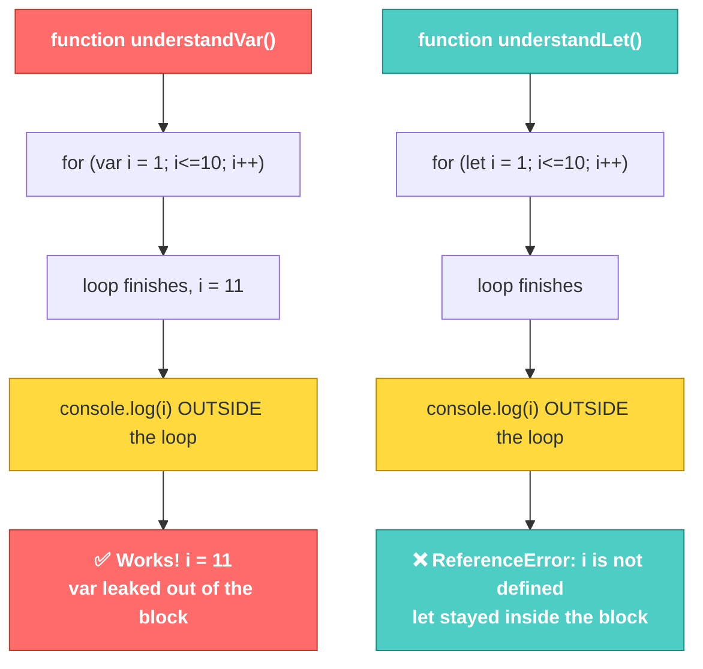

# JS-101 · File 1: Variables — `var`, `let`, `const`

Every value your program touches has to live somewhere. `var`, `let`, and `const` are three different sets of rules for how that "somewhere" behaves — when it can be reassigned, whether it can be redeclared, and where it's visible.

Source: `src/2-understanding-variables.js`

---

## 💡 The Concept

| Keyword | Reassignment | Redeclaration | Scope |
|---|---|---|---|
| `var` | ✅ Yes | ✅ Yes | Function-scoped (leaks out of blocks/loops) |
| `let` | ✅ Yes | ❌ No | Block-scoped |
| `const` | ❌ No | ❌ No | Block-scoped |

🔁 **ANALOGY:** Think of a shared office whiteboard (`var`) vs. a sticky note on your own desk (`let`) vs. a nameplate engraved into your desk (`const`). Anyone can walk up and rewrite the whiteboard from anywhere in the office — it doesn't respect room walls. A sticky note stays on your desk, in your room, but you can swap it for a new note anytime. A nameplate is fixed the moment it's engraved.

---

## 🎨 Diagram: Scope Leakage



⚠️ **GOTCHA — verified against the actual file:** running `src/2-understanding-variables.js` as-is throws a real error partway through:

```
2000
/2-understanding-variables.js:46
updatedCount=employeeCount+1000
            ^
ReferenceError: updatedCount is not defined
```

This isn't a typo in the teaching material — it's the actual behavior. `updatedCount` was never declared with `var`/`let`/`const`; it's an *implicit global*. In older non-strict JS this would silently create a global variable, but in an ES Module (which is what our Node project uses), implicit globals are disallowed — so it throws instead of silently polluting global scope. **This is a great real-world argument for why `const`/`let` and ES Modules exist**: they catch mistakes like this at the moment they happen instead of letting bad state creep in silently.

---

## ✅ TRY THIS — Hands-On Practice

In `src/2-understanding-variables.js` (or a scratch file), predict the output before running:

```javascript
const employeeCount = 2000;
console.log(employeeCount);

// Uncomment one line at a time and predict what happens:
// employeeCount = 3000;              // ?
// let updatedCount = employeeCount + 1000;
// console.log(updatedCount);          // ?
```

Run it with `node src/2-understanding-variables.js` and check your prediction against the real output.

---

## 🧪 Lab

1. Write a function `scopeTest()` that declares a `var` inside a `for` loop and logs its value both inside and after the loop.
2. Rewrite the same function using `let` instead, and confirm you get a `ReferenceError` when you try to log the loop variable outside the loop.
3. Declare a `const` object (not primitive) and try reassigning one of its *properties* (not the whole object). Predict whether this works before running it — then explain in one sentence why `const` still allowed it.

---

## 🚀 Challenge Task

Write a short function that intentionally triggers a `TypeError: Assignment to constant variable`. Then fix it using the *minimum* possible keyword change — no restructuring the logic, just change one declaration.

*No solution provided — bring your attempt to the next session.*