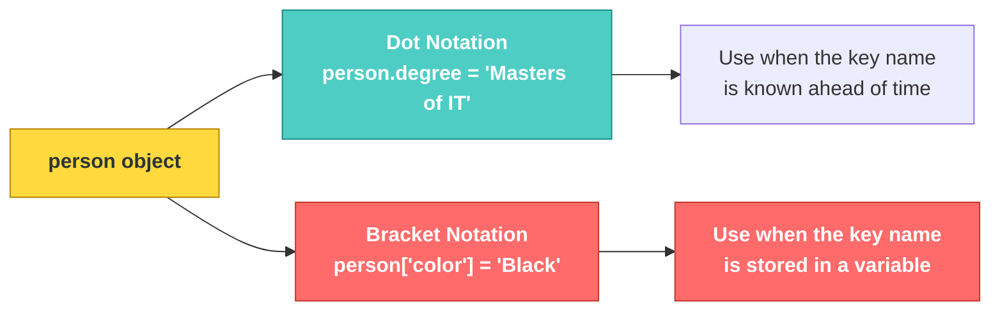

# JS-101 · File 2: Objects

Objects are how JavaScript groups related data and behavior together under one name — the foundation for everything from a single "customer" to the JSON your Flask API will send back later.

Source: `src/3-object.js`

---

## 💡 The Concept

An object is a collection of `key: value` pairs. Values can be strings, numbers, booleans, arrays, other objects, or even functions (called **methods** when they live inside an object).

```javascript
const person = {
    name: 'Zartab M Nakhwa',
    age: 34,
    blog: 'www.fsolutions.com',
    isMarried: true,
    letsCode() {
        console.log("Lets Start Coding")
    }
}
```

🔁 **ANALOGY:** An object is a filing folder with labeled tabs. `person.name` is you reaching straight for the tab labeled "name" — you don't rifle through the whole folder, you go directly to the label.

---

## 🎨 Diagram: Two Ways to Add a Property



⚠️ **GOTCHA:** Dot notation only works with a *literal, known-in-advance* key name. If the key name is stored in a variable (`let propertyName = "city"`), you **must** use bracket notation — `person[propertyName]`, not `person.propertyName` (that would look for a literal key called `"propertyName"`, which doesn't exist).

**Verified output** (from `node src/3-object.js`):
```
{
  name: 'Zartab M Nakhwa',
  age: 34,
  blog: 'www.fsolutions.com',
  isMarried: true,
  letsCode: [Function: letsCode],
  degree: 'Masters of IT',
  color: 'Black',
  city: 'Mumbai',
  techStack: [ 'JS', 'Java', 'Big Data', 'Cloud' ]
}
```

---

## ✅ TRY THIS — Hands-On Practice

```javascript
const x = {};
const countries = ["India", "Russia", "Sri Lanka"];
const capitals = ["New Delhi", "Moscow", "Colombo"];

let counter = 0;
for (let country of countries) {
    x[country] = capitals[counter];   // why bracket notation here?
    counter++;
}
console.log(x);
```

Before running: why would `x.country = capitals[counter]` **not** give the same result? Write your answer, then verify with `node`.

---

## 🧪 Lab

1. Build an object `employee` with at least 4 properties, one of which is a method (like `letsCode`).
2. Add two more properties dynamically using dot notation, and two more using bracket notation with variable key names.
3. Log the final object and check every key is present.

---

## 🚀 Challenge Task

You're given two arrays: `const keys = ["name", "role", "team"]` and `const values = ["Priya", "Backend Dev", "Platform"]`. Without hardcoding any key name, build a single object that pairs them up (`{name: "Priya", role: "Backend Dev", team: "Platform"}`) using a loop and bracket notation.

*No solution provided — bring your attempt to the next session.*