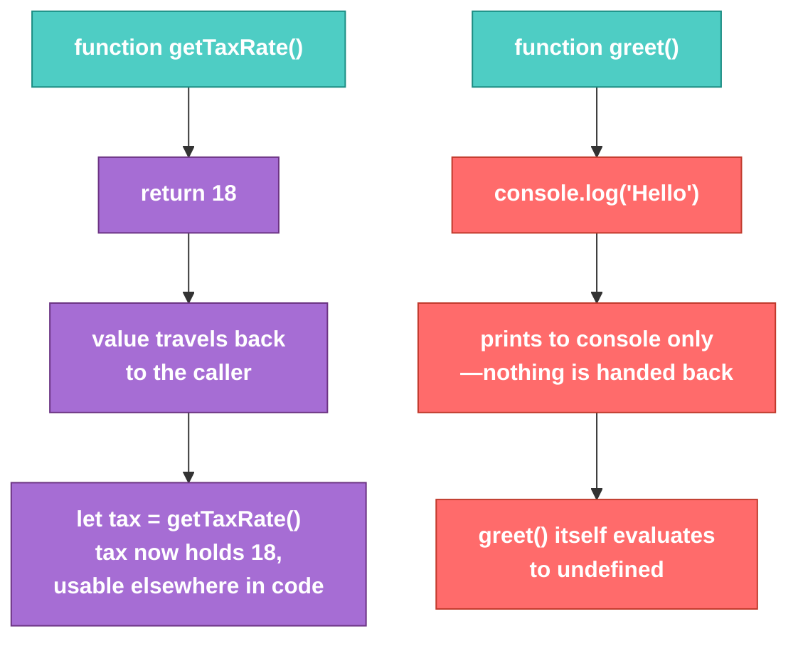

# JS-101 · File 3: Functions in JS

A function is a reusable block of instructions. JavaScript gives you two ways to create one — a **function declaration** and a **function expression** — and knowing the difference matters once we get to callbacks and promises.

Source: `src/4-functions-in-js.js`

---

## 💡 The Concept

```javascript
// Function Declaration
function greet(){
    console.log("Hello Eveyone")
}

// Function Expression — stored in a variable
let displayPi = function(){
    console.log("Value of PI is ", 3.142)
}

// A function that returns a value instead of just logging
function getTaxRate(){
    return 18;
}
let tax = getTaxRate()
```

🔁 **ANALOGY:** A function declaration is like a named recipe printed in a cookbook — you can flip to it from anywhere in the book (JS "hoists" declarations, making them available even before their line of code). A function expression is like a recipe card you wrote and handed to someone — it only exists once you've actually written it and handed it over (assigned it to a variable).

---

## 🎨 Diagram: `console.log` vs `return`



⚠️ **GOTCHA:** `console.log(...)` inside a function shows something on screen — it does **not** give the caller a usable value. If you write `let result = greet()`, `result` will be `undefined`, even though you *saw* "Hello Eveyone" printed. Printing and returning are two completely separate things.

**Verified output** (from `node src/4-functions-in-js.js`):
```
Hello Eveyone
Value of PI is  3.142
18
```

---

## ✅ TRY THIS — Hands-On Practice

```javascript
function double(n) {
    console.log(n * 2);   // prints, doesn't return
}

function tripleReturn(n) {
    return n * 3;          // returns, doesn't print
}

const a = double(5);         // what is `a`?
const b = tripleReturn(5);   // what is `b`?
console.log(a, b);
```

Predict the output of the last line before running it.

---

## 🧪 Lab

1. Write a function declaration `calculateDiscount(price, percent)` that **returns** the discounted price (don't `console.log` inside it).
2. Write a function *expression* `formatCurrency` stored in a `const`, that takes a number and returns a string like `"$45.00"`.
3. Chain them: call `calculateDiscount`, pass its result into `formatCurrency`, and log the final string.

---

## 🚀 Challenge Task

Convert `getTaxRate` so it accepts a `state` parameter (e.g., `"NY"`, `"CA"`) and returns a different tax rate per state using an internal lookup object — without using `if`/`else` at all.

*No solution provided — bring your attempt to the next session.*
