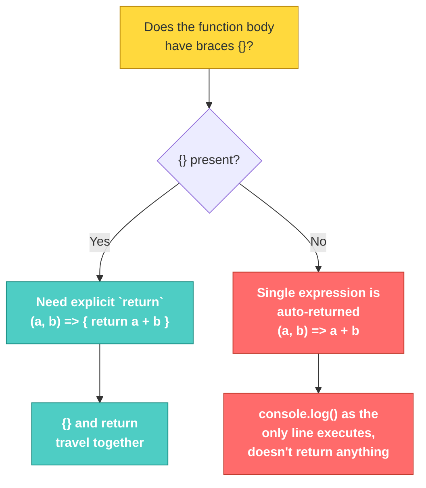

# JS-101 · File 4: Arrow Functions

Arrow functions (`=>`) are a shorter syntax for writing function expressions. They become the default style once we hit `.map()`, `.filter()`, promises, and `fetch` — so it's worth getting comfortable with all the shorthand rules now.

Source: `src/5-arrow-functions.js`

---

## 💡 The Concept — Three Levels of Shrinking

```javascript
// Level 0: full function expression
const myFirstArrow = () => {
    console.log("Welcome to Arrow Functions")
}

// Level 1: one parameter → parentheses become optional
number => {
    return number * number;
}

// Level 2: one statement that's a `return` → drop {} AND `return`
number => number * number
```

| Parameters | Parentheses required? |
|---|---|
| 0 params | `()` always required |
| 1 param | Optional — `number =>` or `(number) =>` both work |
| 2+ params | `()` always required — `(a, b) =>` |

🔁 **ANALOGY:** A full function is a formal letter — salutation, body, signature. An arrow function with `{}` and `return` is a memo. An arrow function with the implicit return (`number => number * number`) is a sticky note with just the answer scribbled on it — no formalities, just the result.

---

## 🎨 Diagram: Implicit vs Explicit Return



⚠️ **GOTCHA — verified against the actual file:** `src/5-arrow-functions.js` throws a real `SyntaxError` when run:

```
SyntaxError: Identifier 'addMe' has already been declared
```

Look at the file closely — `addMe` is declared **twice**:

```javascript
function addMe(a,b,c){
    return a+b+c;
}

const addMe = (a,b,c)=>a+b+c;   // ❌ 'addMe' already exists as a function
```

You cannot declare the same identifier twice in the same scope with `function` + `const`. This is exactly the kind of bug `let`/`const` are designed to catch — under `var`-style rules this silent redeclaration would have been allowed, which hides bugs.

Also note: lines like `(number) => { return number*number; }` sitting on their own with no `const` in front are **valid syntax but useless** — the function is created and immediately discarded, since nothing stores a reference to it.

---

## ✅ TRY THIS — Hands-On Practice

Rewrite each of these as an arrow function, applying maximum shorthand where valid:

```javascript
function isEven(n) { return n % 2 === 0; }

function fullName(first, last) {
    return first + " " + last;
}

function logMessage(msg) {
    console.log(msg);
}
```

---

## 🧪 Lab

1. Fix the duplicate `addMe` bug in `src/5-arrow-functions.js` by removing one version, then run the file and verify it completes without error.
2. Rewrite `calculation(x, y, z)` from the same file as a one-line implicit-return arrow function where possible — if it's not possible in one line, explain why (hint: multiple statements).
3. Write an arrow function `isAdult` that takes an `age` and implicitly returns `true`/`false`.

---

## 🚀 Challenge Task

Take the `transformToComponent` pattern you'll see in the Map module and write it as a single-parameter, implicit-return arrow function using a template literal — no `{}`, no `return` keyword.

*No solution provided — bring your attempt to the next session.*
