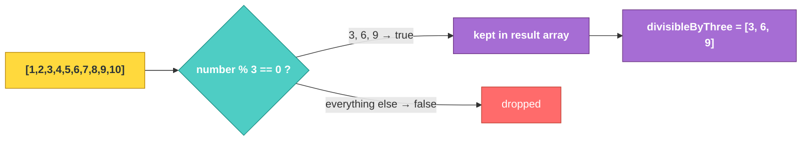

# JS-101 · File 5: Higher-Order Functions & `.filter()`

A **higher-order function** is any function that takes another function as an input, or returns one as output. `Array.filter()` is your first example — it accepts a function that decides, item by item, what stays.

Source: `src/6-higher-order-functions.js`

---

## 💡 The Concept: Manual Loop vs `.filter()`

```javascript
// The manual way
const evenNumbers = []
for (let index = 0; index <= numbers.length; index++) {
    const number = numbers[index]
    if (number % 2 == 0) {
        evenNumbers.push(number)
    }
}

// The higher-order way
function filterOdd(number) {
    return number % 2 == 1
}
const oddNumbers = numbers.filter(filterOdd)

// Or inline with an arrow function
const divisibleByThree = numbers.filter((number) => number % 3 == 0)
```

🔁 **ANALOGY:** `.filter()` is a bouncer at a club door holding a rulebook (your function). Every person (array item) walks up, the bouncer checks them against the rule, and only the ones who pass get let inside. You never have to stand at the door yourself counting people — you just write the rule.

---

## 🎨 Diagram: How `.filter()` Processes an Array



⚠️ **GOTCHA — verified against the actual file:** the manual loop has an off-by-one bug:

```javascript
for(let index=0; index<=numbers.length; index++){   // ❌ should be <, not <=
```

With `numbers.length === 10`, this loop runs `index` from `0` to `10` inclusive — **11 iterations** on a 10-item array. On the final iteration, `numbers[10]` is `undefined`. `undefined % 2` evaluates to `NaN`, and `NaN == 0` is `false`, so nothing crashes and nothing incorrect gets pushed — but it's silently doing one wasted, meaningless iteration. This class of bug (`<=` instead of `<` against `.length`) is one of the most common real-world sources of off-by-one errors, and it's exactly the kind of thing `.filter()` eliminates entirely, since it never asks you to manage an index at all.

**Verified output** (from `node src/6-higher-order-functions.js`):
```
Original: [ 1, 2, 3, 4, 5, 6, 7, 8, 9, 10 ]
Even Numbers: [ 2, 4, 6, 8, 10 ]
Odd Numbers: [ 1, 3, 5, 7, 9 ]
Three: [ 3, 6, 9 ]
```

---

## ✅ TRY THIS — Hands-On Practice

```javascript
const words = ["cat", "elephant", "dog", "hippopotamus", "ox"];

// Filter words longer than 3 characters
const longWords = words.filter(word => word.length > 3);
console.log(longWords);
```

Predict the result before running.

---

## 🧪 Lab

1. Fix the off-by-one bug in the manual loop version in `src/6-higher-order-functions.js`.
2. Given `const ages = [12, 17, 18, 25, 16, 40]`, use `.filter()` to get only the adults (18+).
3. Given the `users` array from the Map module (`id`, `name`, `dept`), use `.filter()` to get only users in the `"IT"` department.

---

## 🚀 Challenge Task

Write a single `.filter()` call that returns numbers from `numbers` that are divisible by **both** 2 and 3 (i.e., divisible by 6) — without writing a named helper function, using only an inline arrow function.

*No solution provided — bring your attempt to the next session.*
