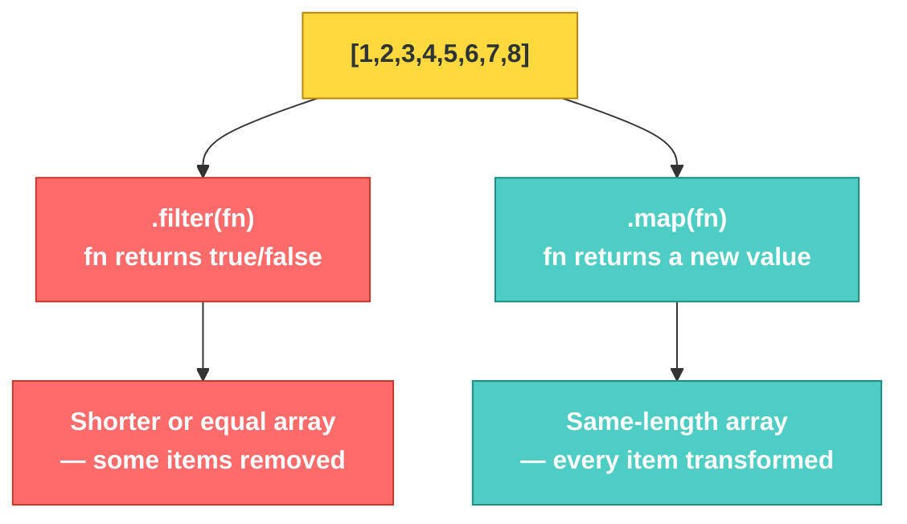

# JS-101 · File 6: `.map()`

Where `.filter()` decides what **stays**, `.map()` decides what each item **transforms into**. Every input produces exactly one output — same length in, same length out. This is the exact pattern you'll use later to turn API data into HTML rows.

Source: `src/7-map-function-array.js`

---

## 💡 The Concept

```javascript
function doubleTheNumber(number) {
    return number * 2
}
const doubled = numbers.map(doubleTheNumber)

// Turning objects into HTML strings — this is the pattern
// you'll reuse when rendering the customer table from data
function transformToComponent(user) {
    return `<div>
    <h1>${user.name}</h1>
    <h2>${user.dept}</h2>
    <p>${user.id}</p>
</div>`
}
const components = users.map(transformToComponent)
```

🔁 **ANALOGY:** `.map()` is a photocopier with a stamp attachment — every page (item) that goes in comes back out the other side, same count, but stamped/transformed according to whatever you configured the stamp to do. Nothing is added or removed, only changed.

---

## 🎨 Diagram: `.filter()` vs `.map()` — Same Shape, Different Job



⚠️ **GOTCHA:** `.map()` **always** returns an array the same length as the original — even if your transform function does nothing meaningful to some items. If you're trying to *remove* items, you want `.filter()`, not `.map()`. Mixing these up is one of the most common early mistakes.

**Verified output** (from `node src/7-map-function-array.js`):
```
Original: [ 1, 2, 3, 4, 5, 6, 7, 8 ]
Doubled: [ 2, 4, 6, 8, 10, 12, 14, 16 ]
Sqaured: [ 1, 4, 9, 16, 25, 36, 49, 64 ]
```
The `users.map(transformToComponent)` call produces an array of 4 HTML strings — one `<div>...</div>` block per user, each stamped with that user's `name`, `dept`, and `id`.

---

## ✅ TRY THIS — Hands-On Practice

```javascript
const prices = [10, 25, 40, 15];

// Add 10% tax to every price using .map() and an arrow function
const withTax = prices.map(price => price * 1.10);
console.log(withTax);
```

---

## 🧪 Lab

1. Given `const temps = [0, 15, 30, 100]` (Celsius), use `.map()` to convert every value to Fahrenheit (`F = C * 9/5 + 32`).
2. Given the `users` array (`id`, `name`, `dept`), use `.map()` to produce an array of just the names (`["Tom", "Mariam", "Elizabeth", "Leanord"]`).
3. Chain `.filter()` then `.map()`: from `users`, get only IT department users, then transform each into a string `"Tom (IT)"`.

---

## 🚀 Challenge Task

Using the customer data shape from the Customer Management page you're building later (`id, name, email, phone, dob, joinDate, branch, balance`), write a `.map()` call that transforms an array of customer objects into an array of `<tr>...</tr>` HTML strings — this is a direct preview of the DOM rendering module coming up in Track 4.

*No solution provided — bring your attempt to the next session.*
