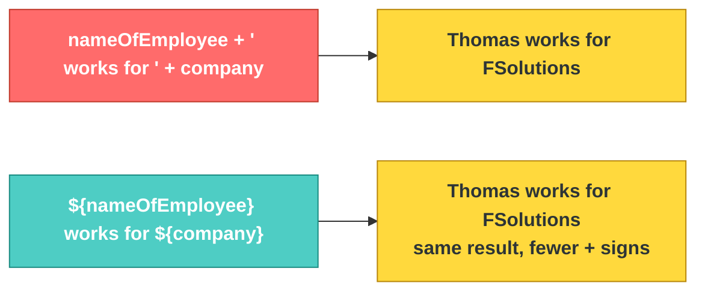

# JS-101 · File 7: Strings & Template Literals

JavaScript gives you three ways to write a string, but only one of them lets you embed variables directly inside the text — and that's the one you'll use constantly once you're building UI from data.

Source: `src/8-strings.js`

---

## 💡 The Concept

```javascript
const name = "Thomas"
const city = "London"

// Old way — string concatenation
const sentence = name + " lives in " + city

// Template literal — backticks, not quotes
const paragraph = ` can span
multiple lines
without any special characters`

// Interpolation — inject variables directly with ${}
const iLine = `${nameOfEmployee} works for ${company} and his employee code is ${employeeCode}`
```

| Syntax | Can interpolate variables? | Can span multiple lines? |
|---|---|---|
| `"double quotes"` | ❌ No | ❌ No |
| `'single quotes'` | ❌ No | ❌ No |
| `` `backticks` `` | ✅ Yes, with `${}` | ✅ Yes |

🔁 **ANALOGY:** Concatenation with `+` is stapling separate index cards together to form a sentence — functional, but fiddly and error-prone with spacing. Template literals are a fill-in-the-blank form letter — you write the whole sentence once, and `${}` marks the blanks that get filled automatically.

---

## 🎨 Diagram: Concatenation vs Interpolation



⚠️ **GOTCHA:** Interpolation only works inside **backticks**. `"${name}"` with double quotes will literally print the characters `${name}` — the browser/Node has no idea you meant it as a variable. This trips up almost everyone the first time they switch quote styles out of habit.

**Verified output** (from `node src/8-strings.js`):
```
Thomas lives in London
Thomas works for FSolutions and his employee code is FSOL0001
Thomas works for FSolutions and his employee code is FSOL0001
```
Note the last two lines are identical — one built with `+` concatenation, one with template literal interpolation. Same result, different readability.

---

## ✅ TRY THIS — Hands-On Practice

```javascript
const product = "Laptop";
const price = 999.99;
const inStock = true;

// Rewrite this concatenation as a template literal:
const summary = product + " costs $" + price + " and is " + (inStock ? "in stock" : "out of stock");
```

---

## 🧪 Lab

1. Given `firstName`, `lastName`, and `role` variables, build a greeting string `"Welcome, Jane Doe (Admin)!"` using template literals only — no `+`.
2. Write a template literal that spans 3 lines describing a customer record (name, email, branch), pulling all values from variables.
3. Take one line of concatenation from `src/8-strings.js` and rewrite it as a template literal, then verify with `node` that both produce identical output.

---

## 🚀 Challenge Task

Given a customer object `{ name: "Sara Kovacs", balance: 1980.50 }`, write a template literal that formats the balance to exactly 2 decimal places using `.toFixed(2)` inside the `${}` expression — e.g. `"Sara Kovacs's balance is $1980.50"`.

*No solution provided — bring your attempt to the next session.*
