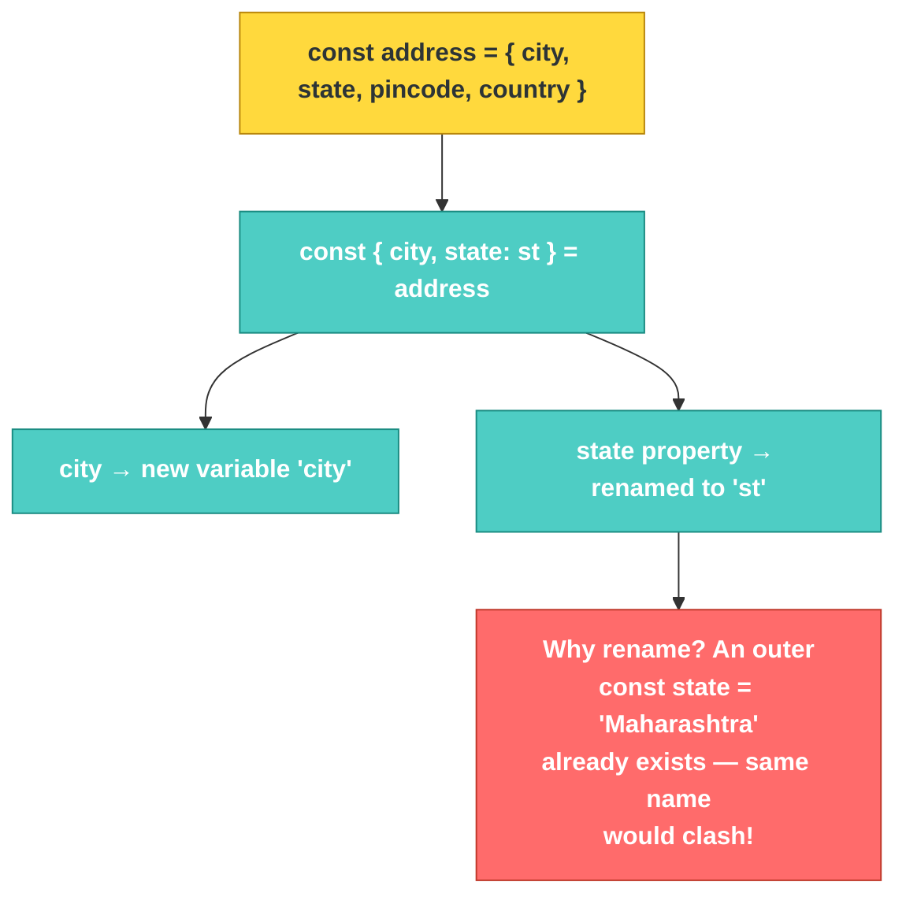

# JS-101 · File 8: Object Destructuring

Destructuring lets you pull specific properties out of an object into their own variables in one line — instead of writing `object.property` repeatedly. It's especially powerful in function parameters, which is where you'll use it most.

Source: `src/9-object-destructuring.js`

---

## 💡 The Concept

```javascript
const address = {
    city: 'Mumbai', state: 'MH', pincode: 400001, country: 'India'
}

// Traditional way (verbose)
// const city = address.city
// const state = address.state

// Destructuring — same result, one line
const { city, state: st } = address   // renaming state -> st to avoid clashing with outer `state`
const { country, pincode } = address
```

### The real power: destructuring function parameters

```javascript
// Before — must reference address.x every time
function displayAddress(address) {
    console.log(address.city)
    console.log(address.state)
}

// After — destructure right in the parameter list
function displayAddressWithDestructuredObject({ state, city, pincode, country }) {
    console.log(city)
    console.log(state)
}
```

🔁 **ANALOGY:** An object is a delivery box with labeled compartments. Destructuring is reaching in and pulling out only the compartments you actually need, labeling them as you go — instead of carrying the whole box around and reaching in every single time you need something.

---

## 🎨 Diagram: Renaming During Destructuring



⚠️ **GOTCHA:** Destructuring `{ state } = address` when a variable called `state` **already exists in scope** either throws a redeclaration error (with `const`/`let`) or silently shadows it — confusing either way. The `state: st` syntax renames the pulled-out value to sidestep the clash entirely: `{ state: st }` means *"take the `state` property, but call it `st` here."*

**Verified output** (from `node src/9-object-destructuring.js`):
```
Mumbai -- MH -- Maharashtra -- India -- 400001
Mumbai
MH
India
400001
Mumbai
MH
India
400001
```
Notice `MH` (from `st`, the renamed destructured value) and `Maharashtra` (from the separate outer `state` variable) print side by side — proof the rename avoided a real naming collision.

---

## ✅ TRY THIS — Hands-On Practice

```javascript
const product = { title: "Keyboard", price: 49.99, category: "Electronics", inStock: true };

// Destructure title and price only
const { title, price } = product;
console.log(title, price);

// Now write a function `showProduct` that takes the whole product object
// destructured directly in its parameter list, and logs title and price.
```

---

## 🧪 Lab

1. Destructure `{ city, state, pincode, country }` from `address` in one line (no renaming needed this time, since there's no clash).
2. Write a function that accepts a destructured customer object `{ name, email, branch }` and logs a one-line summary.
3. Destructure a **nested** object: given `const order = { id: 1, customer: { name: "Tom", email: "tom@x.com" } }`, pull out `name` and `email` directly (hint: `const { customer: { name, email } } = order`).

---

## 🚀 Challenge Task

Write a function `formatCustomerRow({ name, email, branch, balance })` that returns a template literal string formatted like a table row: `"Tom | tom@x.com | Budapest | $4250.00"` — using destructuring in the parameter list and template literal interpolation together.

*No solution provided — bring your attempt to the next session.*
