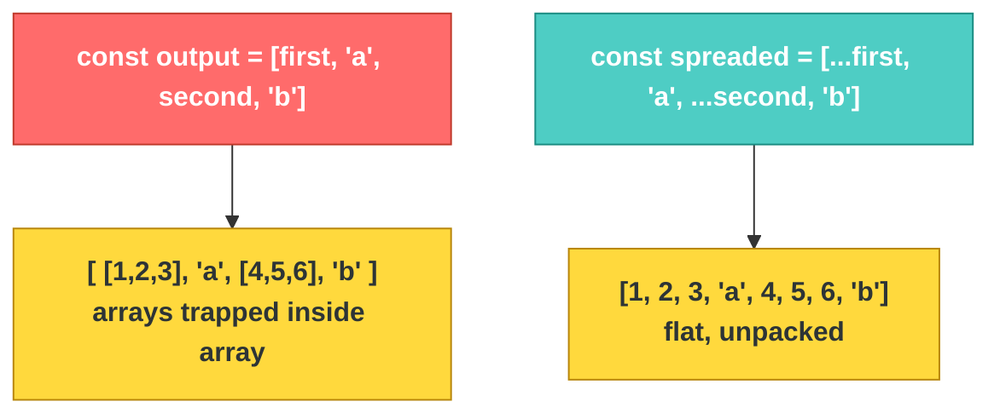

# JS-101 · File 9: The Spread Operator (`...`)

The spread operator "unpacks" the contents of an array or object in place. It's the cleanest way to combine data without mutating the original — which becomes critical once state management and API responses enter the picture.

Source: `src/10-spread-operator.js`

---

## 💡 The Concept

```javascript
const first = [1,2,3]
const second = [4,5,6]

// Combining with .concat()
const combined1 = first.concat(second)   // [1,2,3,4,5,6]

// Combining with spread — same result, more flexible
const spreaded = [...first, 'a', ...second, 'b']  // [1,2,3,'a',4,5,6,'b']

// Spread with objects — merging
const personal = { name:'Tom', age:25, gender:'M' }
const professional = { company:'FSolutions', dept:'IT', position:'Developer' }
const details = { ...personal, ...professional, country: "India" }
```

🔁 **ANALOGY:** Without spread, `[first, second]` is like putting two sealed boxes inside a bigger box — the contents are still trapped in their own containers (`[[1,2,3],[4,5,6]]`). Spread (`[...first, ...second]`) is opening both boxes and pouring their contents directly into the new box — one flat, unpacked collection (`[1,2,3,4,5,6]`).

---

## 🎨 Diagram: Spread vs. Nesting



⚠️ **GOTCHA — verified against the actual file:** `.sort()` **mutates the original array in place** — it doesn't return a new sorted copy, it changes and returns the same array. This is exactly why the file's "Problem Statement" comment exists:

```javascript
// Problem: calling grades.sort() changes `grades` itself permanently
const grades = ["A","B","D","C"]
const sorted = grades.sort()
console.log("After Sorting, Original is :", grades)  // grades is now sorted too — surprise!
```

The fix demonstrated in the file uses spread to sort a **copy**, leaving the original untouched:

```javascript
const sorted = [...grades, 'Z', 'X', 'Y'].sort()
```

`[...grades, 'Z', 'X', 'Y']` creates a brand-new array first — `.sort()` then mutates *that* new array, and `grades` is never touched.

**Verified output** (from `node src/10-spread-operator.js`):
```
Grades: [ 'A', 'B', 'D', 'C' ]
Sorted: [ 'A', 'B', 'C', 'D', 'X', 'Y', 'Z' ]
After Sorting, Original is : [ 'A', 'B', 'D', 'C' ]
```
`grades` stayed exactly as it started — proof the spread-copy pattern protected the original.

---

## ✅ TRY THIS — Hands-On Practice

```javascript
const settings = { theme: "dark", fontSize: 14 };
const userOverrides = { fontSize: 18 };

// Merge so userOverrides wins on conflicts (later spread wins)
const finalSettings = { ...settings, ...userOverrides };
console.log(finalSettings);   // { theme: "dark", fontSize: 18 }
```

Predict what happens if you reverse the order: `{ ...userOverrides, ...settings }`.

---

## 🧪 Lab

1. Given two arrays of customer branches, combine them into one flat array without duplicates using spread + `Set`: `[...new Set([...arr1, ...arr2])]`.
2. Given a `customer` object, create an **updated copy** with one field changed, without mutating the original: `const updated = { ...customer, balance: 5000 }`.
3. Reproduce the `.sort()` mutation bug on purpose, observe it, then fix it using the spread-copy pattern — confirm the original array is untouched afterward.

---

## 🚀 Challenge Task

Write a function `addCustomer(customerList, newCustomer)` that returns a **new array** with `newCustomer` appended, without ever mutating `customerList` — this exact non-mutating pattern is what you'll use later when adding rows to the Customer Management table via the Flask API.

*No solution provided — bring your attempt to the next session.*
