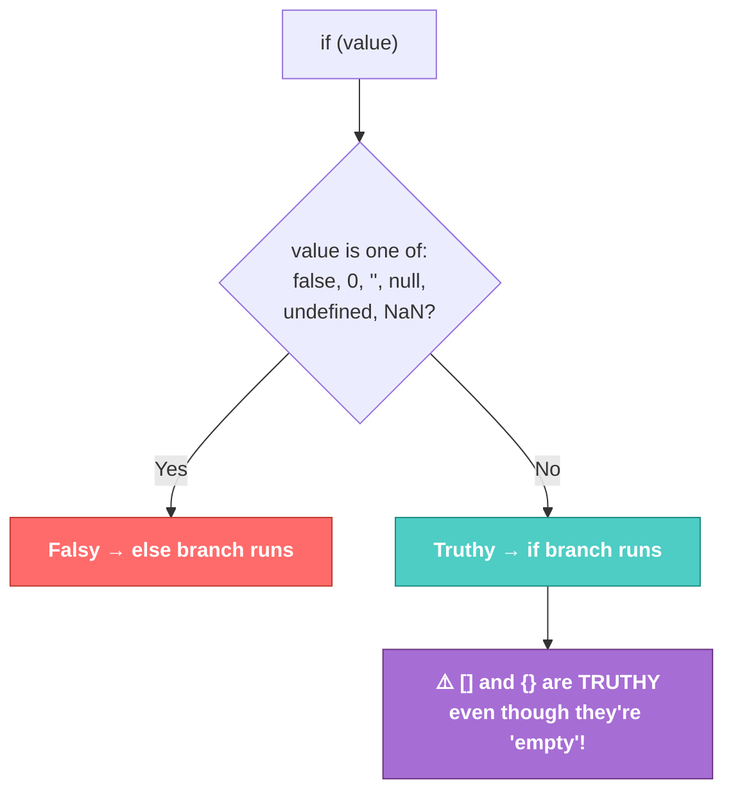

# JS-101 · File 10: Truthy & Falsy

Every value in JavaScript, not just `true`/`false`, behaves like a boolean when tested in an `if` condition. Knowing exactly which values act "falsy" is essential once you're checking API responses for empty data.

Source: `src/11-truthy-and-falsy.js`

---

## 💡 The Concept — The Complete Falsy List

There are only **7 falsy values** in all of JavaScript. Everything else is truthy.

```javascript
false        // boolean false
0            // the number zero
""           // empty string ('' or "")
null
undefined
NaN          // Not a Number
0n           // BigInt zero (not covered in the source file, but part of the full list)
```

🔁 **ANALOGY:** Think of `if (value)` as a bouncer checking if someone has "something" vs "nothing" — not checking *what* they have, just whether the pocket is empty. An empty string, a zero, a missing value — the bouncer treats all of those as "nothing there," regardless of type.

---

## 🎨 Diagram: The Truthy/Falsy Decision



⚠️ **GOTCHA — verified against the actual file:** an **empty array `[]`** and an **empty object `{}`** are both **truthy**, not falsy — this surprises almost everyone at first, because they *feel* empty.

**Verified output** (from `node src/11-truthy-and-falsy.js`):
```
Falsy     ← 0
Truthy    ← 100
Falsy     ← ''
Truthy    ← 'a'
Truthy    ← []   (empty array — still truthy!)
Falsy     ← false
Truthy    ← {}   (empty object — still truthy!)
```

If you want to check whether an array is actually empty, you must check its `.length` explicitly (`if (numbers.length)`), not just `if (numbers)`.

---

## 🌐 Why This Matters for API Data

The source file includes a comment previewing exactly where you'll use this:

```javascript
// const data = null --> will be populated in backend -- API will be called and data will be filled
// if(data){
//     display table
// }else{
//     display a loader
// }
```

This is the *exact* pattern you'll write once `fetch` calls to Flask come in: before data arrives, a variable might be `null` or `undefined` (falsy) — perfect for showing a loading spinner. Once real data lands, the same `if` condition becomes truthy and swaps to showing the table.

---

## ✅ TRY THIS — Hands-On Practice

```javascript
function checkValue(val) {
    if (val) {
        console.log("Truthy:", val);
    } else {
        console.log("Falsy:", val);
    }
}

checkValue(NaN);
checkValue("0");     // note: this is a STRING containing "0", not the number 0
checkValue([]);
checkValue(undefined);
```

Predict each result — the `"0"` string one is the trickiest.

---

## 🧪 Lab

1. Write a function `hasData(value)` that returns `true`/`false` using truthy/falsy logic, correctly handling `null`, `undefined`, and empty string as "no data."
2. Fix the empty-array/object trap: write a function `isEmptyCollection(value)` that correctly identifies `[]` and `{}` as empty (hint: check `.length` for arrays, `Object.keys(value).length` for objects).
3. Simulate the API loading pattern from the source file: write a function that takes `data` (which could be `null` or an array of customers) and logs `"Loading..."` or `"Showing X customers"` accordingly.

---

## 🚀 Challenge Task

Write a single function `describeValue(value)` that correctly distinguishes between all 7 falsy values by name (e.g., input `NaN` logs `"This is NaN"`, input `0` logs `"This is zero"`) — you'll need more than a simple truthy check for this, since falsy values are all falsy but not identical.

*No solution provided — bring your attempt to the next session.*
