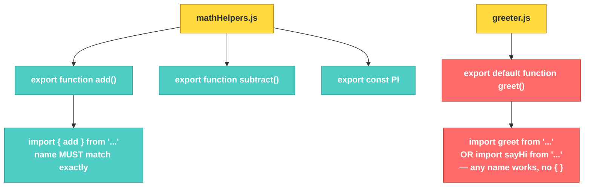

# JS-101 · File 11: `import` / `export` (Named & Default)

Every file you've written so far has lived on its own. Real projects split code across many files — modules — and `import`/`export` is how those files share code with each other. This is also the exact syntax you'll reuse in the browser once your Customer Management page splits into separate JS files.

Source: `src/12-import-export.js`, `src/modules/mathHelpers.js`, `src/modules/greeter.js`

---

## 💡 The Concept — Two Kinds of Export

There are **two separate export styles**, and they behave differently on import.

### 1. Named exports — as many as you want per file

```javascript
// modules/mathHelpers.js
export function add(a, b) {
    return a + b;
}
export function subtract(a, b) {
    return a - b;
}
export const PI = 3.14159;
```

```javascript
// importing — names must match exactly, wrapped in { }
import { add, subtract, PI } from './modules/mathHelpers.js';
```

### 2. Default export — only ONE per file

```javascript
// modules/greeter.js
export default function greet(name) {
    return `Hello, ${name}! Welcome to FSolutions training.`;
}
```

```javascript
// importing — you choose ANY name, no { } needed
import greet from './modules/greeter.js';
import sayHi from './modules/greeter.js';  // this would ALSO work — same function, different local name
```

🔁 **ANALOGY:** Named exports are a shared toolbox with labeled compartments — "hammer," "wrench," "PI" — and when you borrow one, you must ask for it by its exact label (or explicitly relabel it with `as`). A default export is a single, unlabeled gift box — there's only one thing in it, so you're free to call it whatever you want when you take it out.

---

## 🎨 Diagram: Named vs. Default Import



⚠️ **GOTCHA:** Forgetting the curly braces `{}` on a named import (`import add from './mathHelpers.js'`) will not throw an error — it will silently import `undefined`, because JavaScript assumes you meant the default export, and this file doesn't have one. Calling `add(2,3)` in that case throws `TypeError: add is not a function`. Always match `{}` to named exports, and no `{}` to default exports.

**Verified output** (from `node src/12-import-export.js`):
```
8
6
3.14159
Hello, Zartab! Welcome to FSolutions training.
4
```
The last line (`4`) comes from `import { add as sum }` — renaming a named import with the `as` keyword, useful when two modules export something with the same name.

---

## 🌐 Why This Matters Going Forward

Once your project moves to the browser, this exact syntax works with `<script type="module" src="app.js"></script>` — no bundler needed for local files. You'll likely end up with something like:

```javascript
// api.js
export async function fetchCustomers() { ... }
export async function saveCustomer(customer) { ... }

// app.js
import { fetchCustomers, saveCustomer } from './api.js';
```

This is exactly the shape you'll use in Track 4 to keep your fetch/API logic separate from your DOM-rendering logic.

---

## ✅ TRY THIS — Hands-On Practice

```javascript
// stringHelpers.js
export function capitalize(str) {
    return str.charAt(0).toUpperCase() + str.slice(1);
}
export default function reverse(str) {
    return str.split('').reverse().join('');
}
```

Write the two import lines needed to use both `capitalize` and the default `reverse` function in another file — remember, they need different import syntax.

---

## 🧪 Lab

1. Create a module `validators.js` with two named exports: `isValidEmail(str)` and `isValidPhone(str)` (simple regex or `.includes()` checks are fine).
2. Create a module `formatters.js` with **one default export**: a function that formats a currency value like `$1,234.56`.
3. In a third file, import all three functions (2 named + 1 default) and use them together on a sample customer object.

---

## 🚀 Challenge Task

Split the `customer-form` validation logic you'll build in Track 4 into two modules ahead of time: `validators.js` (named exports for each field check — name, email, phone) and `customerApi.js` (default export: a single function that bundles a "save customer" fetch call). Import both into a `main.js` and wire up a mock form submit that calls the validators, then logs whether it *would* proceed to the API call.

*No solution provided — bring your attempt to the next session.*
