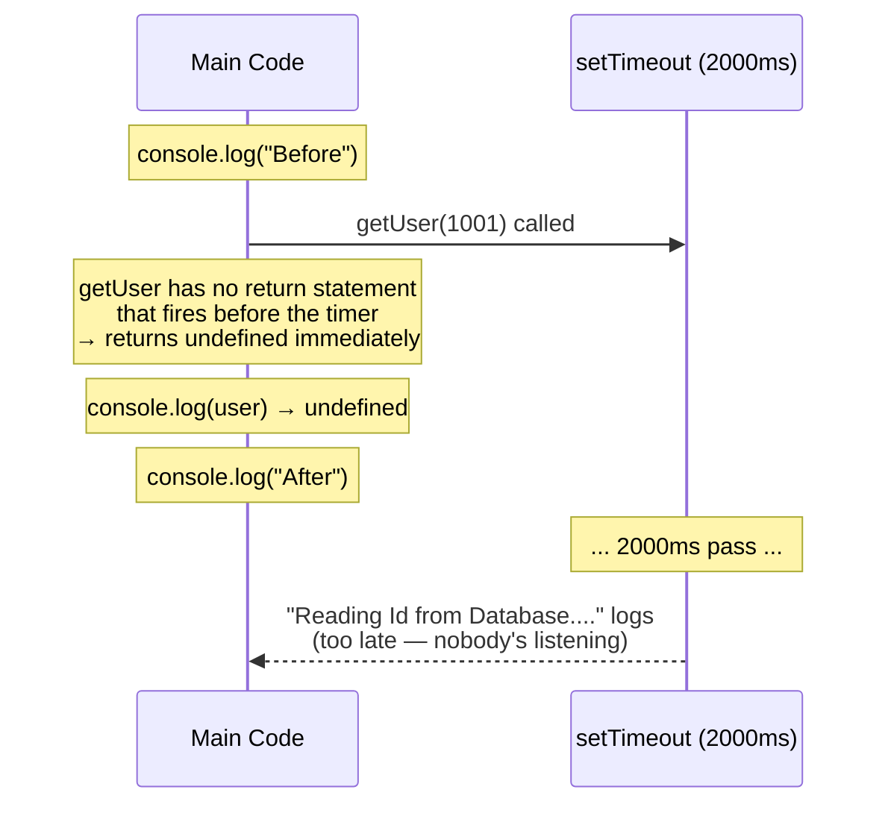

# Promises/Async · File 1: The Async Problem

Everything you've written so far runs top-to-bottom, instantly. Real apps have to wait — for a database, for a network request, for a file to load. This file is where JavaScript's biggest gotcha shows up for the first time: **code that takes time doesn't just pause and wait for you.**

Source: `src/P0-async-problem.js`

---

## 💡 The Concept

```javascript
console.log("Before")

const user = getUser(1001)
console.log(user)

console.log("After")

function getUser(id) {
    setTimeout(() => {
        console.log("Reading Id from Database ....")
        return { id: id, gitUser: 'fsolutions' }
    }, 2000)
}
```

`setTimeout(callbackFn, delayMs)` tells JavaScript "run this function later, after at least `delayMs` milliseconds — but don't wait around for it now, keep going." That last part is the whole problem: `getUser` doesn't wait for its own `setTimeout` to finish before it returns.

🔁 **ANALOGY:** Calling `getUser(1001)` is like dropping a letter in a mailbox and asking someone "can you check the mailbox and read me what's inside?" — then immediately turning around and asking "so, what did it say?" before they've even walked to the mailbox. The mail (the database read) hasn't arrived yet; the person can't answer a question about content that doesn't exist yet.

---

## 🎨 Diagram: Why `console.log(user)` Prints `undefined`



⚠️ **GOTCHA — verified against the actual file:** `getUser` has **no `return` statement of its own** — the `return {id, gitUser}` inside the `setTimeout` callback returns a value to the *timer's* internal caller, not to whoever called `getUser`. `getUser` itself finishes instantly (having done nothing but schedule the timer) and returns `undefined` by default.

**Verified output** (from `node src/P0-async-problem.js`):
```
Before
undefined
After
Reading Id from Database ....
```

Notice the exact order: `"Before"` → `undefined` → `"After"` → *then, two seconds later* → `"Reading Id from Database...."`. The `console.log(user)` line runs and prints `undefined` **before** the database read even happens. This is the core problem every async pattern from here on exists to solve.

---

## ✅ TRY THIS — Hands-On Practice

```javascript
function delayedGreeting(name) {
    setTimeout(() => {
        console.log(`Hello, ${name}!`);
    }, 1000);
}

console.log("Start");
delayedGreeting("Priya");
console.log("End");
```

Before running: write down the exact order you expect these three lines to print. Then run it and check.

---

## 🧪 Lab

1. Modify `delayedGreeting` to accept a `delay` parameter instead of a hardcoded `1000`, and call it three times with different delays (500, 1500, 3000). Predict the print order before running.
2. Write a function `fakeApiCall(endpoint)` that logs `"Calling ${endpoint}..."` immediately, then after 2 seconds logs `"${endpoint} responded"`. Notice you have no way, yet, to get a *return value* out of it — that's the exact gap the next three files close.
3. In your own words (2–3 sentences), explain to a teammate why `const user = getUser(1001)` doesn't work the way it looks like it should.

---

## 🚀 Challenge Task

Without changing `setTimeout` or introducing Promises/callbacks yet, try to "fix" `getUser` so `console.log(user)` prints the real user object instead of `undefined`. (Spoiler: you can't, cleanly — that's the point. Write down what you tried and why it failed; we'll solve it properly in the next file.)

*No solution provided — bring your attempt to the next session.*
