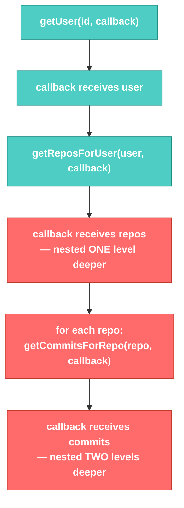

# Promises/Async · File 2: Callbacks (and Callback Hell)

The first real solution to the async problem: instead of *waiting* for a return value, you *hand over a function* to be called once the result is ready. That function is the **callback**.

Source: `src/P1-callback-solution.js`, `src/P2-callback-solution-with-arrow.js`

---

## 💡 The Concept

```javascript
function getUser(id, callback) {
    setTimeout(() => {
        console.log("Reading Id from Database ....")
        const user = { id: id, userid: 'fsolutions' }
        callback(user)   // hand the result to whoever asked, when it's ready
    }, 2000)
}

getUser(1001, callbackFunctionForUser)

function callbackFunctionForUser(user) {
    console.log(user)
    getReposForUser(user, callbackFunctionForRepos)
}
```

Instead of `getUser` trying (and failing) to `return` a value immediately, it accepts a **second parameter** — a function — and calls it *later*, once the real data exists.

🔁 **ANALOGY:** Instead of standing at the counter demanding your coffee right now, you give the barista your name (the callback) and go sit down. When it's ready, they call your name and hand it over. You didn't wait doing nothing — you handed off "what to do when it's ready" and walked away.

---

## 🎨 Diagram: Callback Hell — Nesting Deepens With Each Step



Each new async step nests **inside** the previous callback — this pyramid shape, growing rightward with every step, is exactly what earned the nickname "callback hell" (or the "pyramid of doom").

⚠️ **GOTCHA — verified against the actual file:** watch the order of the `repo1`/`repo2`/`repo3` log lines vs. their commit counts:

```
repo1
repo2
repo3
Connecting to github.com [ repo1 ]...
No of commits are  15
Connecting to github.com [ repo2 ]...
No of commits are  15
Connecting to github.com [ repo3 ]...
No of commits are  15
```

The `for` loop fires all three `getCommitsForRepo` calls almost instantly — each one starts its own independent 3-second timer *at roughly the same moment*. That's why all three `repo1/repo2/repo3` labels print immediately, and only afterward do the (near-simultaneous) commit results trickle in. The loop does **not** wait for one repo's commits before starting the next repo's request — callbacks give you no built-in way to say "do these one at a time, in order."

**Verified full output** (from `node src/P1-callback-solution.js`, ~8 seconds total):
```
Before
After
Reading Id from Database ....
{ id: 1001, userid: 'fsolutions' }
Connecting to github.com [ fsolutions ]...
repo1
repo2
repo3
Connecting to github.com [ repo1 ]...
No of commits are  15
Connecting to github.com [ repo2 ]...
No of commits are  15
Connecting to github.com [ repo3 ]...
No of commits are  15
```
Note `"Before"` then `"After"` print immediately — same lesson as File 1 — and everything async trickles in afterward. `P2-callback-solution-with-arrow.js` is the exact same logic, just with arrow functions instead of named functions passed as callbacks — verified to produce identical output.

---

## 🌐 What's Wrong With Callbacks?

1. **Nesting grows with every async step** — 5 sequential API calls means 5 levels of indentation.
2. **No built-in error handling path** — if something fails partway through, you have to manually check and propagate errors at every level yourself.
3. **Hard to run things in a guaranteed order** when a loop is involved (as seen above).

These three pain points are exactly what **Promises** (next file) were designed to fix.

---

## ✅ TRY THIS — Hands-On Practice

```javascript
function fetchStep1(callback) {
    setTimeout(() => callback("Step 1 done"), 1000);
}
function fetchStep2(input, callback) {
    setTimeout(() => callback(input + " → Step 2 done"), 1000);
}

fetchStep1((result1) => {
    console.log(result1);
    fetchStep2(result1, (result2) => {
        console.log(result2);
    });
});
```

Predict the print order and timing before running.

---

## 🧪 Lab

1. Write a 2-level callback chain: `getBranch(callback)` → returns a branch name after 1s → `getBranchManager(branch, callback)` → returns a manager name after 1s. Log both results in order.
2. Take the `getCommitsForRepo` loop bug from this file and describe (in writing, no code needed) how you'd force the three repos to be processed **one at a time**, in order, using only callbacks. (It's awkward — that's intentional, to feel the pain before Promises fix it.)
3. Convert one named-function callback from `P1-callback-solution.js` into an inline arrow function, matching the style of `P2-callback-solution-with-arrow.js`.

---

## 🚀 Challenge Task

Rewrite the 3-level `getUser → getReposForUser → getCommitsForRepo` callback chain so that if `getReposForUser` "fails" (simulate by calling `callback(null)` instead of the repo list), the chain stops cleanly and logs an error message — without letting the code crash on `null.length` or similar. Notice how much manual checking this takes at every level.

*No solution provided — bring your attempt to the next session.*
