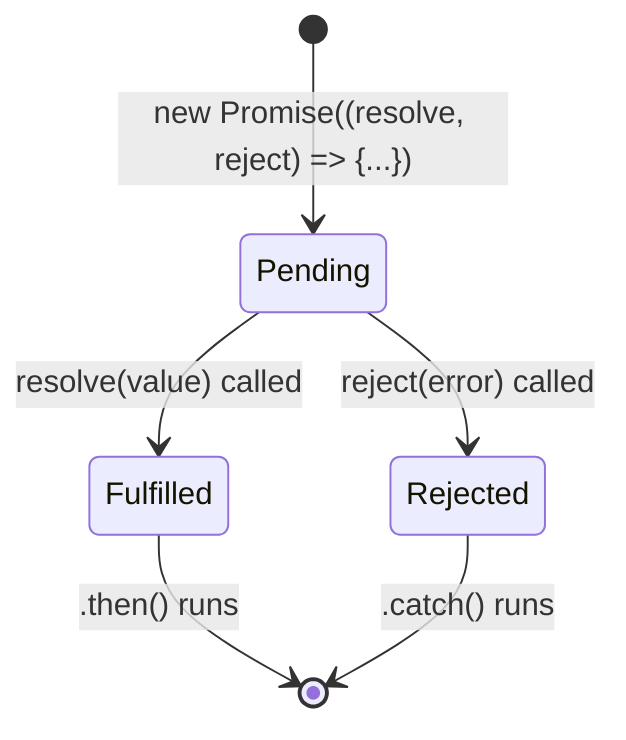
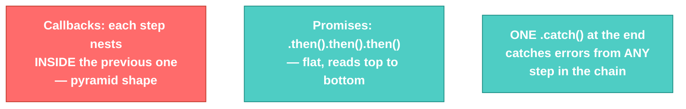

# Promises/Async · File 3: Promises

A **Promise** is an object that represents a value that doesn't exist *yet* but will (or won't) exist at some point in the future. It replaces "hand over a callback and hope" with a proper object you can attach `.then()`/`.catch()` handlers to — and chain, instead of nest.

Source: `src/P3-promise-concept.js`, `src/P4-promise-solution.js`

---

## 🔁 The Pizza Analogy

> A Promise in JavaScript is like ordering a pizza over the phone. You call the pizza place and place your order — that's creating a Promise. The pizza guy says "your pizza will arrive in 30 minutes" — the Promise has been made, but you don't have the pizza yet. While you wait, you can binge-watch a show or clean your room — that's the whole point of a Promise: it lets you keep doing other things while something happens in the background.
>
> If the delivery succeeds, the pizza arrives — the Promise is **resolved**. If something goes wrong, they call to tell you — the Promise is **rejected**.
>
> - `.then()` = "what do I do when my pizza arrives?"
> - `.catch()` = "what do I do if my pizza gets delayed or canceled?"
> - `.finally()` = "what do I do no matter what — pizza or no pizza?"

---

## 💡 The Concept

```javascript
const p = new Promise((resolve, reject) => {
    console.log("Task to be performed-- Async Task")
    const isTaskSuccessful = false
    if (isTaskSuccessful) {
        resolve(10)                                    // success path
    } else {
        reject(new Error("I don't like the promise"))   // failure path
    }
})

p.then((result) => {
    console.log("Fulfilled:", result)
}).catch((error) => {
    console.log("Broken:", error.message)
})
```

Every Promise starts in one of three states:

| State | Meaning |
|---|---|
| **pending** | Still waiting — hasn't resolved or rejected yet |
| **fulfilled** | `resolve(value)` was called — `.then()` runs |
| **rejected** | `reject(error)` was called — `.catch()` runs |

---

## 🎨 Diagram: Promise States



**Verified output** (from `node src/P3-promise-concept.js`):
```
Task to be performed-- Async Task
Value Returned When the Promise is Broken: I dion't like the promise
```
(The source file has a genuine typo in that error message — `"I dion't like the promise"` — worth pointing out to candidates that error message strings are just strings; JS doesn't spell-check them.)

---

## Solving the Callback Hell Problem: Promise Chaining

```javascript
const p1 = getUser(1234)

p1.then((user) => {
    console.log("User:", user)
    return getReposForUser(user)     // returning a Promise here chains it
}).then((repos) => {
    console.log("Repos:", repos)
    for (let repo of repos) {
        getCommitsForRepo(repo).then((noOfCommits) => {
            console.log("No of commits :", noOfCommits)
        })
    }
}).catch((error) => {
    console.log("Encountered Error:", error.message)
})
```

🎨 **Diagram: Nesting vs. Chaining**



💡 **WHY this matters:** with callbacks, error handling had to be repeated at every nesting level. With Promises, **one single `.catch()`** at the end of the chain catches a rejection from *any* step above it — that's a direct fix for callback-hell pain point #2.

---

## ⚠️ GOTCHA — verified against the actual file: a real bug in `P4-promise-solution.js`

```javascript
function getUser(id) {
  p = new Promise((resolve, reject) => {   // ❌ missing const/let!
    ...
  })
  return p;
}
```

`p` is never declared with `const` or `let` — it's an implicit global assignment. Running the file produces a real crash:

```
Before
ReferenceError: p is not defined
    at getUser (P4-promise-solution.js:27:4)
```

This is the exact same class of bug you saw back in the Variables file (`updatedCount`) — ES Modules refuse to silently create implicit globals, so the mistake surfaces immediately as an error instead of quietly working. **The fix is one word:** `const p = new Promise(...)`.

Separately — note the file's `getReposForUser` intentionally calls `reject(...)` instead of `resolve(listOfRepos)`, to demonstrate the `.catch()` path actually catching something real once the `p` bug above is fixed.

---

## ✅ TRY THIS — Hands-On Practice

```javascript
function orderPizza(size) {
    return new Promise((resolve, reject) => {
        setTimeout(() => {
            if (size === "large") {
                resolve(`${size} pizza delivered!`);
            } else {
                reject(new Error("We only deliver large pizzas today"));
            }
        }, 1000);
    });
}

orderPizza("large")
    .then((msg) => console.log(msg))
    .catch((err) => console.log("Order failed:", err.message));
```

Change `"large"` to `"medium"` and predict which branch runs.

---

## 🧪 Lab

1. Fix the `p` implicit-global bug in a copy of `P4-promise-solution.js`, then run it and verify the `.catch()` block fires with `"Account Doesn't exists"`.
2. Fix the `getReposForUser` function so it `resolve`s instead of `reject`s, and verify the full chain runs to completion, logging commits for all three repos.
3. Write your own 2-step Promise chain: `getBranch()` resolving to a branch name, chained into `getBranchManager(branch)` resolving to a manager name — with one `.catch()` at the end.

---

## 🚀 Challenge Task

Rewrite the entire `getUser → getReposForUser → getCommitsForRepo` chain so that **all three repos' commits are fetched in parallel** and logged only once *all* of them have finished, using `Promise.all()`. (This is a preview of a pattern you'll see again once you're firing multiple `fetch()` calls to your Flask API at once.)

*No solution provided — bring your attempt to the next session.*
