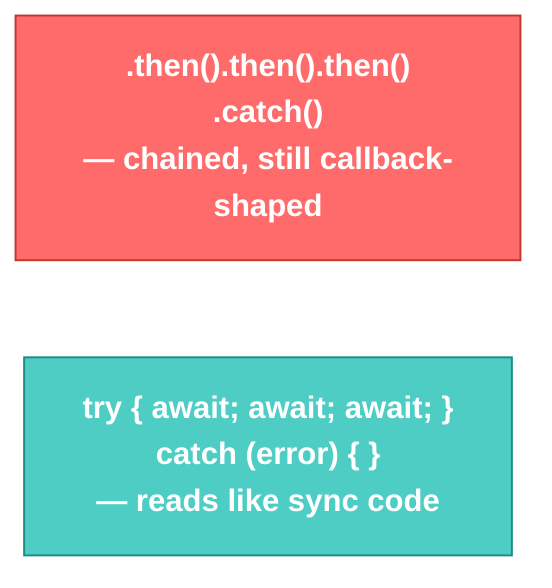

# Promises/Async · File 4: `async`/`await`

`async`/`await` is not a new mechanism — it's **syntax sugar over Promises**. It lets you write asynchronous code that *reads* like ordinary top-to-bottom synchronous code, while still being fully non-blocking underneath. This is the exact style you'll use when calling `fetch()` against your Flask API.

Source: `src/P5-promise-solution-async-await.js`

---

## 💡 The Concept

```javascript
async function displayReposWithCommits() {
    try {
        const user = await getUser(1234)
        console.log(user)
        const repos = await getReposForUser(user)
        console.log(repos)
        for (let repo of repos) {
            const noOfCommits = await getCommitsForRepo(repo)
            console.log(noOfCommits)
        }
    } catch (error) {
        console.log("Error Encountered:", error.message)
    }
}

displayReposWithCommits()
```

Two rules:
1. **`await` only works inside a function marked `async`.**
2. **`await` pauses that function** (not the whole program) until the Promise it's waiting on resolves or rejects — then it "unwraps" the resolved value directly into your variable, no `.then()` needed.

🔁 **ANALOGY:** If Promises are ordering pizza and getting a phone call back, `async`/`await` is like pizza delivery via a very well-trained assistant: you say "wait right here until the pizza physically arrives, then hand it to me" — and your assistant handles all the waiting-around logistics invisibly. From your point of view, it just *reads* like: order → wait → have pizza. No phone-call callback juggling visible at all.

---

## 🎨 Diagram: `.then()` Chain vs. `async`/`await` — Same Behavior, Different Shape



💡 **WHY:** `try`/`catch` around `await` calls replaces `.catch()` — and it's the *same* familiar error-handling syntax you already use for synchronous errors elsewhere in JS. This is the version most real-world code is written in today; Promises with `.then()` still matter because `async`/`await` is built directly on top of them.

---

## ⚠️ GOTCHA — verified against the actual file: the bug from File 3 resurfaces, with a twist

`P5-promise-solution-async-await.js` reuses the *exact same* `getUser` function from `P4-promise-solution.js` — including the same `p = new Promise(...)` implicit-global bug (missing `const`).

**Verified output** (from `node src/P5-promise-solution-async-await.js`):
```
Error Encountered: p is not defined
Reading Id from Database ....
```

Look closely at the **order** — the error prints *before* "Reading Id from Database....", which seems backwards. Here's why: `p = new Promise((resolve, reject) => {...})` first *constructs* the Promise (which immediately schedules the `setTimeout` for 2 seconds later — that's why the callback is still guaranteed to fire), and only *after* the Promise object is built does JavaScript attempt to assign it to `p`. That assignment fails instantly (synchronously) with `ReferenceError`, which `try`/`catch` catches right away. Meanwhile the `setTimeout` callback — already scheduled, with no relation to whether the assignment succeeded — fires two seconds later anyway, logging to an orphaned Promise nobody is listening to.

**Takeaway:** fixing this is still the same one-word fix — `const p = new Promise(...)` — but this version shows *why* async bugs can be more confusing to debug than sync ones: the error and its "cause" don't always print in the order you'd intuitively expect, because scheduled work keeps running even after the surrounding function has already failed and moved on.

---

## ✅ TRY THIS — Hands-On Practice

```javascript
function delay(ms, value) {
    return new Promise((resolve) => setTimeout(() => resolve(value), ms));
}

async function runSteps() {
    console.log("Start");
    const step1 = await delay(1000, "Step 1 done");
    console.log(step1);
    const step2 = await delay(1000, "Step 2 done");
    console.log(step2);
    console.log("Finished");
}

runSteps();
```

Predict the full print order and rough timing (in seconds) before running.

---

## 🧪 Lab

1. Fix the `p` bug in a copy of `P5-promise-solution-async-await.js`, then fix `getReposForUser` to `resolve` instead of `reject`, and run the full chain end-to-end successfully.
2. Convert your 2-step Promise chain from the previous file (`getBranch` → `getBranchManager`) into an `async`/`await` version with `try`/`catch`.
3. Write an `async` function `loadCustomer(id)` that `await`s a fake `getCustomerById(id)` Promise (resolves after 1s with a mock customer object) and logs the result — this is the exact shape you'll reuse for real `fetch()` calls in the next track.

---

## 🚀 Challenge Task

Rewrite the `for (let repo of repos) { const noOfCommits = await getCommitsForRepo(repo) }` loop so all repos' commits are fetched **in parallel** instead of one-at-a-time, using `await Promise.all(repos.map(repo => getCommitsForRepo(repo)))`. Compare the total run time against the sequential version — this is a preview of a real performance decision you'll make once multiple Flask API calls are involved.

*No solution provided — bring your attempt to the next session.*

---

## 🌐 Bridge to Track 3

Every pattern in this file — `async function`, `await somePromise`, `try`/`catch` for errors — is exactly what you'll write next, except `getUser`/`getReposForUser` get replaced with real `fetch()` calls to a Flask API:

```javascript
async function loadCustomers() {
    try {
        const response = await fetch('/api/customers');
        const customers = await response.json();
        console.log(customers);
    } catch (error) {
        console.log("Failed to load customers:", error.message);
    }
}
```
