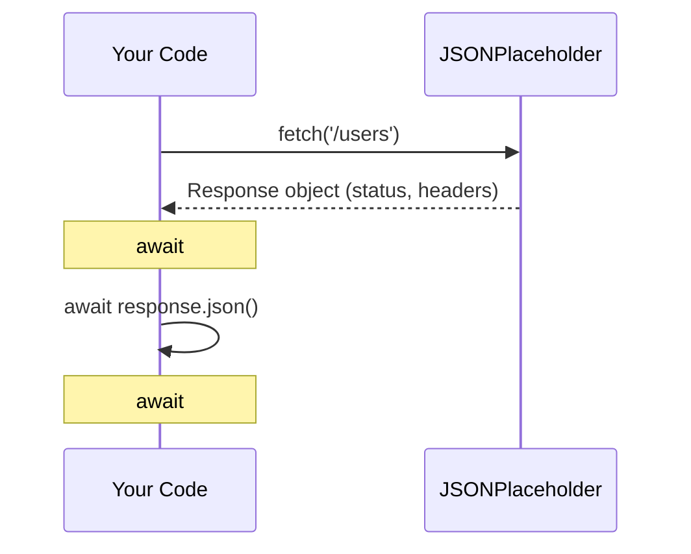

# Fetch · File 1: Fetch Basics (GET Requests)

`fetch()` is the browser's (and Node's) built-in way to make HTTP requests. Everything you learned about `async`/`await`, Promises, and `try`/`catch` in the last track exists specifically to make working with `fetch()` clean — because `fetch()` itself is Promise-based from the ground up.

Source: `src/fetch/01-fetch-basics.js` — calls **[JSONPlaceholder](https://jsonplaceholder.typicode.com)**, a free, hosted, no-signup, no-API-key fake REST API maintained by the JSON Server team — a real API on the open internet, not something we're running ourselves. We're using its `/users` resource, since its fields (`id`, `name`, `email`, `phone`) map closely to a "customer."

---

## 💡 The Concept

```javascript
async function loadAllUsers() {
    const response = await fetch('https://jsonplaceholder.typicode.com/users');
    console.log('Status:', response.status, response.ok);
    const users = await response.json();
    console.log('Total users:', users.length);
    console.log('First user:', users[0]);
}
```

`fetch()` takes **two steps** to get usable data, and both are asynchronous:

1. `await fetch(url)` — resolves once the server has responded with *headers and status* (not the full body yet). This gives you a `Response` object.
2. `await response.json()` — resolves once the *body* has been fully downloaded and parsed as JSON. This is a **second, separate await**.

🔁 **ANALOGY:** `fetch()` resolving is like the delivery truck pulling up to your building and the driver telling you "Package for you, weight and address confirmed" — you know something arrived, but you haven't opened the box yet. `response.json()` is you actually opening the box and unpacking the contents. Two distinct steps, two distinct waits.

---

## 🎨 Diagram: The Two-Step Fetch



⚠️ **GOTCHA:** Forgetting the second `await` (`response.json()`) is one of the most common `fetch` mistakes. Without it, `users` would be a **Promise object**, not the actual array — `console.log(users)` would print `Promise { <pending> }` instead of real data, and trying to `.map()` over it would throw `users.map is not a function`.

**Real live data** (pulled directly from `https://jsonplaceholder.typicode.com/users`):
```json
[
  {
    "id": 1,
    "name": "Leanne Graham",
    "username": "Bret",
    "email": "Sincere@april.biz",
    "address": { "street": "Kulas Light", "city": "Gwenborough", "zipcode": "92998-3874" },
    "phone": "1-770-736-8031 x56442",
    "website": "hildegard.org",
    "company": { "name": "Romaguera-Crona" }
  },
  { "id": 2, "name": "Ervin Howell", "email": "Shanna@melissa.tv" },
  "... 8 more users, 10 total"
]
```
So `loadAllUsers()` prints `Total users: 10` and the full first record shown above. `loadOneUser(2)` returns just user `id: 2` ("Ervin Howell").

💡 **WHY a real, live, hosted API matters here:** this isn't something running on your machine — it's out on the open internet, exactly like the Flask API you'll eventually deploy. That means real network latency, real DNS lookups, and real HTTP behavior — not a simulation.

---

## `response.status` vs `response.ok`

| Property | What it tells you |
|---|---|
| `response.status` | The raw HTTP status code — `200`, `404`, `500`, etc. |
| `response.ok` | Shorthand boolean — `true` if status is in the 200–299 range |

💡 **WHY:** `response.ok` is a quick check before you trust the body. A `404` or `500` response still successfully "fetches" — the network request itself didn't fail — so `fetch()` won't throw just because the server said "not found." Checking `.ok` is how you catch that. (Full detail on this comes in File 3.)

---

## ✅ TRY THIS — Hands-On Practice

```javascript
async function loadOneUser(id) {
    const response = await fetch(`https://jsonplaceholder.typicode.com/users/${id}`);
    const user = await response.json();
    console.log(`User ${id}:`, user);
}

loadOneUser(5);   // try running this in your browser console right now
```

Notice the URL uses a template literal (`${id}`) to build a dynamic path — this is the exact pattern for "get one specific record" endpoints. Since this hits a real, live server, try pasting this straight into your browser's console — no setup needed.

---

## 🧪 Lab

1. Write `loadUserCount()` — fetch all users, then log just `users.length` (should be `10`).
2. Write `loadUserEmails()` — fetch all users, then use `.map()` (from JS-101!) to log just an array of emails.
3. Fetch a user by an id that doesn't exist (e.g. `999`) and log both `response.status` and `response.ok` — notice `fetch` resolves normally even though the user isn't found (full explanation in File 3).

---

## 🚀 Challenge Task

Write a function `loadUsersByCity(cityName)` that fetches **all** users, then filters (using `.filter()` from JS-101) to only those whose `address.city` matches `cityName` — do the filtering in your own JS code, not by asking the server to filter.

*No solution provided — bring your attempt to the next session.*
