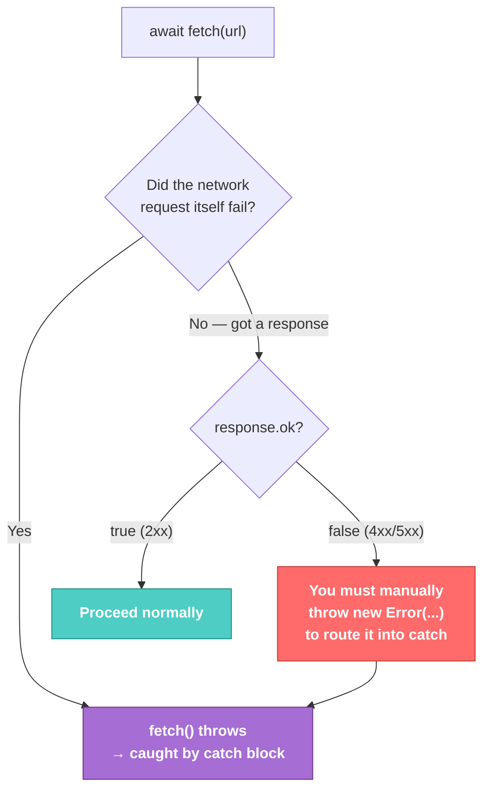

# Fetch · File 3: Error Handling

`fetch()` has one surprising rule that trips up nearly everyone the first time: **it does not throw an error for HTTP error responses.** A `404` or `500` is, as far as `fetch()` is concerned, a "successful" round trip — the server *did* respond, it just responded with bad news. Only actual network failures throw. Knowing this distinction is essential before you connect to a real Flask API that can fail in either way.

Source: `src/fetch/03-fetch-error-handling.js` — against JSONPlaceholder (a real hosted API), demonstrating both failure types with a real 404 and a genuinely unreachable domain.

---

## 💡 The Concept — Two Completely Different Kinds of Failure

| Failure type | Does `fetch()` throw? | How you detect it |
|---|---|---|
| **Network error** (server down, DNS failure, no internet) | ✅ Yes — the `await fetch()` itself throws | `try`/`catch` around the fetch call |
| **HTTP error** (`404`, `400`, `500` — server responded, just with bad news) | ❌ No — resolves normally | Manually check `response.ok` / `response.status` |

```javascript
async function loadMissingUser() {
    try {
        const response = await fetch('https://jsonplaceholder.typicode.com/users/999');
        console.log('Status:', response.status, 'ok:', response.ok);
        if (!response.ok) {
            throw new Error(`Request failed with status ${response.status}`);
        }
        const user = await response.json();
        console.log(user);
    } catch (error) {
        console.log('Caught error:', error.message);
    }
}
```

🔁 **ANALOGY:** A network error is the phone call not connecting at all — no dial tone, nothing. An HTTP error is the call connecting fine, and the person on the other end saying "sorry, we don't have that." Both are "bad news," but only the first one is a *connection* failure — the second one requires you to actually listen to what they said before deciding it went wrong.

---

## 🎨 Diagram: The Manual `throw` Pattern



💡 **WHY manually `throw`:** since `fetch()` won't do it for you on a `404`/`500`, wrapping your own `throw new Error(...)` inside the `if (!response.ok)` block is what routes HTTP errors into the same `catch` block as network errors — giving you **one consistent place** to handle "something went wrong," regardless of which of the two failure types actually occurred.

---

## ⚠️ GOTCHA — real, live behavior: two failure modes side by side

**Case 1 — HTTP 404 (JSONPlaceholder only seeds 10 users, ids 1–10 — `999` doesn't exist):**
```
Status: 404 ok: false
Caught error: Request failed with status 404
```
`fetch()` resolved successfully (status printed fine) — the "error" only appeared because the code explicitly checked `.ok` and threw. JSONPlaceholder's own docs confirm this exact behavior: requesting an id outside their fixed dataset returns a genuine `404`.

**Case 2 — genuine network failure (a domain that doesn't exist at all):**
```javascript
fetch('https://this-domain-does-not-exist-fsolutions.invalid/api')
```
```
Caught network error: fetch failed
```
`.invalid` is a domain suffix specifically reserved by internet standards to **guarantee it never resolves** — perfect for demonstrating a real DNS-level network failure safely and repeatably, without depending on a real server happening to be down. This time `await fetch(...)` itself throws — no `response` object is ever created, no `.status` to check.

---

## ✅ TRY THIS — Hands-On Practice

```javascript
async function safeLoad(url) {
    try {
        const response = await fetch(url);
        if (!response.ok) {
            throw new Error(`Request failed: ${response.status}`);
        }
        return await response.json();
    } catch (error) {
        console.log('Something went wrong:', error.message);
        return null;
    }
}

safeLoad('https://jsonplaceholder.typicode.com/users/999');
safeLoad('https://this-domain-does-not-exist-fsolutions.invalid/api');
```

Predict which error message each call produces before running — then try it live in your browser console.

---

## 🧪 Lab

1. Write `safeAddPost(post)` — POST a new post, wrapping the request so any failure is caught and logged as a friendly message instead of an unhandled rejection.
2. Deliberately fetch a nonexistent JSONPlaceholder path (like `/users/abc` or `/nonexistent`) and observe what status code comes back.
3. Write a reusable helper `handleResponse(response)` that checks `.ok`, throws with a descriptive message if not, and otherwise returns `response.json()` — then use it in place of repeating the same `if (!response.ok)` block in every function.

---

## 🚀 Challenge Task

Combine everything from this track into one function `safeApiRequest(url, options)` that wraps `fetch`, handles both network errors and HTTP errors through a single `catch`, and returns either the parsed data or `null` — this exact helper is what you'll build into the `api.js` module (using `import`/`export` from JS-101) at the start of Track 4, pointed at your real Flask `/api/customers` endpoints instead of JSONPlaceholder.

*No solution provided — bring your attempt to the next session.*
