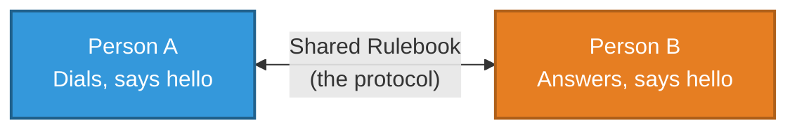
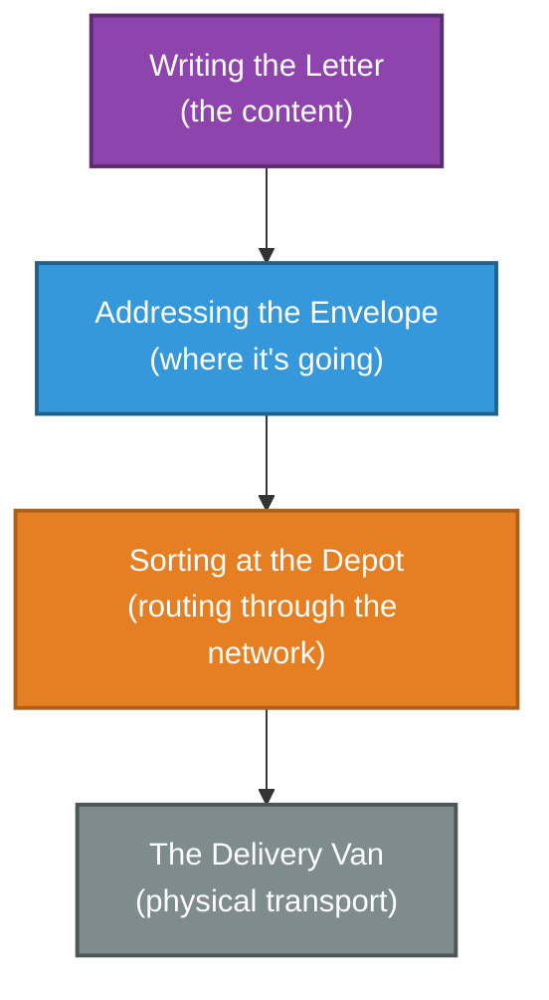
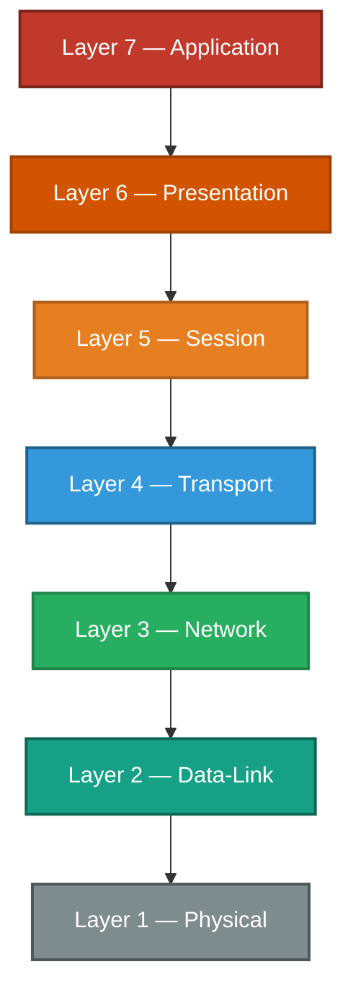
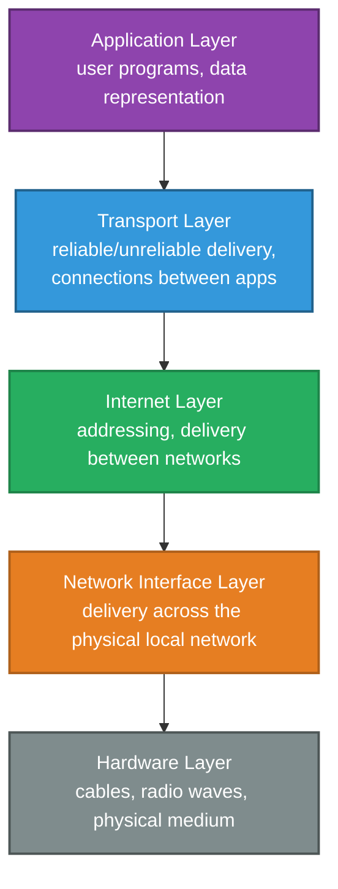
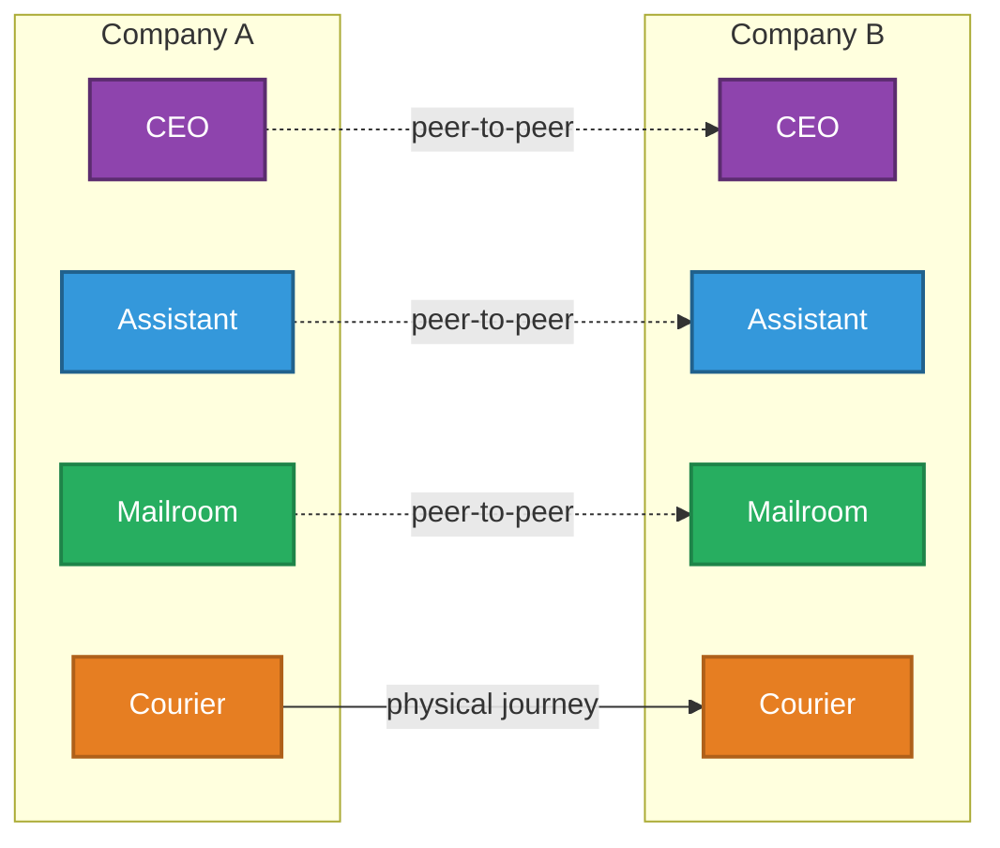
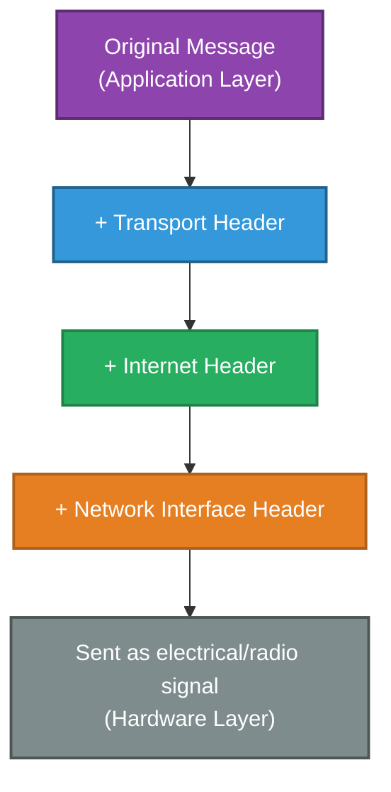
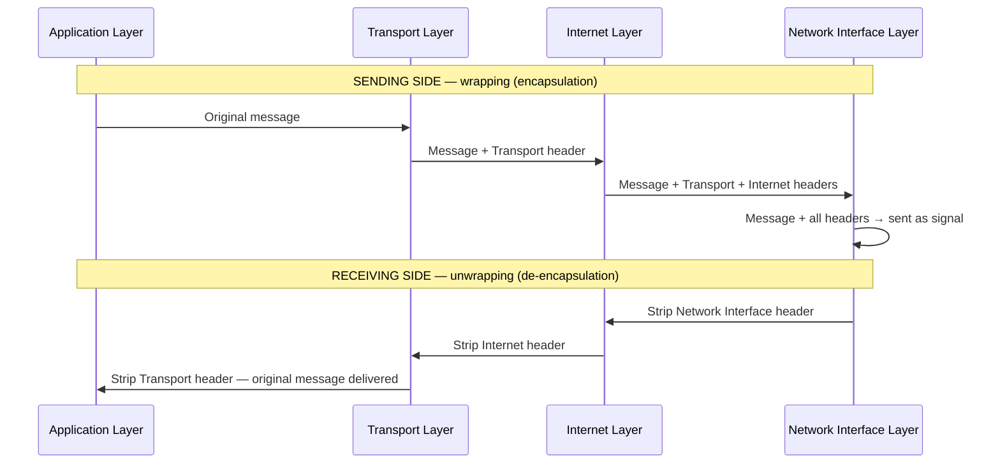
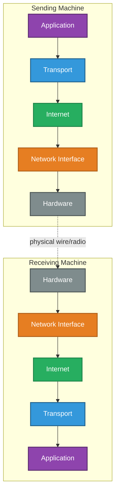

# How Networks Talk
### Protocols & The Layered Model

---

## Introduction

Before two computers can exchange a single byte of data, they need to agree on the rules of the conversation — who speaks first, how a message is structured, and how both sides know when it's finished. This document explains what a "protocol" actually is, why networking is broken into distinct **layers** rather than one giant system, and how a message travels down through those layers on one machine and back up through them on another.

---

## 1. The Core Idea: A Protocol is Just an Agreed Rulebook

Imagine picking up the phone to call someone you've never met. Despite never having spoken before, the call works — because you both already follow the same unwritten rulebook:

- One person dials, the other answers.
- Someone says "hello" first.
- You take turns speaking.
- One person says "goodbye" before hanging up.

Neither of you invented these rules on the spot — you both already knew them. A **network protocol** is exactly this: a formally agreed set of rules that lets two devices, which have never "met" before, communicate successfully because they both follow the identical rulebook.

---

## 2. Why One Giant Rulebook Doesn't Work

It might seem simpler to have just one enormous protocol that handles everything — from the electrical signal on a cable all the way up to what appears on a screen. In practice, this would be a disaster to build and maintain.

**Real-world analogy — the postal service:**

Sending a letter involves several genuinely separate jobs:

1. **Writing the letter** — deciding what to say (this is content, not delivery)
2. **Addressing the envelope** — deciding where it needs to go
3. **Sorting at the depot** — routing it through the postal network
4. **The delivery van and postman** — the physical act of getting it to the door

Each of these jobs is handled by a **different part of the system**, and — critically — each part can change independently without breaking the others. If the postal service switches from vans to bicycles, your letter's content and address don't need to change at all. If you switch from handwriting to a typed letter, the postal service's sorting process doesn't need to change either.

Computer networking is built the same way: instead of one giant rulebook, it is split into **layers**, each responsible for one job, each able to change independently.

### Why This Layered Approach Matters

| Benefit | What it means in practice |
|---|---|
| Divides complexity | Each layer only has to solve one narrow problem, not the whole system at once |
| Enables independent change | Swapping WiFi for a cable connection doesn't require rewriting your web browser |
| Provides a standard | Every device manufacturer builds to the same agreed structure, so everything interoperates |
| Simplifies troubleshooting | A fault can be isolated to a specific layer, rather than searched for across an undivided system |

---

## 3. Two Models, One Idea (Don't Let This Confuse You)

There are two different "layer diagrams" you'll encounter in networking, and it's easy to assume they contradict each other. They don't — they're just two different levels of detail describing the same underlying reality.

### The OSI Model (7 Layers)

This is the academic, reference model — extremely detailed, widely taught, and still used as shared vocabulary in the industry (you'll often hear engineers say "that's a Layer 3 problem" or "this is a Layer 7 firewall"). It is rarely implemented exactly as-is in real software.

### The TCP/IP Model (4 Layers)

This is the model that is **actually implemented** on every real operating system — Windows, macOS, Linux, iOS, Android — and is the practical model used throughout the rest of this series of documents.

**In short:** OSI is the detailed textbook description; TCP/IP is the simplified, real-world implementation. This document, and the rest in this series, use the 4-layer TCP/IP model as the spine.

---

## 4. Peer-to-Peer Communication — The Hardest Idea to Grasp

Here is the single most important (and most commonly misunderstood) rule of the layered model:

> **Each layer only ever "talks" to the matching layer on the other machine — never to the other layers on its own machine.**

This is called **peer-to-peer communication between layers**. The Application layer on your laptop behaves as if it's speaking directly to the Application layer on the server — it doesn't need to know or care how the Transport, Internet, or Hardware layers beneath it are doing their jobs.

**Real-world analogy — a company's internal mail system:**

Imagine two company CEOs exchanging a signed contract by post. The CEO writes the letter and hands it to their own assistant. The assistant puts it in an envelope and hands it to the mailroom. The mailroom hands it to a courier. The courier drives it across the country and hands it to the receiving company's mailroom, who hands it to *their* assistant, who hands it to *their* CEO.

- The two **CEOs** feel like they are directly communicating with each other (peer-to-peer), even though in reality the message physically passed through several intermediate hands.
- The **assistants** likewise only interact with each other's role, not with the courier directly.
- The **courier** only ever deals with other couriers/depots, not with the CEOs or their letters' content at all.

Each role in this chain only interacts with its equivalent role at the other end, and only hands work to the role directly above or below it on its own side. This is precisely how the four layers of the TCP/IP model behave.

---

## 5. Encapsulation — Wrapping the Message as it Travels Down

When data actually moves down through the layers on the sending machine, each layer wraps the message from the layer above it in its own additional information — like nesting one envelope inside a larger envelope.

**Real-world analogy — Russian nesting dolls (matryoshka):**

Picture placing a small note inside a small wooden doll. That doll goes inside a slightly bigger doll. That doll goes inside a bigger one still, and so on. To someone receiving the largest doll, it looks like a single solid object — but inside, layer by layer, is the original note, each layer added by a different "worker" along the way.

On the **receiving** machine, this happens in exact reverse — each layer strips off its own "wrapper" and hands the remaining contents up to the layer above, until only the original message is left. This reverse process is called **de-encapsulation**.

This single mechanism — wrap on the way down, unwrap on the way up — is the foundation for everything covered in the rest of this document series. Every later document (on Ethernet frames, IP datagrams, TCP segments) is really just describing what gets added at one specific layer during this same process.

---

## 6. The Complete Picture

| Layer | Real-World Equivalent | Job |
|---|---|---|
| **Application** | The letter's content | The actual message a program wants to send |
| **Transport** | The assistant | Decides how reliably it's delivered, and to which specific recipient |
| **Internet** | The mailroom | Adds addressing, decides how it's routed across networks |
| **Network Interface** | The courier | Physically carries it across one local network |
| **Hardware** | The road / vehicle | The literal cable, fibre, or radio wave carrying the signal |

**In summary:** a protocol is simply an agreed rulebook that lets two unfamiliar devices communicate successfully. Rather than one giant rulebook, networking splits the job into independent layers, each handling one narrow responsibility and speaking only to its matching layer on the other machine. As a message travels down through these layers, it is progressively wrapped in additional information (encapsulation); as it arrives and travels back up, that same information is stripped away in reverse (de-encapsulation) until the original message is delivered.

---

*Prepared as a technical reference document.*
