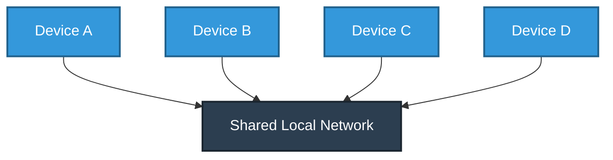
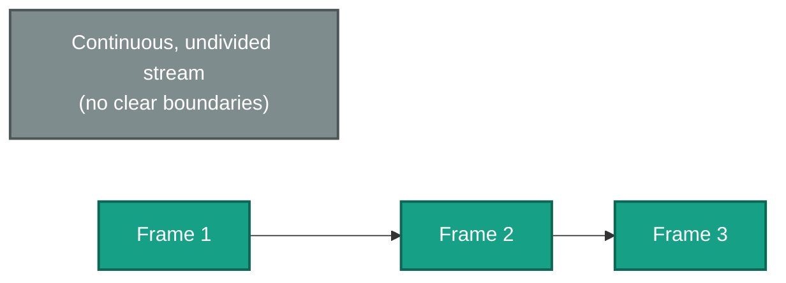
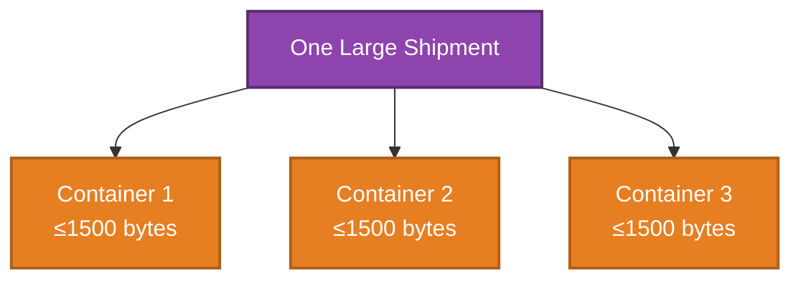
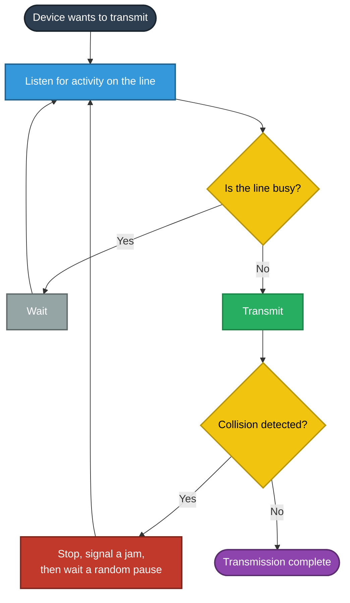
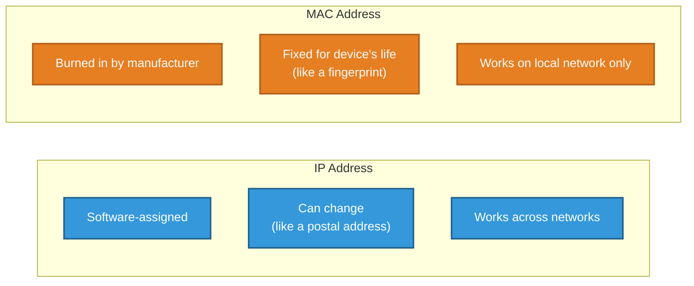
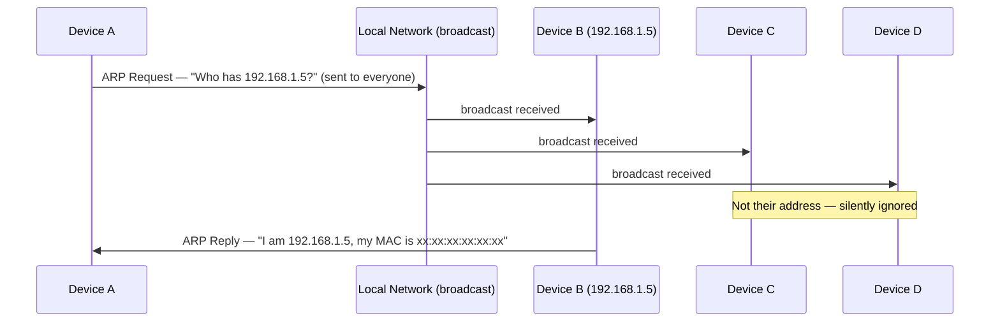
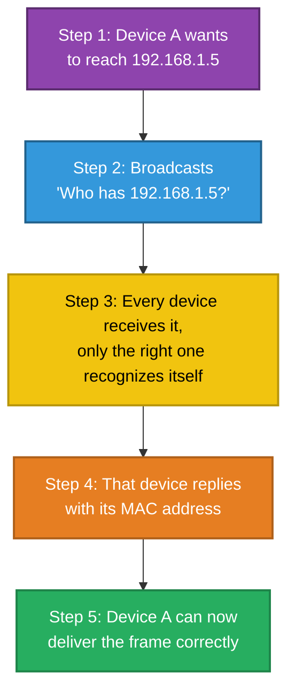
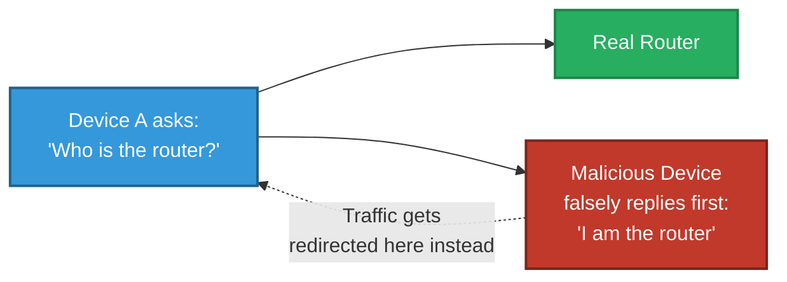

# Getting Data Across the Room
### Ethernet, Frames & ARP

---

## Introduction

Once a message has been addressed and handed down to the lowest layers of a network connection, something has to physically move it across the wire (or airwaves) to the next device. This document explains **Ethernet** — the most common technology for doing this on a local network — how data is packaged into **frames**, how devices politely take turns sharing one connection, and how a device finds another device's exact physical hardware address using **ARP**.

> This document is part of a series explaining networking fundamentals. It focuses on the **Network Interface Layer** — the layer responsible for delivering data across one local physical network, one level below addressing and routing (covered separately in the IP Addressing & CIDR document).

---

## 1. What Problem Does Ethernet Solve?

Imagine an office where dozens of desks are all connected to a single shared telephone line — one line, many people. If two people tried to speak into that line at the exact same moment, neither conversation would be understandable; the sound would simply clash.

**Ethernet is the set of rules that lets many devices share a single local network connection without constantly talking over one another.**

Ethernet was standardized in 1985 as IEEE 802.3, and it remains the dominant technology for wired local networks today. It operates at what the standard networking model calls the **Network Interface Layer** — one level below the addressing and routing responsibilities of the Internet Layer, and one level above the raw physical cabling itself.

---

## 2. Frames — The Envelope for Local Delivery

Ethernet doesn't send data as one continuous, undivided stream. Instead, it breaks data into individual units called **frames** — each with a clearly defined beginning and end.

**Real-world analogy:** Think of a single sheet of paper with a visible top margin and bottom margin, as opposed to one continuous, unbroken scroll of text. Because each sheet has a clear start and finish, whoever picks it up immediately knows exactly where one page ends and the next begins.

Each Ethernet frame carries a defined maximum amount of data — commonly **1500 bytes**. Anything larger than that has to be split into multiple frames before it can be sent, and reassembled again once it arrives at the destination.

**Real-world analogy — a container ship:** A shipment far too large to move as a single block of cargo gets split into standard-sized shipping containers, each one loaded individually, then reassembled into the full shipment once every container has arrived at port.

---

## 3. CSMA/CD — Polite Turn-Taking on a Shared Line

Ethernet's rulebook for avoiding "everyone talking at once" is called **CSMA/CD**, which breaks down into three plain-English steps:

- **C**arrier **S**ense — *listen* before speaking, to check the line isn't already in use
- **M**ultiple **A**ccess — any device is free to try transmitting when the line is clear
- **C**ollision **D**etection — if two devices happen to transmit at the same moment, both instantly notice the resulting garbled signal (a "collision") and know to stop

**Real-world analogy — walkie-talkie etiquette:** Before pressing the talk button, you listen to make sure no one else is already speaking. If it's clear, you speak. If you hear your own voice get garbled because someone else keyed up at the same instant, you both immediately stop, wait a short, random amount of time, and then try again — the randomness ensures you don't simply collide again straight away.

**Worth knowing:** on modern switched networks, each device typically gets its own dedicated connection to a network switch rather than sharing one line with everyone, which makes true collisions rare in practice. CSMA/CD remains important to understand because it explains *why* that switched design was such a major improvement, and WiFi still has to solve a very similar problem using a related technique.

---

## 4. Two Different Addresses — The Key Distinction

Every device on a network actually has **two completely different types of address**, each with a different job. Confusing these two is one of the most common early misunderstandings in networking, so it's worth being very precise here.

| | **IP Address** | **MAC Address** |
|---|---|---|
| Assigned by | Software — manually, or automatically via DHCP | Burned into the hardware by the manufacturer |
| Can it change? | Yes, easily and often | Effectively fixed for the device's lifetime |
| Real-world equivalent | Your **postal address** — you can move house | Your **fingerprint** — it stays with you permanently |
| Used for | Identifying a device across potentially many different networks | Identifying a device on **one single local network** |

Here's the critical detail: **Ethernet itself has no concept of IP addresses at all.** It only ever knows how to deliver a frame to a specific MAC address. This creates an obvious problem: if your computer knows another device's IP address, how does it find out that device's MAC address in order to actually deliver anything to it locally? This is exactly the problem ARP solves.

---

## 5. ARP — Translating a Known IP Address into a MAC Address

**ARP (Address Resolution Protocol)** answers exactly one question: *"I know this device's IP address — what's its MAC address on this local network?"*

**Real-world analogy — shouting across an open-plan office:** You know a colleague works in "the accounts department" (their IP address, a logical grouping), but you don't know their exact desk number (their MAC address, a physical location). So you stand up and call out across the office: *"Who is sitting at desk labelled 192.168.1.5?!"* Everyone in the office hears the shout, but only the person actually at that desk raises their hand and replies with their exact location.

### The Full Sequence, Step by Step

1. Device A wants to send data to `192.168.1.5` on the local network, but doesn't yet know its MAC address.
2. Device A **broadcasts** an ARP request to every device on the local network at once: *"Who has 192.168.1.5?"*
3. Every device receives the broadcast, but only the device that actually holds `192.168.1.5` recognizes itself.
4. That device replies directly to Device A with its MAC address.
5. Device A now has both pieces of information it needs and can deliver the Ethernet frame to the correct physical device.

### A Practical Efficiency: The ARP Cache

Repeating this broadcast for every single piece of data sent would be wasteful. Instead, devices remember recent ARP answers for a short period in a local **ARP cache** — much like remembering a colleague's desk number after asking once, rather than shouting the question across the office every single time you need to reach them again.

---

## 6. A Security Consideration Worth Knowing

Because an ARP reply is trusted by default, with no built-in verification of who is actually answering, a malicious device on the same local network can send **fake ARP replies**, falsely claiming to be a device it isn't — for example, pretending to be the network's router.

This technique is known as **ARP spoofing** (or ARP poisoning), and it's a classic method for intercepting traffic on an unsecured local network, since other devices have no automatic way to tell a genuine reply from a forged one.

---

## 7. Bringing It All Together

| Concept | Real-World Analogy | Technical Meaning |
|---|---|---|
| Ethernet | A shared office phone line | Rules for sharing one local network connection |
| Frame | A sheet of paper with clear margins | One bounded unit of data, with a defined start and end |
| CSMA/CD | Walkie-talkie etiquette | Listen, transmit if clear, stop and retry after a collision |
| MAC Address | A fingerprint | A fixed, manufacturer-assigned hardware address |
| IP Address | A postal address | A software-assigned, changeable network address |
| ARP | Shouting "who has this address?" across an office | Translates a known IP address into the matching MAC address |

**In summary:** Ethernet is the rulebook that lets multiple devices share one local network without talking over each other, using clearly bounded frames and a listen-before-transmit discipline called CSMA/CD. Every device also has a permanent hardware MAC address, separate from its changeable software-assigned IP address — and ARP is the mechanism that bridges the two, letting a device translate a known IP address into the exact physical MAC address it needs in order to deliver data locally.

---

*Prepared as a technical reference document.*
