# Addressing & Routing Across Networks
### IP Addresses, Datagrams, CIDR & Routing

---

## Introduction

Once data has been prepared for delivery across a local network, something still needs to solve a bigger problem: getting it to a device on a **completely different** network — potentially thousands of miles away. This document explains how IP addresses work, what a subnet mask like `255.255.255.0` actually means, how CIDR notation makes addressing more flexible, and how routers get data across networks they've never directly seen before.

> This document is part of a series explaining networking fundamentals. It focuses on the **Internet Layer** — the layer responsible for addressing devices and routing data between different networks.

---

## 1. The Core Idea: An IP Address is Just a Street Address

Consider a postal address: **170 Oxford Street**. This is not one indivisible piece of information — it naturally splits into two parts:

- **"Oxford Street"** tells the postal service *which street* to deliver to.
- **"170"** tells the delivery person *which specific house* on that street.

An IP address works exactly the same way. It is a single number, logically divided into two parts:

- A **network portion** — identifies *which network* a device belongs to (the "street").
- A **host portion** — identifies *which specific device* on that network (the "house number").

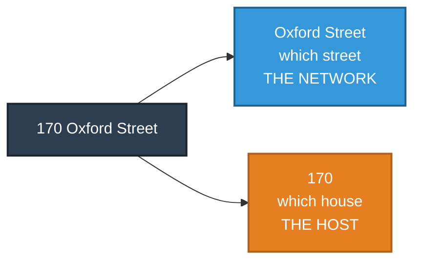

---

## 2. What an IP Address Actually Is

An IPv4 address, such as `192.168.1.168`, is written as four numbers separated by dots for human readability. Underneath, it is a single **32-bit binary number**, simply split into four 8-bit groups (called **octets**).

```
192       .  168      .  1        .  168
11000000  .  10101000 .  00000001 .  10101000
```

Each octet is 8 bits long. Eight bits can represent any value from `00000000` (0) to `11111111` (255) — which is exactly why every number in an IP address always falls between 0 and 255, and never higher.

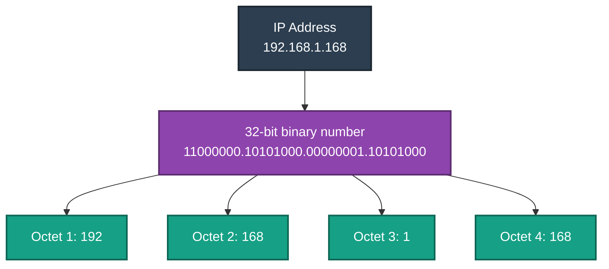

---

## 3. The Envelope Itself: What's Inside an IP Datagram

At this layer, one unit of data is called a **datagram** — the "envelope" that carries the addressing information needed to get data across networks. It contains several fields, but three matter most in everyday practice:

| Field | Real-World Equivalent | Purpose |
|---|---|---|
| **Source & Destination IP** | The "from" and "to" address on an envelope | Identifies who sent the data and where it's going |
| **Protocol** | A label saying "letter" or "parcel" | Says what kind of data is inside (e.g. TCP or UDP) |
| **TTL (Time To Live)** | "Forward this email a maximum of 10 times" | A hop counter that prevents data from circulating forever if something goes wrong |

**Understanding TTL with a real-world analogy:** Imagine forwarding an email with a rule attached: *"this message may only be forwarded 10 more times before it must be deleted."* Every time a router passes your data along to the next router, it reduces the TTL by one. If the TTL ever reaches zero, that router discards the data and sends back a small notification saying so. Without this safety mechanism, a misconfigured network could cause data to loop between routers indefinitely, endlessly consuming bandwidth.

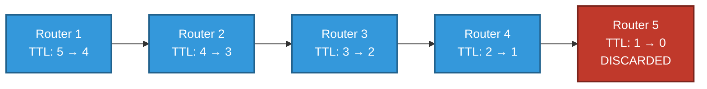

A companion protocol called **ICMP** is used specifically to send these kinds of control and error messages back to the sender — for example, "your data's TTL expired" or the notification behind the everyday `ping` command that tests whether a device is reachable at all.

---

## 4. Splitting the Address: Network vs. Host

Just like "170 Oxford Street" splits into a street and a house number, every IP address splits into a **network portion** and a **host portion**. What determines *where* that split happens is a second 32-bit number, called the **subnet mask**.

The subnet mask uses a simple rule:

- Every bit set to **1** in the mask means "this bit belongs to the network."
- Every bit set to **0** in the mask means "this bit belongs to the host."

**Example — `192.168.1.168` with a mask of `255.255.255.0`:**

```
IP Address:    192       .168      .1        .168
Subnet Mask:   255       .255      .255      .0
In binary:     11111111  .11111111.11111111 .00000000
```

Here, the first 24 bits are all `1`s (network), and the last 8 bits are all `0`s (host).

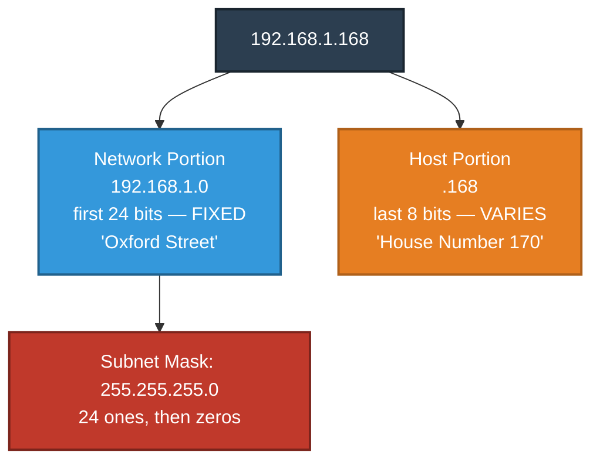

---

## 5. Decoding `255.255.255.0` — What This Number Actually Means

`255.255.255.0` looks arbitrary at first glance, but once translated into binary, it directly answers one question: **"how many houses share this street name?"**

Recall that **255 in binary is `11111111`** — all eight bits switched on. So `255.255.255.0` really reads as:

```
255       . 255       . 255       . 0
11111111  . 11111111  . 11111111  . 00000000
└──────────────── network ────────────────┘ └── host ──┘
        (24 bits, all "1" — fixed)         (8 bits, all "0" — free to vary)
```

| Part of the mask | Value | Street Address Meaning |
|---|---|---|
| First 24 bits | All `1`s (`255.255.255`) | "Oxford Street" — the fixed part every device on this network shares |
| Last 8 bits | All `0`s (`.0`) | The house number — the part left blank for each individual device to fill in |

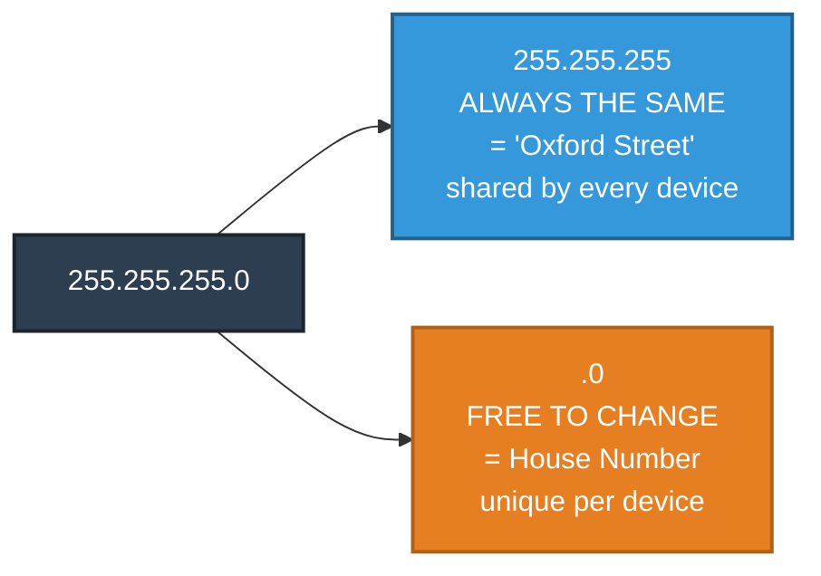

So on a network using `192.168.1.0` with mask `255.255.255.0`, every device shares the street name `192.168.1` and simply picks a different house number from `.1` through `.254`.

---

## 6. CIDR — A Shorter Way to Write the Same Mask

Writing out `255.255.255.0` every time is verbose. **CIDR notation** (Classless Inter-Domain Routing) is simply a shorthand: a forward slash followed by a count of how many `1`s appear in the mask.

```
255.255.255.0   →   24 ones   →   /24
```

So `192.168.1.168` with mask `255.255.255.0` is written far more compactly as `192.168.1.168/24`. No new concept is introduced — `/24` and `255.255.255.0` are two different spellings of the exact same instruction.

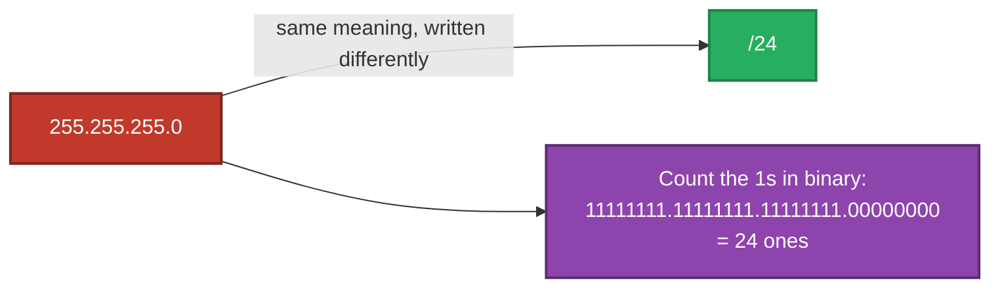

Because CIDR is just a count of bits, that count doesn't have to stop at a fixed 8, 16, or 24 — it can land anywhere, which makes it far more flexible than the older, rigid address-class system.

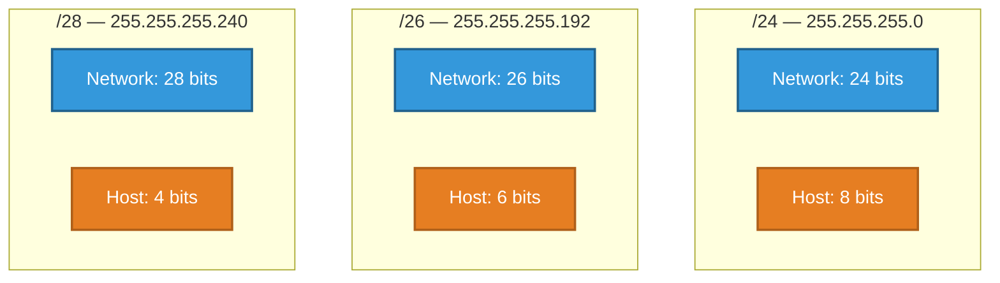

---

## 7. How Many Machines Can a Network Serve?

The number of devices a network can support is determined entirely by how many bits are given to the host portion. An IP address always has 32 bits total — whatever isn't given to the network is automatically available for hosts.

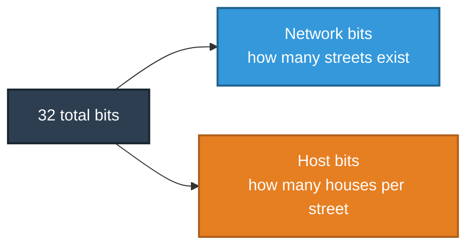

### The Formula

```
Usable hosts = (2 ^ number of host bits) − 2
```

Two addresses are always subtracted, because they are reserved and cannot be assigned to a device:

1. **The all-zeros host address** — represents the network itself (e.g. `192.168.1.0`), not an actual device.
2. **The all-ones host address** — the **broadcast address** (e.g. `192.168.1.255`), used to reach every device on the network at once, not a specific device. This is the network's equivalent of a "Dear All" announcement — data sent here is delivered to every device on the local network simultaneously.

### Worked Example

For `192.168.1.168/24`: Network bits: 24 → Host bits: 32 − 24 = **8** → Usable hosts: 2⁸ − 2 = **254**.

### The Trade-Off

| CIDR | Subnet Mask | Network Bits | Host Bits | Usable Machines | Typical Scale |
|---|---|---|---|---|---|
| `/8` | `255.0.0.0` | 8 | 24 | 16,777,214 | A very large organization |
| `/16` | `255.255.0.0` | 16 | 16 | 65,534 | A large campus |
| `/24` | `255.255.255.0` | 24 | 8 | 254 | A small office / home network |
| `/26` | `255.255.255.192` | 26 | 6 | 62 | A small department |
| `/28` | `255.255.255.240` | 28 | 4 | 14 | A handful of devices |
| `/30` | `255.255.255.252` | 30 | 2 | 2 | A direct link between two routers |

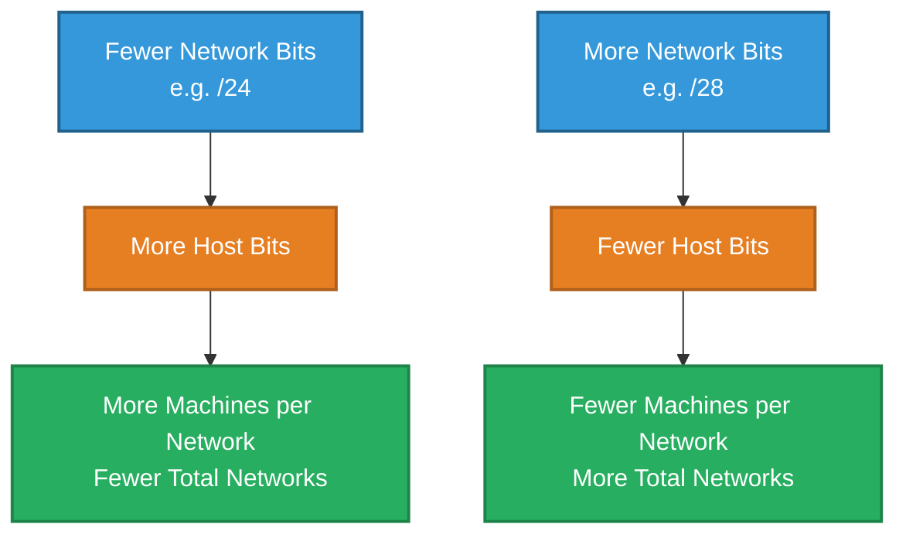

This relationship is **exponential, not linear** — moving from `/24` to `/25` removes just one host bit, but roughly halves capacity: from 254 usable machines down to 126.

---

## 8. Getting Data to a Different Network: Routing

Everything so far explains how one network is addressed internally. But most data isn't staying on one local network — it needs to reach a device on a completely different network, potentially on the other side of the world. This is the job of a **router**.

**Real-world analogy — a mailroom clerk at the boundary of two office buildings:** If a letter is addressed to someone inside your own building, you deliver it directly. If it's addressed elsewhere, you hand it to the mailroom clerk — and critically, that clerk doesn't need to know the entire route to the destination. They only need to know the *next* direction to forward it toward. The next mailroom along the way makes the same simple decision, and so on, until the letter reaches a mailroom that recognizes the final building.

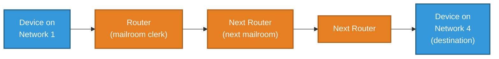

This "next hop only" approach is exactly what makes the global internet scalable — no single router anywhere needs a complete map of every network on Earth; it only needs to know, for any given destination, which direction to forward the data next.

The address every device sends its "not for my local network" traffic to is called the **default gateway** — simply the IP address of the router responsible for forwarding data onward.

---

## 9. Bringing It All Together

| Concept | Analogy | Technical Meaning |
|---|---|---|
| IP Address | 170 Oxford Street | A 32-bit number identifying a device on a network |
| Network Portion | "Oxford Street" | Bits that identify which network a device belongs to |
| Host Portion | "170" | Bits that identify a specific device on that network |
| TTL | "Forward this email a maximum of 10 times" | A hop counter that prevents data from looping forever |
| Subnet Mask (`255.255.255.0`) | The line dividing street name from house number | Defines exactly which bits belong to network vs host |
| CIDR Notation (`/24`) | Shorthand for the same line | A count of how many bits are locked as "network" |
| Capacity | How many houses can fit on the street | `(2 ^ host bits) − 2` = usable machines |
| Router | A mailroom clerk at a building's boundary | Forwards data toward the next network, one hop at a time |

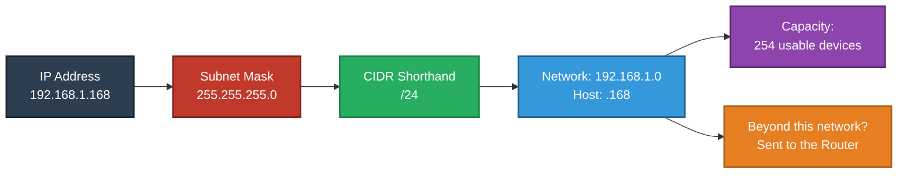

**In summary:** an IP address is a single fixed-size number split into a network portion and a host portion. A subnet mask like `255.255.255.0` (equivalently written as `/24` in CIDR notation) defines exactly where that split happens, which in turn determines how many machines a network can support. Data destined for a device outside the local network is handed to a router, which forwards it one hop at a time — using its destination address, and a TTL safeguard to prevent it from circulating forever — until it reaches its final destination.

---

*Prepared as a technical reference document.*
