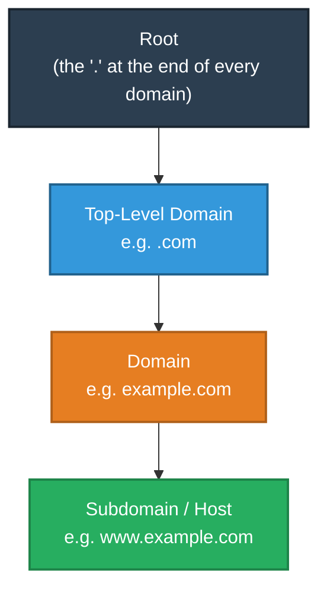
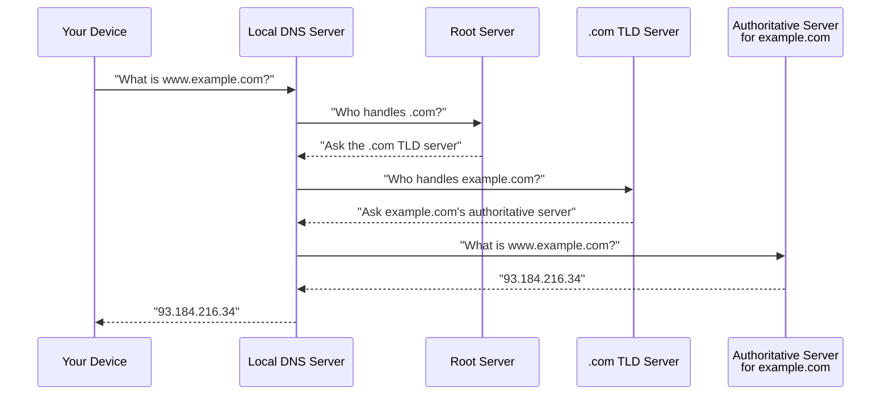
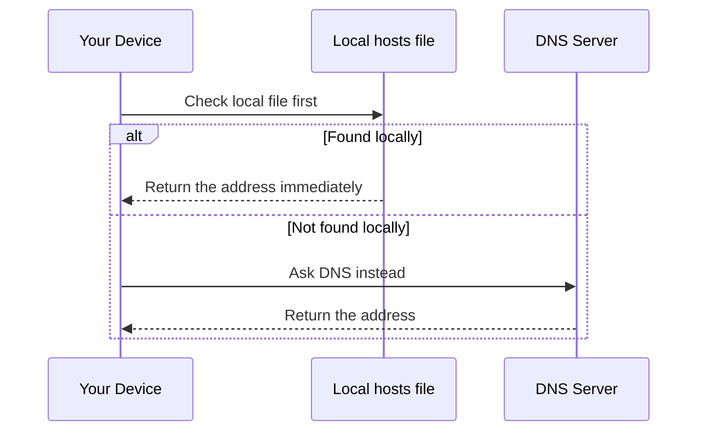
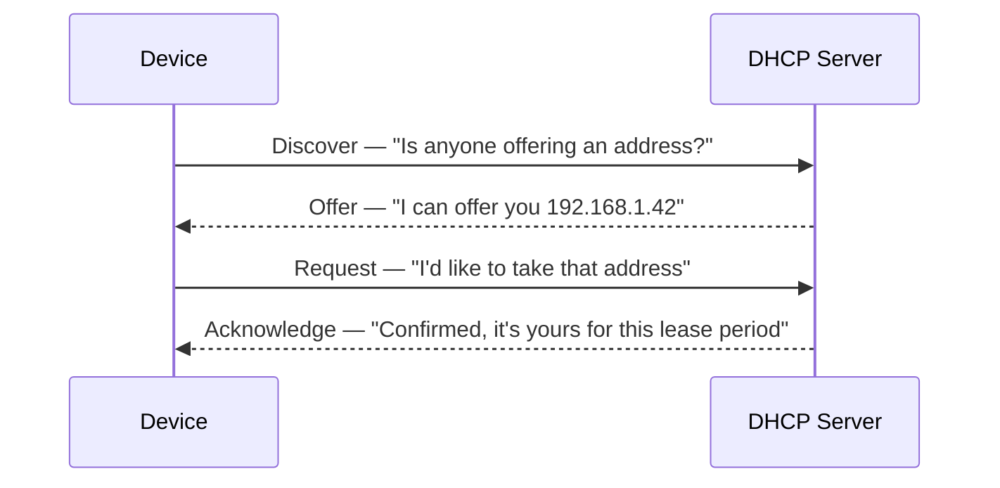
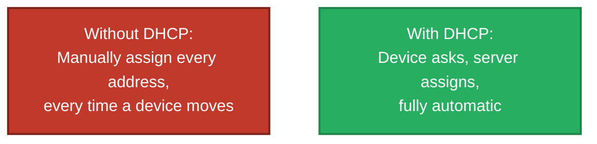

# Finding Things by Name
### DNS & DHCP

---

## Introduction

Two everyday conveniences make networks usable without needing to memorize numbers: typing a website name instead of a string of digits, and a device automatically receiving an address the moment it joins a network. This document explains **DNS**, the system that translates names into addresses, and **DHCP**, the system that automatically hands addresses out in the first place.

> This document is part of a series explaining networking fundamentals. It focuses on two supporting services that sit above and around the Internet Layer covered in the IP Addressing & CIDR document.

---

## 1. DNS: The Internet's Phone Book

Computers only ever really deal in IP addresses — but humans work far better with names. **DNS (Domain Name System)** exists purely to translate between the two.

**Real-world analogy:** Think of your phone's contacts list. You tap "Mum" rather than dialling a ten-digit number from memory — your phone silently looks up the correct number behind the scenes. DNS performs exactly this translation for computers: you type `www.example.com`, and DNS quietly looks up the numeric IP address the computer actually needs in order to connect.

### Why DNS is Distributed, Not Centralized

No single computer anywhere on Earth holds the complete list of every domain name and its corresponding address. Instead, DNS is built as a **distributed, hierarchical database** — spread across many servers worldwide, organized in layers.

**Real-world analogy — dialling an international phone number:** Dialling `+44 20 xxxx xxxx` involves a hierarchy: the country code (`+44`) narrows it to the right country, the area code (`20`) narrows it to the right city, and the final digits identify the exact phone. DNS resolves names the same way, working from broad to specific:

### The Full Resolution Journey

When your computer needs an address it doesn't already know, it works its way up this hierarchy, asking progressively more specific servers, until it gets an authoritative answer:

### Caching: Why This Isn't Slow Every Time

Once an answer is found, it's remembered locally for a period of time — exactly like your phone remembering a contact's number after the first lookup, so it doesn't have to search again on every single call. This is called **caching**, and it's why most everyday DNS lookups feel instantaneous.

### A Practical Local Shortcut

Most operating systems also check a small local file before ever asking DNS at all — commonly named `hosts` (found at `/etc/hosts` on Linux/macOS, or `C:\Windows\System32\drivers\etc\hosts` on Windows). This is simply a manually editable, private phone book on your own machine — useful, for example, for pointing a name like `myproject.local` at your own computer during software development, without needing a real public DNS entry at all.

---

## 2. Two Real Stories That Show Why DNS Matters

### The Bug That Could Have Broken the Internet (2008)

In the summer of 2008, security researcher Dan Kaminsky discovered a flaw in the core trust mechanism of DNS itself. <cite index="12-1">DNS queries include a random transaction number, and a response is only considered valid if it contains the same number — but Kaminsky discovered this could be circumvented because there were only 65,536 possible transaction IDs.</cite> <cite index="16-1">The flaw would have allowed attackers to intercept email, bypass password authentication, and impersonate websites — and since nearly every DNS server was vulnerable, a coordinated global response was required to fix it.</cite> Remarkably, <cite index="15-1">Kaminsky brought together the world's major IT vendors in secret to patch the flaw before publicly disclosing it at Black Hat USA in August 2008.</cite>

This is a striking real-world illustration of the resolution journey above — the entire internet's naming system trusted a single random number, and once that trust could be broken, virtually any website could theoretically have been silently impersonated.

### When One DNS Company Went Down, Half the Internet Went With It (2016)

<cite index="23-1">On 21 October 2016, a major network outage occurred that rendered well-known websites — including Twitter, Netflix, Spotify, Reddit, PayPal and eBay — inaccessible for hours.</cite> The cause wasn't those companies' own servers failing — it was an attack on Dyn, a single company providing DNS resolution for many of them. <cite index="22-1">The attack used the Mirai botnet, reaching a peak traffic rate of 1.2 terabits per second.</cite> <cite index="23-1">The botnet itself was made up of everyday consumer IoT devices — IP cameras, home routers, and media players — many still running factory-default usernames and passwords.</cite>

This shows exactly why DNS is described as "the main means of resolving host names on the internet" — when that layer breaks, it doesn't matter that a company's own servers are perfectly healthy; nobody's computer can translate the name into the address needed to even reach them.

---

## 3. DHCP: Automatically Handing Out Addresses

Every device on a network needs a valid IP address before it can communicate at all. **DHCP (Dynamic Host Configuration Protocol)** is the system that assigns these addresses automatically, rather than requiring someone to configure every single device by hand.

**Real-world analogy — checking into a hotel:** When you check in, the front desk hands you a room key **for the duration of your stay** — you don't own the room permanently. When you check out, or your stay ends, that room becomes available again for the next guest. DHCP works the same way: it hands a device an IP address **for a limited lease period**, and reclaims it once that period ends (or the device leaves the network) so it can be reused.

### The Handshake, Step by Step (often remembered as "DORA")

- **D**iscover — the device broadcasts a request, since it doesn't yet have an address to be reached at.
- **O**ffer — a DHCP server on the network proposes an available address.
- **R**equest — the device formally asks to take that specific address.
- **A**cknowledge — the server confirms the assignment and includes other useful configuration.

### More Than Just an Address

DHCP typically hands over several pieces of configuration in the same exchange, not just the IP address itself:

| Information Provided | Purpose |
|---|---|
| IP address | The device's own address on this network |
| Subnet mask | Defines the network/host split (see the IP Addressing document) |
| Default gateway | The router to use for reaching other networks |
| DNS server address | Where to send name lookups |

### Why This Matters in Practice

**Real-world analogy for the alternative:** Imagine manually reassigning a room key every single time a hotel guest wanted to move to a different floor. Without DHCP, exactly this tedious process would be required every time a laptop moved to a different office, or a new phone joined the network — someone would need to manually assign a unique, unused address to every device, and track every assignment to avoid clashes.

---

## 4. Bringing It All Together

| Concept | Real-World Analogy | Technical Meaning |
|---|---|---|
| DNS | A phone book / contacts list | Translates human-readable names into IP addresses |
| DNS Hierarchy | Dialling an international number | Root → Top-Level Domain → Domain → Subdomain, resolved step by step |
| DNS Caching | Remembering a contact's number after the first call | Stores recent lookups locally to avoid repeating the full journey |
| `hosts` file | A private, personal phone book | A local file checked before DNS is ever contacted |
| DHCP | Checking into a hotel | Automatically assigns an IP address for a limited lease period |
| DORA | The hotel check-in conversation | Discover → Offer → Request → Acknowledge |

**In summary:** DNS exists to translate the names people actually type into the numeric IP addresses computers require, using a distributed, hierarchical lookup system with caching to keep it fast — and as the 2008 and 2016 stories show, its central role makes it a critical point of trust and resilience for the entire internet. DHCP solves a separate but related problem: automatically assigning each device the IP address (and supporting configuration) it needs the moment it joins a network, without requiring manual setup.

---

*Prepared as a technical reference document.*
