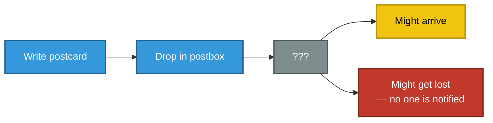
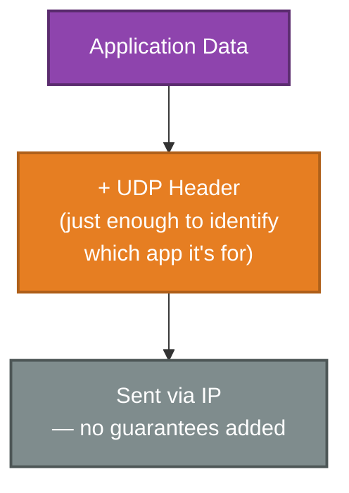
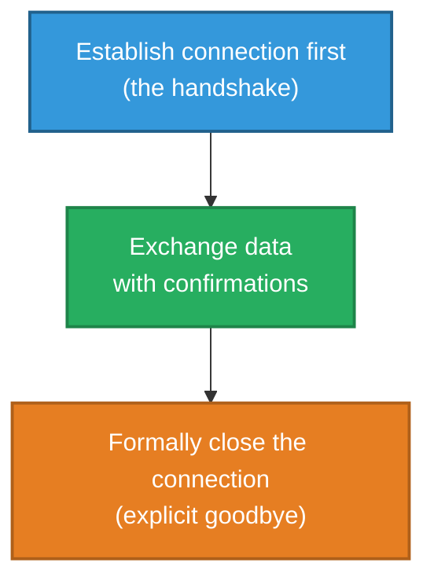
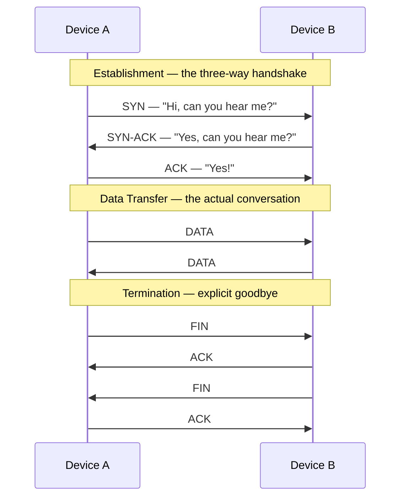
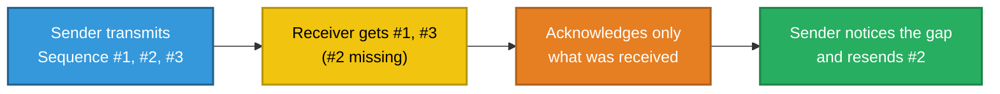
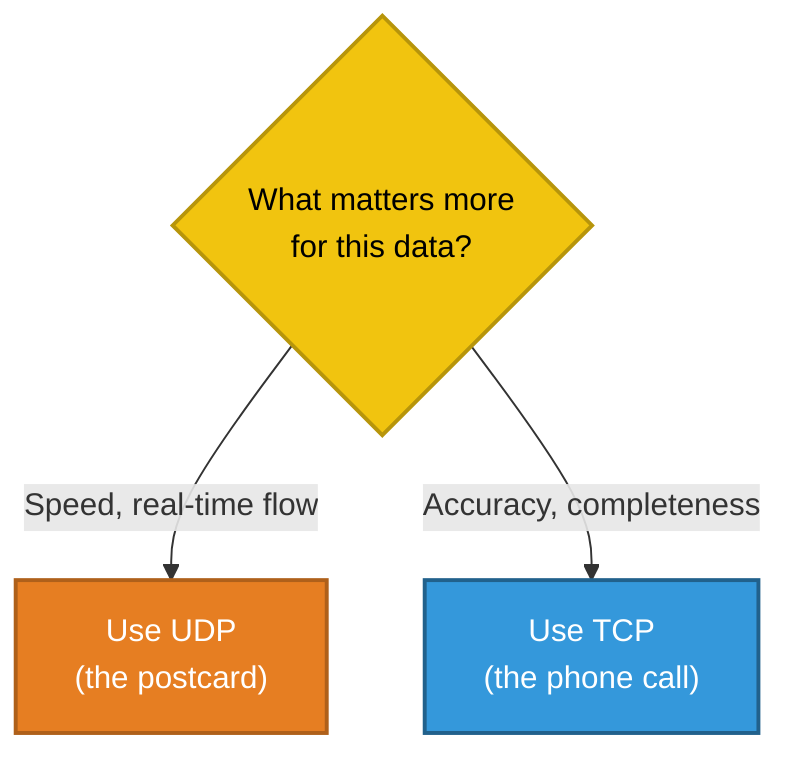

# Reliable vs Fast
### UDP and TCP

---

## Introduction

Once data has been addressed and is ready to travel across networks, one question remains unanswered: should delivery prioritize **speed**, or **certainty**? This document explains the two very different answers to that question — **UDP** and **TCP** — the trade-off between them, and why both are still used side by side today.

> This document is part of a series explaining networking fundamentals. It focuses on the **Transport Layer** — the layer responsible for how reliably data is delivered, and to which specific application it belongs.

---

## 1. The Core Problem: IP Alone Makes No Promises

A separate document in this series (IP Addressing & CIDR) explains how data is addressed and routed across networks using IP. What that document doesn't mention is this: **IP itself makes absolutely no guarantees about delivery.**

- It does not confirm that data arrived.
- It does not guarantee data arrives in the order it was sent.
- It does not automatically resend anything that goes missing.

This is described as **"connectionless"** — and connectionless protocols are, by design, **unreliable**.

**Real-world analogy — sending a postcard:** You write it, drop it in a postbox, and hope for the best. There's no confirmation of receipt, no guaranteed arrival date, and if it happens to get lost in transit, nobody automatically sends a replacement.

Given this gap, two different solutions exist at the Transport Layer — one that accepts this uncertainty in exchange for speed, and one that adds a full system of guarantees on top.

---

## 2. UDP: Accepting the Uncertainty, in Exchange for Speed

**UDP (User Datagram Protocol)** is, quite deliberately, just a thin layer on top of IP's existing behaviour. It adds almost nothing — mainly just enough information to identify which application the data is for — and inherits IP's "no guarantees" nature completely.

**Real-world analogy:** UDP **is** the postcard. Quick to send, minimal overhead, but with absolutely no built-in confirmation of delivery.

### Why Would Anyone Deliberately Choose "Unreliable"?

Because for certain kinds of data, **speed matters more than perfection.** Consider a live video call: if one tiny fragment of audio is lost, the ideal response isn't to pause the entire call and wait for that one piece to be resent — by the time it arrived, the conversation would already have moved on. It's far better to simply accept a brief, barely noticeable glitch and keep the conversation flowing in real time.

| Good Fit for UDP | Why |
|---|---|
| Live video/voice calls | A late retransmitted packet is more disruptive than a tiny bit of dropped data |
| Live streaming | Real-time flow matters more than perfect completeness |
| Online gaming (position updates) | The next update will arrive shortly anyway, making an old resend pointless |
| DNS lookups | Small, quick request/response — if no reply comes, simply ask again |

---

## 3. TCP: Adding a Full System of Guarantees

**TCP (Transmission Control Protocol)** takes the opposite approach. Rather than accepting IP's uncertainty, it builds an entire reliability system on top of it — confirming every step, tracking exactly what's been sent and received, and automatically resending anything that goes missing.

**Real-world analogy — a phone call:** Before either person says a word of substance, you first confirm the connection actually works: *"Hello, can you hear me?"* Only once that's confirmed does the real conversation begin. And crucially, at the end, both people explicitly say goodbye before hanging up — the call doesn't just silently cut off.

This is described as **"connection-oriented"** — a genuine, tracked conversation, rather than a one-way, fire-and-forget message.

### The Three-Way Handshake

Before any actual data is exchanged, TCP performs a short setup exchange to confirm both sides are ready. It takes exactly three steps, which map neatly onto a real conversation:

| Step | Message | Plain-English Meaning |
|---|---|---|
| 1 | **SYN** | "Hi, can you hear me?" |
| 2 | **SYN-ACK** | "Yes, I can hear you — can you hear me?" |
| 3 | **ACK** | "Yes!" — now the real conversation can begin |

**Why three steps, not two?** The sender needs proof the receiver is listening (step 1 → 2), and the receiver needs proof the sender actually received that confirmation and genuinely intends to proceed (step 2 → 3). Without that third step, a receiver could end up committing resources to a connection the other side never actually intended to use.

### How TCP Actually Delivers Its Guarantees

Two pieces of information, carried in every exchange, do almost all of the real work:

- **Sequence Numbers** — every piece of data is numbered, so even if pieces arrive out of order (which can genuinely happen across a large network), the receiving side can reassemble them correctly.
- **Acknowledgement Numbers** — the receiver confirms exactly what it has received. If the sender doesn't get confirmation within an expected time, it assumes the data was lost and automatically resends it.

| Good Fit for TCP | Why |
|---|---|
| Web browsing | A web page must arrive complete and correctly ordered to render properly |
| File downloads | A partially-corrupted file is effectively useless |
| Email | Every part of a message needs to arrive intact |
| Database connections | Data integrity matters more than raw speed |

---

## 4. The Trade-Off, Side by Side

| | **UDP** | **TCP** |
|---|---|---|
| Real-world equivalent | A postcard | A phone call |
| Connection required first? | No | Yes — the three-way handshake |
| Guarantees delivery? | No | Yes |
| Guarantees correct order? | No | Yes |
| Automatically resends lost data? | No | Yes |
| Speed / overhead | Fast, minimal overhead | Slower, more overhead due to tracking and confirmations |
| Best suited for | Real-time, time-sensitive data | Data that must arrive complete and correct |

**Neither protocol is "better" than the other** — they represent a genuine trade-off, and real-world networked systems deliberately choose whichever one fits the nature of their data.

---

## 5. Bringing It All Together

| Concept | Real-World Analogy | Technical Meaning |
|---|---|---|
| IP being "connectionless" | A postcard with no tracking | No built-in guarantee of delivery or order |
| UDP | The postcard itself | Fast, minimal transport with no delivery guarantees |
| TCP | A phone call | Connection-oriented, reliable, ordered delivery |
| Three-Way Handshake | "Hi, can you hear me?" → "Yes, can you hear me?" → "Yes!" | SYN → SYN-ACK → ACK, confirming both sides before data flows |
| Sequence Numbers | Numbering pages of a document | Lets out-of-order data be reassembled correctly |
| Acknowledgements | Confirming receipt of a delivery | Lets the sender know what arrived, and what needs resending |

**In summary:** IP alone offers no guarantees about delivery, order, or completeness — it simply forwards data and hopes for the best. UDP embraces this trade-off in exchange for speed and minimal overhead, making it ideal for real-time data like video calls. TCP builds a full reliability system on top of IP instead — establishing a connection with a three-way handshake, tracking every piece of data with sequence numbers, and automatically resending anything that goes missing — making it the right choice whenever data absolutely must arrive complete and in order.

---

*Prepared as a technical reference document.*
